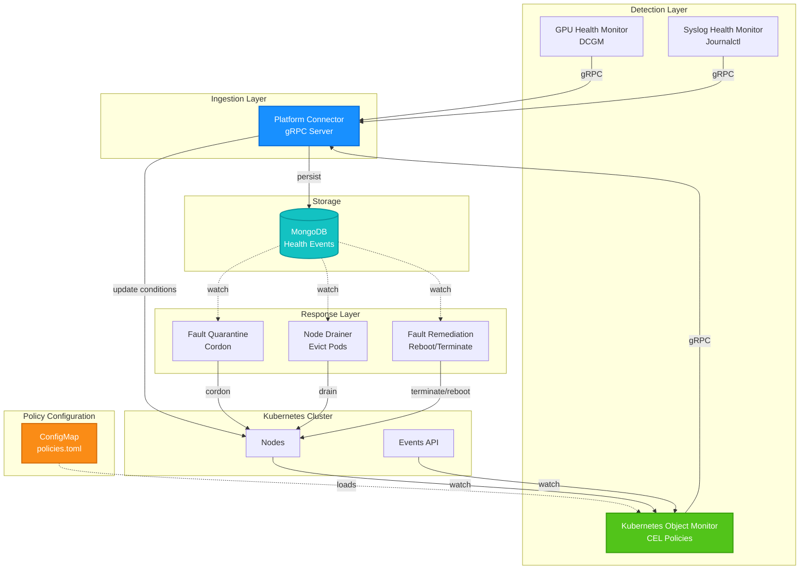

# ADR-011: Kubernetes Object Monitor

## Problem

Although NVSentinel has a pluggable architecture, the barrier to adding new monitors is high. Users must write, test, and deploy a complete health monitor to integrate existing health checks that don't fall into current monitor categories (e.g., storage checks). Many of these existing checks already manifest issues by modifying Kubernetes objects such as node conditions, taints, labels, and annotations.

## Solution 

Develop a policy-driven Kubernetes health monitor that is configurable via CEL policies and publishes health events based on rule matches. This allows users to integrate existing health checks without writing new health monitors.


An example of such configuration would be:
```toml
# ConfigMap: kubernetes-health-monitor-config
# policies.toml

# Node condition-based policy - GPU node not ready for more than 2 hours
[[policies]]
name = "GPUNodeNotReady"
enabled = true

[policies.resource]
group = ""           # Core API group
version = "v1"
kind = "Node"

[policies.predicate]
expression = '''
has(resource.metadata.labels['nvidia.com/gpu.present']) &&
resource.metadata.labels['nvidia.com/gpu.present'] == 'true' &&
resource.status.conditions.exists(c, 
  c.type == 'Ready' && 
  (c.status == 'Unknown' || c.status == 'False') &&
  (now - timestamp(c.lastTransitionTime)) > duration('2h')
)
'''

[policies.healthEvent]
componentClass = "Node"
isFatal = true
message = "GPU node has been NotReady for more than 2 hours"
recommendedAction = "REBOOT_NODE"

# Event-based policy - GPU container runtime failures
# Note: These are Pod events but indicate Node-level GPU issues
# Time-based check ensures recovery when events stop appearing
[[policies]]
name = "NVMLError"
enabled = true

[policies.resource]
group = "events.k8s.io"  # Event API group (v1 Events)
version = "v1"
kind = "Event"

[policies.predicate]
expression = '''
resource.type == 'Warning' &&
resource.reason == 'Failed' &&
resource.regarding.kind == 'Pod' &&
resource.reportingController == 'kubelet' &&
resource.note.contains('nvidia-container-cli') &&
resource.note.contains('nvml error') &&
(now - timestamp(resource.eventTime)) < duration('10m')
'''

[policies.healthEvent]
componentClass = "GPU"
isFatal = true
message = "GPU container runtime failures detected - likely node GPU driver issue"
recommendedAction = "REBOOT_NODE"
```

### Architecture Overview

The Kubernetes Object Monitor is implemented as a **Deployment** that uses **Kubernetes informers** with a **work-queue** for efficient cluster-wide monitoring. It evaluates CEL-based policies against Kubernetes objects and publishes HealthEvents when policies match.

#### Integration with NVSentinel Breakfix Pipeline



### Key Integration Points

1. **Kubernetes Object Monitor** watches Kubernetes API resources (based on policy GVKs) via informers
2. Evaluates user-defined CEL policies from ConfigMap (TOML format)
3. Publishes HealthEvents to Platform Connector via gRPC (same interface as other monitors)
4. Platform Connector persists events to MongoDB
5. Downstream modules (Quarantine, Drainer, Remediation) react to events

### Key Components

- **Informer-based watch**: Efficiently monitors Kubernetes resources using client-go informers (dynamically created based on policy GVKs)
- **Work-queue**: Provides retry logic, rate-limiting, and deduplication
- **CEL Policy Engine**: Evaluates user-defined predicates against Kubernetes objects using the `resource` variable


### Watched Resources

Dynamically configured based on policies' GVK specifications:
- **Nodes** (`core/v1/Node`): For condition, taint, label, and annotation checks
- **Events** (`events.k8s.io/v1/Event`): For detecting event-based issues (Pod failures, kubelet errors, etc.)
- Extensible to other resources: Pods, Deployments, StatefulSets, etc.

### Policy Structure

Policies consist of two key components:

1. **Resource (GVK)**: Group/Version/Kind of the Kubernetes resource to watch
   - `group`: API group (empty string `""` for core resources)
   - `version`: API version (e.g., `"v1"`)
   - `kind`: Resource kind (e.g., `"Node"`, `"Event"`)
   
2. **Predicate** (CEL expression): Boolean condition evaluated against the resource object
   - Uses generic `resource` variable that represents the specified GVK object
   - When predicate evaluates to `true` → **unhealthy event sent**
   - When predicate evaluates to `false` → **healthy/recovery event sent**

#### Supported Resource Types

- **Nodes**: `group=""`, `version="v1"`, `kind="Node"`
- **Events (v1)**: `group="events.k8s.io"`, `version="v1"`, `kind="Event"`
- Future: Extensible to other Kubernetes resources (Pods, Deployments, etc.)

#### Time-based Conditions

Time-based conditions can be expressed directly in CEL using built-in timestamps:
- Node conditions: `(now - timestamp(resource.status.conditions[0].lastTransitionTime)) > duration('2h')`
- Event timestamps: `(now - timestamp(resource.eventTime)) < duration('5m')` (for recent events only)


#### CEL Variables

- `resource` - The Kubernetes resource object being evaluated (type depends on policy's GVK)
  - For Node policies: `resource` is `corev1.Node`
  - For Event policies: `resource` is `eventsv1.Event`
- `now` - Current timestamp (time.Time)

### State Machine

Uniform two-state machine for all resources:

```text
┌─────────────┐
│  Unmatched  │
└──────┬──────┘
       │ Predicate evaluates to true
       ↓
┌─────────────┐
│   Matched   │──→ Send Unhealthy Event
└──────┬──────┘
       │ Predicate evaluates to false
       ↓
┌─────────────┐
│  Unmatched  │──→ Send Healthy Event
└─────────────┘
```

#### Key Characteristics

- Predicate evaluates to `true` → Send unhealthy health event
- Predicate evaluates to `false` → Send healthy/recovery health event
- Time conditions expressed directly in CEL (e.g., `now - lastTransitionTime > 2h`)
- No state persistence needed - all logic in CEL predicates


### Reconciliation Triggers

The controller reconciles on two triggers:

#### 1. Resource Changes (Event-Driven)

- Informers watch configured GVK resources (e.g., Nodes, Events)
- When a watched resource changes (create/update/delete), triggers reconciliation
- For each policy matching the resource's GVK, evaluate the CEL predicate

#### 2. Periodic Reconciliation

- Required for time-based predicates (e.g., "NotReady for more than 2 hours")
- When a Node condition transitions to NotReady, the predicate evaluates to `false` initially
- After 2 hours, periodic reconciliation re-evaluates and detects the threshold crossing
- Configured via controller's resync period (e.g., every 5 minutes)

#### Evaluation Result

- Predicate evaluates to `true` → Send unhealthy event
- Predicate evaluates to `false` → Send healthy event

### Reconciliation Logic

Uniform reconciliation for all resources:

1. Retrieve the resource object (from informer cache)
2. For each policy matching the resource's GVK, evaluate the CEL predicate
3. If predicate evaluates to `true`:
   - Publish unhealthy HealthEvent via gRPC
4. If predicate evaluates to `false`:
   - Publish healthy/recovery HealthEvent via gRPC
5. Multiple reconciliations run concurrently (configured via `MaxConcurrentReconciles`)

#### Special Handling for Pod Events

For Event resources where `resource.regarding.kind == 'Pod'`:
- Look up the Pod to determine which Node it's scheduled on
- Associate the health event with that Node in the HealthEvent payload


### Recovery Event Handling

Recovery is handled uniformly for all resource types:

- When CEL predicate evaluates to `false`, a healthy/recovery HealthEvent is published
- Works for all resources: Nodes, Events, Pods, Deployments, etc.

#### Examples

- Node condition `Ready=False` → `Ready=True` (predicate becomes false → healthy event)
- Event disappears or becomes stale (predicate with time check becomes false → healthy event)
- Pod status changes from `Failed` → `Running` (predicate becomes false → healthy event)

#### Event Recovery Pattern

For Events to support recovery, the CEL predicate should include time-based checks:
```cel
resource.type == 'Warning' && 
resource.reason == 'Failed' &&
(now - timestamp(resource.eventTime)) < duration('5m')  // Only match recent events
```
When the event becomes older than 5 minutes, the predicate returns false → healthy event sent automatically.
