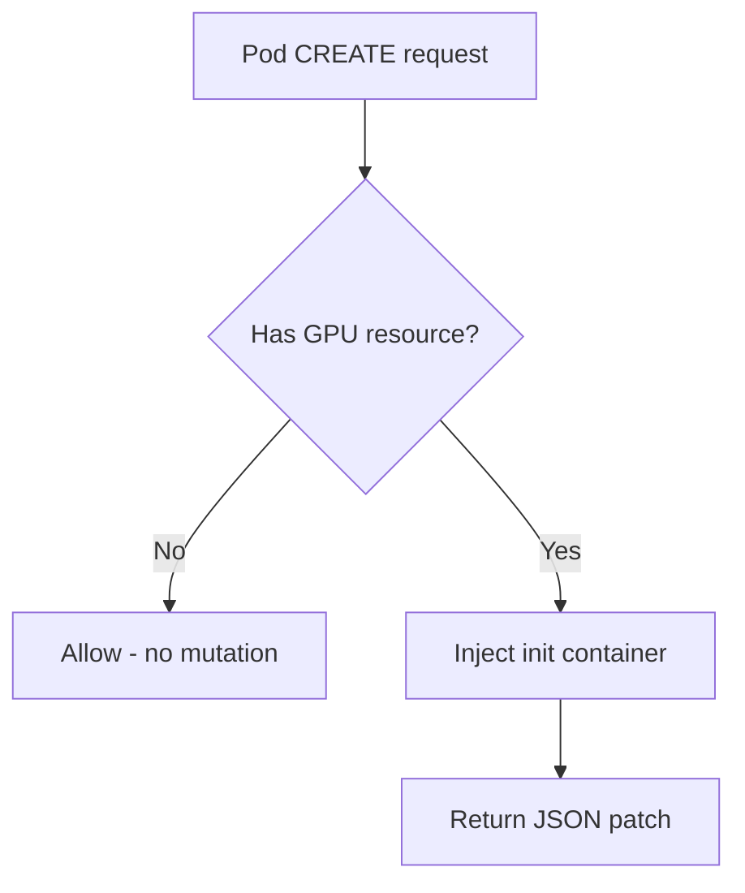
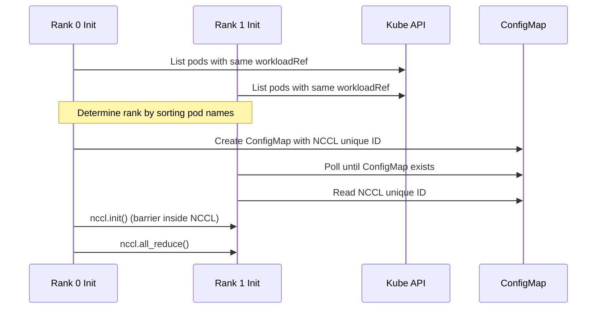

# ADR-026: Feature — Preflight Checks via Init Container Injection

## Context

GPU failures during training waste compute time. Running diagnostics before the workload starts catches bad GPUs early.

Kubernetes 1.35 introduced `spec.workloadRef` for gang scheduling. Preflight can use `workloadRef` to discover peer pods and run gang-wide checks (NCCL all-reduce).

### Distinction from Health Monitors

NVSentinel already has health monitors (GPU Health Monitor, Syslog Health Monitor) that detect GPU issues. This is different:

| | Health Monitors | Preflight Checks |
|-|-----------------|------------------|
| When | Continuous (DaemonSet) | Once at pod start (init container) |
| Check type | Passive (health watches, syslog parsing) | Active diagnostics (DCGM diag) |
| Detects | Failures as they occur (XID errors, ECC, thermal) | Latent issues before starting |
| NCCL tests | No | Yes |
| Purpose | Reactive remediation | Prevent bad starts |

Preflight asks "is this GPU healthy enough to start?" Health monitors ask "did this GPU fail while running?"

## Decision

Implement a MutatingAdmissionWebhook that injects preflight check init containers into GPU pods (pods requesting `nvidia.com/gpu`) in configured namespaces.

- Injection trigger: GPU resource request + namespace
- Gang coordination (NCCL all-reduce): Uses `workloadRef` if present, skipped otherwise

## Implementation

### Component Structure

```
preflight-injector/
├── main.go
├── go.mod
├── go.sum
├── Makefile
├── Tiltfile
└── pkg/
    ├── config/
    │   ├── config.go
    │   └── config_test.go
    ├── webhook/
    │   └── v1alpha1/
    │       ├── handler.go          # Admission handler
    │       └── handler_test.go
    ├── injection/
    │   ├── injector.go             # Init container construction
    │   └── injector_test.go
    ├── coordination/
    │   ├── discovery.go            # Peer discovery via workloadRef
    │   └── configmap.go            # NCCL ID ConfigMap management
    └── metrics/
        └── metrics.go
```

### Webhook Flow



Namespace filtering handled by `namespaceSelector` in webhook config. Checks configured at deployment time.

### MutatingWebhookConfiguration

```yaml
apiVersion: admissionregistration.k8s.io/v1
kind: MutatingWebhookConfiguration
metadata:
  name: preflight-injector
webhooks:
  - name: preflight.nvsentinel.nvidia.com
    clientConfig:
      service:
        name: preflight-injector
        namespace: nvsentinel
        path: /mutate-pod
    rules:
      - apiGroups: [""]
        apiVersions: ["v1"]
        resources: ["pods"]
        operations: ["CREATE"]
    namespaceSelector:
      matchExpressions:
        - key: kubernetes.io/metadata.name
          operator: In
          values: []  # Populated from Helm values
    failurePolicy: Fail
    sideEffects: None
    admissionReviewVersions: ["v1"]
```

Namespace list populated from Helm values.

### Init Container Spec

```yaml
initContainers:
  - name: nvsentinel-preflight
    image: ghcr.io/nvidia/nvsentinel/preflight-checker:v1
    env:
      - name: PREFLIGHT_CHECKS
        value: "dcgm-diag,nccl-loopback"
      - name: DCGM_DIAG_LEVEL
        value: "1"
      - name: CHECK_TIMEOUT
        value: "300s"
      - name: GANG_TIMEOUT
        value: "600s"
    resources:
      limits:
        nvidia.com/gpu: 8  # Copied from main container
    securityContext:
      privileged: true
    volumeMounts:
      - name: dcgm-socket
        mountPath: /var/run/nvidia
      - name: platform-connector-socket
        mountPath: /var/run/nvsentinel
```

**GPU resource handling:** Webhook copies `nvidia.com/gpu` from main container to init container (GPU allocation is per-pod).

### Check Types

| Check | Scope | Coordination |
|-------|-------|--------------|
| `dcgm-diag` | Single node | None |
| `nccl-loopback` | Single node | None |
| `nccl-allreduce` | Gang-wide | ConfigMap |
| `plugin:<name>` | Varies | Varies |

### Plugin Interface (Third-Party Checks)

Plugins are separate init containers. Webhook injects one container per plugin.

**Registration:**
```yaml
preflight-injector:
  plugins:
    - name: bandwidth-check
      image: myregistry/bandwidth-check:v1
      timeout: "60s"
```

**Injected init containers:**
```yaml
initContainers:
  # Built-in checks
  - name: nvsentinel-preflight
    image: ghcr.io/nvidia/nvsentinel/preflight-checker:v1
    ...
  
  # Plugin (separate container)
  - name: preflight-bandwidth-check
    image: myregistry/bandwidth-check:v1
    env:
      - name: CHECK_TIMEOUT
        value: "60s"
      - name: NODE_NAME
        valueFrom:
          fieldRef:
            fieldPath: spec.nodeName
```

**Plugin contract:**
- Exit codes: `0` (passed), `1` (check failed), `2` (config error)
- Write HealthEvent to Platform Connector socket (same as built-in checks)
- Plugin sets `isFatal`, `recommendedAction` in HealthEvent
- Platform Connector overrides can modify values
- Webhook mounts same volumes (GPU, DCGM socket, Platform Connector socket)

### Configuration

Configured at deployment time via Helm values. No per-workload annotations.

### Gang Coordination

For gang-wide checks like `nccl-allreduce`, pods discover peers using `workloadRef`:



**Peer discovery via workloadRef:**
- Init container lists pods where `workloadRef.name` and `workloadRef.podGroup` match
- Gets peer IPs directly from pod list
- Determines rank by sorting pod names alphabetically

**NCCL ID sharing:**
- Rank 0 creates ConfigMap named `preflight-{workload}-{podgroup}`
- Other ranks poll until ConfigMap exists (10 min timeout)
- ConfigMap has owner reference to Workload for cleanup

Webhook injects the init container. No Service or other resources created.

**Gang coordination timeout:** 10 minutes. If gang doesn't form, init fails with `isFatal: false` (not a hardware issue).

### Failure Behavior

Init container exit codes:
- `0`: All checks passed
- `1`: Check failed, pod should not start
- `2`: Configuration error

On failure:
- Pod stays in `Init:Error` state
- **HealthEvent created** via Platform Connector (same as health monitors)
- Kubernetes Event created with failure details
- Metrics incremented (`preflight_check_failures_total`)

HealthEvent feeds into existing NVSentinel workflow (quarantine, correlation, etc).

### Error to Recommended Action Mapping

**DCGM Diag** :

| Test | Result | Recommended Action |
|------|--------|-------------------|
| Memory | `FAIL` | `CONTACT_SUPPORT` |
| PCIe | `FAIL` | `CONTACT_SUPPORT` |
| NVLink | `FAIL` | `CONTACT_SUPPORT` |
| Stress | `FAIL` | `RUN_DCGMEUD` |
| Any | `WARN` | `NONE` |

**NCCL Checks**:

| Error | Recommended Action |
|-------|-------------------|
| `NCCL_SYSTEM_ERROR` | `CONTACT_SUPPORT` |
| `NCCL_INTERNAL_ERROR` | `RUN_DCGMEUD` |
| `NCCL_INVALID_USAGE` | `NONE` |
| `NCCL_TIMEOUT` | `NONE` |
| `NCCL_REMOTE_ERROR` | `CONTACT_SUPPORT` |

**isFatal determination**:
- DCGM diag `FAIL` → `isFatal: true`
- DCGM diag `WARN` → `isFatal: false`
- NCCL hardware errors (`SYSTEM_ERROR`, `INTERNAL_ERROR`, `REMOTE_ERROR`) → `isFatal: true`
- NCCL timeout/config errors → `isFatal: false`

### Helm Values

```yaml
preflight-injector:
  enabled: false  # Opt-in
  
  checks:
    - dcgm-diag
    - nccl-loopback
    # - nccl-allreduce  # Enable for gang workloads
  
  dcgmDiagLevel: 1       # 1 (quick, ~30s) or 2 (medium, ~2-3min)
  checkTimeout: "300s"   # Per-check timeout
  gangTimeout: "600s"    # Gang coordination timeout
  
  # Namespaces where preflight checks apply
  namespaces:
    - training
  
  webhook:
    failurePolicy: Fail  # or Ignore
  
  image:
    repository: ghcr.io/nvidia/nvsentinel/preflight-checker
    tag: v1
```

All GPU pods in listed namespaces get the configured checks.

## Rationale

- Mutating webhook, no external dependencies
- Init containers
- Namespace selector opt-in
- Deployment-level config

## Consequences

### Positive
- Catches GPU failures before workload starts
- Works with any workload controller

### Negative
- Adds 30-60s pod startup latency (DCGM diag)
- Requires privileged init container
- Webhook downtime blocks pod creation

### Mitigations
- `failurePolicy: Ignore` if latency unacceptable
- Timeout configuration
- HA deployment (replicas, PDB)

## Alternatives Considered

### Kyverno Policy
Rejected: External dependency.

### User-managed init containers
Rejected: No enforcement. Users forget.

### Custom CRD wrapper
Rejected: Requires changing how workloads are deployed.

## Out of Scope

- **Repeated failure handling**: Health Event Analyzer handles pattern detection. Preflight emits events.

## References

- K8s 1.35 Workload API: https://kubernetes.io/blog/2025/12/29/kubernetes-v1-35-introducing-workload-aware-scheduling/
- GitHub Issue: https://github.com/NVIDIA/NVSentinel/issues/658

