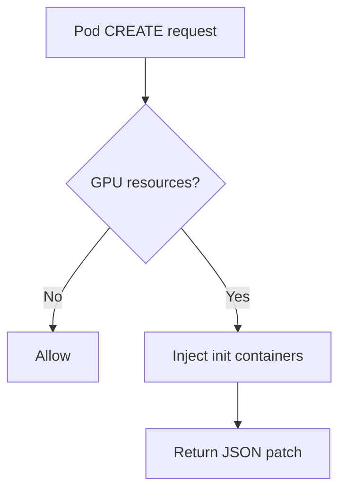
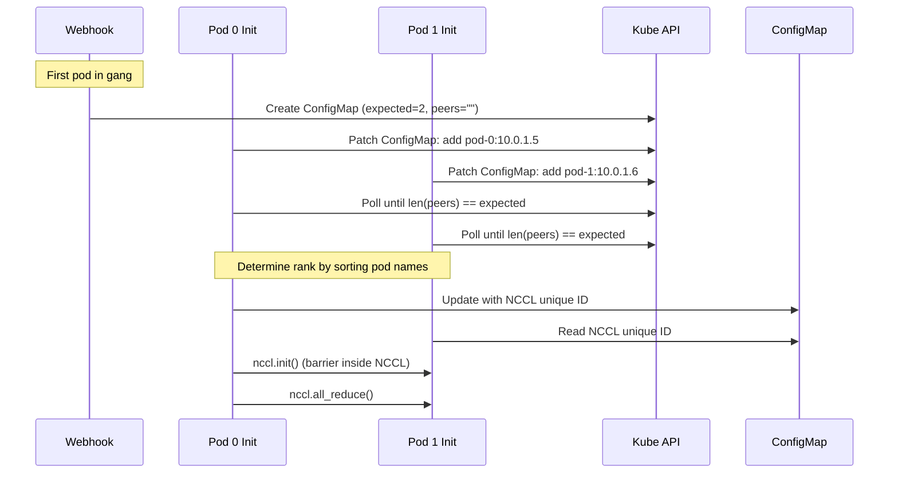

# ADR-026: Feature — Preflight Checks via Init Container Injection

## Context

GPU failures during training waste compute time. Running diagnostics before the workload starts catches bad GPUs early.

Kubernetes 1.35 introduced `spec.workloadRef` for gang scheduling. Preflight can use `workloadRef` to discover peer pods and run gang-wide checks (NCCL all-reduce).

### Distinction from Health Monitors

NVSentinel already has health monitors (GPU Health Monitor, Syslog Health Monitor) that detect GPU issues. This is different:

| | Health Monitors | Preflight Checks |
|-|-----------------|------------------|
| When | Continuous (DaemonSet) | Once at pod start (init container) |
| Check type | Passive (health watches, syslog parsing) | Active diagnostics (DCGM diag) |
| Detects | Failures as they occur (XID errors, ECC, thermal) | Latent issues before starting |
| NCCL tests | No | Yes |
| Purpose | Reactive remediation | Prevent bad starts |

Preflight asks "is this GPU healthy enough to start?" Health monitors ask "did this GPU fail while running?"

## Decision

Implement a MutatingAdmissionWebhook that injects preflight check init containers into GPU pods in configured namespaces.

### Key points

- Injection trigger: GPU resources (extended resources or DRA claims) + namespace
- Gang coordination: Uses `workloadRef` for gang-wide checks when present
- Resource detection: Configurable lists for extended resource names and DRA device classes

## Architecture

### Components

```
preflight/
├── injector/                       # Webhook (Deployment)
│   └── pkg/
│       ├── webhook/                # Admission handler
│       └── injection/              # Pod mutation + DRA detection
│
└── checker/                        # Init container image
    ├── nccl-topologies/            # Built-in topology files
    └── pkg/
        ├── checks/                 # dcgm + nccl
        ├── coordination/           # gang registration + NCCL ID
        └── reporting/              # HealthEvent reporting
```

### Webhook flow



Namespace filtering handled by `namespaceSelector` in webhook config.

### Namespace model

- NVSentinel Helm chart is installed in `nvsentinel` namespace (webhook Deployment runs there).
- Webhook mutates Pods in *other* namespaces based on `namespaceSelector` (and skips system namespaces).
- The injected init containers run in the workload namespace.
- Any Kubernetes API access needed by the init container (gang coordination ConfigMap + Workload reads) must be granted in the workload namespace (namespace-scoped Role/RoleBinding). This is created by the Helm chart in the opted-in namespaces.

### MutatingWebhookConfiguration (sketch)

```yaml
apiVersion: admissionregistration.k8s.io/v1
kind: MutatingWebhookConfiguration
metadata:
  name: preflight-injector
webhooks:
  - name: preflight.nvsentinel.nvidia.com
    clientConfig:
      service:
        name: preflight-injector
        namespace: nvsentinel
        path: /mutate-pod
    rules:
      - apiGroups: [""]
        apiVersions: ["v1"]
        resources: ["pods"]
        operations: ["CREATE"]
    namespaceSelector:
      matchExpressions:
        - key: kubernetes.io/metadata.name
          operator: In
          values: []  # Populated from Helm values
        - key: kubernetes.io/metadata.name
          operator: NotIn
          values: []  # Excluded namespaces (systemNamespaces, nvsentinel, etc.)
    failurePolicy: Fail
    sideEffects: None
    admissionReviewVersions: ["v1"]
```

## Resource detection and injection

### Detection logic

1. Extended resources (device plugins): check `resources.limits`/`resources.requests` for configured names (e.g. `nvidia.com/gpu`)
2. DRA: check `spec.resourceClaims`, resolve claim/template, match `deviceClassName` against configured list

### Init container spec (sketch)

```yaml
initContainers:
  - name: nvsentinel-preflight
    image: ghcr.io/nvidia/nvsentinel/preflight-checker:v1
    env:
      - name: PREFLIGHT_CHECKS
        value: "dcgm-diag,nccl-loopback"
      - name: DCGM_DIAG_LEVEL
        value: "1"
      - name: CHECK_TIMEOUT
        value: "300s"
      - name: GANG_TIMEOUT
        value: "600s"
      - name: PLATFORM_CONNECTOR_SOCKET
        value: "unix:///var/run/nvsentinel.sock"
      - name: MY_POD_NAME
        valueFrom:
          fieldRef:
            fieldPath: metadata.name
      - name: MY_POD_IP
        valueFrom:
          fieldRef:
            fieldPath: status.podIP
    resources:
      limits:
        nvidia.com/gpu: 8          # Max across all containers
        nvidia.com/mlnxnics: 4     # Max across all containers (if NCCL enabled)
    securityContext:
      privileged: true             # DCGM diag
    volumeMounts:
      - name: dcgm-socket
        mountPath: /var/run/nvidia
      - name: platform-connector-socket
        mountPath: /var/run
```

### Resource handling

- GPUs / extended resources: inject max across all containers
- Network / extended resources: inject max across all containers for configured names
- DRA: inject all referenced GPU/network claims into init container

## Check types

| Check | Scope | Coordination |
|-------|-------|--------------|
| `dcgm-diag` | Single node | None |
| `nccl-loopback` | Single node | None |
| `nccl-allreduce` | Gang-wide | ConfigMap |
| `plugin:<name>` | Varies | Varies |

### Plugin Interface (Third-Party Checks)

Plugins are separate init containers. Webhook injects one container per plugin.

**Registration:**
```yaml
preflight-injector:
  plugins:
    - name: bandwidth-check
      image: myregistry/bandwidth-check:v1
      timeout: "60s"
```

**Injected init containers:**
```yaml
initContainers:
  # Built-in checks
  - name: nvsentinel-preflight
    image: ghcr.io/nvidia/nvsentinel/preflight-checker:v1
    ...
  
  # Plugin (separate container)
  - name: preflight-bandwidth-check
    image: myregistry/bandwidth-check:v1
    env:
      - name: CHECK_TIMEOUT
        value: "60s"
      - name: NODE_NAME
        valueFrom:
          fieldRef:
            fieldPath: spec.nodeName
```

**Plugin contract:**
- Exit codes: `0` (passed), `1` (check failed), `2` (config error)
- Report failures via gRPC to Platform Connector:
  - Unix socket: `unix:///var/run/nvsentinel.sock` (matches global `socketPath`)
  - Use `HealthEventOccurredV1` RPC (service `PlatformConnector`, proto `data-models/protobufs/health_event.proto`)
  - Plugin sets `isFatal`, `recommendedAction`, `errorCode` in HealthEvent
  - Platform Connector overrides can modify these values via CEL rules
- Webhook mounts required volumes: GPU devices, DCGM socket, Platform Connector socket

### Configuration

Configured at deployment time via Helm values. No per-workload annotations.

### Gang Coordination

For gang-wide checks like `nccl-allreduce`, pods discover peers via ConfigMap registration:



**Peer registration (no pod listing):**
- Webhook idempotently creates ConfigMap named `preflight-<workloadRef.name>-<workloadRef.podGroup>` with `expected_count`
- Each init container patches ConfigMap to add its IP
- Init containers poll until all peers register
- Determines rank by sorting pod names alphabetically

**ConfigMap structure:**
```yaml
apiVersion: v1
kind: ConfigMap
metadata:
  name: preflight-myworkload-group1
  ownerReferences:
    - apiVersion: scheduling.k8s.io/v1alpha1
      kind: Workload
      name: myworkload
data:
  expected_count: "2"
  peers: |
    pod-0:10.0.1.5
    pod-1:10.0.1.6
  nccl_unique_id: "base64..."  # Added by rank 0
```

**Security:** Init containers have minimal RBAC (get/patch ConfigMap, get Workload). No pod list permission.

**Gang coordination timeout:** 10 minutes. If gang doesn't form, init fails with `isFatal: false` (not a hardware issue).

### RBAC (gang coordination)

Use a namespace-scoped Role for coordination. Kubernetes RBAC does not support label-based restrictions for ConfigMaps, so the checker enforces scope in code (expected ConfigMap name + required labels/ownerRef).

```yaml
rules:
  - apiGroups: ["scheduling.k8s.io"]
    resources: ["workloads"]
    verbs: ["get"]
  - apiGroups: [""]
    resources: ["configmaps"]
    verbs: ["get", "create", "patch"]
```

Checker only reads/writes the coordination ConfigMap `preflight-<workloadRef.name>-<workloadRef.podGroup>` in its own namespace.

### DRA Integration

For pods using Dynamic Resource Allocation (DRA), the webhook copies resource claim references to the init container.

**Device claim detection:**
Webhook checks pod's `spec.resourceClaims`, retrieves each ResourceClaim or ResourceClaimTemplate, and matches `deviceClassName` against configurable lists for GPUs and network devices:

```yaml
# Helm values
preflight-injector:
  gpuDetection:
    # Extended resources (current, no DRA)
    resourceNames:
      - "nvidia.com/gpu"
    
    # DRA device classes (requires operator configuration)
    deviceClasses:
      - "gpu.nvidia.com"
      - "nvidia.com/gpu"
      # Operators add their DeviceClass names here
```

**Init container injection with DRA:**
```yaml
apiVersion: v1
kind: Pod
spec:
  # Pod-level claims
  resourceClaims:
    - name: gpu-claim
      resourceClaimName: training-gpus
    - name: rdma-claim
      resourceClaimName: training-rdma
  
  initContainers:
    - name: nvsentinel-preflight
      resources:
        claims:
          - name: gpu-claim   # References same GPU claim
          - name: rdma-claim  # References same network claim
  
  containers:
    - name: main
      resources:
        claims:
          - name: gpu-claim
          - name: rdma-claim
```

**Multiple containers with GPUs:**
```yaml
# Extended resources example
containers:
  - name: trainer
    resources:
      limits:
        nvidia.com/gpu: 4
        nvidia.com/mlnxnics: 2
  - name: validator
    resources:
      limits:
        nvidia.com/gpu: 8
        nvidia.com/mlnxnics: 4

# Init container gets max(4, 8) = 8 GPUs, max(2, 4) = 4 NICs
initContainers:
  - name: nvsentinel-preflight
    resources:
      limits:
        nvidia.com/gpu: 8
        nvidia.com/mlnxnics: 4
```

**Detection logic:**
1. Check if pod uses extended resources (`nvidia.com/gpu`, `nvidia.com/mlnxnics`) → inject with max counts across all containers
2. Check if pod has DRA claims with matching `deviceClassName` → inject with all unique GPU and network claim references
3. If neither → skip injection

Network devices (InfiniBand, RDMA) can be exposed via DRA claims or extended resources. Webhook uses same detection pattern for both.

DRA device class names are not standardized. Operators configure `gpuDetection.deviceClasses` and `networkDetection.deviceClasses` to match cluster DeviceClass names.

### Network Resources for NCCL Tests

NCCL tests require access to RDMA/InfiniBand devices for efficient GPU-to-GPU communication.

**Network device exposure methods:**

1. **Extended resources (device plugins):**
   - Example: `nvidia.com/mlnxnics` (common on GPU+IB clusters)
   - Resource names are cluster-specific; configure `networkDetection.resourceNames` accordingly

2. **DRA claims:**
   - Network devices can also be exposed via DRA claims (DeviceClass names are cluster-specific)
   - Webhook matches claim `deviceClassName` against `networkDetection.deviceClasses`

**Webhook behavior for NCCL checks:**
If `nccl-loopback` or `nccl-allreduce` is enabled, webhook:
1. Copies all network device resources (extended resources using max count, or DRA claim references)
2. Scans all container env vars, copies those matching `ncclEnvPatterns` (glob patterns from Helm config)
3. Copies volume mounts referenced by `NCCL_TOPO_FILE` (if present)

**Example: How env vars are copied**

Main container has:
```yaml
env:
  - name: NCCL_TOPO_FILE
    value: /etc/nccl/topo.xml
  - name: NCCL_IB_PCI_RELAXED_ORDERING
    value: "1"
  - name: NCCL_SOCKET_IFNAME
    value: eth0
  - name: MY_APP_CONFIG
    value: /app/config.yaml
  - name: OMPI_MCA_btl
    value: openib
```

Webhook with `ncclEnvPatterns: ["NCCL_*", "OMPI_*"]` copies to init container:
```yaml
env:
  - name: NCCL_TOPO_FILE           # Matches NCCL_*
    value: /etc/nccl/topo.xml
  - name: NCCL_IB_PCI_RELAXED_ORDERING  # Matches NCCL_*
    value: "1"
  - name: NCCL_SOCKET_IFNAME       # Matches NCCL_*
    value: eth0
  - name: OMPI_MCA_btl             # Matches OMPI_*
    value: openib
  # MY_APP_CONFIG NOT copied (doesn't match patterns)
volumeMounts:
  - name: nccl-topology            # Copied because NCCL_TOPO_FILE references it
    mountPath: /etc/nccl
```

**NCCL topology file handling:**
The init container image includes common topology files for major cloud platforms:
```
/opt/nvsentinel/nccl-topologies/
├── azure-ndv4.xml
├── azure-ndv5.xml
├── aws-p5.48xlarge.xml
├── gcp-a3-mega.xml
└── oci-bm-gpu-a100.xml
```

**Topology selection priority:**
1. **User-provided**: Webhook checks if any container has `NCCL_TOPO_FILE` env var with a corresponding volume mount at that path → copy that volume mount to init container
2. **Auto-detect**: If no `NCCL_TOPO_FILE` + volume mount found, init container reads node label `node.kubernetes.io/instance-type`, maps to built-in topology file via Helm config
3. **Fallback**: If instance type unknown or not in mapping, don't set `NCCL_TOPO_FILE` (NCCL auto-detects topology)

If pod has no network device resources, NCCL tests are skipped (DCGM diag runs).

### Failure Behavior

Init container exit codes:
- `0`: All checks passed
- `1`: Check failed
- `2`: Configuration error

On failure:
- Pod stays in `Init:Error` state
- **HealthEvent created** via Platform Connector (same as health monitors)
- Kubernetes Event created with failure details
- Metrics incremented (`preflight_check_failures_total`)

HealthEvent feeds into existing NVSentinel workflow (quarantine, correlation, etc).

### Error to Recommended Action Mapping

**DCGM Diag** :

| Test | Result | Recommended Action |
|------|--------|-------------------|
| Memory | `FAIL` | `CONTACT_SUPPORT` |
| PCIe | `FAIL` | `CONTACT_SUPPORT` |
| NVLink | `FAIL` | `CONTACT_SUPPORT` |
| Stress | `FAIL` | `RUN_DCGMEUD` |
| Any | `WARN` | `NONE` |

**NCCL Checks**:

| Error | Recommended Action |
|-------|-------------------|
| `NCCL_SYSTEM_ERROR` | `CONTACT_SUPPORT` |
| `NCCL_INTERNAL_ERROR` | `RUN_DCGMEUD` |
| `NCCL_INVALID_USAGE` | `NONE` |
| `NCCL_TIMEOUT` | `NONE` |
| `NCCL_REMOTE_ERROR` | `CONTACT_SUPPORT` |

**isFatal determination**:
- DCGM diag `FAIL` → `isFatal: true`
- DCGM diag `WARN` → `isFatal: false`
- NCCL hardware errors (`SYSTEM_ERROR`, `INTERNAL_ERROR`, `REMOTE_ERROR`) → `isFatal: true`
- NCCL timeout/config errors → `isFatal: false`

### Integration with Node Drainer

Preflight failures quarantine nodes without draining. Rationale:
- Workload never started → no pods to evict
- Draining would disrupt other gang members waiting for coordination
- Quarantine prevents new scheduling while remediation happens

**Platform Connector override:**
```yaml
pipeline:
  overrides:
    - match:
        agent: "preflight-checker"
      override:
        drainOverrides:
          skip: true
```

**Flow:**
1. Preflight fails → HealthEvent with `isFatal: true`
2. Platform Connector applies override → `drainOverrides.skip: true`
3. Node drainer sees `skip: true` → quarantines node (taint), skips drain
4. Fault Remediation runs based on `recommendedAction` (EUD, support ticket, etc.)
5. Remediation succeeds → taint removed → node back in rotation

Gang members on other nodes timeout after `gangTimeout`, fail with `isFatal: false` (coordination failure, not hardware), no quarantine.

### Helm Values

```yaml
preflight-injector:
  enabled: false  # Opt-in
  
  checks:
    - dcgm-diag
    - nccl-loopback
    # - nccl-allreduce  # Enable for gang workloads
  
  dcgmDiagLevel: 1       # 1 (quick, ~30s) or 2 (medium, ~2-3min)
  checkTimeout: "300s"   # Per-check timeout
  gangTimeout: "600s"    # Gang coordination timeout
  
  # GPU detection configuration
  gpuDetection:
    # Extended resources (current approach)
    resourceNames:
      - "nvidia.com/gpu"
    
    # DRA device classes (add your cluster's DeviceClass names)
    deviceClasses: []
    # Example:
    # - "gpu.nvidia.com"
    # - "nvidia.com/gpu"
  
  # Network device resources (for NCCL tests)
  networkDetection:
    # Extended resources
    resourceNames:
      - "nvidia.com/mlnxnics"
      - "rdma/hca"
      # Add other network device plugin resources used in your cluster
    
    # DRA device classes (if using DRA for network devices)
    deviceClasses: []
    # Example:
    # - "rdma.nvidia.com"
    # - "infiniband.mellanox.com"
  
  # NCCL environment variable patterns to copy (glob patterns)
  # Webhook scans container env vars, copies those matching any pattern
  ncclEnvPatterns:
    - "NCCL_*"      # Matches NCCL_TOPO_FILE, NCCL_IB_*, etc.
    - "UCX_*"       # Matches UCX_TLS, UCX_NET_DEVICES, etc.
    - "OMPI_*"      # Matches OMPI_MCA_*, etc.
  
  # NCCL topology auto-detection (if user doesn't provide topology file)
  ncclTopology:
    # Node label to detect instance type
    instanceTypeLabel: "node.kubernetes.io/instance-type"
    # Map instance types to built-in topology files
    instanceTypeMapping:
      "Standard_ND96isr_H100_v5": "azure-ndv5.xml"
      "Standard_ND96amsr_A100_v4": "azure-ndv4.xml"
      "p5.48xlarge": "aws-p5.48xlarge.xml"
      "a3-megagpu-8g": "gcp-a3-mega.xml"
    # Fallback: use NCCL auto-detection if instance type unknown
    enableFallback: true
  
  # Namespaces where preflight checks apply
  namespaces:
    - training

  # Namespaces to exclude (system namespaces). Recommended to reuse node-drainer `systemNamespaces`.
  excludeNamespaces:
    - nvsentinel
    - kube-system
    - kube-public
    - kube-node-lease
  
  webhook:
    failurePolicy: Fail  # or Ignore
  
  image:
    repository: ghcr.io/nvidia/nvsentinel/preflight-checker
    tag: v1
```

All GPU pods in listed namespaces get the configured checks.

### Metrics

**preflight/checker** (exposed via pushgateway or scraped from pod annotations):

| Metric | Type | Labels |
|--------|------|--------|
| `preflight_check_total` | Counter | `check`, `result` |
| `preflight_check_duration_seconds` | Histogram | `check` |
| `preflight_check_failures_total` | Counter | `check`, `node`, `error_code` |
| `preflight_gang_wait_seconds` | Histogram | `workload` |
| `preflight_config_errors_total` | Counter | `error` |

**preflight/injector** (standard Prometheus endpoint):

| Metric | Type | Labels |
|--------|------|--------|
| `preflight_injection_total` | Counter | `result` |
| `preflight_webhook_latency_seconds` | Histogram | - |

## Rationale

- Mutating webhook, no external dependencies
- Init containers
- Namespace selector opt-in
- Deployment-level config

## Consequences

### Positive
- Catches GPU failures before workload starts
- Works with any workload controller
- Built-in NCCL topology files for major cloud platforms

### Negative
- Adds 30-60s pod startup latency (DCGM diag level 1)
- Requires privileged init container for DCGM
- Webhook downtime blocks pod creation (if `failurePolicy: Fail`)
- NCCL tests require network device plugins (InfiniBand/RDMA) to be configured

### Mitigations
- **Latency**: Use DCGM level 1 (~30s) vs level 2 (~2-3min); skip expensive checks for non-critical workloads
- **Privileged**: Required for hardware access; limit to specific namespaces
- **Webhook availability**: HA deployment (replicas, PDB); `failurePolicy: Ignore` for graceful degradation
- **Network resources**: NCCL tests skipped if network devices unavailable; DCGM diag runs regardless

## Alternatives Considered

### Kyverno Policy
Rejected: External dependency.

### User-managed init containers
Rejected: No enforcement. Users forget.

### Custom CRD wrapper
Rejected: Requires changing how workloads are deployed.

## Out of Scope

- **Repeated failure handling**: Health Event Analyzer handles pattern detection. Preflight emits events.
- **Automatic DRA DeviceClass discovery**: Requires operator configuration. Device class names are not standardized.

## References

- K8s 1.35 Workload API: https://kubernetes.io/blog/2025/12/29/kubernetes-v1-35-introducing-workload-aware-scheduling/
- GitHub Issue: https://github.com/NVIDIA/NVSentinel/issues/658

