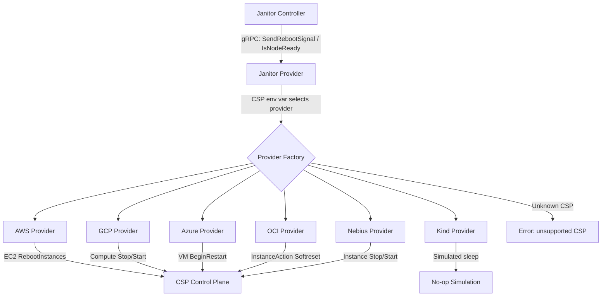
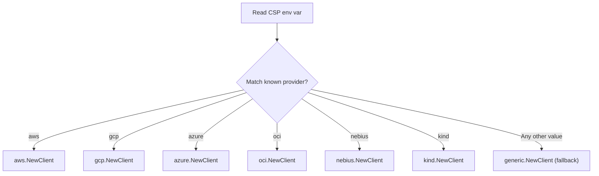
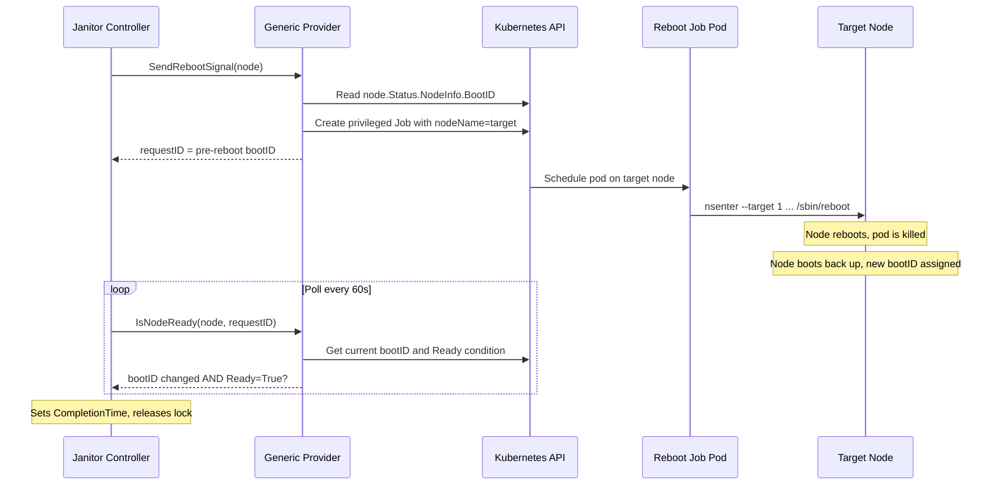
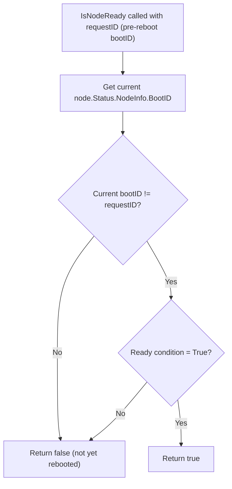

# ADR-028: Janitor — Generic Bare-Metal Reboot Provider

## Context

The janitor-provider supports node reboots through CSP APIs (AWS EC2, GCP Compute, Azure, OCI, Nebius). If the `CSP` environment variable is set to an unrecognized value, the provider returns an error and refuses to start.

This doesn't work for environments without a CSP reboot API:

- On-premises bare-metal clusters
- Infrastructure providers that do not expose a reboot API
- Self-managed Kubernetes clusters on physical hardware

### Current Architecture



## Decision

Replace the error for unrecognized `CSP` values with a **generic fallback provider** that reboots nodes via a privileged Kubernetes Job running `nsenter ... /sbin/reboot`. This follows the Job-based pattern from GPU Reset ([ADR-019](019-janitor-gpu-reset.md)).

## Implementation

### 1. Provider Factory — Fallback to Generic



### 2. Generic Provider — Reboot via Privileged Job



#### SendRebootSignal

Records the node's current `bootID` from `node.Status.NodeInfo.BootID`, creates a privileged Job on the target node, and returns the pre-reboot `bootID` as the `requestID`.

**Job specification:**

```yaml
apiVersion: batch/v1
kind: Job
metadata:
  name: reboot-<node-name>-<short-hash>
  namespace: <configured-namespace>
  labels:
    nvsentinel.nvidia.com/reboot-job: "true"
spec:
  backoffLimit: 0
  ttlSecondsAfterFinished: 86400
  template:
    spec:
      nodeName: <target-node>
      hostPID: true
      restartPolicy: Never
      tolerations:
        - operator: "Exists"
      containers:
        - name: reboot
          image: busybox:1.37
          command:
            - nsenter
            - --target
            - "1"
            - --mount
            - --uts
            - --ipc
            - --net
            - --
            - /sbin/reboot
          securityContext:
            privileged: true
```

**Design choices (mirroring GPU Reset):**

| Choice | Value | Rationale |
|--------|-------|-----------|
| `hostPID` | `true` | Required for `nsenter` to access PID 1 |
| `privileged` | `true` | Required to enter host namespaces |
| `backoffLimit` | `0` | Reboot kills the pod — retrying would double-reboot |
| `ttlSecondsAfterFinished` | `86400` | Auto-cleanup after 24h; Job shows "Failed" (expected) |
| `tolerations` | `[{operator: Exists}]` | Target node is likely cordoned/tainted |
| `restartPolicy` | `Never` | Do not restart after reboot |
| Image | `busybox:1.37` | Only needs `nsenter` and `/sbin/reboot` |

#### IsNodeReady

The `requestID` is the pre-reboot `bootID`. A changed `bootID` is definitive proof that the node rebooted — unlike `lastTransitionTime`, it cannot change due to network blips or other non-reboot events.



If the reboot never happened, `bootID` stays the same and the janitor controller will eventually time out.

Once `IsNodeReady` confirms a successful reboot, it deletes the reboot Job before returning `true`. This avoids a lingering "Failed" Job (the pod is killed by the reboot, so the Job always ends in a failed state).

### 3. Helm Configuration

```yaml
# distros/kubernetes/nvsentinel/charts/janitor-provider/values.yaml
csp:
  provider: "kind"           # existing field, unchanged

  generic:                   # NEW — config for the generic fallback provider
    rebootImage: "busybox:1.37"
    rebootJobNamespace: ""   # defaults to the janitor-provider's own namespace
    rebootJobTTLSeconds: 86400
```

```yaml
# deployment.yaml env injection
env:
  - name: CSP
    value: {{ .Values.csp.provider | default "kind" | quote }}
  - name: GENERIC_REBOOT_IMAGE
    value: {{ .Values.csp.generic.rebootImage | default "busybox:1.37" | quote }}
  - name: GENERIC_REBOOT_JOB_NAMESPACE
    value: {{ .Values.csp.generic.rebootJobNamespace | quote }}
  - name: GENERIC_REBOOT_JOB_TTL
    value: {{ .Values.csp.generic.rebootJobTTLSeconds | default 86400 | quote }}
```

### 4. RBAC

Additional ClusterRole permissions for creating reboot Jobs:

```yaml
- apiGroups: ["batch"]
  resources: ["jobs"]
  verbs: ["create", "get", "list", "watch", "delete"]
```

### 5. File Locations

| File | Change |
|------|--------|
| `janitor-provider/pkg/csp/generic/generic.go` | New — generic provider implementation |
| `janitor-provider/pkg/csp/generic/generic_test.go` | New — unit tests |
| `janitor-provider/pkg/csp/client.go` | Modified — default case returns generic provider |
| `janitor-provider/pkg/csp/client_test.go` | Modified — tests for fallback routing |
| `distros/.../charts/janitor-provider/values.yaml` | Modified — add `csp.generic` block |
| `distros/.../charts/janitor-provider/templates/deployment.yaml` | Modified — inject generic env vars |
| `distros/.../charts/janitor-provider/templates/clusterrole.yaml` | Modified — add `batch/jobs` permissions |

## Rationale

- **Proven pattern**: Same Job-based architecture as GPU Reset ([ADR-019](019-janitor-gpu-reset.md)), validated in production
- **No custom image**: `busybox` with `nsenter` is sufficient
- **Zero breaking changes**: Known CSP values keep their existing implementations
- **Minimal interface changes**: Generic provider creates its own K8s client internally

## Consequences

### Positive
- Enables automated reboot remediation on bare-metal and non-cloud environments
- Consistent remediation workflow regardless of infrastructure type
- New providers can be onboarded by setting `CSP` to their name — no code needed
- Kubernetes-native (Jobs, RBAC, tolerations)

### Negative
- Requires **privileged pod with hostPID**
- No `SendTerminateSignal` support for bare-metal nodes
- CSP name typo (e.g., `"awss"`) silently falls back to generic reboot

### Mitigations
- **Security**: Ephemeral Job with TTL cleanup, RBAC-restricted RebootNode creation. Matches GPU Reset security model.
- **Typo risk**: Log a warning at startup when the generic fallback is used.

## Alternatives Considered

### SSH-Based Reboot
**Rejected**: Requires SSH key management and network access to all nodes.

### Privileged DaemonSet Agent
**Rejected**: Larger security surface than an ephemeral Job, wastes resources while idle. Also rejected in [ADR-019](019-janitor-gpu-reset.md).

### IPMI / BMC Out-of-Band Reboot
**Rejected** as default: Requires BMC credentials and network access that vary across environments. Could be added as a dedicated provider later.

### Modifying CSPClient Interface to Accept a Kubernetes Client
**Rejected**: Would require changing every provider constructor. The in-cluster client approach is self-contained.

## Testing

- **Unit**: Job spec generation, `IsNodeReady` bootID comparison logic, factory fallback routing, config loading
- **Integration**: Mock K8s client, verify Job creation with correct spec, verify `IsNodeReady` for various node conditions
- **E2E**: Deploy with `CSP=baremetal` on kind, create RebootNode CR, verify reboot Job creation

## Notes

- `busybox:1.37` is overridable via Helm for custom image registries
- Job TTL (24h default) is tunable per-environment
- Future providers (IPMI, Redfish) can be added as named factory cases without changing fallback behavior

## References

- [ADR-019: Janitor GPU Reset](019-janitor-gpu-reset.md) — Job-based pattern for host-level operations
- [ADR-020: NVSentinel GPU Reset](020-nvsentinel-gpu-reset.md) — End-to-end GPU reset in NVSentinel
- [ADR-008: Cloud Provider Integration](008-cloud-provider-integration.md) — Current CSP architecture
- [Kubernetes Jobs](https://kubernetes.io/docs/concepts/workloads/controllers/job/)
- [nsenter](https://man7.org/linux/man-pages/man1/nsenter.1.html)
