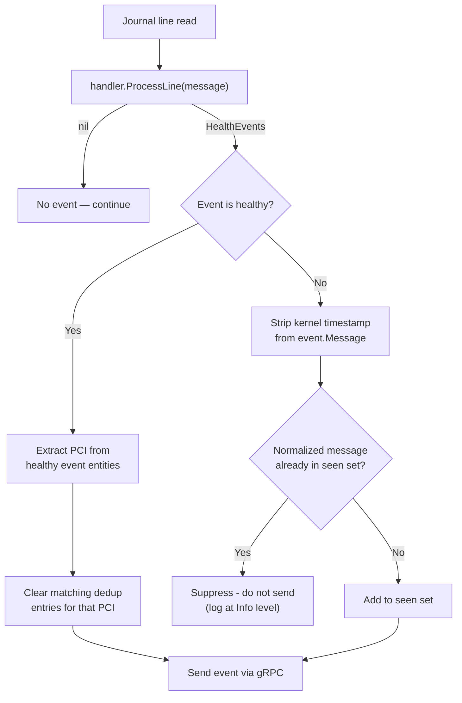

# ADR-039: Syslog Health Monitor — Event Deduplication Until Remediation

## Context

The syslog health monitor processes journal entries on a periodic polling loop (default 30 seconds). Each poll reads new journal entries since the last cursor, passes them through the appropriate handler (`XIDHandler`, `SXIDHandler`, `GPUFallenHandler`), and sends any resulting `HealthEvent` via gRPC to the platform connector.

When a GPU enters a persistent error state, the kernel repeatedly logs identical XID/SXID messages to the journal. Across successive poll cycles, the monitor re-reads and re-emits the same error — differing only in the kernel timestamp prefix (e.g., `[ 1108.858286]`). This produces a flood of duplicate health events downstream:

```
Poll 1:  [ 1108.858286] NVRM: Xid (PCI:0000:b3:00.0): 79, pid=1234, name=nv-hostengine  →  event sent
Poll 2:  [ 1843.308145] NVRM: Xid (PCI:0000:b3:00.0): 79, pid=1234, name=nv-hostengine  →  duplicate event sent
Poll 3:  [ 2501.556012] NVRM: Xid (PCI:0000:b3:00.0): 79, pid=1234, name=nv-hostengine  →  duplicate event sent
```

Downstream components are affected differently by these duplicates. The platform connector compacts node-condition annotations, but the fault-quarantine module persists each event individually and the node-drainer module treats each incoming event as a distinct drain trigger. Duplicate health events therefore carry real operational cost: redundant drain evaluations, inflated stored event counts, and noise in audit logs.

**The current poll-based architecture makes cross-poll deduplication difficult** because each poll opens a fresh journal handle; no in-poll state carries over to suppress already-reported messages.

### Scope

This ADR covers deduplication for the **SysLogsXIDError** and **SysLogsSXIDError** checks only. The `SysLogsGPUFallenOff` check already has its own XID-windowed correlation logic and is excluded.

## Decision

Add a **deduplication layer** to the syslog monitor that suppresses health events whose message — after masking the kernel timestamp — has already been emitted since the last remediation signal. Concretely:

1. **Normalize** each message by stripping the leading kernel timestamp (e.g., `[12345.678901] `).
2. **Track** normalized messages that have been emitted, per check name.
3. **Suppress** any unhealthy event whose normalized message is already in the seen set.
4. **Clear selectively** — when a healthy event arrives (e.g., GPU reset), remove only the seen-set entries whose normalized message contains the recovered GPU's PCI address. On system reboot, clear all entries for all checks.
5. **Persist** the seen set in the existing state file so dedup survives pod restarts within the same remediation window.



### What counts as "the same message"

The dedup key is the **exact message string** with the kernel timestamp prefix stripped. Two messages that differ in any field — PCI address, XID code, pid, channel, process name — are treated as distinct and are **not** deduplicated. Only truly identical repeated error lines are suppressed.

### What clears the dedup

| Signal                                                                  | What gets cleared                                                                                                                               |
|-------------------------------------------------------------------------|-------------------------------------------------------------------------------------------------------------------------------------------------|
| GPU reset detected (`GPU reset executed: GPU-...`)                      | Only seen-set entries whose normalized message contains the recovered GPU's PCI address (extracted from the healthy event's `EntitiesImpacted`) |
| System reboot (boot ID change)                                          | All seen sets for all checks                                                                                                                    |
| Healthy event with no `PCI` entity (e.g., generic reboot healthy event) | Entire seen set for that check                                                                                                                  |
| Pod restart (state file reloaded)                                       | Nothing cleared — seen set is restored from state file                                                                                          |


Per-GPU clearing ensures that when GPU-A is reset, dedup entries for GPU-B remain intact and its repeated errors continue to be suppressed.

SXID events have no runtime healthy signal (the recommended action is `CONTACT_SUPPORT`), so the SXID seen set is only cleared on system reboot.

## Implementation

### 1. New package: `pkg/dedup`

A new `dedup` package under the syslog-health-monitor provides the `Tracker` type:

```go
package dedup

type Tracker struct {
    mu   sync.RWMutex
    seen map[string]struct{}
}

// reKernelTimestamp matches the kernel timestamp prefix in dmesg-style messages.
// Examples: "[ 1108.858286] ", "[73309.599396] ", "[123] "
var reKernelTimestamp = regexp.MustCompile(`^\[\s*\d+(?:\.\d+)?\]\s*`)

func NormalizeMessage(msg string) string {
    return reKernelTimestamp.ReplaceAllString(msg, "")
}

func NewTracker() *Tracker
func NewTrackerFromSnapshot(msgs []string) *Tracker

func (t *Tracker) IsDuplicate(normalizedMsg string) bool
func (t *Tracker) Mark(normalizedMsg string)
func (t *Tracker) Clear()                          // remove all entries
func (t *Tracker) ClearMatching(substr string)     // remove entries containing substr
func (t *Tracker) Snapshot() []string              // for state persistence
```

Key properties:
- Thread-safe (mutex-protected) — safe for future concurrent use, although the current monitor is single-threaded.
- `ClearMatching(substr)` iterates the seen set and removes entries containing `substr`. Used to selectively clear entries for a specific PCI address on GPU reset.
- `Snapshot()` returns the current set as a slice for JSON serialization.
- `NewTrackerFromSnapshot()` reconstructs from a persisted slice.

### 2. Observability: suppressed-event metric

Existing XID/SXID counter metrics are incremented inside `ProcessLine()`, which runs **before** dedup. They therefore reflect the true error rate from the kernel, not the deduplicated event stream:

| Existing metric                     | Labels                                 |
|-------------------------------------|----------------------------------------|
| `syslog_health_monitor_xid_errors`  | `node`, `err_code`                     |
| `syslog_health_monitor_sxid_errors` | `node`, `err_code`, `link`, `nvswitch` |


To give operators visibility into dedup activity, a new Prometheus counter is registered in the `syslogmonitor` package with labels matching the common dimensions across both checks:

```go
var dedupSuppressedCounter = promauto.NewCounterVec(
    prometheus.CounterOpts{
        Name: "nvsentinel_syslog_dedup_suppressed_total",
        Help: "Total number of health events suppressed by deduplication.",
    },
    []string{"check", "node", "err_code"},
)
```

The `node` and `err_code` values are extracted from the `HealthEvent` being suppressed (`event.NodeName` and `event.ErrorCode[0]`). This allows operators to correlate suppression with the existing error counters per node and error code:

```promql
rate(nvsentinel_syslog_dedup_suppressed_total{check="SysLogsXIDError", node="gpu-node-1"}[5m])
  /
rate(syslog_health_monitor_xid_errors{node="gpu-node-1"}[5m])
```

### 3. Integration into `SyslogMonitor`

**Struct changes** in [`pkg/syslog-monitor/types.go`](health-monitors/syslog-health-monitor/pkg/syslog-monitor/types.go):

```go
type SyslogMonitor struct {
    // ... existing fields ...
    dedupTrackers map[string]*dedup.Tracker   // per check name, only for XID and SXID
}
```

**State file changes** in [`pkg/syslog-monitor/types.go`](health-monitors/syslog-health-monitor/pkg/syslog-monitor/types.go):

```go
type syslogMonitorState struct {
    Version          int                     `json:"version"`
    BootID           string                  `json:"boot_id"`
    CheckLastCursors map[string]string       `json:"check_last_cursors"`
    SeenMessages     map[string][]string     `json:"seen_messages,omitempty"`
}
```

The `SeenMessages` field is `omitempty` and optional during deserialization. Old state files without this field will unmarshal cleanly with `SeenMessages == nil` — no version bump is required.

**Constructor** in [`pkg/syslog-monitor/syslogmonitor.go`](health-monitors/syslog-health-monitor/pkg/syslog-monitor/syslogmonitor.go) — `NewSyslogMonitorWithFactory`:

```go
dedupChecks := map[string]bool{XIDErrorCheck: true, SXIDErrorCheck: true}
dedupTrackers := make(map[string]*dedup.Tracker)
for _, check := range checks {
    if !dedupChecks[check.Name] {
        continue
    }
    if msgs, ok := state.SeenMessages[check.Name]; ok {
        dedupTrackers[check.Name] = dedup.NewTrackerFromSnapshot(msgs)
    } else {
        dedupTrackers[check.Name] = dedup.NewTracker()
    }
}
sm.dedupTrackers = dedupTrackers
```

### 4. Dedup in the event-sending path

A new method `applyDedup` is inserted into [`handleSingleLine`](health-monitors/syslog-health-monitor/pkg/syslog-monitor/syslogmonitor.go) between `handler.ProcessLine()` and `sendHealthEventWithRetry()`:

```go
func (sm *SyslogMonitor) handleSingleLine(check CheckDefinition, lineToEvaluate string) error {
    if handler, ok := sm.checkToHandlerMap[check.Name]; ok {
        healthEvents, err := handler.ProcessLine(lineToEvaluate)
        if err != nil {
            return fmt.Errorf("error processing line %s: %w", lineToEvaluate, err)
        }
        if healthEvents != nil {
            healthEvents = sm.applyDedup(check.Name, healthEvents)
        }
        if healthEvents != nil && len(healthEvents.Events) > 0 {
            if err := sm.sendHealthEventWithRetry(healthEvents, 5, 2*time.Second); err != nil {
                return fmt.Errorf("failed to send health event: %w", err)
            }
        }
    }
    return nil
}
```

The `applyDedup` method:

```go
func (sm *SyslogMonitor) applyDedup(checkName string, events *pb.HealthEvents) *pb.HealthEvents {
    tracker, ok := sm.dedupTrackers[checkName]
    if !ok {
        return events   // no tracker for this check — pass through unmodified
    }

    var filtered []*pb.HealthEvent
    for _, event := range events.Events {
        if event.IsHealthy {
            sm.clearDedupForHealthyEvent(checkName, event)
            filtered = append(filtered, event)
            continue
        }

        key := dedup.NormalizeMessage(event.Message)
        if tracker.IsDuplicate(key) {
            errCode := ""
            if len(event.ErrorCode) > 0 {
                errCode = event.ErrorCode[0]
            }
            dedupSuppressedCounter.WithLabelValues(checkName, event.NodeName, errCode).Inc()
            slog.Info("Suppressed duplicate health event",
                "check", checkName,
                "node", event.NodeName,
                "errCode", errCode,
                "normalizedMessage", key)
            continue
        }
        tracker.Mark(key)
        filtered = append(filtered, event)
    }

    if len(filtered) == 0 {
        return nil
    }
    return &pb.HealthEvents{Version: events.Version, Events: filtered}
}

// clearDedupForHealthyEvent selectively clears dedup entries for the recovered GPU.
// If the healthy event carries PCI entities, only entries containing that PCI are removed.
// If no PCI entity is present (e.g., generic reboot healthy event), the entire set is cleared.
func (sm *SyslogMonitor) clearDedupForHealthyEvent(checkName string, event *pb.HealthEvent) {
    tracker, ok := sm.dedupTrackers[checkName]
    if !ok {
        return
    }

    clearedByPCI := false
    for _, entity := range event.EntitiesImpacted {
        if entity.EntityType == "PCI" && entity.EntityValue != "" {
            tracker.ClearMatching(entity.EntityValue)
            slog.Info("Cleared dedup entries matching PCI on healthy event",
                "check", checkName,
                "pci", entity.EntityValue)
            clearedByPCI = true
        }
    }

    if !clearedByPCI {
        tracker.Clear()
        slog.Info("Cleared entire dedup tracker on healthy event (no PCI entity)",
            "check", checkName)
    }
}
```

### 5. Boot ID change handling

In [`handleBootIDChange`](health-monitors/syslog-health-monitor/pkg/syslog-monitor/syslogmonitor.go), clear all dedup trackers alongside cursors:

```go
func (sm *SyslogMonitor) handleBootIDChange(oldBootID, newBootID string) error {
    if oldBootID != newBootID {
        // Clear all cursors (existing)
        for checkName := range sm.checkLastCursors {
            delete(sm.checkLastCursors, checkName)
        }

        // Clear all dedup trackers (new)
        for _, tracker := range sm.dedupTrackers {
            tracker.Clear()
        }

        // ... save state, send healthy events (unchanged) ...
    }
    return nil
}
```

### 6. State persistence

In `saveCurrentState`, snapshot the dedup trackers:

```go
func (sm *SyslogMonitor) saveCurrentState() error {
    seenMsgs := make(map[string][]string)
    for checkName, tracker := range sm.dedupTrackers {
        if snapshot := tracker.Snapshot(); len(snapshot) > 0 {
            seenMsgs[checkName] = snapshot
        }
    }

    state := syslogMonitorState{
        Version:          stateFileVersion,
        BootID:           sm.currentBootID,
        CheckLastCursors: sm.checkLastCursors,
        SeenMessages:     seenMsgs,
    }
    return saveState(sm.stateFilePath, state)
}
```

This is called after each check in `executeCheck`, which already happens today for cursor persistence. No additional save calls are needed.

### 7. Files changed summary

| File                                       | Change                                                                                                                                         |
|--------------------------------------------|------------------------------------------------------------------------------------------------------------------------------------------------|
| `pkg/dedup/tracker.go`                     | **New** — `Tracker` type, `NormalizeMessage`, snapshot/restore                                                                                 |
| `pkg/dedup/tracker_test.go`                | **New** — unit tests for normalization, dedup, clear, snapshot round-trip                                                                      |
| `pkg/syslog-monitor/types.go`              | Add `dedupTrackers` field to `SyslogMonitor`, add `SeenMessages` to `syslogMonitorState`                                                       |
| `pkg/syslog-monitor/syslogmonitor.go`      | Initialize trackers in constructor, add `applyDedup` method, modify `handleSingleLine`, modify `handleBootIDChange`, modify `saveCurrentState` |
| `pkg/syslog-monitor/syslogmonitor_test.go` | Add dedup integration tests (duplicate suppression, healthy-clears-dedup, reboot-clears-dedup, state-round-trip)                               |


## Rationale

- **Monitor-level dedup, not handler-level**: placing dedup in `handleSingleLine` avoids modifying the `Handler` interface or each handler implementation. The `Handler.ProcessLine` contract stays unchanged — it returns events, and the monitor decides whether to send them.
- **Exact message matching (minus timestamp)**: this is the simplest correct key. Any semantic difference in the message (different PCI, different pid, different XID code) is a different error and should not be suppressed.
- **State file persistence**: the monitor is a long-running daemon, so in-memory tracking covers cross-poll dedup. Persisting to the state file additionally covers pod restarts without needing to re-report errors that downstream components have already processed.
- **No TTL/expiry**: dedup is scoped to "until remediation". Healthy events and reboots are the remediation signals. A TTL would introduce a tuning parameter with no universally correct value and risk either premature re-reporting or unbounded suppression.

## Consequences

### Positive
- Eliminates redundant gRPC health event traffic for repeated identical syslog errors
- Reduces noise in downstream stores (MongoDB, node conditions) and audit logs
- Dedup survives across poll cycles and pod restarts
- No changes to the `Handler` interface or downstream components

### Negative
- `ClearMatching` performs a linear scan of the seen set on each healthy event. The set is expected to be small (order of 1-10 entries between remediations), so this is negligible.
- The state file grows by the size of the seen set. Between a fault and its remediation, this is typically a small number of unique message strings (order of 1-10), so the impact is negligible.
- Messages that differ only in pid or process name are not considered duplicates. If the kernel logs the same XID with a rotating pid, each variant will be sent. This is intentional — different pids may represent different failure occurrences.

### Mitigations
- State file growth is bounded by the number of unique error messages between remediations. A pathological case would require hundreds of distinct message variants, which would indicate a genuinely different set of errors.

## Alternatives Considered

### Whole-check clearing on healthy events
Instead of selectively clearing by PCI, clear the entire check's seen set whenever any healthy event is produced for that check.

**Not chosen** because: when GPU-A is reset, GPU-B's suppressed errors would be re-reported unnecessarily. Per-GPU clearing avoids this at the cost of a linear scan over a small set, which is an acceptable trade-off.

### Dedup in downstream components only (platform connector / fault-quarantine)
Rely on existing downstream compaction (e.g., `deduplicateMessagesByIdentity` in the platform connector) instead of dedup at the source.

**Not chosen** because: the downstream dedup operates on node-condition annotations (size-bounded compaction), not on the gRPC event stream itself. Redundant events still consume network bandwidth, storage, and inflate event counts. Source-level dedup is complementary and eliminates the problem at origin.

### Add a TTL to auto-expire seen entries
Seen entries expire after a configurable duration (e.g., 1 hour) regardless of remediation signals.

**Not chosen** because: introduces a tuning parameter with no universally correct value. Too short re-introduces duplicates; too long suppresses genuinely new occurrences. The event-driven clear (healthy event / reboot) is a precise signal that doesn't require tuning.

## Notes

- The kernel timestamp regex `^\[\s*\d+(?:\.\d+)?\]\s*` covers all observed formats: `[ 1108.858286] `, `[73309.599396] `, `[123] `. If a new timestamp format appears, only the regex needs updating.
- The `GPUFallenOff` check is excluded from dedup because it already has XID-windowed correlation in `gpufallen_handler.go` (5-minute PCI-keyed map). Adding dedup on top would interfere with that logic.
- The dedup tracker is thread-safe (mutex-protected) but the current monitor is single-threaded. The mutex is a low-cost forward-looking measure.
- This ADR does not change the `Handler` interface, the gRPC protocol, the HealthEvent protobuf, or any downstream component.

## References

- [ADR-020: NVSentinel GPU Reset](020-nvsentinel-gpu-reset.md) — defines the GPU reset detection mechanism (syslog `GPU reset executed:` line) that serves as the XID remediation signal.
- [ADR-001: Health Event Detection Interface](001-health-event-detection-interface.md) — defines the `Handler` interface that this ADR intentionally leaves unchanged.
