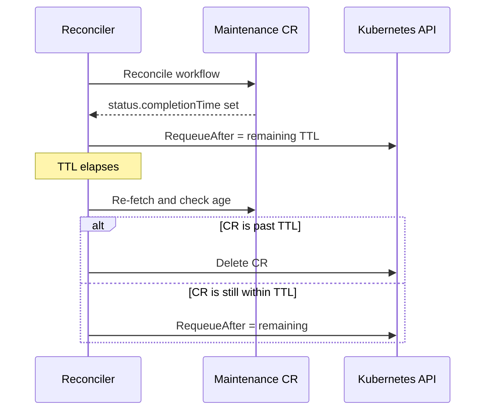

# ADR-037: Janitor — Automatic Cleanup of Stale Maintenance CRs

## Context

The janitor controllers own three cluster-scoped CRs — `RebootNode`, `GPUReset`, `TerminateNode` (`janitor.dgxc.nvidia.com/v1alpha1`) — that drive maintenance workflows. They are created per-event (typically by `fault-remediation`, sometimes by admins) and reach a terminal state signaled by `status.completionTime`.

There is no cleanup after completion. The reconcilers return `ctrl.Result{}` on terminal state and never revisit the CR. Existing mechanisms also don't GC:

- OwnerReference cascade is ineffective: `fault-remediation` sets the owner to the `Node` with `BlockOwnerDeletion: false`, so cascade fires only when the Node is deleted, which is rare for long-lived clusters.
- No TTL field exists on any of the three CRD schemas.

Observed in production: across multiple long-running clusters, 93–99% of `RebootNode` CRs are older than 14 days.

### Impact

- etcd growth scales linearly with cluster age.
- Informer cache and LIST latency degrade in proportion — notably in `fault-remediation.checkExistingCRStatus`, which LISTs on every reconcile.
- `kubectl get rebootnode` is dominated by stale items.

## Decision

Each janitor reconciler deletes its own CR `T` after `status.completionTime`, where `T` is a per-controller `ttlAfterCompletion` duration.

- Default: `336h` (14 days) — matches the staleness threshold observed in production.
- `0` disables (opt-out).
- No CRD schema change.

## Implementation

### Workflow



### Reconciliation model

Reconcile is event-driven: it fires on create/update/delete and on the controller's `RequeueAfter`. Two properties make this design work without a separate GC loop:

- Steady state: the completed branch now returns `RequeueAfter: ttl - age` instead of `ctrl.Result{}`, so each completed CR schedules exactly one future reconcile at `completionTime + ttl`.
- Backlog on upgrade: on startup, controller-runtime performs an initial sync and fires Reconcile once per existing CR. Any CR already past TTL is deleted on that first pass; others are requeued for their remaining lifetime. No migration code is needed.

### Config

Add one field to each of `RebootNodeControllerConfig`, `GPUResetControllerConfig`, `TerminateNodeControllerConfig` in `janitor/pkg/config/config.go`:

```go
// TTLAfterCompletion is the duration after status.completionTime before a
// completed CR is auto-deleted. 0 disables.
TTLAfterCompletion time.Duration `mapstructure:"ttlAfterCompletion" json:"ttlAfterCompletion"`
```

Default `14 * 24 * time.Hour` applied in `applyConfigDefaults`.

### Shared helper

A single helper in `janitor/pkg/controller/utils.go`:

```go
func enforceTTLAfterCompletion(
    ctx context.Context, c client.Client, obj client.Object,
    completionTime *metav1.Time, ttl time.Duration,
) (ctrl.Result, bool, error) {
    if ttl == 0 || completionTime == nil {
        return ctrl.Result{}, false, nil
    }
    age := time.Since(completionTime.Time)
    if age >= ttl {
        if err := c.Delete(ctx, obj); err != nil && !apierrors.IsNotFound(err) {
            return ctrl.Result{}, false, err
        }
        metrics.GlobalMetrics.IncCRTTLDeleted(obj.GetObjectKind().GroupVersionKind().Kind)
        return ctrl.Result{}, true, nil
    }
    return ctrl.Result{RequeueAfter: ttl - age}, false, nil
}
```

### Reconciler call sites

Each `Reconcile` gains one call on the completed branch. For `RebootNodeReconciler`:

```go
res, deleted, err := enforceTTLAfterCompletion(
    ctx, r.Client, &rebootNode,
    rebootNode.Status.CompletionTime, r.Config.TTLAfterCompletion)
if err != nil || deleted {
    return res, err
}
return res, nil
```

Same pattern in `gpureset_controller.go` (after finalizer handling) and `terminatenode_controller.go`.

### Helm values

```yaml
# distros/kubernetes/nvsentinel/charts/janitor/values.yaml
config:
  rebootNodeController:
    ttlAfterCompletion: "336h"    # 14 days; set to 0 to disable
  terminateNodeController:
    ttlAfterCompletion: "336h"
  gpuResetController:
    ttlAfterCompletion: "336h"
```

`charts/janitor/templates/configmap.yaml` already renders the full config block via viper — no template change.

### Metrics

New counter in `janitor/pkg/metrics/metrics.go`:

```
janitor_cr_deleted_by_ttl_total{kind="RebootNode|GPUReset|TerminateNode"}
```

### RBAC

All three controllers already have `delete` on their resources. No RBAC change.

### File changes

| File | Change |
|------|--------|
| `janitor/pkg/config/config.go` | Add `TTLAfterCompletion` to 3 configs |
| `janitor/pkg/config/default.go` | Default `336h` (14d) |
| `janitor/pkg/controller/utils.go` | Add helper |
| `janitor/pkg/controller/{rebootnode,gpureset,terminatenode}_controller.go` | Call helper |
| `janitor/pkg/metrics/metrics.go` | Add counter |
| `distros/.../charts/janitor/values.yaml` | Add 3 `ttlAfterCompletion` entries |
| `janitor/pkg/controller/*_test.go` | TTL test cases |

## Rationale

- Uses the existing reconcile path — no new controller, no new watches, no leader-election changes.
- Config-level TTL is operationally equivalent to a spec field without a CRD schema bump; can be promoted to a `spec.ttlSecondsAfterFinished` field later if needed.
- Mirrors Kubernetes `Job.ttlSecondsAfterFinished` semantics, familiar to operators.
- `completionTime` is a reliable terminal signal already set by each controller.
- `0` preserves current behavior for operators with external retention tooling.

## Consequences

**Positive**: bounded CR growth; faster LISTs; cleaner `kubectl` output; consistency with sibling Jobs.

**Negative**:
- Historical CRs beyond TTL are gone. Maintenance CRs are a transient workflow artifact — long-term audit of health events and remediation outcomes should rely on the configured event store or an external sink, not on these CRs.
- First rollout on a large backlog briefly spikes deletion traffic.

**Mitigations**: 14-day default gives ample investigation time; tunable per controller; `0` opts out; deletion is logged and counted; operators with large backlogs can start at a higher TTL and ramp down.

## Alternatives Considered

- Separate cleanup controller — rejected; duplicates RBAC and watches already present in the per-kind reconcilers.
- CronJob running `kubectl delete` — rejected; non-idiomatic, awkward to test, separate RBAC surface.
- CRD `spec.ttlSecondsAfterFinished` field — deferred; requires schema migration, and config-level is equivalent for v1.
- OwnerReference redesign (owner = `HealthEventResource`) — deferred; depends on ADR-027 TTL landing and doesn't cover admin-created CRs.
- Do nothing — rejected; production evidence (93–99% staleness across clusters) shows manual cleanup does not happen.

## Testing

- envtest: delete past TTL; requeue before TTL; `ttl=0` disables; nil `completionTime` is never deleted; `NotFound` on delete is not an error; idempotent across repeated reconciles.
- Integration: per-controller TTLs independent; Helm upgrade picks up new TTL.
- Metrics: counter increments on each TTL deletion.

## References

- [Issue #370](https://github.com/NVIDIA/NVSentinel/issues/370)
- [ADR-019: Janitor GPU Reset](019-janitor-gpu-reset.md)
- [ADR-027: Kubernetes Data Store](027-kubernetes-data-store.md)
- [ADR-028: Generic Bare-Metal Reboot Provider](028-generic-baremetal-reboot-provider.md)
- [Kubernetes `Job.ttlSecondsAfterFinished`](https://kubernetes.io/docs/concepts/workloads/controllers/ttlafterfinished/)
