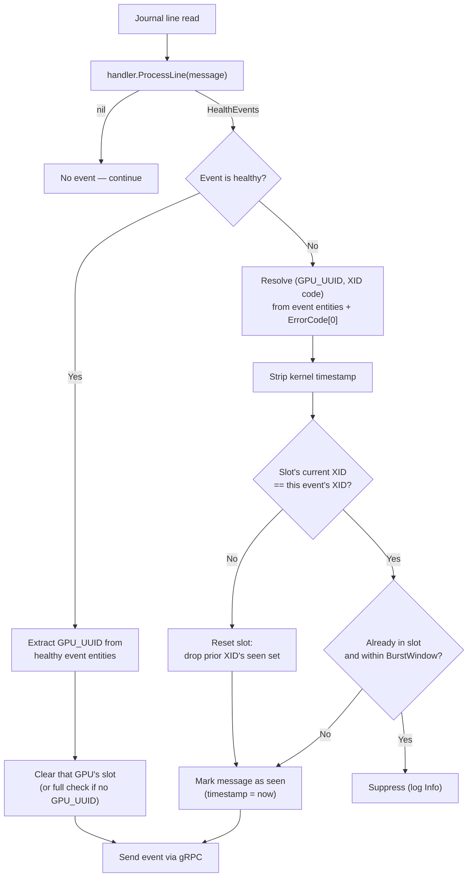

# ADR-039: Syslog Health Monitor — Event Deduplication Until Remediation

## Context

The syslog monitor polls journald (default 30s), runs each line through the appropriate handler (`XIDHandler`, `SXIDHandler`, `GPUFallenHandler`), and forwards any resulting `HealthEvent` to the platform connector. When a GPU enters a persistent error state, the kernel logs the *same* XID/SXID line every poll, differing only in the kernel timestamp prefix:

```
Poll 1:  [ 1108.858286] NVRM: Xid (PCI:0000:b3:00.0): 79, pid=1234, name=nv-hostengine
Poll 2:  [ 1843.308145] NVRM: Xid (PCI:0000:b3:00.0): 79, pid=1234, name=nv-hostengine
Poll 3:  [ 2501.556012] NVRM: Xid (PCI:0000:b3:00.0): 79, pid=1234, name=nv-hostengine
```

These reach fault-quarantine and node-drainer as distinct events: redundant drain evaluations, inflated event counts, audit-log noise. The platform connector compacts node-condition annotations but does not deduplicate the gRPC stream.

### Scope

`SysLogsXIDError` and `SysLogsSXIDError` only. `SysLogsGPUFallenOff` already runs its own XID-windowed correlation and is excluded.

### Assumption: single dominant XID per burst

Production XID bursts on a given GPU are dominated by a single XID code (e.g., XID 31, 45, 95 producing ~100k repeated events). Distinct XID codes arriving back-to-back within the same burst window are rarely observed in field data, except XID 162 <-> XID 163 pair. This justifies tracking only one `(currentXidCode, seenMessages)` slot per `(node, GPU_UUID)`: a different XID arriving on the same GPU is treated as a state transition that supersedes the prior slot.

## Decision

Per `(node, GPU_UUID)` slot, hold one current XID code and a TTL'd set of seen normalized messages. Suppress an unhealthy event when its normalized message is already in the slot for the same XID code and the entry is within `BurstWindow`. Reset the slot on XID change, healthy event, or reboot.



The dedup key is the message string with the kernel timestamp prefix stripped. Any other field difference (PCI, XID, pid, channel, process) is a distinct error and is not deduplicated.

### What clears the dedup

| Signal                                                            | Cleared                                                                  |
|-------------------------------------------------------------------|--------------------------------------------------------------------------|
| Different XID code observed on same `(node, GPU_UUID)`            | The full slot for that GPU                                               |
| `BurstWindow` TTL elapses on a seen-message entry                 | That message entry only — next identical line re-emits as a fresh burst |
| GPU reset detected (`GPU reset executed: GPU-...`)                | The slot for the recovered GPU (matched via the healthy event's GPU_UUID) |
| Healthy event with no GPU_UUID entity (e.g., generic reboot)      | All slots for that check                                                 |
| System reboot (boot ID change)                                    | All slots for all checks                                                 |
| Pod restart                                                       | Nothing — slots restored from state file                                 |

SXID has no runtime healthy signal (recommended action is `CONTACT_SUPPORT`), so an SXID slot only clears on XID change, TTL, or reboot.

### TTL semantics

The seen-message TTL is the **burst window** — the smallest gap between two error lines that should still count as the same burst. Entries older than `BurstWindow` are evicted, so every gap larger than the burst window produces a fresh event: a stuck GPU still emits one event per burst at the kernel's pace.

Default: **3 minutes**. Configurable via the helm value `syslog-health-monitor.burstWindow` (Go duration string, e.g. `"3m"`, `"180s"`).

## Implementation

### `pkg/dedup` (new)

```go
package dedup

type Tracker struct {
    mu     sync.RWMutex
    perGPU map[string]*gpuSlot   // key: GPU_UUID; "" for events without GPU attribution
    ttl    time.Duration         // BurstWindow
    now    func() time.Time      // injectable for tests
}

type gpuSlot struct {
    xidCode string
    seen    map[string]time.Time   // normalizedMessage → first-seen
}

// SlotSnapshot is the on-disk representation of a single (gpuUUID, xidCode) slot.
type SlotSnapshot struct {
    GPUUUID   string            `json:"gpuUUID"`
    XidCode   string            `json:"xidCode"`
    FirstSeen map[string]string `json:"firstSeen"`   // normalizedMessage → RFC3339
}

// Strips the kernel timestamp prefix: "[ 1108.858286] ", "[73309.599396] ", "[123] "
var reKernelTimestamp = regexp.MustCompile(`^\[\s*\d+(?:\.\d+)?\]\s*`)

func NormalizeMessage(msg string) string

func NewTracker(ttl time.Duration) *Tracker
func NewTrackerFromSnapshot(ttl time.Duration, snap []SlotSnapshot) *Tracker  // drops already-expired entries

// IsDuplicate is true iff (gpuUUID, xidCode, msg) is in the slot and within ttl.
// Side effect: evicts TTL-expired entries it scans.
func (t *Tracker) IsDuplicate(gpuUUID, xidCode, normalizedMsg string) bool

// Mark records the message. If the slot's xidCode differs, the slot is reset before recording.
func (t *Tracker) Mark(gpuUUID, xidCode, normalizedMsg string)

func (t *Tracker) ClearGPU(gpuUUID string)   // O(1)
func (t *Tracker) Clear()
func (t *Tracker) Snapshot() []SlotSnapshot
```

The mutex is forward-looking — the monitor is single-threaded today.

### Suppressed-event metric

Existing `syslog_health_monitor_xid_errors{node, err_code}` and `syslog_health_monitor_sxid_errors{node, err_code, link, nvswitch}` are incremented inside `ProcessLine()`, before dedup, so they reflect the kernel rate. A new counter measures suppression:

```go
var dedupSuppressedCounter = promauto.NewCounterVec(
    prometheus.CounterOpts{
        Name: "nvsentinel_syslog_dedup_suppressed_total",
        Help: "Total number of health events suppressed by deduplication.",
    },
    []string{"check", "node", "err_code"},
)
```

Suppression rate as a fraction of true error rate:
```promql
rate(nvsentinel_syslog_dedup_suppressed_total{check="SysLogsXIDError", node="gpu-node-1"}[5m])
  /
rate(syslog_health_monitor_xid_errors{node="gpu-node-1"}[5m])
```

### `SyslogMonitor` integration

Struct gains `dedupTrackers map[string]*dedup.Tracker` (keyed by check name; populated only for XID and SXID).

State-file struct in `pkg/syslog-monitor/types.go`:

```go
type syslogMonitorState struct {
    Version          int                              `json:"version"`
    BootID           string                           `json:"boot_id"`
    CheckLastCursors map[string]string                `json:"check_last_cursors"`
    Slots            map[string][]dedup.SlotSnapshot  `json:"slots,omitempty"`
}
```

No state-file version bump; old files load with `Slots == nil`.

In `NewSyslogMonitorWithFactory`, the constructor builds one tracker per dedup-eligible check, restoring from `state.Slots[check.Name]` if present, with `ttl` parsed from the `BURST_WINDOW` env var rendered by the chart from `syslog-health-monitor.burstWindow` (default `"3m"`).

### Event-sending path

A new `applyDedup` is inserted in `handleSingleLine` between `handler.ProcessLine()` and `sendHealthEventWithRetry()`:

```go
func (sm *SyslogMonitor) applyDedup(checkName string, events *pb.HealthEvents) *pb.HealthEvents {
    tracker, ok := sm.dedupTrackers[checkName]
    if !ok {
        return events
    }

    var filtered []*pb.HealthEvent
    for _, event := range events.Events {
        if event.IsHealthy {
            sm.clearDedupForHealthyEvent(checkName, event)
            filtered = append(filtered, event)
            continue
        }

        gpuUUID := extractGPUUUID(event.EntitiesImpacted)   // "" if absent
        xidCode := ""
        if len(event.ErrorCode) > 0 {
            xidCode = event.ErrorCode[0]
        }
        key := dedup.NormalizeMessage(event.Message)

        if tracker.IsDuplicate(gpuUUID, xidCode, key) {
            dedupSuppressedCounter.WithLabelValues(checkName, event.NodeName, xidCode).Inc()
            slog.Info("Suppressed duplicate health event",
                "check", checkName, "node", event.NodeName,
                "gpuUUID", gpuUUID, "xidCode", xidCode, "normalizedMessage", key)
            continue
        }
        tracker.Mark(gpuUUID, xidCode, key)   // resets slot if xidCode changed
        filtered = append(filtered, event)
    }

    if len(filtered) == 0 {
        return nil
    }
    return &pb.HealthEvents{Version: events.Version, Events: filtered}
}

// clearDedupForHealthyEvent: with GPU_UUID, clear that slot; otherwise clear all slots for the check.
func (sm *SyslogMonitor) clearDedupForHealthyEvent(checkName string, event *pb.HealthEvent) {
    tracker, ok := sm.dedupTrackers[checkName]
    if !ok {
        return
    }
    cleared := false
    for _, e := range event.EntitiesImpacted {
        if e.EntityType == "GPU_UUID" && e.EntityValue != "" {
            tracker.ClearGPU(e.EntityValue)
            cleared = true
        }
    }
    if !cleared {
        tracker.Clear()
    }
}
```

`handleBootIDChange` clears every tracker alongside the existing cursor reset. `saveCurrentState` snapshots each tracker into `state.Slots[checkName]`. State persistence already happens after each check in `executeCheck` — no new save calls.

### Files touched

| File                                       | Change                                                                                          |
|--------------------------------------------|-------------------------------------------------------------------------------------------------|
| `pkg/dedup/tracker.go`                     | **New** — `Tracker`, `SlotSnapshot`, `NormalizeMessage`                                         |
| `pkg/dedup/tracker_test.go`                | **New** — unit tests: TTL eviction, XID-change reset, snapshot round-trip                       |
| `pkg/syslog-monitor/types.go`              | Add `dedupTrackers` to `SyslogMonitor`; add `Slots` to state                                    |
| `pkg/syslog-monitor/syslogmonitor.go`      | Constructor wiring; `applyDedup`, `clearDedupForHealthyEvent`; updates to `handleBootIDChange` and `saveCurrentState` |
| `pkg/syslog-monitor/syslogmonitor_test.go` | Integration tests: suppression, healthy-clears, reboot-clears, XID-change reset, state round-trip |

## Rationale

- **Monitor-level dedup** keeps the `Handler` interface and every handler implementation untouched.
- **TTL = `BurstWindow`** ensures dedup operates within a burst rather than across bursts.
- **Single slot per GPU** — see Assumption.
- **State persistence** carries dedup across pod restarts within the current burst window.

## Consequences

### Positive
- Eliminates redundant gRPC traffic, store rows, and audit-log entries within a burst.
- One event still emerges per burst, so any consumer that counts bursts continues to work.
- No `Handler`, gRPC, or downstream contract changes.

### Negative
- Same XID with rotating pid or process name is intentionally not deduped — different pids may be different occurrences.
- An XID alternating between two codes on the same GPU (X→Y→X→Y) re-emits on every transition. Alternation is itself a signal worth surfacing.
State-file size is bounded by `O(GPUs per node)`, regardless of message-set size or burst length.

## Alternatives Considered

### Whole-check clearing on healthy events
Clear every slot for the check whenever any healthy event arrives, instead of clearing per-GPU.

**Rejected:** when GPU-A is reset, GPU-B's suppressed errors would be re-reported.

### Dedup only in downstream components
Rely on `deduplicateMessagesByIdentity` in the platform connector instead of suppressing at source.

**Rejected:** that operates on node-condition annotations, not the gRPC event stream. Redundant events still consume bandwidth, storage, and inflate counts.

## Notes

- The unknown-GPU bucket (slot key `""`) handles events without GPU attribution and is single-XID-slotted with the same semantics as a real GPU bucket.
## References

- [ADR-020: NVSentinel GPU Reset](020-nvsentinel-gpu-reset.md) — the GPU reset detection that serves as the XID remediation signal.
- [ADR-001: Health Event Detection Interface](001-health-event-detection-interface.md) — the `Handler` interface this ADR leaves unchanged.
