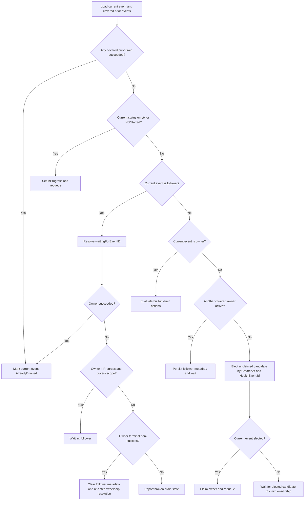

# ADR-040: Node Drainer — Coalesce Overlapping Built-in Drains

## Context

Node-drainer processes quarantined health events and executes either:

- the built-in drain flow, which evicts or waits for Kubernetes pods directly, or
- the custom-drain flow, which delegates drain work to a configured CR.

This ADR is scoped only to built-in drains. Custom drain already has its own active-drain handling through drain CRs and is intentionally out of scope.

Built-in drains already avoid redundant work after a previous drain has completed. For an `AlreadyQuarantined` node, node-drainer checks the node's `quarantineHealthEvent` annotation, loads prior events from the store, and skips the current event when a previous completed drain covers the same scope.

The gap is active overlap. If another event for the same node and drain scope arrives while an earlier built-in drain is still `InProgress`, the later event does not currently treat the active drain as covering it. Because events are retried through the workqueue, overlapping events can interleave across queue turns and repeatedly run the same namespace matching, pod listing, eviction, completion-check, timeout, node-event, and retry loop.

This is redundant work rather than a new remediation behavior. Kubernetes eviction is mostly idempotent, and node-drainer currently runs with one worker, but the repeated drain loop adds queue churn, Kubernetes API calls, and operational noise for bursts of events that represent the same physical fault.

## Decision

Add scope-aware coalescing for built-in drains.

For a built-in drain event, node-drainer should resolve ownership for the drain scope before doing namespace matching, pod listing, eviction, timeout, or completion-check work. One event becomes the drain owner for that scope. Later covered events become followers: they wait for the owner, and when the owner succeeds they become `AlreadyDrained`.

The design preserves the existing completed-drain skip semantics and extends them to active built-in drains. Completed covered drains take priority over active overlaps. Broken or ambiguous overlap state must be observable and bounded; it should not silently retry forever or let stale follower metadata drive drain work.

## Scope and Coverage

Coalescing applies only to built-in drains. Custom drain remains CR-driven and must not use built-in owner/follower metadata.

Drain scope follows the same coverage rules as completed-drain skipping:

| Existing drain scope | Current drain scope | Relationship |
|----------------------|---------------------|--------------|
| Full node            | Full node           | Covers       |
| Full node            | Partial entity      | Covers       |
| Partial entity `E`   | Partial entity `E`  | Covers       |
| Partial entity `E`   | Partial entity `F`  | Does not cover |
| Partial entity `E`   | Full node           | Does not cover |

A full-node drain covers all later built-in drains for the node. A partial drain covers only later partial drains for the same impacted entity. A partial drain must not block a later full-node drain.

Completed coverage wins before active ownership is considered. If any covered prior event has `userpodsevictionstatus.status == Succeeded`, the current event is marked `AlreadyDrained`, even if the current event has stale follower metadata or another covered event is still `InProgress`.

## Ownership Model

Node-drainer persists ownership state under `healtheventstatus.userpodsevictionstatus.metadata`.

Required metadata:

- `drainRole`: `owner` or `follower`.
- `waitingForEventID`: set on followers to the owner event they are waiting for.

`waitingForEventID` stores the canonical health-event record ID: the same value stored in `HealthEvent.Id`, written into the `quarantineHealthEvent` annotation, and used by `getHealthEventFromId` for store lookup. It must not use the workqueue key or a datastore document ID.

An owner is the only event allowed to perform built-in drain work for a covered scope. A follower is never an eligible owner for another event. This prevents chains such as `C -> B -> A`; followers point only to a real owner.

Ownership must be claimed before namespace or pod work begins. The owner claim is a targeted datastore update that matches only when the current event is still `InProgress` and has no `drainRole` or `waitingForEventID`. If the claim update does not modify the document, node-drainer must re-fetch and re-evaluate before doing any drain work.

This design assumes node-drainer processes events with a single worker and a single replica. The per-event conditional claim prevents stale writes to the current event, and deterministic local election ensures that one worker chooses one owner for a scope. A multi-worker or multi-replica node-drainer must add a scope-level compare/guard, such as a drain-scope lease document or an atomic update keyed by `(node, drainScope)`, before concurrent processing is enabled.

Status updates must preserve ownership metadata. The implementation should use granular datastore updates for `userpodsevictionstatus.status` and `userpodsevictionstatus.message` instead of replacing the whole `userpodsevictionstatus` object. This keeps `drainRole` and `waitingForEventID` intact without changing the protobuf status model. Terminal updates must not clear `drainRole` or `waitingForEventID`.

## Evaluation Order

Built-in drain processing is split into ownership resolution and drain action evaluation. Only an event that has resolved as owner reaches the built-in drain action evaluator.

Follower resolution must validate both the referenced owner status and scope. A follower waits only when `waitingForEventID` points to an `InProgress` owner whose derived scope covers the follower's scope. A succeeded owner makes the follower `AlreadyDrained`; a terminal non-success owner clears follower metadata and re-enters ownership resolution; a missing, invalid, or mismatched owner is reported as broken drain state.

Follower metadata must be durable before a delayed overlap wait is scheduled. Marking an event as follower is idempotent when it is already a follower for the same `waitingForEventID`. A mismatched `waitingForEventID` is a conflict and must be re-evaluated through the rate-limited path.

Expected overlap waits must use delayed requeue behavior. The existing `ActionWait` path currently logs `WaitDelay` but requeues via the exponential rate limiter. Overlap waits need an explicit wait reason, such as `OverlapActiveDrain`, that the worker maps to `AddAfter`. Existing error waits, such as missing status, namespace lookup failures, and datastore/client errors, continue to use rate-limited retry.

`ownershipNone` after preconditions is an invariant violation. It must be reported as broken drain state and must not fall through to drain action evaluation.

## Recovery and Cold Start

Cold start re-enqueues events that still require node-drainer processing:

- `InProgress` events, including owners and followers.
- `Quarantined` or `AlreadyQuarantined` events whose eviction status is empty or `NotStarted`.

Empty or `NotStarted` events first transition to `InProgress` through a conditional update, then re-enter ownership resolution. That update must match only non-terminal events whose current eviction status is still empty or `NotStarted`; if the update loses, node-drainer re-fetches and re-evaluates.

Cold-start replay order must not affect correctness. If a follower is processed before its owner, it uses `waitingForEventID` to resolve the owner state. If the owner completed while the follower was not running, the follower becomes `AlreadyDrained`. If the owner failed or was cancelled, the follower clears follower metadata and re-enters ownership resolution.

Unclaimed missing-role `InProgress` events are handled as a migration/recovery case. Node-drainer elects one candidate deterministically by `(CreatedAt, HealthEvent.Id)`. Non-elected events wait for the candidate to claim ownership but do not persist follower metadata until the owner claim succeeds. This avoids follower chains.

Waiting on an unclaimed elected candidate is bounded. If the same candidate remains unclaimed after a small fixed number of polls, or cold start cannot recover it, node-drainer reports broken drain state and re-evaluates so another candidate can claim ownership.

## Observability

The implementation should add metrics and structured logs for:

- overlapping built-in drain waits, labeled by node and low-cardinality scope (`full` or `partial`);
- cold-start recovery failures for selected events that could not be re-enqueued;
- broken drain-state conditions such as missing owners, invalid owners, follower/owner scope mismatch, unclaimed owner candidates, and impossible ownership results.

Do not put raw entity values such as GPU UUIDs in metric labels. Include entity type/value and event IDs in structured logs instead.

Broken states are operational signals. They should be visible and bounded rather than hidden behind endless delayed overlap waits.

## Consequences

### Positive

- Reduces duplicate built-in drain evaluation, pod scans, eviction attempts, node events, and retry cycles for bursts of overlapping events.
- Preserves existing completed-drain behavior and reuses the same coverage semantics.
- Keeps partial-drain isolation: a partial drain for one entity does not block a different entity or a later full-node drain.
- Makes active overlap state explicit and observable through owner/follower metadata.

### Negative

- Adds ownership metadata that must be preserved by status updates.
- Adds a pre-drain ownership-resolution phase before built-in drain evaluation.
- Followers remain `InProgress` until the owner succeeds, fails, or becomes observably broken.
- The initial design assumes the current single-worker/single-replica node-drainer deployment for scope-level uniqueness.

### Mitigations

- Keep the ownership logic inside the built-in path; custom drain remains CR-driven.
- Preserve metadata with granular updates or model support before enabling coalescing.
- Emit metrics/logs for cold-start recovery failures and broken overlap state.
- Add a scope-level guard before any future multi-worker or multi-replica node-drainer deployment.

## Acceptance Tests

Implementation should include focused coverage for:

- custom drain enabled: no built-in owner/follower metadata is written;
- completed-priority behavior when both completed and active covered drains exist;
- empty/`NotStarted` cold-start events are initialized before ownership decisions;
- current owner continues to drain and does not wait on itself;
- current follower waits, becomes `AlreadyDrained`, clears metadata, or reports broken state based on owner status;
- follower scope validation rejects mismatched owners;
- deterministic owner election includes the current event and prevents mutual waits;
- owner claim loss causes re-fetch/re-evaluation without drain work;
- follower marking is idempotent for the same `waitingForEventID`;
- terminal status updates preserve ownership metadata unless deliberately cleared;
- `waitingForEventID` uses canonical `HealthEvent.Id`;
- overlap waits use delayed requeue, while error waits remain rate-limited.

## References

- [ADR-004: Workload Eviction Strategies](./004-workload-eviction-strategies.md) — built-in node-drainer behavior and namespace-based drain modes.
- [ADR-015: Node Drain Extensibility](./015-custom-drain-extensibility.md) — custom drain behavior, explicitly out of scope for this ADR.
- [ADR-039: Health Event Deduplication](./039-health-event-deduplication.md) — upstream event deduplication; complementary but not sufficient for node-drainer scope coalescing.
