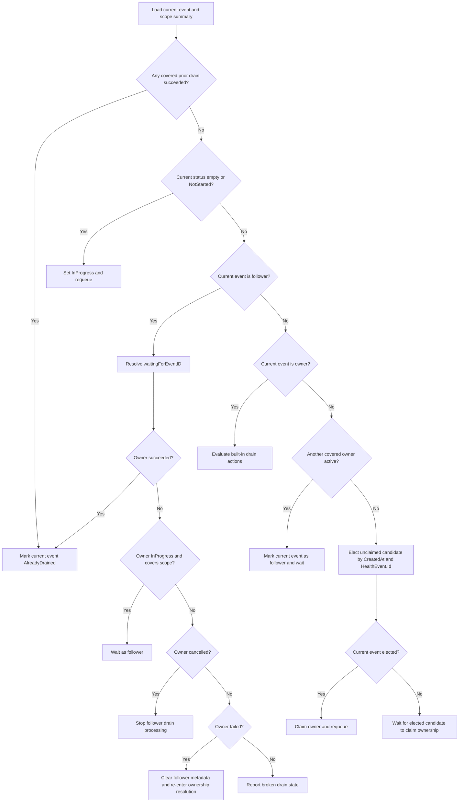

# ADR-040: Node Drainer — Coalesce Overlapping Built-in Drains

## Context

Node-drainer processes quarantined health events and executes either:

- the built-in drain flow, which evicts or waits for Kubernetes pods directly, or
- the custom-drain flow, which delegates drain work to a configured CR.

This ADR is scoped only to built-in drains. Custom drain already has its own active-drain handling through drain CRs and is intentionally out of scope.

Built-in drains already avoid redundant work after a previous drain has completed. For an `AlreadyQuarantined` node, node-drainer checks the node's `quarantineHealthEvent` annotation, loads prior events from the store, and skips the current event when a previous completed drain covers the same scope.

The gap is active overlap. If another event for the same node and drain scope arrives while an earlier built-in drain is still `InProgress`, the later event can repeat the same drain loop across workqueue retries. This is redundant work, not new remediation, and adds queue churn, Kubernetes API calls, and operational noise for bursts that represent the same physical fault.

## Decision

Add scope-aware coalescing for built-in drains.

For a built-in drain event, node-drainer resolves ownership for the drain scope before doing namespace matching, pod listing, eviction, timeout, or completion-check work. One event becomes the drain owner for that scope. Later covered events become followers: they wait for the owner, and when the owner succeeds they become `AlreadyDrained`.

The design preserves the existing completed-drain skip semantics and extends them to active built-in drains. Completed covered drains take priority over active overlaps. Broken or ambiguous overlap state is observable and bounded; it should not silently retry forever or let stale follower metadata drive drain work.

## Scope and Coverage

Coalescing applies only to built-in drains. Custom drain remains CR-driven and must not use built-in owner/follower metadata.

Drain scope follows the same coverage rules as completed-drain skipping:

| Existing drain scope | Current drain scope | Relationship |
|----------------------|---------------------|--------------|
| Full node            | Full node           | Covers       |
| Full node            | Partial entity      | Covers       |
| Partial entity `E`   | Partial entity `E`  | Covers       |
| Partial entity `E`   | Partial entity `F`  | Does not cover |
| Partial entity `E`   | Full node           | Does not cover |

A full-node drain covers all later built-in drains for the node. A partial drain covers only later partial drains for the same impacted entity. A partial drain must not block a later full-node drain.

Completed coverage wins before active ownership is considered. If any covered prior event has `userpodsevictionstatus.status == Succeeded`, the current event is marked `AlreadyDrained`, even if the current event has stale follower metadata or another covered event is still `InProgress`.

## Ownership Resolution

Ownership resolution is the gate before built-in drain work. Only an event that has resolved as owner reaches the built-in drain action evaluator.

Node-drainer persists ownership state under `healtheventstatus.userpodsevictionstatus.metadata`:

- `drainRole`: `owner` or `follower`.
- `waitingForEventID`: set on followers to the owner event they are waiting for.

Ownership resolution must read a typed representation that includes `userpodsevictionstatus.metadata`. Add metadata support to the protobuf `OperationStatus` model and preserve it through serialization/deserialization so this remains database-agnostic.

`waitingForEventID` stores the canonical health-event record ID: the same value stored in `HealthEvent.Id`, written into the `quarantineHealthEvent` annotation, and used by `getHealthEventFromId` for store lookup. It must not use the workqueue key or a datastore document ID.

Owner event:

```json
{
  "healtheventstatus": {
    "userpodsevictionstatus": {
      "status": "InProgress",
      "metadata": {
        "drainRole": "owner"
      }
    }
  }
}
```

Follower event:

```json
{
  "healtheventstatus": {
    "userpodsevictionstatus": {
      "status": "InProgress",
      "metadata": {
        "drainRole": "follower",
        "waitingForEventID": "<owner HealthEvent.Id>"
      }
    }
  }
}
```

Status updates must preserve ownership metadata. The implementation should either update `userpodsevictionstatus.status` and `userpodsevictionstatus.message` granularly, or preserve the existing metadata when writing the full operation-status object. Terminal updates must not clear `drainRole` or `waitingForEventID`.

### In-Memory Ownership Index

Ownership resolution uses an in-memory per-node drain-scope summary instead of scanning the full annotation for every event. The summary is built from the node's `quarantineHealthEvent` annotation and current store results, rebuilt during cold start, and refreshed as drain events are processed.

For each full-node scope and partial-entity scope, the summary tracks:

- completed drains;
- active owners;
- unclaimed `InProgress` candidates.

This makes burst and cold-start processing close to one scan per node plus scope lookups, instead of `O(N)` annotation scans for each of `N` events.

Ownership resolution follows this decision order:

```text
resolveOwnership(currentEvent):
  currentScope = deriveDrainScope(currentEvent)
  scopeSummary = getOrBuildScopeSummary(currentEvent.node)

  if scopeSummary has completed drain covering currentScope:
    mark currentEvent AlreadyDrained
    return

  if currentEvent eviction status is empty or NotStarted:
    set currentEvent InProgress
    requeue currentEvent
    return

  if currentEvent is follower:
    owner = load waitingForEventID
    if owner is missing or is not the recorded drain owner:
      report broken drain state
    else if owner succeeded:
      mark currentEvent AlreadyDrained
    else if owner is InProgress and owner scope covers currentScope:
      wait as follower
    else if owner was cancelled:
      stop follower drain processing
    else if owner failed:
      clear follower metadata and re-enter ownership resolution
    else:
      report broken drain state
    return

  if currentEvent is owner:
    evaluate built-in drain actions
    return

  if scopeSummary has active owner covering currentScope:
    mark currentEvent as follower of that owner
    wait as follower
    return

  candidate = scopeSummary elects unclaimed InProgress event by (CreatedAt, HealthEvent.Id)
  if candidate is currentEvent:
    claim owner and requeue as owner
  else:
    wait for candidate to claim ownership
```



The key rules are:

- An owner is the only event allowed to perform built-in drain work for a covered scope.
- A follower is never an eligible owner for another event; followers point only to a real owner.
- Ownership must be claimed before namespace or pod work begins.
- The owner claim is a targeted datastore update that matches only when the current event is still `InProgress` and has no `drainRole` or `waitingForEventID`.
- If the owner claim update does not modify the document, node-drainer re-fetches and re-evaluates before doing any drain work.
- Follower metadata must be durable before a delayed overlap wait is scheduled.
- Marking an event as follower is idempotent when it is already a follower for the same `waitingForEventID`.
- A mismatched `waitingForEventID` is a conflict and is re-evaluated through the rate-limited path.
- `ownershipNone` after preconditions is an invariant violation and must not fall through to drain action evaluation.

Follower behavior depends on owner status:

- A succeeded owner makes the follower `AlreadyDrained`.
- An active owner keeps the follower waiting, as long as the owner scope still covers the follower scope.
- A cancelled owner stops follower drain processing, because cancellation represents uncordon or healthy-event recovery rather than a signal to find another drain owner.
- A failed owner may let the follower clear metadata and re-enter ownership resolution. This is expected to be rare for current built-in drains.
- A missing, invalid, or mismatched owner is reported as broken drain state.

When a follower is only waiting for its owner, node-drainer should requeue it after the requested delay instead of treating the wait like an error. The existing `ActionWait` path currently logs `WaitDelay` but requeues via the exponential rate limiter. Follower waits need an explicit reason, such as `OverlapActiveDrain`, that the worker maps to `AddAfter`. Real errors, such as missing status, namespace lookup failures, and datastore/client errors, continue to use rate-limited retry.

This design assumes node-drainer processes events with a single worker and a single replica. The per-event conditional claim prevents stale writes to the current event, and deterministic local election ensures that one worker chooses one owner for a scope. A multi-worker or multi-replica node-drainer must add a scope-level compare/guard, such as a drain-scope lease document or an atomic update keyed by `(node, drainScope)`, before concurrent processing is enabled.

## Recovery and Cold Start

Cold start re-enqueues events that still require node-drainer processing:

- `InProgress` events, including owners and followers.
- `Quarantined` or `AlreadyQuarantined` events whose eviction status is empty or `NotStarted`.

Empty or `NotStarted` events first transition to `InProgress` through a conditional update, then re-enter ownership resolution. That update must match only non-terminal events whose current eviction status is still empty or `NotStarted`; if the update loses, node-drainer re-fetches and re-evaluates.

Cold-start replay order must not affect correctness. If a follower is processed before its owner, it uses `waitingForEventID` to resolve the owner state. If the owner completed while the follower was not running, the follower becomes `AlreadyDrained`. If the owner was cancelled, the follower stops drain processing and does not look for another owner. If the owner failed after claiming ownership, the follower may clear follower metadata and re-enter ownership resolution.

Unclaimed missing-role `InProgress` events are handled as a migration/recovery case. Node-drainer elects one candidate deterministically by `(CreatedAt, HealthEvent.Id)`. Non-elected events wait for the candidate to claim ownership but do not persist follower metadata until the owner claim succeeds. This avoids follower chains.

Waiting on an unclaimed elected candidate is bounded. If the same candidate remains unclaimed after a small fixed number of polls, or cold start cannot recover it, node-drainer records that candidate as broken and excludes it from the next election before re-evaluating.

## Observability

The implementation should add metrics and structured logs for:

- overlapping built-in drain waits, labeled by node and low-cardinality scope (`full` or `partial`);
- cold-start recovery failures for selected events that could not be re-enqueued;
- broken drain-state conditions such as missing owners, invalid owners, follower/owner scope mismatch, unclaimed owner candidates, and impossible ownership results.

Do not put raw entity values such as GPU UUIDs in metric labels. Include entity type/value and event IDs in structured logs instead.

Broken states are operational signals. They should be visible and bounded rather than hidden behind endless delayed overlap waits.

## Consequences

### Positive

- Reduces duplicate built-in drain evaluation, pod scans, eviction attempts, node events, and retry cycles for bursts of overlapping events.
- Preserves existing completed-drain behavior and reuses the same coverage semantics.
- Keeps partial-drain isolation: a partial drain for one entity does not block a different entity or a later full-node drain.
- Makes active overlap state explicit and observable through owner/follower metadata.

### Negative

- Adds ownership metadata that must be preserved by status updates.
- Adds a pre-drain ownership-resolution phase before built-in drain evaluation.
- Followers remain `InProgress` until the owner succeeds, fails, is cancelled, or becomes observably broken.
- The design assumes the current single-worker/single-replica node-drainer deployment for scope-level uniqueness.

### Mitigations

- Keep the ownership logic inside the built-in path; custom drain remains CR-driven.
- Preserve metadata with granular updates or model support before enabling coalescing.
- Emit metrics/logs for cold-start recovery failures and broken overlap state.
- Add a scope-level guard before any future multi-worker or multi-replica node-drainer deployment.

## References

- [ADR-004: Workload Eviction Strategies](./004-workload-eviction-strategies.md) — built-in node-drainer behavior and namespace-based drain modes.
- [ADR-015: Node Drain Extensibility](./015-custom-drain-extensibility.md) — custom drain behavior, explicitly out of scope for this ADR.
- [ADR-039: Health Event Deduplication](./039-health-event-deduplication.md) — upstream event deduplication; complementary but not sufficient for node-drainer scope coalescing.
