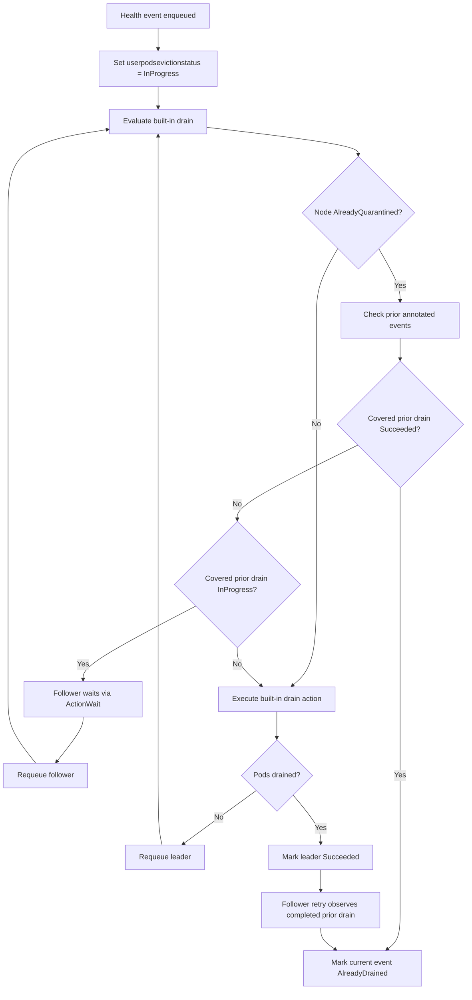
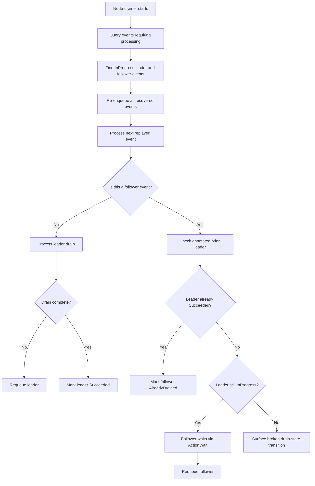

# ADR-040: Node Drainer — Coalesce Overlapping Built-in Drains

## Context

Node-drainer processes quarantined health events and executes either a built-in drain flow or, when configured, a custom drain flow. This ADR is scoped only to the built-in flow.

Built-in drains already avoid redundant work after a previous drain has completed. For an `AlreadyQuarantined` node, `NodeDrainEvaluator.isNodeAlreadyDrained` inspects the node's `quarantineHealthEvent` annotation, looks up other health events from the store, and skips the current event when a previous completed drain covers the same scope:

- A completed full drain covers later full and partial drains for the same node.
- A completed partial drain covers later partial drains for the same impacted entity.

The gap is in-progress overlap. If another event for the same node and same drain scope arrives while an earlier built-in drain is still `InProgress`, the evaluator does not treat that event as covered. The later event can therefore run the same namespace matching, pod listing, eviction, completion-check, timeout, node-event, and retry loop. The queue currently has a single worker, so overlapping events are not processed simultaneously in separate worker goroutines; however, retries can interleave them across queue turns. In practice this behaves like time-sliced parallelism for the same drain scope and creates redundant queue cycles and Kubernetes API calls.

This is sub-optimal for bursts of health events that represent the same physical fault, especially partial drains for the same `GPU_UUID`. It can make the overall quarantine-to-drained lifecycle noisier and slower even though the first actionable event should still move the node to `draining` before the heavier pod work runs.

Solution surfaces considered:

1. Upstream event volume reduction before node-drainer receives events.
2. Node-drainer built-in drain coalescing using existing drain scope semantics.
3. No node-drainer change, relying on Kubernetes eviction idempotency and existing retries.

## Decision

Add built-in drain coalescing inside node-drainer. When an event is already draining the same or a broader drain scope, later overlapping built-in events should wait for that active drain instead of repeating the drain work. Once the active drain completes, follower events should use the existing completed-drain logic and be marked `AlreadyDrained` when the completed scope covers them.

## Implementation

### Drain Scope

Define a small internal drain scope model in `node-drainer/pkg/evaluator`:

```go
type drainScope struct {
    nodeName string
    entity   *protos.Entity // nil means full-node drain
}
```

Scope coverage follows the same rules as completed-drain skipping:

| Existing drain scope | Current drain scope | Relationship |
|----------------------|---------------------|--------------|
| Full node            | Full node           | Covers       |
| Full node            | Partial entity      | Covers       |
| Partial entity `E`   | Partial entity `E`  | Covers       |
| Partial entity `E`   | Partial entity `F`  | Does not cover |
| Partial entity `E`   | Full node           | Does not cover |

The last row is intentional. A partial drain in progress should not block a later full-node drain, because the full drain represents a broader remediation requirement and cannot be satisfied by the partial drain.

### Evaluator Result

Extend the existing `AlreadyQuarantined` check so it can distinguish three outcomes:

```go
type priorDrainDisposition int

const (
    priorDrainNone priorDrainDisposition = iota
    priorDrainCompleted
    priorDrainInProgress
)
```

Wrap the existing completed-drain check with a helper that returns a richer disposition:

```go
func (e *NodeDrainEvaluator) priorCoveredDrainDisposition(
    ctx context.Context,
    currentEventID string,
    currentPartialDrainEntity *protos.Entity,
    nodeName string,
    healthEventStore datastore.HealthEventStore,
) (priorDrainDisposition, error)
```

The helper should reuse the current annotation/store lookup behavior from `isNodeAlreadyDrained` rather than reimplementing a separate path:

1. Read the node's `quarantineHealthEvent` annotation.
2. Ignore the current event ID.
3. For each other event, load the full `HealthEventWithStatus` from the health-event store.
4. Compute the previous event's drain scope using `shouldExecutePartialDrain`.
5. If the previous scope covers the current scope:
   - Return `priorDrainCompleted` when `userpodsevictionstatus.status == Succeeded`.
   - Return `priorDrainInProgress` when `userpodsevictionstatus.status == InProgress`.
   - Ignore terminal non-success states such as `Failed`, `Cancelled`, and `AlreadyDrained`.

`handleAlreadyQuarantined` then maps the disposition to actions:

```go
switch disposition {
case priorDrainCompleted:
    return &DrainActionResult{
        Action: ActionMarkAlreadyDrained,
        Status: model.AlreadyDrained,
    }
case priorDrainInProgress:
    return &DrainActionResult{
        Action:    ActionWait,
        WaitDelay: builtInDrainPollInterval,
    }
default:
    return nil
}
```

`builtInDrainPollInterval` should be a small constant, for example `30 * time.Second`, matching the custom-drain poll interval. This keeps follower events in the existing rate-limited queue loop and avoids introducing a second scheduler.

### Normal Operation Flow



### Reuse Existing Completion Path

Follower events do not need a new terminal state. They remain `InProgress` while waiting. On the next retry after the leader event reaches `Succeeded`, the same annotation/store lookup returns `priorDrainCompleted`, and the follower is marked `AlreadyDrained`.

This preserves the existing contract:

- `Succeeded` means this event performed the drain.
- `AlreadyDrained` means another event already drained the required scope.
- `InProgress` means the event is still waiting for either its own drain or a covered active drain.

### Active Drain Invariant

An `InProgress` built-in drain represents an active drain session owned by node-drainer. Once node-drainer sets `userpodsevictionstatus.status = InProgress`, the event remains in the workqueue retry loop until it reaches a terminal status. If node-drainer restarts, cold-start recovery re-enqueues existing `InProgress` events.

Follower events rely on that invariant: a covered `InProgress` event is treated as the leader for the drain scope, and followers wait for it to complete. No drain-age timeout is applied, because `AllowCompletion` can keep a drain legitimately `InProgress` for hours or days.

If an `InProgress` event is no longer being retried or recoverable through cold start, node-drainer should surface that as an operational error through logs and metrics. That condition is outside the normal coalescing path and should be investigated as a broken drain-state transition.

### Cold Start Behavior

Cold-start recovery re-enqueues all events whose `userpodsevictionstatus.status` is `InProgress`, including both leader and follower events. The design must be independent of the order in which those events are replayed.

If a follower is processed before its leader after restart, it re-runs the same coalescing check, sees the covered leader event still `InProgress`, and returns `ActionWait`. If the leader completed before restart but the follower had not yet observed that completion, the follower sees the completed prior drain and is marked `AlreadyDrained`. If the leader is no longer recoverable through cold start, that is handled as the broken drain-state transition described above rather than as a normal follower takeover path.



### Metrics and Logs

Add a counter for visibility:

```go
var OverlappingDrainWaits = promauto.NewCounterVec(
    prometheus.CounterOpts{
        Name: "nvsentinel_node_drainer_overlapping_drain_waits_total",
        Help: "Total number of built-in drain events that waited for an overlapping active drain.",
    },
    []string{"node", "scope"},
)
```

The `scope` label should be low-cardinality:

- `full`
- `partial`

Do not include raw entity values such as GPU UUIDs in metric labels. Include entity type/value in structured logs instead.

## Rationale

- **Preserves existing semantics:** Completed-drain coverage already defines which scopes can satisfy later events. Reusing the same coverage rules for active drains keeps behavior predictable.
- **Reduces redundant work:** Follower events do not repeat pod scans, eviction attempts, node-event updates, timeout checks, and queue retries for the same drain scope.
- **Keeps recovery path simple:** Waiting is implemented with the existing `ActionWait` and workqueue retry mechanics. No new persistent lock or leader-election mechanism is required.
- **Avoids under-draining:** A partial active drain does not block a later full drain, so broader remediation actions are not delayed by narrower ones.

## Consequences

### Positive

- Faster convergence for bursts of overlapping events because one leader event performs the drain and followers wait.
- Fewer duplicate Kubernetes eviction calls and pod-listing operations.
- Less node-event/log/metric noise during repeated health-event bursts.
- Clearer event status: redundant events become `AlreadyDrained` after the leader succeeds instead of each attempting to complete independently.

### Negative

- Follower events remain `InProgress` until the leader completes or stops being considered active.
- A broken `InProgress` transition can delay followers until node-drainer surfaces and fixes the underlying operational error.
- The evaluator becomes slightly more complex because it distinguishes completed, active, and irrelevant prior drains.

### Mitigations

- Emit the overlapping-drain wait metric and structured logs so operators can see when coalescing is happening.
- Emit logs and metrics when cold-start recovery cannot re-enqueue an `InProgress` event.
- Keep the scope coverage rules identical to the completed-drain rules to reduce surprising behavior.

## Notes

- This ADR intentionally excludes the custom drain path. Custom drain already detects active CRs for a node and waits instead of creating duplicate drain requests.
- The behavior should apply only after the node is `AlreadyQuarantined`, matching the existing completed-drain lookup path.
- `AlreadyDrained` remains a terminal status and should continue to be skipped by preprocessing/evaluation.
- This design does not change how events enter the workqueue or how many workers node-drainer runs.

## References

- [ADR-004: Workload Eviction Strategies](./004-workload-eviction-strategies.md) — built-in node-drainer behavior and namespace-based drain modes.
- [ADR-015: Node Drain Extensibility](./015-custom-drain-extensibility.md) — custom drain behavior, explicitly out of scope for this ADR.
- [ADR-039: Health Event Deduplication](./039-health-event-deduplication.md) — upstream event deduplication; complementary but not sufficient for node-drainer scope coalescing.
