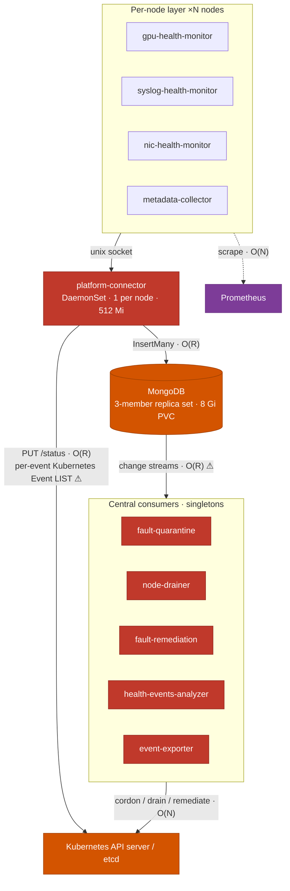
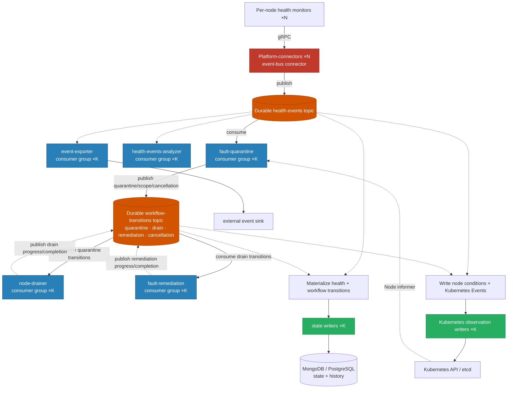

# NVSentinel Scale Issues

## Executive Summary

Each node runs health monitors and a platform-connector. Together they send health events to a shared datastore and write state to the shared Kubernetes control plane. Fault-quarantine, node-drainer, fault-remediation, analyzers, and exporters then turn those events into actions.

At small scale, the flow looks simple: a monitor reports a problem, platform-connector records it, and the fault-handling modules react. Growth changes that flow in three ways. **First,** every new node adds another writer. **Second,** the central modules remain a small fixed group while the amount of cluster state they must hold or search keeps growing. **Third,** one reported fault does not remain one operation: it becomes database writes, Kubernetes updates, rule queries, logs, metrics, and more stream records. During a fleet-wide incident, more nodes speak at once, every report creates secondary work, and the same listeners must catch up.

Local fixes should remove avoidable scans, retries, queue growth, and missing indexes while capacity-planning the required metric cardinality. At larger scale, the remaining structural constraint is a growing number of node-level writers feeding fixed shared resources and fixed-capacity listeners. The final section describes the architecture needed after the local amplification loops are removed.

---

## Action Items

Scale drivers used below: **N** = nodes, **P** = total pods, **R** = cluster-wide health-event rate, and **E** = retained health-event history (`R × retention`).

The items are ordered by how they can be delivered. Component optimizations and architecture changes are complementary: the former remove wasted work; the latter change how capacity grows.

### Existing Helm values

| ID  | Action                                                                                     | Scale driver |
| --- | ------------------------------------------------------------------------------------------ | ------------ |
| H1  | Resize MongoDB PVCs using the Bitnami subchart `persistence.size` value                    | E = R × TTL  |
| H2  | Set `namespace` on every kubernetes-object-monitor (KOM) Pod or Kubernetes Event policy    | P            |
| H3  | Enable deduplication for known noisy checks and define the suppression window and include list | R            |

### Chart changes

| ID  | Action                                                                                                              | Scale driver                  |
| --- | ------------------------------------------------------------------------------------------------------------------- | ----------------------------- |
| C1  | Expose HealthEvents TTL as a Helm value; reduce the default from 30 days where operationally acceptable             | E = R × TTL                   |
| C2  | Add PVC-utilization and oplog-window alerts                                                                         | E, R                          |
| C3  | Expose WiredTiger cache and explicit oplog sizing                                                                   | E, R                          |
| C4  | Add secondary MongoDB indexes for the existing status, agent, and cold-start filters; do not change query semantics | E × query rate                |
| C5  | Collect per-node metrics locally and provision sharded remote storage for the required node/XID series              | N × scrape targets and series |
| C6  | Replace percentage-based multi-DaemonSet rollout waves with staggered absolute budgets                              | N                             |

### Component code changes

| ID  | Action                                                                                                                | Scale driver               |
| --- | --------------------------------------------------------------------------------------------------------------------- | -------------------------- |
| K1  | Configure MongoDB `maxPoolSize`, `minPoolSize`, and `maxConnIdleTime` in store-client                                 | N                          |
| K2  | Add per-component QPS/burst configuration for fault-quarantine and node-drainer                                       | faulted nodes              |
| K3  | Replace GET + full-node `UpdateStatus` with PATCH and no-op suppression                                               | R                          |
| K4  | Replace the per-health-event Kubernetes Event LIST-and-write with `EventRecorder`                                     | R × matching Event history |
| K5  | Bound connector queues, retry `RESOURCE_EXHAUSTED`, and requeue transient Kubernetes failures                         | R                          |
| K6  | Replace analyzer per-event, per-rule queries with incremental windows and relevant-rule dispatch                     | R × rules, E               |
| K7  | Replace labeler peer/ResourceSlice scans with indexes and incremental counters                                        | N², ResourceSlices         |
| K8  | Replace janitor admission LISTs and preflight namespace LISTs with indexed lookups                                    | remediation CRs, P         |
| K9  | Budget and coalesce metadata-collector pod annotation PATCHes                                                         | N × pod churn              |
| K10 | Keep one canonical full-payload log per health event, correlate later stages by event ID, and reuse GPU-monitor gRPC connections | R, N                  |
| K11 | Define PostgreSQL changelog retention and optimize watermark storage without weakening per-event processing semantics | E, R                       |
| K12 | Tune kubernetes-object-monitor resync/concurrency and replace startup LIST + per-node reads with one cache-backed load | N, P                       |

### Architecture changes

| ID  | Action                                                                                                                    | Scale driver removed                   |
| --- | ------------------------------------------------------------------------------------------------------------------------- | -------------------------------------- |
| A1  | Make a durable, partitioned event bus the primary ingestion path; persist events and state through scalable state writers | O(N) datastore clients                 |
| A2  | Add Kubernetes observation writers for node conditions and Kubernetes Event objects, with a fleet-wide write budget       | O(R) uncoordinated API writers         |
| A3  | Run each fault-handling stage as a partitioned consumer group keyed by node                                               | Fixed singleton throughput             |
| A4  | Define durable per-event workflow sessions, node-level cancellation cutoffs, equivalence groups, and idempotent transitions | Long-running workflow/replay safety    |
| A5  | Preserve Kubernetes observation inputs, the fleet circuit breaker, janitor node locks, and cold-start reconciliation        | Cross-partition/global coordination    |
| A6  | Port existing smoke, cancellation, cold-start, partial-drain, janitor, circuit-breaker, and exporter tests to broker-native injection | Migration confidence             |

**Suggested sequence:** apply H-items first, deliver C-items that improve capacity and observability, remove the largest local amplification loops (K3–K9), then introduce A-items using the same load tests as acceptance criteria.

---

## System Architecture

> **Note:** This document uses MongoDB for the main pipeline examples. MongoDB is disabled by default in the shipped chart (`values.yaml:180`); PostgreSQL is also supported and has a separate scale section below. Kubernetes API, informer, queue, and observability findings apply to both backends.

---

## O(N) — Grows with cluster size (steady-state problems)

These are present and measurable right now, independent of event rate.

### MongoDB connection count

Every node runs a `platform-connector` pod. When that pod starts, it opens a MongoDB client — and that client immediately dials all three replica set members, opening 2 monitoring connections to each. These stay open permanently, whether or not any health events are flowing.

The first InsertMany opens one more connection to the primary. That connection never closes, because `maxConnIdleTime` defaults to zero. Over days of operation, as the pod handles more health events, more connections accumulate — up to 100 by default (`maxPoolSize=100`).

Each pod therefore starts at about 7 connections and can grow toward 106 over time.

The primary receives all of these (monitor + app). The secondaries receive only the 2 monitor connections each. With N pods in the cluster, the primary sees between 3N and 102N connections depending on how long the cluster has been running.

This eventually reaches MongoDB's memory and connection limits. At the document's ≈1 MB-per-connection assumption, a member with ≈1–1.5 GB free after the WiredTiger cache can hold approximately 1,000–1,500 connections. That estimate places the memory wall at **≈500–750 nodes** at the 7-connection floor. MongoDB also defaults to a hard cap of 65,536 incoming connections per member, but memory is expected to bind first under these resource limits.

Tuning `maxPoolSize` down to 2–5 pushes both walls out proportionally. Adding `maxConnIdleTime=60s` stops the slow drift toward the ceiling.

**Current code:** store-client does not set `maxPoolSize` or `maxConnIdleTime`; the MongoDB Go driver defaults still apply unless an operator supplies pool options through the connection URI.

**Fix:** Set `maxPoolSize=2–5` and `maxConnIdleTime=60s` in store-client.

**File:** `store-client/pkg/datastore/providers/mongodb/watcher/watch_store.go:729-759`

---

### Coordinated DaemonSet rollout herds

Platform-connector and the per-node monitors use rolling updates whose unavailable budget is a percentage of N. At large N, one chart upgrade restarts hundreds of node-local components together. Platform-connectors reconnect to the datastore while monitors retry the local socket and may publish recovered state.

The percentage keeps rollout duration bounded but makes each wave larger as the fleet grows.

**Fix:** Use an absolute rollout budget, stagger dependent DaemonSets, add jitter to reconnects, and test upgrades as a scale scenario rather than only steady operation.

**Files:** `distros/kubernetes/nvsentinel/templates/daemonset.yaml:22-25`, `platform-connectors/main.go:223-247`

---

## O(P) — Grows with total pod count

P is the total number of pods in the cluster — NVSentinel's own DaemonSet pods (5N) plus all workload pods. On a GPU cluster with large jobs, P can be much larger than 5N.

### kubernetes-object-monitor and node-drainer memory

These two modules keep Kubernetes objects in memory. The dominant risk is **unscoped Pod informers**, because workload pod count can grow much faster than node count.

**kubernetes-object-monitor** starts one informer per resource kind referenced in its policies. If a policy watches Pods without a `namespace` set in `[policies.resource]`, KOM starts a cluster-wide Pod informer and caches every pod in the cluster. The CEL predicate that filters which pods are interesting runs after the object is already in memory — the informer has no knowledge of it. Pod count scales with cluster size. At large node counts, the pod population dominates KOM's memory.

**node-drainer** starts an unconditional cluster-wide typed Pod informer at startup (`informers/informers.go:63-68`), regardless of how many nodes are actually being drained. It needs pod visibility to manage drains, but holds every pod in the cluster to do it.

KOM uses unstructured objects for policy resources and also creates a typed Node cache for annotation handling. Its default five-minute resync requeues every cached object while `maxConcurrentReconciles` defaults to one. A broad Pod policy therefore costs memory continuously and creates a serial O(P) reconcile wave every five minutes. KOM startup also reloads annotation state with a Node LIST followed by per-node reads.

**Fix for KOM:** Any policy that watches Pods or Kubernetes Events must set `namespace` in `[policies.resource]`. If multiple namespaces are needed, split into multiple policies. The informer will then be scoped to only those namespaces.

**The global Pod informer is intentional for the current design.** AllowCompletion and DeleteAfterTimeout repeatedly inspect pod phase, readiness, deletion timestamps, grace periods, ownership, resource requests, and device annotations. Replacing the cache with a LIST on each workqueue retry would move the cost to the API server and amplify it during mass drains. Kubernetes also cannot dynamically scope one shared informer to an arbitrary changing set of drain nodes.

No cache-removal action is recommended here. The O(P) memory cost should be treated as a capacity requirement unless node-drainer itself is partitioned. A future low-risk optimization could use an informer transform to remove Pod fields proven unused, but that requires memory profiling and complete behavior tests and does not remove O(P) growth.

**Files:**

- KOM policy config: `[policies.resource].namespace` field
- `node-drainer/pkg/informers/informers.go:63-68`

---

### Remediation throughput ceiling

When a fault storm hits, fault-quarantine, node-drainer, and fault-remediation all need to cordon, drain, and remediate affected nodes. Each cordon is two API calls — a GET followed by a full UPDATE. Fault-quarantine and node-drainer inherit the client-go default of 5 QPS / 10 burst; fault-remediation defaults to one concurrent reconcile.

That gives a sustained cordon rate of ≈2.5 nodes/s. At that rate, cordoning 1,000 faulted nodes takes ≈7 minutes. Cordoning 10,000 takes over an hour. The storm does not wait.

Raising QPS/burst moves the fault-quarantine/node-drainer ceiling, but those settings are not currently exposed as Helm values. Switching from full UPDATE to PATCH reduces request volume and conflict retries.

**Fix:** Add per-component QPS/burst configuration, size it from an explicit fleet write budget, increase fault-remediation concurrency only after proving idempotency, and switch node mutations to PATCH.

**File:** `fault-quarantine/pkg/informer/k8s_client.go:61-68`

---

### Prometheus scrape targets

The default PodMonitor scrapes every pod that NVSentinel deploys—all five DaemonSets plus the central modules. At 364 nodes, that is already approximately 1,820 scrape targets every 30 seconds. The number grows linearly with N and requires explicit capacity testing for the chosen Prometheus deployment.

The fix is not to remove per-node scraping — metrics like `syslog_health_monitor_xid_errors` are critical and must be retained. The fix is to change the collection topology: deploy node-local Prometheus agents (e.g. Prometheus Agent mode or a Grafana Alloy DaemonSet) that scrape the pods on their own node and remote-write to central Prometheus. This keeps the per-node metrics while reducing the central Prometheus scrape fan-out from 5N targets to a small number of remote-write streams.

**Fix:** Add a node-local scraping agent DaemonSet. Update PodMonitor to cover only the central singleton pods.

**File:** `distros/kubernetes/nvsentinel/templates/podMonitor.yaml`

---

### Labeler peer and ResourceSlice scans

Labeler is a singleton. For some device-count policies, reconciling one node copies the full node cache and evaluates peer nodes in the same hardware group. When DRA ResourceSlices are enabled, labeler also keeps a cluster-wide ResourceSlice informer and scans all slices to find those belonging to a node.

A fleet-wide driver or label rollout can therefore approach O(N²) node work, or O(N × S) when S ResourceSlices are scanned repeatedly. The informer also retains every ResourceSlice in memory.

**Fix:** Maintain expected device counts incrementally, add a node index to the ResourceSlice informer, and avoid copying/scanning the complete node cache on each reconcile.

**Files:** `labeler/pkg/devicecounts/device_counts.go:469-547`, `labeler/pkg/devicecounts/resource_slices.go:33-44`

---

### Metadata-collector pod annotation writes

Every metadata-collector wakes every 30 seconds, reads pods on its node, and PATCHes pods whose GPU-device annotation changed. This traffic is independent of health-event rate. Its fleet-wide driver is node count multiplied by pod churn.

Large job waves can synchronize these collectors and produce a burst of pod PATCHes against the API server. The default 5 QPS client limit slows each node but does not impose a fleet-wide budget.

**Fix:** Make updates change-driven where possible, coalesce annotation changes, and enforce a fleet-level write budget during job waves.

**Files:** `metadata-collector/main.go:79-93`, `metadata-collector/pkg/mapper/mapper.go:123-152,210-226`

---

### Admission and discovery LIST amplification

Janitor's validating webhook lists all remediation CRs of a kind before accepting a new RebootNode, TerminateNode, or GPUReset. If C CRs are retained, each admission request performs O(C) work; creating C new CRs can therefore approach O(C²) aggregate scanning. Because the webhook fails closed, a slow LIST blocks remediation.

Preflight has a related problem: gang coordination can watch all pods cluster-wide, then list every pod in a namespace when discovering peers. Large training namespaces multiply this work by the number of gang-pod updates.

**Fix:** Replace admission LISTs with indexed lookups or maintained active-state indexes. Scope preflight's cache to enabled namespaces and index gang membership rather than listing whole namespaces.

**Files:** `janitor/pkg/webhook/v1alpha1/janitor_webhook.go:160-219`, `preflight/pkg/controller/gang_controller.go:62-65`, `preflight/pkg/gang/discoverer/kubernetes.go:208-210`

---

### Prometheus series cardinality

Scrape-target count is only half of the monitoring cost. Several central modules label metrics by node name. Syslog monitor also pre-creates approximately 167 XID counters per node before any error occurs.

At fleet scale, Prometheus therefore stores tens or hundreds of thousands of mostly idle series even after the scrape topology is improved. Node-local agents reduce central scraping fan-out but do not remove these series.

**Capacity plan:** retain node and XID labels because they provide required diagnostic detail. Treat the catalog size as a predictable series budget (`nodes × known XID codes`), then size or shard the metrics backend accordingly. Use node-local collection, scalable remote storage, shorter raw-series retention where acceptable, and recording rules for common fleet-wide dashboards while preserving raw per-node series for drill-down. Alert when active-series count approaches the provisioned limit.

**Files:** `syslog-health-monitor/main.go:290-303`, `syslog-health-monitor/pkg/xid/metrics/metrics.go:70-92`, `fault-quarantine/pkg/metrics/metrics.go:51-86`

---

## O(E) = O(R × TTL) — Grows with accumulated health events

These problems are driven by how many health event documents have accumulated in MongoDB — not by the current event rate, but by the rate integrated over the TTL window. They reach a steady state once the collection is full, and that steady state is determined by R × TTL × bytes per document.

### MongoDB disk

At a steady event rate with a 30-day TTL, collection size = R × TTL × bytes/doc. The shipped default of 8 Gi PVC has no margin for event rate spikes. Once the collection reaches steady state for a given R, any sustained increase in event rate — a fault storm, a noisy node, a software rollout causing reconnects — will fill the remaining space. When the disk fills, MongoDB stops accepting writes. platform-connector retries for ≈5 seconds then drops the events permanently.

TTL is the principal retention knob controlling steady-state size. The shipped 30-day default maximizes retained history and disk usage.

**Fix:**

1. Resize PVCs from 8 Gi to ≥50 Gi. This gives real headroom for burst.
2. If seven days meets operational retention requirements, reduce TTL from 30 days to 7 days. This lowers steady-state storage by approximately 4×.
3. Add a PVC utilization alert at 70%.
4. Co-configure TTL and PVC size in `values.yaml` so they stay in sync — the current defaults are mismatched.

**File:** `charts/mongodb-store/templates/configmap.yaml:51` (TTL), `charts/mongodb-store/values.yaml` (PVC size)

---

### MongoDB RAM (WiredTiger cache)

WiredTiger tries to keep the working set — the documents and indexes most recently read or written — in RAM. As the collection grows, so does the working set, and so does the cache pressure. At 364 nodes with 11 million documents, each MongoDB member is using ≈3.8 GB against a 6 Gi limit.

This growth is not linear in N. It is driven by E = R × TTL, which means a longer TTL or a higher event rate inflates it faster than adding nodes does.

**Fix:** Pin the WiredTiger cache size explicitly with `storage.wiredTiger.engineConfig.cacheSizeGB` rather than letting it auto-size to half of available RAM. When resizing the PVC, also review the memory limit — a larger dataset will demand more cache.

**File:** `charts/mongodb-store/values.yaml`

---

## O(R) — Grows with health event rate

These are invisible at low health event rates. They activate when a correlated fault drives R up 100–1,000×.

### etcd write saturation

Every condition-relevant health event causes platform-connector to fetch the full node object and write it back with an updated status — a GET followed by a full PUT, not a PATCH. The write includes an unconditional `LastHeartbeatTime` bump even when nothing else changed. Each platform-connector only handles its own node, so per-node load is proportional to that node's health event rate. The etcd pressure is the aggregate across all N nodes: at a cluster-wide rate of 2,000 health events/s, that is 2,000 × 20 KB = 40 MB/s of writes to etcd, which is 1.3–4× etcd's sustainable write throughput of 10–30 MB/s on typical control-plane hardware.

**Fix:** Replace the GET + full PUT with a PATCH of only the changed condition fields. Skip the write entirely when Status, Reason, and Message are unchanged.

**File:** `platform-connectors/pkg/connectors/kubernetes/process_node_events.go:84,93`

---

### Change-stream consumers fall behind

Five modules consume the MongoDB change stream: fault-quarantine, node-drainer, fault-remediation, health-events-analyzer, and event-exporter. Fault-quarantine, node-drainer, and health-events-analyzer process their main stream serially; fault-remediation defaults to one concurrent reconcile. Event-exporter has a configurable worker pool (`charts/event-exporter/values.yaml:82`), but ordered token advancement still waits behind the earliest unfinished publish. The serial consumers persist a majority-concern resume token after each health event, waiting for replica-set acknowledgment before advancing.

At low event rates this is fine. Under storm conditions, the consumers fall behind. The oplog — MongoDB's replication log, which the change stream reads from — has a fixed retention window. On an 8 Gi PVC that window is only ≈70–165 seconds. Once a consumer's lag exceeds the window, its position in the oplog is gone. The library responds by deleting the consumer's resume token and restarting the stream from the current moment, silently skipping everything it missed.

At that point the consumer is not slow. It is blind.

**Fix:**

1. Keep per-event resume-token persistence because it is part of the processing correctness boundary.
2. Size the oplog for the worst expected consumer lag and alert on token age before history is lost.
3. Treat `ChangeStreamHistoryLost` recovery as a module-specific design problem. Do not introduce generic replay/backfill until quarantine, drain, and remediation handlers prove idempotent behavior under duplicates.

**File:** `store-client/pkg/datastore/providers/mongodb/watcher/watch_store.go:340-386,478-529`

---

### Health-events-analyzer query multiplication

Health-events-analyzer does more than consume one stream item. For each health event it can evaluate roughly 22 enabled rules, with one MongoDB aggregation pipeline per rule. Its database demand is therefore closer to `R × enabled rules` than R.

Some rules inspect historical windows, so query cost also grows with retained history E. At high event rates the analyzer can dominate MongoDB reads before the generic change-stream consumer ceiling is reached.

**Fix:** Replace per-event historical aggregation with incremental in-memory windows, run only rules relevant to the event's check type, set query time limits, and add indexes for the fields used by remaining pipelines.

**Files:** `health-events-analyzer/pkg/reconciler/reconciler.go:226-247,402-432`, `charts/health-events-analyzer/values.yaml:72-110`

---

### Remediation database fan-out

One fault does not create only one database operation. The initial insert is followed by quarantine, drain, and remediation status updates. Those updates become new change-stream records for downstream modules. With `UpdateLookup`, matching update records also trigger an extra read to reconstruct the full document.

The processing requirement is therefore a multiple of incoming health-event rate. A storm can generate several database writes and stream deliveries for each original fault.

**Fix:** Measure operations per completed remediation, coalesce status transitions where practical, avoid `UpdateLookup` for consumers that can use update descriptions, and partition consumers by node.

**Files:** `store-client/pkg/client/pipeline_builder.go:27-46`, `store-client/pkg/datastore/providers/mongodb/watcher/watch_store.go:165`

---

### Some database queries scan the full event history

The shipped MongoDB indexes cover TTL and a node/entity/time query. They do not cover several frequently used status, agent, and cold-start predicates. As retained history grows, fault-quarantine, fault-remediation, and analyzer queries can become collection scans.

This makes E a multiplier on R: a query pattern that is cheap during the first day can become the dominant database cost after weeks of retention.

**Fix:** Preserve the module filters and their behavior. Capture `explain()` plans for those existing queries, then add secondary compound indexes matching their filter and sort order. Verify that indexed and unindexed executions return identical results, and include index validation in chart upgrade tests.

**Files:** `mongodb-store/templates/jobs.yaml:288-307`, `fault-quarantine/pkg/eventwatcher/event_watcher.go:440-547`, `health-events-analyzer/pkg/reconciler/reconciler.go:501-517`

---

### Accepted health events can be lost downstream

When a monitor sends a health event, platform-connector first runs its transformer pipeline synchronously. Deduplication, metadata augmentation, overrides, tracing, and logging therefore delay the acknowledgment. After transformation, platform-connector acknowledges before the asynchronous MongoDB and Kubernetes connectors finish.

Each connector has one worker and its own unbounded queue. A slow Kubernetes connector can accumulate work independently of the database connector. On failure, the database and gRPC-sink connectors retry, but the Kubernetes connector drops the batch. MongoDB can therefore contain a health event whose node condition or Kubernetes Event object was never written.

**Fix:** Bound every connector queue, expose queue depth, and requeue transient Kubernetes failures with bounded backoff. Return `RESOURCE_EXHAUSTED` when ingress capacity is exhausted, and update the common publisher to retry that code. Move expensive, optional transformation work out of the acknowledgment path.

**Files:** `platform-connectors/pkg/server/platform_connector_server.go:65-95`, `ringbuffer/ring_buffer.go:83-131`, `connectors/kubernetes/k8s_connector.go:122-131`

---

### Logging and connection churn at the edge

Platform-connector logs full health-event payloads at INFO both on ingress and dequeue. The payload is valuable for debugging, but serializing and storing it twice creates an avoidable O(R) multiplier. The Python GPU monitor also creates a new gRPC channel for every send attempt instead of reusing one connection.

These costs are small during normal operation but amplify rollout and recovery storms across N nodes.

**Fix:** Keep one canonical full-payload INFO log when the event is accepted. Log the stable event ID, queue, attempt, and outcome at later stages so the complete path remains traceable without repeating the payload. Size log ingestion/retention for the full health-event rate and alert on dropped logs. Reuse a long-lived GPU-monitor gRPC channel.

**Files:** `platform-connectors/pkg/server/platform_connector_server.go:65`, `platform-connectors/pkg/ringbuffer/ring_buffer.go:108`, `gpu-health-monitor/platform_connector/platform_connector.py:348-370`

---

## Per-health-event Kubernetes Event LIST amplification

The Kubernetes connector performs a LIST before writing each non-fatal Kubernetes Event object. The request includes `involvedObject.name=<node>`, so the code does **not** explicitly request every Event object in the namespace. Whether etcd can satisfy that selector without scanning and filtering a larger range depends on the Kubernetes storage implementation and must be measured.

A conservative model is `R × L_node`, where `L_node` is the cost of listing Event history for the affected node. A hot node grows both terms at once; balanced fleet traffic spreads Event history across nodes. The previous strict `O(R²)` and “1 GB per LIST” claims are not established by the current code alone.

The design is still wasteful: a read-before-write occurs for every non-fatal health event, and local fault floods make each subsequent read more expensive. This path needs an API-server trace or load test before assigning a numeric ceiling.

**Fix:** Replace the LIST + CREATE/UPDATE pattern with `client-go`'s `record.EventRecorder`. It correlates repeated Kubernetes Event objects client-side with no LISTs.

**File:** `platform-connectors/pkg/connectors/kubernetes/process_node_events.go:478,494,514`

---

## PostgreSQL-specific scale limits

PostgreSQL removes the per-node MongoDB monitoring-connection pattern, but it introduces a different write-amplification path. A trigger writes full OLD and NEW JSON documents to `datastore_changelog` for every update and sends a notification. The remediation status transitions described above therefore enlarge both the primary table and changelog traffic.

Each consumer opens its own LISTEN connection. When notifications are quiet or lost, consumers poll the changelog in batches. Marking an event processed updates changelog rows and upserts a resume-token row, adding more writes per consumed event.

Without explicit retention and partitioning, `datastore_changelog` can grow faster than the health-event table itself.

**Fix:** Define changelog retention and partitioning, store only fields required for replay, preserve per-event processed-watermark semantics, and measure five concurrent consumers under status-update fan-out.

**Files:** `store-client/pkg/datastore/providers/postgresql/datastore.go:446-511`, `store-client/pkg/datastore/providers/postgresql/changestream.go:232-254,358-405,588-663`

---

## Where component tuning stops being enough

NVSentinel is built around a hub-and-spoke topology: N nodes each talk directly to a shared MongoDB and a shared Kubernetes API server. Every node is an independent actor with no coordination with any other node.

This works well at small scale. Each node minds its own business, the central store accumulates health events, and a handful of singleton consumers process them. The design is simple and easy to reason about.

The problem is that the cost of running the system grows with every node you add, even at idle. Each new platform-connector pod opens approximately seven connections to MongoDB—not because it is doing work, but because the MongoDB client monitors all replica-set members. With the current client and resource assumptions, a five-digit node count creates tens of thousands of connections and exceeds practical connection memory before MongoDB's hard connection cap.

The Kubernetes API server has the same shape. Every node writes its own conditions and Kubernetes Event objects independently, with no coordination. At low health event rates this is invisible. Under a fault storm — say, a fabric failure that affects 5,000 nodes simultaneously — all 5,000 platform-connectors start writing to the API server at the same moment. The aggregate write rate is determined by the number of nodes, not by any central rate limiter.

The change-stream consumers have the mirror problem. Fault-quarantine and node-drainer process their main streams serially, while fault-remediation defaults to one concurrent reconcile. Event-exporter has workers, but ordered token advancement still blocks behind the slowest earlier publish. Adding replicas is unsafe because each consumer type shares one stream position and would double-process work. As health-event rates grow, these fixed-capacity listeners fall behind the producers.

All three problems share the same root cause: the system scales its costs with N and R, but concentrates its processing capacity in a fixed number of singletons. The per-node layer gets bigger with every node added. The central processing layer stays constant. Configuration changes and code fixes raise the individual ceilings but do not change this shape.

### Target architecture

The target is a brokered, partitioned pipeline. Node-level producers publish once. Each broker-facing fault-handling stage consumes assigned node partitions, persists progress as a new state-transition event, and commits its position. The database stores current state and history; it no longer transports work between modules.

The diagram shows one node-keyed `workflow-transitions` topic shared by the workflow stages. Fault-quarantine publishes quarantine/scope/cancellation transitions; node-drainer and fault-remediation consume relevant transitions and publish progress back to the same topic. This preserves cross-stage ordering for one node. **Blue** modules are independently scalable consumer groups. **Green** writers independently materialize every transition into the database and write bounded Kubernetes observations. Health-events-analyzer and event-exporter consume health events independently of the fault-handling chain.

### What needs to be built

**Event bus ingestion:** Add an eventbus abstraction so platform-connector can publish health events directly, keyed by node name. Kafka can be the first implementation, with Pulsar or NATS behind the same `EventPublisher` / `EventConsumer` contracts. Disable direct datastore and Kubernetes writes at the edge. The existing gRPC sink can help bridge migration, but it is not the durable broker itself.

**Workflow identity and transition contract:** Use one `workflow-transitions` topic for quarantine, drain, remediation, recovery, and cancellation transitions. Node name is the Kafka partition key, but durable state is keyed more narrowly by `(node, healthEventId, impacted entity/session)`, because several faults and partial drains can coexist on one node. Records must preserve processing strategy, recommended action, impacted entities, overrides, configuration snapshot, session start/end, and a monotonic workflow sequence.

**Quarantine scope and cancellation:** The transition model represents `Quarantined`, `AlreadyQuarantined`/scope update, `UnQuarantined`, `Cancelled`, and no-op. A node-level recovery carries a session cutoff: workflows created at or before the recovery are cancelled and newer faults remain active. Manual uncordon/untaint and node deletion arrive through the Kubernetes Node informer, making fault-quarantine a dual-input reconciler. Node observations are routed or filtered to the same partition owner as health events so only one fault-quarantine instance reconciles a node.

**Durable long-running sessions:** AllowCompletion, DeleteAfterTimeout, Immediate, partial drain, and custom DrainRequest CR workflows use persistent state machines. Each meaningful phase (`WaitingForPods`, deadline pending, force-delete started, completed, cancelled, failed) is durable. A consumer commits after persisting its next phase and schedules later reevaluation without blocking partition consumption. Cancellation removes pending timers/retries; irreversible actions are recorded with their actual outcome.

**Global coordination:** Keep the fleet circuit breaker, fault-quarantine cursor CREATE/RESUME policy, remediation equivalence/superseding groups, and janitor's per-node Lease lock as shared coordination state. `UnQuarantined` and `Cancelled` remain different remediation outcomes.

**Materialized state and cold start:** State writers consume `health-events` and `workflow-transitions` idempotently and maintain MongoDB/PostgreSQL status fields and history. Module startup reconciles broker positions with materialized DB state and live Kubernetes annotations/CR status, retaining stale-session tombstoning, unresolved-work queries, completion markers, and missing-node handling.

**Kubernetes observation writers:** Consume health-event observations and replace both Kubernetes write paths currently owned by platform-connector. Condition changes are coalesced per node/check and written through no-op-suppressed `PATCH nodes/status` calls. Non-fatal warnings are published through `EventRecorder`, which correlates repeated Kubernetes Event objects without the current LIST-before-write behavior. Apply one fleet-wide budget with higher priority for condition state and lower priority/load shedding for best-effort Kubernetes Events.

**Independent consumers:** Event-exporter retains independent replay guarantees. Health-events-analyzer consumes health events in parallel and marks derived events so they do not re-enter its own analysis loop. ExternalRemediationRequest and CSP maintenance workflows remain explicit side paths.

**Topic storage and retention:** Kafka stores `health-events` and `workflow-transitions` as replicated durable logs for a configured replay window. MongoDB/PostgreSQL remains the queryable materialized view and may retain longer history. Consumer positions, workflow sequence numbers, and stable transition IDs must make duplicate delivery harmless without suppressing a legitimate second remediation cycle.

**Migration plan:** Put the event-bus path behind a feature flag. Run the same fault scenarios once through the existing change-stream path and once through the event bus, then compare node cordons/taints/labels, pod evictions, remediation CRs, database statuses, and exported events. Every health event keeps one stable ID, and only one path is allowed to trigger actions during rollout, preventing duplicate cordons, drains, or remediation. Switch production traffic after the existing smoke, manual recovery, drain-cancellation, restart, partial-drain, circuit-breaker, janitor-lock, and exporter-resume scenarios produce the same outcomes.