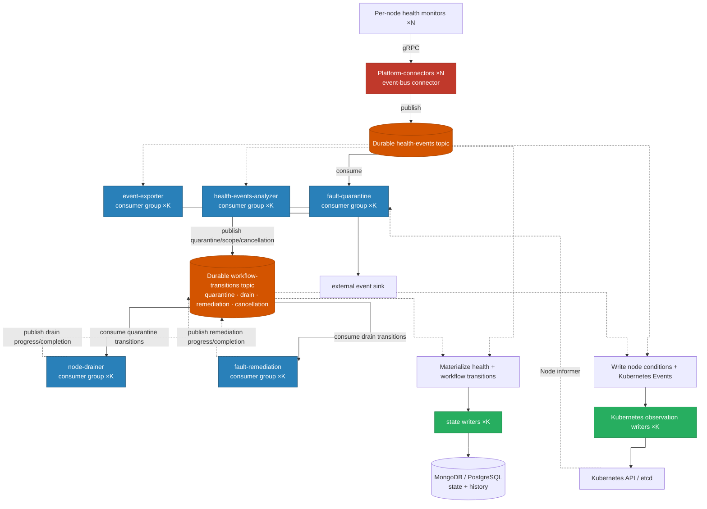

# NVSentinel Scale Issues

## Executive Summary

Each node runs health monitors and a platform-connector. Together they send health events to a shared datastore and write state to the shared Kubernetes control plane. Fault-quarantine, node-drainer, fault-remediation, analyzers, and exporters then turn those events into actions.

At small scale, the flow looks simple: a monitor reports a problem, platform-connector records it, and the fault-handling modules react. Growth changes that flow in three ways. **First,** every new node adds another writer. **Second,** the central modules remain a small fixed group while the amount of cluster state they must hold or search keeps growing. **Third,** one reported fault does not remain one operation: it becomes database writes, Kubernetes updates, rule queries, logs, metrics, and more stream records. During a fleet-wide incident, more nodes speak at once, every report creates secondary work, and the same listeners must catch up.

Before changing the architecture, improve the individual components: remove repeated full-list scans, bound in-memory queues, retry only temporary failures, add database indexes for existing queries, and size the metrics backend for the required per-node and per-XID series. At larger scale, the remaining structural constraint is a growing number of node-level writers feeding fixed shared resources and fixed-capacity listeners. The final section describes the architecture needed after these component-level inefficiencies are removed.

---

## Action Items

Scale drivers used below: **N** = nodes, **P** = total pods, **R** = cluster-wide health-event rate, and **E** = retained health-event history (`R × retention`).

The items are ordered by how they can be delivered. Component optimizations and architecture changes are complementary: the former remove wasted work; the latter change how capacity grows.

### Existing Helm values

| ID  | Action                                                                                         | Scale driver |
| --- | ---------------------------------------------------------------------------------------------- | ------------ |
| H1  | Resize MongoDB PVCs using the Bitnami subchart `persistence.size` value                        | E = R × TTL  |
| H2  | Set `namespace` on every kubernetes-object-monitor (KOM) Pod or Kubernetes Event policy        | P            |
| H3  | Enable deduplication for known noisy checks and define the suppression window and include list | R            |
| H4  | Set Janitor `ttl.defaultTTL` so retained completed CRs stay within the webhook's LIST budget    | remediation CRs |
| H5  | Tune KOM `resyncPeriod` and `maxConcurrentReconciles` from measured object count and CEL cost   | N, P         |

### Chart changes

| ID  | Action                                                                                                              | Scale driver   |
| --- | ------------------------------------------------------------------------------------------------------------------- | -------------- |
| C1  | Expose HealthEvents TTL as a Helm value; reduce the default from 30 days where operationally acceptable             | E = R × TTL    |
| C2  | Add PVC-utilization and oplog-window alerts                                                                         | E, R           |
| C3  | Expose WiredTiger cache and explicit oplog sizing                                                                   | E, R           |
| C4  | Add secondary MongoDB indexes for the existing status, agent, and cold-start filters; do not change query semantics | E × query rate |
| C5  | Replace percentage-based multi-DaemonSet rollout waves with staggered absolute budgets                              | N              |

### Component code changes

| ID  | Action                                                                                                                           | Scale driver               |
| --- | -------------------------------------------------------------------------------------------------------------------------------- | -------------------------- |
| K1  | Configure MongoDB `maxPoolSize`, `minPoolSize`, and `maxConnIdleTime` in store-client                                            | N                          |
| K2  | Add per-component QPS/burst configuration for fault-quarantine and node-drainer                                                  | faulted nodes              |
| K3  | Replace GET + full-node `UpdateStatus` with PATCH and no-op suppression                                                          | R                          |
| K4  | Replace the per-health-event Kubernetes Event LIST-and-write with `EventRecorder`                                                | R × matching Event history |
| K5  | Bound connector queues, retry `RESOURCE_EXHAUSTED`, and requeue transient Kubernetes failures                                    | R                          |
| K6  | Replace analyzer per-event, per-rule queries with incremental windows and relevant-rule dispatch                                 | R × rules, E               |
| K7  | Replace labeler peer/ResourceSlice scans with indexes and incremental counters                                                   | N², ResourceSlices         |
| K8  | Add a cache index for preflight gang membership                                                                                   | P                          |
| K9  | Budget and coalesce metadata-collector pod annotation PATCHes                                                                    | N × pod churn              |
| K10 | Keep one canonical full-payload log per health event, correlate later stages by event ID, and reuse GPU-monitor gRPC connections | R, N                       |
| K11 | Define PostgreSQL changelog retention and optimize watermark storage without weakening per-event processing semantics            | E, R                       |
| K12 | Replace KOM startup LIST + per-node reads with one cache-backed state load                                                      | N                          |
| K13 | Minimize DaemonSet-owned and system-namespace Pods before storing them in node-drainer's informer cache                         | P                          |

### Architecture changes

| ID  | Action                                                                                                                                | Scale driver removed                |
| --- | ------------------------------------------------------------------------------------------------------------------------------------- | ----------------------------------- |
| A1  | Make a durable, partitioned event bus the primary ingestion path; persist events and state through scalable state writers             | O(N) datastore clients              |
| A2  | Add Kubernetes observation writers for node conditions and Kubernetes Event objects, with a fleet-wide write budget                   | O(R) uncoordinated API writers      |
| A3  | Run each fault-handling stage as a partitioned consumer group keyed by node                                                           | Fixed singleton throughput          |
| A4  | Define durable per-event workflow sessions, node-level cancellation cutoffs, equivalence groups, and idempotent transitions           | Long-running workflow/replay safety |
| A5  | Preserve Kubernetes observation inputs, the fleet circuit breaker, janitor node locks, and cold-start reconciliation                  | Cross-partition/global coordination |
| A6  | Port existing smoke, cancellation, cold-start, partial-drain, janitor, circuit-breaker, and exporter tests to broker-native injection | Migration confidence                |

**Suggested sequence:** apply H-items first, deliver C-items that improve capacity and observability, remove the largest local amplification loops (K3–K9), then introduce A-items using the same load tests as acceptance criteria.

---

## Validation Model

The findings require three complementary test planes:

- **KWOK control-plane simulation:** large populations of Node and Pod objects validate API server/etcd load, informer memory, admission, scheduling, eviction, and central-controller behavior. KWOK pods do not execute containers, so this plane does not validate platform-connector processes, datastore connections, per-pod metrics, or node-level CPU/memory.
- **Real per-instance microbenchmarks:** platform-connector, monitors, and each central module run on real CPU nodes to establish throughput, latency, queue, CPU, and memory limits for one executable instance.
- **Logical connector-pool tests:** real processes on the CPU nodes emulate many node identities and independent client/rate-limit state to validate aggregate datastore and Kubernetes load. Reports distinguish logical clients from physical pods and do not claim simulated per-pod resource overhead.

Every event-rate result states its healthy/fatal/non-fatal mix, processing strategy, payload size, distribution across nodes (uniform versus hot-node), duration, and warmup. A 50k-node KWOK run is a stress test of the shared Kubernetes control plane, not a claim that Kubernetes or NVSentinel supports a 50k-node production cluster.

Architecture changes add a parity lane to this model: run the same smoke, manual recovery, drain cancellation, restart, partial drain, circuit breaker, janitor lock, and exporter resume scenarios through the existing and proposed paths, then compare Kubernetes actions, database state, and exported events.

---

## System Architecture

> **Note:** This document uses MongoDB for the main pipeline examples. MongoDB is disabled by default in the shipped chart (`values.yaml:180`); PostgreSQL is also supported and has a separate scale section below. Kubernetes API, informer, queue, and observability findings apply to both backends.

---

## O(N) — Grows with cluster size (steady-state problems)

These are present and measurable right now, independent of event rate.

### MongoDB connection count

Every node runs a `platform-connector` pod. When that pod starts, it opens a MongoDB client — and that client immediately dials all three replica set members, opening 2 monitoring connections to each. These stay open permanently, whether or not any health events are flowing.

The first InsertMany opens one application connection to the primary. The pool can grow with concurrent demand up to `maxPoolSize=100`, and would retain its high-water mark because `maxConnIdleTime` defaults to zero.

Across the replica set, each pod has a floor of approximately 7 connections: 3 to the primary (2 monitoring + 1 application) and 2 to each secondary. The theoretical pod-wide maximum is approximately 106 (primary: 102), assuming the pool fills.

**Current architecture: the ceiling is not a present problem.** `platform-connectors/main.go:178` starts a single goroutine for the store connector (`go storeConnector.FetchAndProcessHealthMetric(ctx)`). This goroutine processes events sequentially — one `InsertMany` at a time. The connection pool only grows when concurrent operations demand it; with a single caller, the pool stays at 1 data connection regardless of `maxPoolSize`. In practice, each pod holds exactly **3 connections to the primary** (2 monitoring + 1 data) and **2 to each secondary**, matching the floor at all event rates.

**Measured (2026-07-20, 403 connectors):** 1,273 connections on primary = 3.16/pod, confirming the floor. **Microbenchmark (2026-08-04, 1,000 connectors, default maxPoolSize=100):** 3,055 total connections = 3.055/pod — pool never grew beyond 1 data connection regardless of event rate. See `tests/scale-tests/MONGO_BENCHMARK.md` MB-MG-2 for the full sweep.

With N platform-connectors at the floor, the primary sees **3N connections** and each secondary sees **2N**. The 102N ceiling applies only if a future code change introduces concurrent database calls.

**Memory per connection (microbenchmark, 2026-08-04):** `mem_MB = 239 + 0.266 × connections` (R²=0.99999, confirmed to 150,345 connections). At the 3N floor: `239 + 0.266 × 3N` per member. At N=1000: ≈1,037MB — within the 2Gi limit. The Bitnami deployment sets `maxIncomingConnections ≈ 838,860`; the MongoDB 65,536 default cap does not apply.

**The ceiling becomes a future concern if:** concurrent processing is introduced (e.g., parallel `InsertMany` goroutines, higher `maxConcurrentReconciles`, or a batch-parallel write path). At that point, `maxPoolSize` and `maxConnIdleTime` become relevant.

**Fix (defensive, not currently needed):** Set `maxPoolSize=2–5` and `maxConnIdleTime=60s` in store-client to cap any future pool growth and prevent idle connection accumulation if the processing model changes.

**File:** `store-client/pkg/datastore/providers/mongodb/watcher/watch_store.go:729-759`

---

### Coordinated DaemonSet rollout herds

Platform-connector and the per-node monitors use rolling updates whose unavailable budget is a percentage of N. At large N, one chart upgrade restarts hundreds of node-local components together. Platform-connectors reconnect to the datastore while monitors retry the local socket and may publish recovered state.

The percentage keeps rollout duration bounded but makes each wave larger as the fleet grows.

**Fix:** Use an absolute rollout budget, stagger dependent DaemonSets, add jitter to reconnects, and test upgrades as a scale scenario rather than only steady operation.

**Files:** `distros/kubernetes/nvsentinel/templates/daemonset.yaml:22-25`, `platform-connectors/main.go:223-247`

---

## O(P) — Grows with total pod count

P is the total number of pods in the cluster — NVSentinel's own DaemonSet pods (5N) plus all workload pods. On a GPU cluster with large jobs, P can be much larger than 5N.

### kubernetes-object-monitor and node-drainer memory

These two modules keep Kubernetes objects in memory. The dominant risk is **unscoped Pod informers**, because workload pod count can grow much faster than node count.

**kubernetes-object-monitor** starts one informer per resource kind referenced in its policies. If a policy watches Pods without a `namespace` set in `[policies.resource]`, KOM starts a cluster-wide Pod informer and caches every pod in the cluster. The CEL predicate that filters which pods are interesting runs after the object is already in memory — the informer has no knowledge of it. Pod count scales with cluster size. At large node counts, the pod population dominates KOM's memory.

**node-drainer** starts an unconditional cluster-wide typed Pod informer at startup (`informers/informers.go:63-68`), regardless of how many nodes are actually being drained. It needs pod visibility to manage drains, but holds every pod in the cluster to do it.

KOM uses unstructured objects for policy resources and also creates a typed Node cache for annotation handling. Its default five-minute resync requeues every cached object while `maxConcurrentReconciles` defaults to one. A broad Pod policy therefore costs memory continuously and creates a serial O(P) reconcile wave every five minutes. KOM startup also reloads annotation state with a Node LIST followed by per-node reads.

**Fix for KOM:** Any policy that watches Pods or Kubernetes Events must set `namespace` in `[policies.resource]`. If multiple namespaces are needed, split into multiple policies. The informer will then be scoped to only those namespaces.

KOM's `resyncPeriod` and `maxConcurrentReconciles` are already Helm-configurable. Tune them from measured object count and CEL evaluation cost. The startup LIST followed by per-node reads is a separate code path covered by K12.

Node-drainer uses a cluster-wide typed Pod informer indexed by node and by namespace/node. AllowCompletion and DeleteAfterTimeout repeatedly read pod phase, readiness, deletion timestamps, grace periods, ownership, resource requests, and device annotations. Its baseline memory therefore grows with the total pod population, O(P).

Node-drainer already excludes DaemonSet-owned Pods and configured system namespaces from drain decisions, but those Pods are filtered after entering the cache. A `SetTransform` handler can replace excluded Pods with minimal objects containing only cache identity metadata and no node index key. On the measured cluster, 2,331 of 2,539 Pods (~92%) were DaemonSet-owned or in configured system namespaces, so this can materially reduce node-drainer heap.

Using the current Pod JSON as a size proxy, the complete set occupied 24.68 MiB serialized. Replacing ignored Pods with identity-only placeholders reduced the projected stored representation to 4.72 MiB—an 80.9% reduction for the Pod cache input. Actual process RSS reduction requires a Go heap benchmark because informer/index overhead and node/event caches remain.

This is a client-side memory optimization: the API server still sends the cluster-wide Pod LIST/watch stream. Kubernetes has no server-side selector for owner kind or regex namespace exclusion. Server-side filtering would require a reliable workload label or a fixed set of included namespaces.

**Files:**

- KOM policy config: `[policies.resource].namespace` field
- `node-drainer/pkg/informers/informers.go:63-74,332-392`

---

### Remediation throughput ceiling

When a fault storm hits, fault-quarantine, node-drainer, and fault-remediation all need to cordon, drain, and remediate affected nodes. Fault-quarantine currently performs a GET followed by a full UPDATE so it can merge cordon state, taints, labels, and annotations. Fault-quarantine and node-drainer inherit the client-go default of 5 QPS / 10 burst; fault-remediation defaults to one concurrent reconcile.

That gives a sustained cordon rate of ≈2.5 nodes/s. At that rate, cordoning 1,000 faulted nodes takes ≈7 minutes. Cordoning 10,000 takes over an hour. The storm does not wait.

Raising QPS/burst moves the fault-quarantine/node-drainer ceiling, but those settings are not currently exposed as Helm values. The happy path can read current state from the Node informer and send one PATCH containing only FQ-owned fields. Use an SSA field manager or patch precondition for those fields; on ownership conflict or stale cache, re-read and retry. Manual/pre-existing cordon detection remains a state-reconciliation decision.

**Fix:** Add per-component QPS/burst configuration, size it from an explicit fleet write budget, increase fault-remediation concurrency only after proving idempotency, and replace GET+UPDATE with informer-backed, ownership-aware PATCH operations plus conflict fallback.

**File:** `fault-quarantine/pkg/informer/k8s_client.go:61-68`

---

### Labeler peer and ResourceSlice scans

Labeler is a singleton. For some device-count policies, reconciling one node copies the full node cache and evaluates peer nodes in the same hardware group. When DRA ResourceSlices are enabled, labeler also keeps a cluster-wide ResourceSlice informer and scans all slices to find those belonging to a node.

A fleet-wide driver or label rollout can therefore approach O(N²) node work, or O(N × S) when S ResourceSlices are scanned repeatedly. The informer also retains every ResourceSlice in memory.

**Fix:** Maintain expected device counts incrementally, add a node index to the ResourceSlice informer, and avoid copying/scanning the complete node cache on each reconcile.

**Files:** `labeler/pkg/devicecounts/device_counts.go:469-547`, `labeler/pkg/devicecounts/resource_slices.go:33-44`

---

### Metadata-collector pod annotation writes

Every metadata-collector wakes every 30 seconds, reads pods on its node, and PATCHes pods whose GPU-device annotation changed. This traffic is independent of health-event rate. Its fleet-wide driver is node count multiplied by pod churn.

Large job waves can synchronize these collectors and produce a burst of pod PATCHes against the API server. The default 5 QPS client limit slows each node but does not impose a fleet-wide budget.

**Fix:** Make updates change-driven where possible, coalesce annotation changes, and enforce a fleet-level write budget during job waves.

**Files:** `metadata-collector/main.go:79-93`, `metadata-collector/pkg/mapper/mapper.go:123-152,210-226`

---

### Janitor CR retention and preflight cache scans

Janitor's validating webhook lists remediation CRs of a kind before accepting a new RebootNode, TerminateNode, or GPUReset. Janitor's TTL reconcilers bound completed history by deleting CRs after `ttl.defaultTTL` (14 days by default). The retained count is approximately active CRs plus completion rate multiplied by TTL. Active in-progress CRs remain until completion.

Preflight registers a cluster-wide Pod informer. Peer discovery reads from that cache and scans the gang namespace for each gang-pod IP update. Its cost is informer memory, watch processing, and repeated in-memory scans—not repeated API-server LISTs. The informer remains cluster-wide because preflight-enabled namespaces are selected dynamically through namespace labels.

**Fix:** Set Janitor's TTL from the expected CR completion rate and monitor retained CR count plus webhook LIST latency. Add workload/gang indexes to preflight's Pod cache so peer discovery returns only matching peers.

**Files:** `janitor/pkg/webhook/v1alpha1/janitor_webhook.go:160-219`, `charts/janitor/values.yaml:183-196`, `preflight/pkg/controller/gang_controller.go:62-65`, `preflight/pkg/gang/discoverer/kubernetes.go:208-210`

---

### Prometheus series cardinality

Scrape-target count is only half of the monitoring cost. Several central modules label metrics by node name. Syslog monitor also pre-creates approximately 167 XID counters per node before any error occurs.

At fleet scale, Prometheus therefore stores tens or hundreds of thousands of mostly idle series even after the scrape topology is improved. Node-local agents reduce central scraping fan-out but do not remove these series.

**How to size it:** retain node and XID labels because they provide required diagnostic detail. Estimate the number of series as `nodes × known XID codes`, then choose Prometheus memory and retention that can hold them. A longer scrape interval reduces sample ingestion and network traffic but does not reduce active-series count. Use recording rules for common fleet-wide dashboards while preserving raw per-node series for drill-down, and introduce sharding only after measurements require it.

**Files:** `syslog-health-monitor/main.go:290-303`, `syslog-health-monitor/pkg/xid/metrics/metrics.go:70-92`, `fault-quarantine/pkg/metrics/metrics.go:51-86`

---

## O(E) = O(R × TTL) — Grows with accumulated health events

These problems are driven by how many health event documents have accumulated in MongoDB — not by the current event rate, but by the rate integrated over the TTL window. They reach a steady state once the collection is full, and that steady state is determined by R × TTL × bytes per document.

### MongoDB disk

At a steady event rate with a 30-day TTL, collection size = R × TTL × bytes/doc. The shipped default of 8 Gi PVC has no margin for event rate spikes. Once the collection reaches steady state for a given R, any sustained increase in event rate — a fault storm, a noisy node, a software rollout causing reconnects — will fill the remaining space. When the disk fills, MongoDB stops accepting writes. platform-connector retries for ≈5 seconds then drops the events permanently.

TTL is the principal retention knob controlling steady-state size. The shipped 30-day default maximizes retained history and disk usage.

**Fix:**

1. Calculate retained documents as `E = average health-event rate × TTL`.
2. Measure live compressed data bytes/document and index bytes/document from `HealthEvents.stats()` at representative steady state. Subtract WiredTiger bytes available for reuse from allocated `storageSize`; TTL-deleted space remains allocated and otherwise inflates the estimate.
3. Size each replica-set member for `E × (compressed data bytes + index bytes)`, then add explicit oplog allocation, WiredTiger/filesystem overhead, and headroom for the largest supported burst and delayed TTL cleanup.
4. Provision that capacity on every replica-set member; a three-member replica set stores three full copies, so total provisioned cluster storage is approximately three times the per-member PVC.
5. Reduce TTL only where the resulting retention meets operational requirements, and alert before PVC or oplog headroom is exhausted.

MongoDB stores HealthEvents as BSON; WiredTiger applies Snappy block compression on disk. Two measured clusters showed similar live storage footprints:

- 1,933-byte average BSON → 416 bytes compressed data + 149 bytes indexes = 565 bytes/document
- 1,816-byte average BSON → 305 bytes compressed data + 248 bytes indexes = 553 bytes/document

The first cluster retained 22.35 million documents at approximately 8.9 health events/s with a 30-day TTL. Collection storage was 9.29 GB, indexes were 3.33 GB, the oplog was 2.49 GB, and each 50 Gi PVC used approximately 13 GiB.

Storage grows linearly with E. Use 1 KiB per retained document as a rough starting allowance for compressed data, indexes, and growth headroom, then add the explicit oplog and round up:

- E = 10 million documents → 16 Gi PVC per member
- E = 25 million documents → 32 Gi PVC per member
- E = 50 million documents → 64 Gi PVC per member
- E = 100 million documents → 128 Gi PVC per member

For E = 10 million, the breakdown is approximately 9.54 GiB for the 1 KiB/document planning allowance plus a 2.5 GiB oplog, or 12.04 GiB before rounding. A 16 Gi PVC leaves approximately 4 GiB for MongoDB internal files, fragmentation/reusable space, delayed TTL cleanup, and short bursts.

Do not convert the rounded PVC tier into a fixed per-node storage multiplier. Document storage scales with node event rate, but oplog size depends on write amplification and the required resume window, while internal space and storage-tier rounding are deployment-level allowances. At 0.1 health events/s/node and 30-day retention, the document allowance is approximately 253 MiB/node; oplog and free-space requirements are calculated separately.

Production sizing uses the measured live collection and index bytes/document for that workload.

**File:** `charts/mongodb-store/templates/configmap.yaml:51` (TTL), `charts/mongodb-store/values.yaml` (PVC size)

---

### MongoDB RAM (WiredTiger cache)

WiredTiger tries to keep the working set — the documents and indexes most recently read or written — in RAM. As the collection grows, so does the working set, and so does the cache pressure. At 364 nodes with 11 million documents, each MongoDB member is using ≈3.8 GB against a 6 Gi limit.

This growth is not linear in N. It is driven by E = R × TTL, which means a longer TTL or a higher event rate inflates it faster than adding nodes does.

**Fix:** Pin the WiredTiger cache size explicitly with `storage.wiredTiger.engineConfig.cacheSizeGB` rather than letting it auto-size to half of available RAM. When resizing the PVC, also review the memory limit — a larger dataset will demand more cache.

**File:** `charts/mongodb-store/values.yaml`

---

## O(R) — Grows with health event rate

These are invisible at low health event rates. They activate when a correlated fault drives R up 100–1,000×.

### etcd write saturation

Every condition-relevant health event causes platform-connector to fetch the full node object and write it back with an updated status—a GET followed by a full PUT. The write includes an unconditional `LastHeartbeatTime` bump even when nothing else changed. Each platform-connector only handles its own node, so per-node load is proportional to that node's health-event rate. The etcd pressure is the aggregate across all N nodes: at 2,000 condition writes/s and a 20 KB Node object, etcd receives roughly 40 MB/s of revised objects.

**Fix:** Read current state from the node-local/informer path, PATCH only changed condition fields, and skip unchanged Status/Reason/Message. PATCH removes the client-side GET and reduces request payload/conflicts, but the API server still persists a complete revised Node object to etcd. No-op suppression and per-node coalescing are what reduce etcd write volume.

**File:** `platform-connectors/pkg/connectors/kubernetes/process_node_events.go:84,93`

---

### Change-stream consumers fall behind

Five modules consume the MongoDB change stream: fault-quarantine, node-drainer, fault-remediation, health-events-analyzer, and event-exporter. Fault-quarantine, node-drainer, and health-events-analyzer process their main stream serially; fault-remediation defaults to one concurrent reconcile. Event-exporter has a configurable worker pool (`charts/event-exporter/values.yaml:82`), but ordered token advancement still waits behind the earliest unfinished publish. The serial consumers persist a majority-concern resume token after each health event, waiting for replica-set acknowledgment before advancing.

At low event rates this is fine. Under storm conditions, consumers can fall behind the MongoDB oplog. An 8 Gi PVC limits how much oplog can be allocated, but PVC size alone does not determine retention. Retention is the configured/actual oplog size divided by the rate at which MongoDB generates oplog bytes from health-event inserts, workflow status updates, resume-token writes, TTL deletes, and unrelated database activity. The chart does not currently set an explicit oplog size.

**Representative steady-state measurement (2026-07-20):** `rs.printReplicationInfo()` on a 403-node cluster reported a 2,493.6 MB oplog and a 106,549-second (29.6-hour) window. The measured HealthEvents insert rate was approximately 8.9/s, but the retention window also reflects all other oplog-generating writes. The cluster used 50 Gi PVCs; this result must not be applied to the shipped 8 Gi PVC.

No representative current-release fault-storm `rs.printReplicationInfo()` capture is available, so this document does not assert a numerical storm retention window. A valid storm measurement must record the actual/configured oplog size and first/last oplog timestamps before, during, and after the test, together with event rate, fatal/non-fatal mix, status-update rate, resume-token write rate, storm duration, and PVC size.

Once consumer lag exceeds the measured oplog window, its resume point is gone. The library responds by deleting the stale token and reopening the stream; module-specific cold-start/recovery behavior then determines whether missed work is recovered.

At that point the consumer is not slow. It is blind.

**Fix:**

1. Keep per-event resume-token persistence because it is part of the processing correctness boundary.
2. Measure oplog consumption under representative steady-state and fault-storm workloads, then size the oplog for the worst expected consumer lag.
3. Alert on consumer token age versus the measured oplog window.
4. Treat `ChangeStreamHistoryLost` recovery as a module-specific design problem. Do not introduce generic replay/backfill until quarantine, drain, and remediation handlers prove idempotent behavior under duplicates.

**File:** `store-client/pkg/datastore/providers/mongodb/watcher/watch_store.go:340-386,478-529`

---

### Health-events-analyzer query multiplication

Health-events-analyzer does more than consume one stream item. For each health event it can evaluate roughly 22 enabled rules, with one MongoDB aggregation pipeline per rule. Its database demand is therefore closer to `R × enabled rules` than R.

Some rules inspect historical windows, so query cost also grows with retained history E. At high event rates the analyzer can dominate MongoDB reads before the generic change-stream consumer ceiling is reached.

**Fix:** Replace per-event historical aggregation with incremental in-memory windows, run only rules relevant to the event's check type, set query time limits, and add indexes for the fields used by remaining pipelines.

**Files:** `health-events-analyzer/pkg/reconciler/reconciler.go:226-247,402-432`, `charts/health-events-analyzer/values.yaml:72-110`

---

### Remediation database fan-out

One fault does not create only one database operation. The initial insert is followed by quarantine, drain, and remediation status updates. Those updates become new change-stream records for downstream modules. With `UpdateLookup`, matching update records also trigger an extra read to reconstruct the full document.

The processing requirement is therefore a multiple of incoming health-event rate. A storm can generate several database writes and stream deliveries for each original fault.

**Fix:** Measure operations per completed remediation, coalesce status transitions where practical, avoid `UpdateLookup` for consumers that can use update descriptions, and partition consumers by node.

**Files:** `store-client/pkg/client/pipeline_builder.go:27-46`, `store-client/pkg/datastore/providers/mongodb/watcher/watch_store.go:165`

---

### Some database queries scan the full event history

The shipped MongoDB indexes cover TTL and a node/entity/time query. They do not cover several frequently used status, agent, and cold-start predicates. As retained history grows, fault-quarantine, fault-remediation, and analyzer queries can become collection scans.

This makes E a multiplier on R: a query pattern that is cheap during the first day can become the dominant database cost after weeks of retention.

**Fix:** Preserve the module filters and their behavior. Capture `explain()` plans for those existing queries, then add secondary compound indexes matching their filter and sort order. Verify that indexed and unindexed executions return identical results, and include index validation in chart upgrade tests.

**Files:** `mongodb-store/templates/jobs.yaml:288-307`, `fault-quarantine/pkg/eventwatcher/event_watcher.go:440-547`, `health-events-analyzer/pkg/reconciler/reconciler.go:501-517`

---

### Accepted health events can be lost downstream

When a monitor sends a health event, platform-connector first runs its transformer pipeline synchronously. Deduplication, metadata augmentation, overrides, tracing, and logging therefore delay the acknowledgment. After transformation, platform-connector acknowledges before the asynchronous MongoDB and Kubernetes connectors finish.

Each connector has one worker and its own unbounded queue. A slow Kubernetes connector can accumulate work independently of the database connector. On failure, the database and gRPC-sink connectors retry, but the Kubernetes connector drops the batch. MongoDB can therefore contain a health event whose node condition or Kubernetes Event object was never written.

**Fix:** Bound every connector queue, expose queue depth, and requeue transient Kubernetes failures with bounded backoff. Return `RESOURCE_EXHAUSTED` when ingress capacity is exhausted, and update the common publisher to retry that code. Move expensive, optional transformation work out of the acknowledgment path.

**Files:** `platform-connectors/pkg/server/platform_connector_server.go:65-95`, `ringbuffer/ring_buffer.go:83-131`, `connectors/kubernetes/k8s_connector.go:122-131`

---

### Logging and connection churn at the edge

Platform-connector logs full health-event payloads at INFO both on ingress and dequeue. The payload is valuable for debugging, but serializing and storing it twice creates an avoidable O(R) multiplier. The Python GPU monitor also creates a new gRPC channel for every send attempt instead of reusing one connection.

These costs are small during normal operation but amplify rollout and recovery storms across N nodes.

**Fix:** Keep one canonical full-payload INFO log when the event is accepted. Log the stable event ID, queue, attempt, and outcome at later stages so the complete path remains traceable without repeating the payload. Size log ingestion/retention for the full health-event rate and alert on dropped logs. Reuse a long-lived GPU-monitor gRPC channel.

**Files:** `platform-connectors/pkg/server/platform_connector_server.go:65`, `platform-connectors/pkg/ringbuffer/ring_buffer.go:108`, `gpu-health-monitor/platform_connector/platform_connector.py:348-370`

---

## Per-health-event Kubernetes Event LIST amplification

The Kubernetes connector performs a LIST before writing each non-fatal Kubernetes Event object. The request includes `involvedObject.name=<node>`, so the code does **not** explicitly request every Event object in the namespace. Whether etcd can satisfy that selector without scanning and filtering a larger range depends on the Kubernetes storage implementation and must be measured.

A conservative model is `R × L_node`, where `L_node` is the cost of listing Event history for the affected node. A hot node grows both terms at once; balanced fleet traffic spreads Event history across nodes. The previous strict `O(R²)` and “1 GB per LIST” claims are not established by the current code alone.

The design is still wasteful: a read-before-write occurs for every non-fatal health event, and local fault floods make each subsequent read more expensive. This path needs an API-server trace or load test before assigning a numeric ceiling.

**Fix:** Replace the LIST + CREATE/UPDATE pattern with `client-go`'s `record.EventRecorder`. It correlates repeated Kubernetes Event objects client-side with no LISTs.

**File:** `platform-connectors/pkg/connectors/kubernetes/process_node_events.go:478,494,514`

---

## PostgreSQL-specific scale limits

PostgreSQL removes the per-node MongoDB monitoring-connection pattern, but it introduces a different write-amplification path. A trigger writes full OLD and NEW JSON documents to `datastore_changelog` for every update and sends a notification. The remediation status transitions described above therefore enlarge both the primary table and changelog traffic.

Each consumer opens its own LISTEN connection. When notifications are quiet or lost, consumers poll the changelog in batches. Marking an event processed updates changelog rows and upserts a resume-token row, adding more writes per consumed event.

Without explicit retention and partitioning, `datastore_changelog` can grow faster than the health-event table itself.

**Fix:** Define changelog retention and partitioning, store only fields required for replay, preserve per-event processed-watermark semantics, and measure five concurrent consumers under status-update fan-out.

**Files:** `store-client/pkg/datastore/providers/postgresql/datastore.go:446-511`, `store-client/pkg/datastore/providers/postgresql/changestream.go:232-254,358-405,588-663`

---

## Where component tuning stops being enough

NVSentinel is built around a hub-and-spoke topology: N nodes each talk directly to a shared MongoDB and a shared Kubernetes API server. Every node is an independent actor with no coordination with any other node.

This works well at small scale. Each node minds its own business, the central store accumulates health events, and a handful of singleton consumers process them. The design is simple and easy to reason about.

The problem is that the cost of running the system grows with every node you add, even at idle. Each new platform-connector pod opens approximately seven connections to MongoDB—not because it is doing work, but because the MongoDB client monitors all replica-set members. With the current client and resource assumptions, a five-digit node count creates tens of thousands of connections and exceeds practical connection memory before MongoDB's hard connection cap.

The Kubernetes API server has the same shape. Every node writes its own conditions and Kubernetes Event objects independently, with no coordination. At low health event rates this is invisible. Under a fault storm — say, a fabric failure that affects 5,000 nodes simultaneously — all 5,000 platform-connectors start writing to the API server at the same moment. The aggregate write rate is determined by the number of nodes, not by any central rate limiter.

The change-stream consumers have the mirror problem. Fault-quarantine and node-drainer process their main streams serially, while fault-remediation defaults to one concurrent reconcile. Event-exporter has workers, but ordered token advancement still blocks behind the slowest earlier publish. Adding replicas is unsafe because each consumer type shares one stream position and would double-process work. As health-event rates grow, these fixed-capacity listeners fall behind the producers.

All three problems share the same root cause: the system scales its costs with N and R, but concentrates its processing capacity in a fixed number of singletons. The per-node layer gets bigger with every node added. The central processing layer stays constant. Configuration changes and code fixes raise the individual ceilings but do not change this shape.

### Target architecture

The target is a brokered, partitioned pipeline. Node-level producers publish once. Each broker-facing fault-handling stage consumes assigned node partitions, persists progress as a new state-transition event, and commits its position. The database stores current state and history; it no longer transports work between modules.

The diagram shows one node-keyed `workflow-transitions` topic shared by the workflow stages. Fault-quarantine publishes quarantine/scope/cancellation transitions; node-drainer and fault-remediation consume relevant transitions and publish progress back to the same topic. This preserves cross-stage ordering for one node. **Blue** modules are independently scalable consumer groups. **Green** writers independently materialize every transition into the database and write bounded Kubernetes observations. Health-events-analyzer and event-exporter consume health events independently of the fault-handling chain.

### What needs to be built

**Event-bus connector and topics:** Add `EventPublisher` / `EventConsumer` abstractions, with Kafka as the first implementation. In event-bus mode, platform-connector publishes once to `health-events`, keyed by node name, and disables its local store and Kubernetes connectors. Kafka stores `health-events` and `workflow-transitions` as replicated logs for a configured replay window.

**Workflow consumer adapters and durable sessions:** Replace the MongoDB/PostgreSQL change-stream adapters in fault-quarantine, node-drainer, and fault-remediation with partitioned event consumers. The workflow contract carries `(node, healthEventId, impacted entity/session)`, processing strategy, recommended action, entities, overrides, session boundaries, and sequence. It preserves quarantine scope updates, `UnQuarantined` versus `Cancelled`, partial drains, long-running eviction phases, remediation equivalence groups, the fleet circuit breaker, and janitor's node Lease lock.

**State and Kubernetes writers:** State writers materialize every health/workflow transition into MongoDB or PostgreSQL and retain the cold-start fields used today. Kubernetes observation writers replace platform-connector's node-condition and Kubernetes Event paths with coalesced `PATCH nodes/status` calls and `EventRecorder`. Fault-handling modules continue to own cordon, eviction, and remediation-CR actions.

**Independent consumer adapters:** Event-exporter and health-events-analyzer consume `health-events` through their own consumer groups, preserving exporter replay and analyzer feedback-loop prevention. ExternalRemediationRequest and CSP maintenance workflows remain independent paths.

### Migration approach

Put the event-bus path behind a feature flag, keep one stable health-event ID across both paths, and allow only one path to trigger actions during rollout. Switch production traffic after the parity lane in the Validation Model passes.