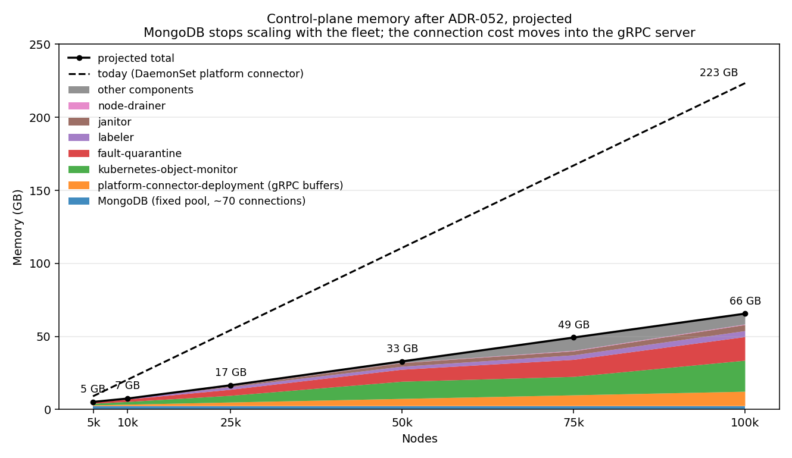

# NVSentinel end-to-end scale test — report

Markers: `[M]` measured, `[S]` simulated harness constant, `[I]` reader-supplied input, `[V]` to verify. `**[ ]` means not yet measured** — those cells are the remaining work.

## Summary

NVSentinel has been tested upto 100k nodes, resource consumption grows predictably with fleet size and stays within ordinary limits with reasonable throughputs.

The whole control plane costs about 233 GB of memory at 100,000 nodes. NVSentinel's own components are 63 GB of that and MongoDB is the remaining 170 GB combined all replica, which it spends on per-node database connections rather than on data. [ADR-052](../../docs/designs/052-deployment-platform-connector.md) removes those connections, and once it lands the same fleet is projected at about 75 GB.

Two components are most of the component total. At 100,000 nodes with a pod on every node, kubernetes-object-monitor is 33.9 GB and fault-quarantine 17.9 GB; janitor is 4.9 GB, labeler 4.3 GB, node-drainer 1.0 GB, and nothing else exceeds 0.6 GB.

CPU was never a constraint at any scale tested. The busiest component peaked at 1.62 cores, so four cores per component is sufficient with headroom to spare.

Cordon completes in 26 ms P50 and 165 ms P99 under continuous load, and a node with one evictable pod is fully drained about ten seconds after that, which is one of node-drainer's recheck cycles. End to end, detection to drained is 10.11 s P50 and 10.29 s P99; a five-hundred-node burst arriving at once stretches that to 55.5 s with every node completing.

The infrastructure around NVSentinel is what broke, in three ways worth planning for. A namespace-wide NetworkPolicy stopped being enforced above roughly 100,000 pods in one namespace and silently dropped MongoDB traffic. The EBS CSI provisioner exceeded its 10 GiB limit at this node count and stopped attaching volumes cluster-wide, which takes MongoDB down with it. And etcd's database threshold caps the fleet: at 100,000 nodes the nodes alone are about 5.5 GB, so a pod population near 100,000 crosses the EKS 4XL tier's 16 GB limit and puts the cluster into read-only until the churn ages out.

Section A1 carries per-component sizing, A2 the load on external systems, A3 the customer-facing SLAs, and B the methodology and the traps that invalidate measurements.

---

## A1. Component sizing

**Memory at a glance.** The control plane costs about 2.2 MB per node, with no meaningful fixed term. Two components are most of NVSentinel's own share: at 100,000 nodes kubernetes-object-monitor is 21.2 GB and fault-quarantine 16.2 GB, together two-thirds of the 54 GB component total; labeler is 12.0 GB, janitor 4.2 GB, and everything else under 0.5 GB. At 50,000 nodes the same order holds at 11.8 / 8.2 / 2.1 / 2.4 GB. The marginal cost from 25k to 100k is **0.57 GB per 1,000 nodes**.

| Nodes   | Control plane | MongoDB         | NVSentinel components |
| ------- | ------------- | --------------- | --------------------- |
| 10,000  | ~22 GB        | ~17 GB          | 4.6 GB `[M]`          |
| 25,000  | ~54 GB        | ~43 GB          | 11.1 GB `[M]`         |
| 50,000  | ~110 GB       | **85 GB** `[M]` | **24.7 GB** `[M]`     |
| 100,000 | **~224 GB**   | ~170 GB         | **54.0 GB** `[M]`     |

MongoDB is measured at one point — 85.0 GB resident summed across the three replica-set members at 50,021 nodes and 350,174 connections, 237 KB each — and scaled linearly at **1.70 MB/node** elsewhere, which is what the connection model implies and all a single measured point supports.

Measured at six scale points from 4,933 to 100,005 nodes. The 5k/10k/25k points were taken with the fleet set, every component restarted, informers resynced and pods held at 731; the 53,513-node point carries the full 642,243-pod fleet, so its pod term is present where the smaller points have none.

Component memory vs fleet size

Control-plane memory by component

**Do not size a large fleet from small-fleet measurements.** Slopes fitted over 5k-25k understate the 100k measurement by 1.3x for kubernetes-object-monitor, 1.9x for labeler and 2.5x for janitor; only fault-quarantine extrapolated exactly, at 160,800 B/node measured against 161,516 fitted. Components that watch Nodes also spike during their initial LIST, so the limit must exceed the steady state by the transient described below.

**The 50k row carries 642,243 pods against 731 at the smaller points**, so it is only comparable after the pod term is separated. Checking each component's 50k measurement against its own fitted node slope, the residual per pod comes out at 10,898 B for kubernetes-object-monitor — within 1% of the 11,026 B/object measured independently against its own cache — and at 12 B for labeler, which is zero because none of those pods match labeler's selectors, not because labeler ignores pods. node-drainer and preflight both show sensible per-pod costs.

**fault-quarantine's steady-state per-node figure is not pursued further.** Its sync peak is 4.09 GB at 25,005 nodes (151,570 B/node, 2.7x the raw object) and it settles to 1.68 GB. The peak is what the limit must cover; the spread between the two is the decode transient described above, not measurement error.

**Size against the sync peak, not the steady state.**

A component that watches Nodes decodes each object at full wire size before its transform reduces it, so a LIST allocates the raw fleet and then discards most of it. The peak is therefore governed by **raw object size**, which is identical for every component, while steady state is governed by the transform, which is not. Measured at 25,005 nodes on 55,138 B node objects:

| Component        | peak    | settled | peak per node | vs raw wire |
| ---------------- | ------- | ------- | ------------- | ----------- |
| labeler          | 6.54 GB | 2.0 GB  | 247,550 B     | 4.5x        |
| fault-quarantine | 4.09 GB | 1.68 GB | 151,570 B     | 2.7x        |

`**peak = settled + transient`**, and the two terms respond to different things. The settled term is what the transform controls: kubernetes-object-monitor's own measurements in issue #1718 put it at 21.85 GB without a transform and 6.15 GB with one, at 30,113 nodes. The transient is the allocation churn of decoding objects at full size and discarding them, measured here at **96 KB/node for fault-quarantine and 182 KB/node for labeler** — it does not scale with what the transform keeps, and it does not go away.

So a transform lowers the limit as well as the request, by lowering the floor the transient sits on. **Size the limit at settled + ~100-180 KB per node**; at 25,005 nodes that is the 4.09 GB and 6.54 GB observed. A precise per-node figure for the transformed cache is not worth pursuing on its own: it is only one of the two terms, and it is not what the kubelet kills on.

**Pods behave the same way and cost far more than the transforms suggest.** Measured at a fixed 10,000 nodes, stepping pods from 731 to 364,217 in a namespace visible to all three pod-caching components:

| Component                     | settled B/pod | peak B/pod | computed from transform |
| ----------------------------- | ------------- | ---------- | ----------------------- |
| kubernetes-object-monitor     | ~3,700        | ~4,400     | ~175                    |
| node-drainer, drain-eligible  | ~4,900        | ~6,200     | ~600                    |
| node-drainer, everything else | n/a           | n/a        | ~205                    |
| preflight                     | ~4,200        | ~5,200     | ~110                    |

The computed figures count retained wire bytes and miss the Go representation and per-object informer overhead, understating the real cost by 8-40x. node-drainer has two rows because it keeps two different field sets: a pod outside the `systemNamespaces` regex that is not DaemonSet-owned keeps identity, one device annotation, owner *kinds* only, deletion timestamp, node name, grace period, container resource limits, phase and the `PodReady` condition; everything else keeps name, namespace, UID and resourceVersion alone. Both paths discard annotations and container detail, so retained size barely moves with pod size. **Size pod caches at 4-6 KB per cached pod, against the peak.**

Peak rather than settled, because these components swing widely with nothing changing. Sampled 40 times over 20 minutes at a constant 364,217 pods: kubernetes-object-monitor 2.44-3.58 GB (47%), node-drainer 1.03-2.29 GB (122%), preflight 0.85-1.92 GB (126%). A single reading therefore lands anywhere in a 2x band, which is why differencing two of them gave a marginal cost of 245 B/pod between the 200k and 364k points -- an artefact of the swing, not a measurement. The per-pod figures above are a measured range, not a fitted slope. `[V]`

This applies to eager Node watchers. kubernetes-object-monitor and node-drainer showed 2% and 0% variation over 20 minutes at constant fleet size because they were not resynced during that window; a restart puts them through the same transient.

#### kubernetes-object-monitor

Node + Pod watches, one per enabled policy; CEL-derived transform (#1720). Per-node cost **174,175 B/node**. Pod term measured at fixed 10,000 nodes stepping 731 to 364,217 pods: **~3,700 B/pod settled, 4,400 B at peak** — the computed `~175 B/pod` from the transform understates it by ~20x, counting retained wire bytes only.

| Nodes   | Pods     | CPU med/peak `[M]` | Working set med/peak `[M]` | Rec. request | Rec. limit |
| ------- | -------- | ------------------ | -------------------------- | ------------ | ---------- |
| 4,933   | 731      | 0.06 / 0.09        | 1.12 / 1.13 G              | 2 Gi         | 4 Gi       |
| 9,990   | 731      | 0.10 / 0.13        | 1.84 / 1.84 G              | 4 Gi         | 8 Gi       |
| 25,005  | 731      | 0.36 / 0.38        | 4.53 / 4.58 G              | 6 Gi         | 12 Gi      |
| 50,005  | 731      | 0.33 / 0.43        | 11.76 G                    | 6 Gi         | 12 Gi      |
| 53,513  | 642,243  | 1.64 / 2.00        | 16.52 G                    | 20 Gi        | 40 Gi      |
| 75,005  | ~100,000 | 0.74 / 1.62        | 24.90 G                    | 28 Gi        | 48 Gi      |
| 100,005 | 731      | 0.58 / 1.05        | 21.24 G                    | 20 Gi        | 40 Gi      |
| 100,005 | ~100,000 | 0.61 / 1.21        | 33.90 G                    | 28 Gi        | 48 Gi      |

#### fault-quarantine

Eager Node informer (`NewNodeInformer`). Per-node cost **161,516 B/node**; retained bytes/node `33,144-34,337` `[I]`, bytes/pod `n/a` `[I]`. Events sent at 0.1 events per second per node with 1:4 ratio of fatal and non-fatal.

| Nodes   | Pods     | CPU med/peak `[M]` | Working set peak `[M]` | Rec. request | Rec. limit |
| ------- | -------- | ------------------ | ---------------------- | ------------ | ---------- |
| 4,933   | n/a      | 0.03 / 0.03        | 0.87 G                 | 1 Gi         | 2 Gi       |
| 9,990   | n/a      | 0.07 / 0.09        | 1.66 G                 | 2 Gi         | 4 Gi       |
| 25,005  | n/a      | 0.14 / 0.19        | 4.11 G                 | 6 Gi         | 12 Gi      |
| 50,005  | n/a      | 0.20 / 0.24        | 8.55 G                 | 6 Gi         | 12 Gi      |
| 75,005  | ~100,000 | **0.14 / 0.19**    | **13.35 G**            | 16 Gi        | 32 Gi      |
| 100,005 | n/a      | 0.29 / 0.46        | 16.17 G                | 12 Gi        | 18 Gi      |
| 100,005 | ~100,000 | **0.18 / 0.32**    | **17.88 G**            | 20 Gi        | 40 Gi      |

#### labeler

Eager informers: one for Nodes with a fixed field projection, and **four pod informers**, each label-scoped -- `app in (dcgm, driver)`, the driver-component label excluding that app, `k8s-app=<gke-installer>`, and ResourceSlice objects. Each builds a node-keyed index.

**The pod term is 9-13 KB per cached pod.** Measured by creating pods carrying the labels the informers actually select on, one per node per DaemonSet:

| Nodes   | Labelled pods           | Settled    | Sync peak  | CPU med/peak | Rec. request | Rec. limit |
| ------- | ----------------------- | ---------- | ---------- | ------------ | ------------ | ---------- |
| 100,005 | 200,010 (DCGM + driver) | **6.60 G** | **7.0 G**  | 0.06 / 0.16  | 8 Gi         | 16 Gi      |
| 75,005  | 150,000 (DCGM + driver) | **4.44 G** | **5.53 G** | 0.11 / 0.78  | 6 Gi         | 12 Gi      |
| 50,005  | 100,000 (DCGM + driver) | **3.90 G** | **3.97 G** | 0.11 / 0.45  | 5 Gi         | 10 Gi      |
| 25,005  | 50,000 (DCGM + driver)  | **1.96 G** | **2.58 G** | 0.05 / 0.33  | 3 Gi         | 6 Gi       |
| 10,005  | 20,000 (DCGM + driver)  | **0.59 G** | **0.59 G** | 0.01 / 0.19  | 1 Gi         | 2 Gi       |

Settled memory rises 0.59 -> 1.96 -> 3.90 -> 4.44 -> 6.60 G as the fleet goes 10k -> 25k -> 50k -> 75k -> 100k nodes, each node carrying its two DaemonSet pods, which is about **66 KB per node inclusive of both pods**. Separating the terms with the 4.04 G measured at 100,005 nodes and no matching pods leaves roughly **26 KB per node** of pod term.

Each row is read from a single pod pinned by name. `max()` across the container returns whichever pod is largest, which during a rolling restart is the terminating one still holding the previous fleet's heap.

The 25,005-node row was reached by decay rather than a fresh sync, and the decay is slow and stepwise: after the fleet shrank from 75,005, the same pod fell 2.58 -> 2.38 -> 2.31 -> 2.15 -> 2.00 -> 1.96 G over about eight minutes before flattening. Sampling at any point on that curve gives a different answer for the same fleet, so allow ten minutes after a fleet change before reading, or restart the component. Sizing at 100,000 nodes therefore needs **6.6 G settled and 7.0 G at peak**, not the 4.31 G recorded on a fleet whose pods labeler never cached.

CPU is unaffected by pod count, but the sync transient is real: 0.78 cores peak while listing at 75,005 nodes against 0.11 med once settled.

Sync peak is the transient while the informer lists the fleet, measured at 25,005 and again at 100,005 nodes where it reached 12.85 GB against 4.31 GB settled -- about 3x in both cases. Rows marked `[ ]` in that column were not captured; assume the same 3x shape. **The limit must cover the peak**: a limit sized to the settled value survives steady state and kills the pod on every restart. Retained bytes/node `~9,818` computed `[I]`. Recommended at 25k: **2 Gi request, 8 Gi limit**. The same shape should be assumed at other fleet sizes — peak roughly 3x settled — until measured. `[V]`

#### node-drainer

Pod informer; the node term is small but not negligible at large fleets — **140 MB at 50,005 nodes (restart-controlled), 344 MB at 75,005 and 360 MB at 100,005, with only 731 pods** `[M]`. The cost is otherwise per pod. Both cache paths prune heavily, so pod type matters less than the code suggests: pods outside the `systemNamespaces` regex that are not DaemonSet-owned are reduced to `drainEligiblePodCacheObject` (name, namespace, UID, resourceVersion, one device annotation, owner *kinds* only, deletion timestamp, grace period, trimmed Spec), and everything else to identity metadata.

| Pod type        | Cost per pod | Basis                                                                                         |
| --------------- | ------------ | --------------------------------------------------------------------------------------------- |
| drain-eligible  | **4,850 B**  | measured: 731 -> 200,731 pods at fixed 10,000 nodes, on 44,593 B pod objects                  |
| DaemonSet-owned | **3,406 B**  | derived: 2.34 GB at 53,513 nodes / 642,243 pods, minus the node term, on ~9,626 B pod objects |

**Cost per pod is close to independent of pod size**, which follows from both paths retaining a fixed field set: 4,850 B on 44.6 KB objects and 3,406 B on 9.6 KB objects. The two figures are therefore not a clean full-versus-stub comparison — they differ in object size as well as code path — but they bracket the answer. **Size at 3.4-4.9 KB per pod whatever the mix**: a 50,000-node fleet at 12 pods/node lands between 2.19 and 3.05 GB.

The derived figure rests on a measurement taken with a 6-8 minute hold, which elsewhere in this report proved too short to reach steady state. `[V]`

Per scale point. The 731-pod rows are the node term alone and are not a sizing figure for a fleet carrying workload; the pod term above dominates once real pods exist.

| Nodes   | Pods     | CPU med/peak `[M]` | Working set peak `[M]` | Rec. request | Rec. limit |
| ------- | -------- | ------------------ | ---------------------- | ------------ | ---------- |
| 50,005  | 731      | `[ ]`              | 0.14 G                 | 512 Mi       | 1 Gi       |
| 75,005  | 731      | `[ ]`              | 0.34 G                 | 512 Mi       | 1 Gi       |
| 75,005  | ~100,000 | **0.19 / 0.48**    | **1.00 G**             | 1 Gi         | 2 Gi       |
| 100,005 | 731      | `[ ]`              | 0.36 G                 | 1 Gi         | 2 Gi       |
| 100,005 | ~100,000 | **0.10 / 0.38**    | **1.04 G**             | 2 Gi         | 4 Gi       |

#### janitor

Node informer created **lazily** on the first `TerminateNode` reconcile, so an idle janitor is **flat at 0.022 GB regardless of fleet size** — 4,933 through 25,005 nodes all read the same. Once triggered it costs **19,616 B/node**: measured on a 25,005-node fleet, one `TerminateNode` took it from 11.4 MB to a settled 501.9 MB, peaking at 926.5 MB during the sync. At larger fleets it reads **2.74 GB at 75,005 nodes and 4.17 GB at 100,005** `[M]`. The behaviour was isolated cleanly at 50,005 nodes: a freshly restarted janitor sat at **54.7 MB**, and a single `TerminateNode` took it to **2.41 GB within 40 seconds**, then flat. Nothing else changed — same fleet, no other work — so one reconcile is the whole difference, a **44x jump**. That gives **48,195 B/node**, consistent with the 41,698 B/node implied at 100,005 nodes. The 19,616 B/node measured at 25,005 is the outlier and was probably sampled before the sync settled.

Retained bytes/node `~10,120` computed `[I]`; the measured 19,616 B is 1.94x that, the gap being Go map and pointer overhead. **Size for the triggered case**: 1 GB at 50k nodes, not the 22 MB an idle pod shows. Recommended **2 Gi / 4 Gi** at 50k.

Per scale point, for the triggered case. An untriggered janitor reads 0.022-0.055 G at every fleet size, so the idle row is not a sizing figure.

| Nodes   | Pods     | CPU med/peak `[M]` | Working set peak `[M]`           | Rec. request | Rec. limit |
| ------- | -------- | ------------------ | -------------------------------- | ------------ | ---------- |
| any     | any      | `[ ]`              | 0.03 G untriggered               | —            | —          |
| 25,005  | 731      | `[ ]`              | 0.93 G sync peak, 0.50 G settled | 1 Gi         | 2 Gi       |
| 50,005  | 731      | `[ ]`              | 2.41 G                           | 2 Gi         | 4 Gi       |
| 75,005  | ~100,000 | **0.13 / 0.29**    | **3.52 G**                       | 4 Gi         | 8 Gi       |
| 100,005 | 731      | `[ ]`              | 4.17 G                           | 6 Gi         | 12 Gi      |
| 100,005 | ~100,000 | **0.10 / 0.36**    | **4.90 G**                       | 6 Gi         | 12 Gi      |

#### preflight

Pod informer only; no Node cache. Working set is **flat at 0.24 GB across 4,933 / 9,990 / 25,005 nodes** with pods held at 731, which is the evidence for no node-count dependence. Measured directly by holding nodes at 10,000 and stepping pods from 731 to 364,217 in a namespace labelled `nvsentinel.nvidia.com/preflight=enabled`: **~4,200 B per cached pod settled, 5,200 B at peak**. Only pods in enabled namespaces are cached. CPU 0.01 cores throughout.

Per scale point. Working set tracks cached pods, not nodes, so the Pods column is the variable that matters.

| Nodes   | Pods     | CPU med/peak `[M]` | Working set peak `[M]` | Rec. request | Rec. limit |
| ------- | -------- | ------------------ | ---------------------- | ------------ | ---------- |
| 4,933   | 731      | 0.01 / 0.01        | 0.24 G                 | 512 Mi       | 1 Gi       |
| 25,005  | 731      | 0.01 / 0.01        | 0.24 G                 | 512 Mi       | 1 Gi       |
| 10,000  | 364,217  | `[ ]`              | 1.92 G                 | 1 Gi         | 2 Gi       |
| 75,005  | ~100,000 | **0.02 / 0.04**    | **0.44 G**             | 1 Gi         | 2 Gi       |
| 100,005 | ~100,000 | **0.03 / 0.16**    | **0.54 G**             | 1 Gi         | 2 Gi       |

The `~110 B` stub figure computed from the transform understates the real cost by roughly 40x, because it counts retained wire bytes and not the Go representation or informer overhead. Size against pods, not nodes: **1 Gi request / 2 Gi limit at 100k cached pods**, scaling at ~5 KB per pod.

#### fault-remediation

No Kubernetes watches, and Node reads bypass the cache (`Client.Cache.DisableFor`). Working set is **flat at 0.014-0.019 GB from 4,933 to 53,513 nodes**, and unaffected by pod count. CPU 0.09 med / 0.18 peak.

| Nodes   | Pods     | CPU med/peak `[M]` | Working set peak `[M]` | Rec. request | Rec. limit |
| ------- | -------- | ------------------ | ---------------------- | ------------ | ---------- |
| 4,933   | 731      | 0.09 / 0.18        | 0.015 G                | 128 Mi       | 256 Mi     |
| 53,513  | 642,243  | 0.09 / 0.18        | 0.019 G                | 128 Mi       | 256 Mi     |
| 75,005  | ~100,000 | **0.07 / 0.08**    | **0.07 G**             | 128 Mi       | 256 Mi     |
| 100,005 | ~100,000 | **0.01 / 0.04**    | **0.02 G**             | 128 Mi       | 256 Mi     |

The flat profile is the point: this component is sized by its remediation rate, not by fleet size.

Recommended **256 Mi / 512 Mi** at any fleet size.

#### health-events-analyzer

Not a Kubernetes API consumer; it reads the event stream from MongoDB. Working set is **flat at 0.015 GB at every scale point**, CPU below 0.01 cores.

| Nodes   | Pods     | CPU med/peak `[M]` | Working set peak `[M]` | Rec. request | Rec. limit |
| ------- | -------- | ------------------ | ---------------------- | ------------ | ---------- |
| 4,933   | 731      | <0.01              | 0.015 G                | 128 Mi       | 256 Mi     |
| 53,513  | 642,243  | <0.01              | 0.015 G                | 128 Mi       | 256 Mi     |
| 75,005  | ~100,000 | **<0.01**          | **0.01 G**             | 128 Mi       | 256 Mi     |
| 100,005 | ~100,000 | **<0.01**          | **0.02 G**             | 128 Mi       | 256 Mi     |

Sized by event rate, not fleet size. The event-rate axis is unmeasured. `[ ]`

Recommended **256 Mi / 512 Mi** at any fleet size.

### QPS

| Component                 | `--kube-api-qps`                              | Burst     | API calls per operation                              | Throughput measured                                |
| ------------------------- | --------------------------------------------- | --------- | ---------------------------------------------------- | -------------------------------------------------- |
| fault-quarantine          | 100                                           | 200       | 1 PATCH per cordon                                   | 41.2 cordons/s (100-node burst)                    |
| node-drainer              | 400 (`node-drainer-bench`, the live instance) | 800       | 3.0 eviction calls per evictable pod                 | 19.2 evictions/s = 3.85 nodes/s (1,000-node burst) |
| labeler                   | 500                                           | 1000      | 1 PATCH per relevant event                           | 53,513 nodes labelled in 18.3 min                  |
| fault-remediation         | via `KUBE_API_QPS`, otherwise disabled        | 2x if set | 9 per remediated node: 5 GET, 3 PUT, 1 POST          | 1.1 nodes/s at 10.4 req/s                          |
| janitor                   | disabled, not configurable                    | —         | >=5.7 per reboot: 2 GET, 1.8 PUT, 1 POST, 0.8 DELETE | —                                                  |
| kubernetes-object-monitor | disabled, not configurable                    | —         | **0** — one cache-served `Get()`, no writes          | —                                                  |
| health-events-analyzer    | n/a — not a Kubernetes API consumer           | —         | —                                                    | —                                                  |

**Three components cannot set a QPS limit at all.** kubernetes-object-monitor, janitor and fault-remediation call `ctrl.GetConfigOrDie()` with no override. controller-runtime v0.24.1 sets `cfg.QPS = -1` whenever the loaded config's QPS is 0 (`pkg/client/config/config.go:101-104`), which disables client-side rate limiting and defers entirely to server-side APF. fault-remediation has an escape hatch in `KUBE_API_QPS` (`main.go:186-193`); the other two have none.

**QPS was never the binding constraint.** node-drainer used 4.8% of its 400 QPS budget at the 1,000-node burst, so raising it will not shorten drain time -- the limit is internal to node-drainer, in its eviction grace period, recheck cadence or per-cycle serialisation. `[V]`

**labeler's full-fleet sweep is bounded by serial event handling, not by QPS.** A cold start over 53,513 nodes converged in 18.3 minutes: 107,880 events, 0 node-update failures, 99.98% of `driver.installed` and 99.77% of `dcgm.version` applied. labeler registers handlers directly on client-go `SharedInformer`s (`pkg/labeler/labeler.go:449-524`), which invoke handlers serially on one goroutine, and no handler spawns its own. The handling histogram accounts for almost all the wall clock on its own: 778.4 s of cumulative handling across those events, P50 3.8 ms, P90 19.3 ms, P99 120.8 ms, mean 7.2 ms -- about 98 events/s, or 48.7 nodes/s sustained, single-threaded. Shortening it further requires parallel event handling, not more QPS.

**At `--kube-api-qps=5` the same sweep does not complete.** 100 new nodes with matching DCGM and driver pods received no labels after five minutes while labeler ran at 0.1 cores, reconciling device counts across the existing fleet at ~42 log lines/s. Servicing 53,000 nodes once at 5 QPS takes about three hours, so new nodes queue behind the whole fleet. The setting has since been raised to 500/1000.

---

## A2. Load on external components

All figures in this section are from one fleet: **50,021 nodes carrying 642,243 pods**, measured on 2026-09-03. The three columns are conditions on that fleet, not scale points -- idle, continuous load at 0.47 nodes/s, and a 100-node burst. Nothing here has been re-measured at 75,000 or 100,000 nodes.

### Kubernetes API

Rates per second. Idle and continuous differ mainly in KWOK lease traffic, not in NVSentinel's own load.

|                    | Idle  | Continuous | Burst (med / peak) |
| ------------------ | ----- | ---------- | ------------------ |
| GET                | 172   | 81         | 78 / 185           |
| PUT                | 2,965 | 1,664      | 1,657 / 2,930      |
| PATCH              | 1,462 | 1,427      | 1,457 / 1,513      |
| LIST               | 7.5   | 8.0        | 7.8                |
| WATCH              | 6.0   | 6.7        | 6.6 / 8.6          |
| APF seats of 1,085 | 92    | 55         | 64 / **116**       |
| APF rejections     | **0** | **0**      | **0**              |

PUT is dominated by KWOK writes -- pod status first, then lease renewal `[S]`. APF never exceeded 11% of its seats and never queued a request, so the API server is far from a limit at this size.

**NVSentinel's own share is small.** Continuous load: fault-remediation 5.67/s, janitor 2.79/s, kubernetes-object-monitor **0.00/s**. Per node in a 100-node burst: fault-remediation 9, janitor 6, node-drainer 3.7, janitor-provider 2.2, fault-quarantine 1, labeler and preflight and kubernetes-object-monitor 0. Taken from EKS audit logs, which cover the three components that register no client-go metrics; cross-checked against `rest_client_requests_total` where both exist and they agree (0.49 vs 0.50/s, 9 calls/node from both). `[M]`

### etcd

|                         | Idle            | Continuous                                  | Burst                                        |
| ----------------------- | --------------- | ------------------------------------------- | -------------------------------------------- |
| DB size, file-allocated | 16.73-16.75 GB  | 16.70 GB                                    | 15.76-16.75 GB                               |
| growth                  | none over 139 s | +288 objects / 638 s (0.45 obj/s, ~449 B/s) | +97 objects per 97 remediated nodes, ~94 KiB |

All growth under continuous load is RebootNode CRs at 993 B median; pods and nodes are unchanged. File-allocated size is not one value -- the three members differ by 983 MB -- and it never shrinks, so it is not the figure the tier threshold is measured against. In-use peaked at **14.59 GB, 91% of the 4XL tier's 16 GB**. CloudWatch publishes the in-use metric but sparsely (206 points in 14 days), so it gives historical context rather than burst attribution.

### MongoDB

|             | Idle                                                       | Continuous                                                    | Burst, 100 nodes                                           |
| ----------- | ---------------------------------------------------------- | ------------------------------------------------------------- | ---------------------------------------------------------- |
| fleet       | 50,021 nodes                                               | 50,021 nodes                                                  | 10,005 nodes                                               |
| connections | 350,174                                                    | 350,174                                                       | **70,143**                                                 |
| ops/s       | insert 0.0, update 7.3, delete 7.1, query 7.8, getmore 4.0 | insert 3.1, update 15.3, delete 3.8, query 11.7, getmore 20.6 | insert 0.6, update 0.6, delete 0.0, query 0.7, getmore 2.3 |
| command/s   | 7,966                                                      | 10,059                                                        | **2,017** (primary, 30,059 connections)                    |
| oplog       | 27 entries / 139 s, +0.01 MB                               | 1.03 GB over 17.1 h                                           | **612 entries, +402 KB**                                   |
| storage     | 0.144 GB / 1.21M docs                                      | 0.13 GB / 1.25M docs                                          | **+196 docs**, storage unchanged                           |

Most of the command rate is the driver checking on the server, not work. Each client sends a `hello` to every member every 10 seconds, so the rate follows the number of clients: 2,017/s at 30,059 connections, about 10,000/s at 350,174. Each node opens 3 connections to the primary and 2 to each secondary, and that does not change under load.

Connections do not slow the pipeline. With 70,143 connections open, injecting 100 fatal events took 144 ms with no errors and all 100 nodes were cordoned within 31 seconds, each carrying a drain-eligible pod. `[M]`

A remediated node costs **6.1 oplog entries, about 4 KB, and 1.96 stored documents** -- the event itself and its status record. Allocated storage does not move at this size, because those documents fit inside an extent the collection already holds. `[M]`

### Node heartbeats and CNI

Heartbeats are most of the write traffic, and their volume is set by fleet size rather than by activity. Across 50,021 nodes the API server sees 247 node PATCHes a second idle and 193 under load -- roughly one per node every three and a half minutes -- alongside 1,600 to 2,900 lease PUTs a second. A simulated node renews its lease every 30.6 seconds where a real kubelet on the same cluster renews every 10.3, because KWOK sets `leaseDurationSeconds` to 120 against the kubelet's 40.

Lease renewal is only part of that PUT traffic. 53,540 leases renewing every 30.6 seconds accounts for roughly 1,750 a second; the rest is pod status. Broken down by resource on a 10,005-node fleet carrying 20,733 pods, **78% of PUTs are `pods/status`** at 3,074/s, followed by endpoints at 161/s, nodes at 138/s and a tail of controller status subresources. Every KWOK pod has its status written periodically by the kwok controller, so pod count drives PUT volume more than node count does -- which is why the 642,243-pod fleet showed PUT traffic the lease arithmetic could not account for. `[M]`

The CNI policy cox`ntroller is the one thing in this list that breaks rather than bends. A namespace with a few narrow NetworkPolicies has four `PolicyEndpoint` shards; a single namespace-wide selector produces 83, and beyond that the controller stalls and does not recover on its own.

### What etcd actually holds `[M]`

etcd holds the live objects plus every revision written in the last five minutes, so its size is live data plus five minutes of churn. At 25,000 nodes that churn is about 2 GB:

| Source | Rate | Bytes per 5 min | Share |
|---|---|---|---|
| `leases/update` | 1,114.6/s | 290 MB | 14% |
| `nodes/patch` + `nodes/update` | 97.9/s | **1.62 GB** | **79%** |
| `pods/patch` | 42.1/s | 122 MB | 6% |
| `events/create` | 24.5/s | ~7 MB | <1% |
| **total** | 1,285/s | **~2.04 GB** | |

Node size is the lever. A lease is 869 B and a node 55 KB, so node heartbeats are 8% of the writes and 79% of the bytes.

Bulk changes inflate this badly, because their revisions sit in the window too. 140,000 node creates and 90,000 deletes in an hour took the in-use size to **14.59 GB, 91% of the 4XL tier's threshold**, against a settled floor of 2.33 GB at 10,000 nodes. Measure after churn has aged out, not during.

100,000 nodes was run twice, and the pod population decided whether it held. With **100,005 nodes and 101,533 pods** the cluster ran normally. With the same fleet and **203,411 pods** at the 50 KB user profile, etcd crossed the threshold and refused every write, including the deletes needed to recover; it came back only after compaction aged the churn out. Nodes alone are about 5.5 GB, so at 100,000 nodes the usable pod budget is roughly 100,000 at that object size. `[M]`

### KWOK nodes and the AWS cloud-controller-manager `[M]`

A simulated node has no EC2 instance behind it, and the cloud-controller-manager reacts badly to that in two ways. Neither is configurable on a managed control plane.

The tagging controller never gives up. It reads an instance ID from `spec.providerID`, fails to parse it, and requeues the node with no rate limit -- **579 log lines a second** across 53,513 nodes, the largest single source of control-plane load in this cluster. Three values were tried on live nodes: empty and `kwok://<name>` both fail to parse and spin locally; `aws:///us-east-1a/i-<17 hex>` parses and is worse, because it turns the local spin into real EC2 `CreateTags` calls that fail and requeue. The fleet therefore runs with no providerID at all.

Upstream fixed this. `cloud-provider-aws` now skips nodes whose instance ID cannot be valid, with a comment naming KWOK directly, but the CCM in this EKS control plane predates that and returns an error instead. The issue behind it, [cloud-provider-aws#325](https://github.com/kubernetes/cloud-provider-aws/issues/325), was closed `NOT_PLANNED` in 2022.

Meanwhile the node-lifecycle controller deletes the fleet, at 2.3 nodes a second once it gets the chance -- about 72 minutes to clear 10,000 nodes -- because the instances it looks for do not exist.

The two problems hide each other. At 53,513 nodes the tagging loop saturates the controller and node deletion never runs, so the fleet is stable. At 10,000 there is spare capacity and the fleet quietly decays. **A KWOK fleet on EKS survives only while the control plane is too busy to clean it up.**

The control plane also stops publishing its own metrics under load. The AWS/EKS stream stopped four minutes after etcd peaked and stayed down for six days, every metric ending at the same timestamp, then resumed within minutes of rebuilding the fleet at 10,000 nodes. Nothing flagged it -- `describe-cluster` health stayed `null` -- so it is no use as a warning near the tier limit. Audit logging was unaffected, which is why the API attribution in this report was possible at all.

### Where the API load actually comes from `[M]`

Almost none of it is NVSentinel. Over a five-minute idle window the API server handled 585,415 audited requests, and **568,470 of them -- 97.1% -- came from `kwok`**. Every component combined sits in the noise beside the harness: node-drainer 1.85/s, fault-remediation 0.49/s and that entirely leader-election lease renewal, and fault-quarantine, labeler, preflight and kubernetes-object-monitor below the reporting threshold.

What a remediation costs, per node, during a 100-node burst:

| Component | Requests per node | Breakdown |
|---|---|---|
| fault-remediation | **9** | 5 get, 3 update, 1 create |
| janitor | **6** | 2 get, 2 update, 1 create, 1 delete |
| node-drainer | 3.7 | get |
| janitor-provider | 2.2 | get |
| fault-quarantine | **1** | 1 patch, the cordon |
| labeler, preflight, kubernetes-object-monitor | **0** | watch only |

Those add up to about 22 requests per node, so remediating an entire 53,513-node fleet costs roughly 1.2 million requests. Compressed into ten minutes that is 2,000 requests a second -- about what the simulation harness already generates on its own, and well inside APF, which peaked at 116 of 1,085 seats.

The costs hold within 20% under sustained load at 0.50 nodes/s: fault-remediation 11 requests per node against 9 in the burst, janitor 5.9 against 6, the extra GETs being retries spread over a longer wall clock.

Sustained load also surfaced something the burst did not: **7 `POST 409` conflicts across 300 remediations**, node-lock contention at 2.3%, all retried successfully.

### NetworkPolicy enforcement broke and stayed broken `[M]`

The AWS VPC CNI expands each `NetworkPolicy` into `PolicyEndpoint` objects, sharded by how many pods the selector matches. This namespace had one policy, `metrics-access`, selecting every pod but one. At around 158,000 pods it had grown to 83 shards, and the controller that maintains them stopped updating them. It has not recovered: the namespace is now down to ~15 pods and `metrics-access` still carries a `deletionTimestamp` days after deletion was requested. The controller runs inside the EKS managed control plane, so it cannot be restarted or inspected.

While stalled, it kept enforcing stale rules. `mongodb-networkpolicy` held a source-IP list of three pods that no longer existed, so every mongod created afterwards was denied on port 27017. Two policies deleted by `helm uninstall` sat `Terminating` on a finalizer for three days, still isolating the pods they selected while programming no rules. A replacement policy allowing 27017 never received a PolicyEndpoint at all.

It took a long time to diagnose because the failure looks like an application bug. Port 9216 on the same pods stayed reachable, since its rule granted `0.0.0.0/0` and had no source list to go stale. Enforcement itself was correct throughout -- a blocked port times out where a closed one returns a RST. MongoDB, TLS, DNS and the CNI agent were all investigated first.

Deleting the 83 stale shards restored connectivity in about two minutes, by leaving the mongod pods selected by no policy at all. That is a workaround: the namespace now runs on four narrow policies and no namespace-wide selector.

What is not known is where the limit is. Pod count was never varied against shard count, only one policy of this shape was ever present, and the controller has been unhealthy since, so re-creating a namespace-wide selector to find the threshold risks reproducing the stall. Whether NVSentinel's own charts ship such a selector was not checked. `[V]`

Two things from AWS's own documentation bear on this. There is a known bug where PolicyEndpoints are not cleaned up after pods are deleted, but it is specific to VPC CNI 1.19.3-eksbuild.1 and this cluster runs **v1.21.1-eksbuild.3** with network-policy-agent v1.3.1, so that is not the explanation. More relevant: AWS states that the network policy agent [only supports pods created by a Deployment or ReplicaSet](https://docs.aws.amazon.com/eks/latest/userguide/network-policies-troubleshooting.html), and that behaviour with standalone pods may be inconsistent. The pods in this fleet are created directly by the benchmark scaler, either standalone or DaemonSet-owned, so the population that triggered the sharding sits outside the supported configuration. That does not explain a controller that never recovers, but it does mean this is not a clean reproduction of a production workload.

### MongoDB per member

| Member | Role | Connections | Resident | WiredTiger cache | Oplog window |
|---|---|---|---|---|---|
| mongodb-rs0-0 | primary | 150,066 | 30.6 GB | 1.17 GB of 51 GB | 17.1 h |
| mongodb-rs0-1 | secondary | 100,058 | 25.3 GB | 2.22 GB | 17.0 h |
| mongodb-rs0-2 | secondary | 100,050 | 29.1 GB | 2.04 GB | 16.9 h |

The memory is connections, not data: 85.0 GB resident across the three members against 350,174 connections, with the cache 2% used. It scales with node count and cannot be tuned away.

Stepping the connector pool separates the fixed cost from the per-connection one:

| Replicas | Connectors | Connections | Resident (3 members) | Marginal |
|---|---|---|---|---|
| 0 | 0 | 180 | 2,332 MB | — |
| 20 | 200 | 1,580 | 2,504 MB | 126 KB/conn |
| 50 | 500 | 3,681 | 2,940 MB | 213 KB/conn |
| 100 | 1,000 | 7,181 | 3,620 MB | 199 KB/conn |
| 150 | 1,500 | 10,678 | 4,296 MB | 198 KB/conn |

With no connectors at all the three members still held **2.33 GB**, but that is this cluster's data rather than a floor for MongoDB: the collection held 1.2M events and a 1 GB oplog, and WiredTiger had ~1.15 GB of it cached on the primary. A cluster with a smaller collection rests far lower. What transfers is the slope: each connection costs **about 200 KB**. Every step added exactly 7.00 connections per connector, split 3 to the primary and 2 to each secondary, which confirms the per-node shape the sizing model and ADR-052 both assume.

That slope does not extrapolate, though. Fitting the sweep gives 195 KB per connection on a 2.20 GB intercept, which predicts 67 GB at 50,000 nodes where 85.0 GB was measured -- 19% low across a 33x reach, because the marginal cost rises with scale. Size from the measured endpoint, **1.70 MB per node**. The sweep's contribution is the intercept, which one endpoint cannot give.

### What ADR-052 changes `[S]`

[ADR-052](../../docs/designs/052-deployment-platform-connector.md) replaces the per-node platform-connector DaemonSet with a three-replica Deployment that monitors reach over gRPC. The 7 connections a node opens collapse to a fixed pool of about 70, so MongoDB's memory stops tracking the fleet and falls back to whatever its data requires -- 2.33 GB on this cluster with 1.2M events cached, less on a smaller collection.

The cost moves rather than disappearing. Each monitor pod holds one HTTP/2 connection to a replica, roughly 3 per node, at tens of kilobytes of server buffers each -- about 0.1 MB per node, which is where the ADR's "several GiB per replica" at 100,000 nodes comes from.

The projected control plane is **5 / 17 / 33 / 66 GB at 5k / 25k / 50k / 100k nodes**, against 32 / 66 / 111 / 223 GB today. At 100,000 nodes that is 3.4x smaller, and the curve stops being dominated by a component holding no NVSentinel state.

None of it is measured. The component bands are, and ADR-052 does not touch them; the two new bands come from the ADR's own figures, and it defers the real gRPC buffer cost to a load test. The ADR also scopes the mode to clusters above ~20,000 nodes, so the 5k and 10k points show shape only.

### Cost per event, by component `[M]`

Every component publishes a histogram of its own handling time, so this cost is read straight off the components rather than inferred from CPU counters. Lifetime means across this session's runs:

| Component | Metric | Events timed | Mean |
|---|---|---|---|
| kubernetes-object-monitor | `workqueue_work_duration_seconds` | 2,131,826 | 0.053 ms |
| labeler | `labeler_event_handling_duration_seconds` | 21,082 | 0.815 ms |
| fault-quarantine | `fault_quarantine_event_handling_duration_seconds` | 40,557 | 3.71 ms |
| node-drainer | `node_drainer_event_handling_duration_seconds` | 8,442 | 13.4 ms |
| janitor | `workqueue_work_duration_seconds` | 4,422 | 15.7 ms |
| fault-remediation | `fault_remediation_event_handling_duration_seconds` | 280 | 106 ms |

The spread is the shape of the pipeline. kubernetes-object-monitor and labeler mostly decide that nothing happened and return, fault-quarantine writes one node patch, and node-drainer, janitor and fault-remediation each make several API calls and wait on the cluster. The expensive end is also the low-volume end, so the cost per node failure stays small even though the slowest handler is two thousand times the fastest.

A node update that matters to nobody is cheaper still. Patching 5,000 nodes with an irrelevant label drove 17,803 items through kubernetes-object-monitor's workqueue at **0.045 ms each**, in line with its lifetime mean; the other components' handling counts did not move, because the update reaches their informer caches and never becomes an event. At the 250 node writes per second this fleet does when idle, that is under two percent of one core across the whole system.

---

## A3. Customer-facing SLAs

### Continuous load, 0.47 nodes/s `[M]`

Measured in a burst-free 10-minute window, so the tails are steady-state rather than burst contention. 314 nodes failed and were processed during it.

| SLA                                                    | P50                                              | P90        | P99        | Max        | Conditions                                                                                                                                                                                                  |
| ------------------------------------------------------ | ------------------------------------------------ | ---------- | ---------- | ---------- | ----------------------------------------------------------------------------------------------------------------------------------------------------------------------------------------------------------- |
| Time to cordon                                         | 26 ms                                            | 48 ms      | 165 ms     | 373 ms     | 50k nodes, 11 pods/node, all DaemonSet                                                                                                                                                                      |
| Time to label                                          | 59 s                                             | 61 s       | 61 s       | 61 s       | driver and DCGM pods appear on a new node → labels on the node object, across 200 nodes `[M]`. The band is tight because labeler applies labels on its 30-second informer resync rather than on the event, so the wall time is two resync cycles; handling itself is 3.8 ms (see A1 QPS)                       |
| Time to drain                                          | 10.09 s                                          | 10.14 s    | 10.27 s    | 10.92 s    | cordon → drained across 400 nodes at 0.5 nodes/s, each carrying one drain-eligible pod in an `Immediate` namespace `[M]`. The band is one node-drainer recheck cycle: it evicts, requeues at its 10 s base backoff, confirms the pod is gone, and marks the node drained                                                        |
| Time to remediate                                      | 0.08 s                                           | 0.09 s     | 0.17 s     | 0.24 s     | drained → remediation dispatched across 400 nodes at 0.5 nodes/s `[M]`. Under a 200-node burst the same stage is 3.20 s, essentially all of it change-stream queue wait                                                               |
| **NVSentinel MTTR**                                    | **10.11 s**                                      | **10.16 s** | **10.29 s** | **10.94 s** | detect → drained, same 400-node run `[M]`. Almost all of it is the drain recheck cycle; detection to cordon is 17 ms at the median                                                                                                                                                                                            |
| Simulated reboot wait `[S]`                            | 46.5 s                                           | 77.0 s     | 81.0 s     | 82.0 s     | CR created → `NodeReady=True`, across 200 nodes `[M]`. Excluded from MTTR and not physical: the simulated reboot is 5 s, the remainder is janitor's readiness re-poll. Of it, CR → `SignalSent` is p50 13 s / p99 30 s |
| Customer end-to-end MTTR `[I]`                         | 10.19 s + R                                      | 10.24 s + R | 10.43 s + R | 11.02 s + R | detect → remediation dispatched across 400 nodes at 0.5 nodes/s `[M]`, plus **R**, the reader's own reboot-to-Ready time. Substituting this harness's R gives 57 s end-to-end at the median `[S]`                                   |
| Sustained fault rate supported                         | 0.47 nodes/s sustained with no degradation `[M]` |            |            |            | far below saturation                                                                                                                                                                                        |
| Burst absorption                                       | see below                                        |            |            |            |                                                                                                                                                                                                             |

Percentiles are computed from per-document timestamps, so they are exact rather than snapped to Prometheus histogram buckets.

### Full-chain run, 200-node burst `[M]`

The rows above for remediation and reboot come from a single injection of 200 fatal `SysLogsXIDError` events, one per node, into 200 nodes with no prior remediation history (selected by the absence of the `dgxc.nvidia.com/nvsentinel-state` label, `Ready=True` and schedulable; the five real EC2 nodes were excluded). All 200 reached `faultRemediated: true` within 32 seconds of injection and all 200 subsequently reached `NodeReady=True`. This is the first run in which the whole chain completed end to end, so it supersedes the earlier per-stage figures taken on already-quarantined nodes.

| Stage                               | p50         | p90         | p99         | max         |
| ----------------------------------- | ----------- | ----------- | ----------- | ----------- |
| detect → quarantined                | 2.94 s      | 4.73 s      | 5.10 s      | 5.14 s      |
| quarantined → drained               | 16.18 s     | 19.94 s     | 21.34 s     | 21.47 s     |
| drained → remediation dispatched    | 3.20 s      | 5.21 s      | 5.77 s      | 5.77 s      |
| **detect → remediation dispatched** | **21.10 s** | **28.79 s** | **30.51 s** | **30.70 s** |
| CR created → `SignalSent=True`      | 13.0 s      | 27.0 s      | 30.0 s      | 31.0 s      |
| CR created → `NodeReady=True`       | 46.5 s      | 77.0 s      | 81.0 s      | 82.0 s      |
| **detect → node back in service**   | **70.0 s**  | **86.0 s**  | **89.0 s**  | **90.0 s**  |

These are burst figures. Two hundred events arrive in a single insert, so each stage's tail measures queue position rather than per-node work; the warm single-event path through fault-remediation is 0.05 s against the 3.20 s median here. For continuous load use the steady-state rows above.

`faultRemediated: true` means the maintenance CR was created, not that the node came back. Anything derived from `lastremediationtimestamp` alone therefore leaves out the reboot, which is the largest term in the chain: detect to back in service is 3.3x detect to dispatch. The CR-derived rows also inherit the API server's one-second timestamps, so their sub-second digits are not real, while the MongoDB-derived rows are exact.

This run used a fault-remediation build with the Node cache disabled. On `v1.21.0` the first remediation after a restart pays a one-time 43 s informer sync.

The drain figures come from a workload simulator (`--mode=workload` in `k8s-object-scaler`) running against `test-workload`, a namespace outside node-drainer's system-namespace exclusion, with pods carrying no `ownerReferences` so they are not treated as DaemonSet-owned. Jobs arrive at 5/s, 30% as gangs of 8-64 pods on consecutive nodes and the rest as singletons, each living 30 minutes, reaching a counted steady state of 109,000 pods.

That load also gave node-drainer's per-pod memory cost, which A1 previously left open: 2.04 GB with no eligible pods, rising linearly to 2.56 GB at 109,000, or **4.9 KB per drain-eligible pod**. Three independent fits agree within 10%.

### MTTR decomposition

| Phase                                     | Measured? | Notes                                                                                                                                                                                                |
| ----------------------------------------- | --------- | ---------------------------------------------------------------------------------------------------------------------------------------------------------------------------------------------------- |
| Detect → cordon                           | yes `[M]` | 17 ms P50 continuous; 3.47 s P50 under a 500-node burst                                                                                                                                              |
| Cordon → drained                          | yes `[M]` | 10.09 s P50 continuous with one drain-eligible pod per node; 52.06 s P50 under a 500-node burst. One recheck cycle under continuous load, several under a burst                                       |
| Drained → remediation CR created          | yes `[M]` | 0.08 s P50 continuous; 3.20 s P50 / 5.77 s P99 under a 200-node burst, which is change-stream queue wait rather than work. On `v1.21.0` the first remediation after a restart also pays a one-time ~43 s Node informer sync |
| CR created → signal sent to provider      | yes `[M]` | 13.0 s P50 / 30.0 s P99 over 200 nodes                                                                                                                                                                      |
| CR created → provider returns             | no `[S]`  | simulated constant, carries no physical meaning (`simulatedRebootDuration: 5s`)                                                                                                                      |
| Provider returns → back in service        | yes `[M]` | CR creation → `NodeReady=True` 46.5 s P50 / 81.0 s P99 over 200 nodes. Dominated by janitor's readiness re-poll, not by the reboot                                                                          |
| **Whole chain, detect → back in service** | yes `[M]` | **70.0 s P50 / 89.0 s P99** under a 200-node burst, correlated per node. Under continuous load the NVSentinel share of that falls to 10.19 s, leaving the reboot as the whole cost                     |

### Event consumption rate `[M]`

Measured directly, with an empty collection and a change stream opened at the current oplog position:

| Offered | Written | Handled by fault-quarantine | Per event | Nodes cordoned |
| ------- | ------- | --------------------------- | --------- | -------------- |
| 50/s    | 29.6/s  | 33.4/s                      | 4.0 ms    | 50 of 50       |
| 200/s   | 106.0/s | 74.3/s                      | 3.9 ms    | 200 of 200     |

At the lower rate it handled more than was written, because it also consumes the status updates it writes itself, so it was fully caught up. At the higher rate it sustained **74 events/s** and cordoned every target node. Per-event cost is **about 4 ms**.

The ceiling is bracketed rather than found. At 200/s offered, consumption still trailed the write rate, so the limit sits somewhere above 74/s. An empty collection is the friendly extreme; a long-lived cluster with a large oplog is the other, and a consumer that has fallen behind one reads far lower. An earlier figure of 17 events/s came from exactly that state, with the component walking a 10.4-million-entry oplog and doing a document lookup per change, and it measures how fast a starved consumer catches up rather than what it can handle.

Two of the component's own metrics mislead while it is behind. `event_backlog_count` reads 0, because the in-process queue is empty and the real queue is the oplog. `events_received_total` reads 0 while the handling histogram counts past 31,000, so it is not wired to this path.

### Drain latency with real pods `[M]`

Two runs, both on brand-new nodes that had never been quarantined, each carrying one drain-eligible pod in `e2e-pods`, the only namespace node-drainer maps to `Immediate` eviction. Percentiles come from the per-document protobuf timestamps on each health event, so they are exact rather than bucketed.

| Stage | Continuous, 400 nodes at 0.5/s | Burst, 500 nodes at once |
| --- | --- | --- |
| detect → quarantined | 0.017 s | 3.47 s |
| cordon → drained | **10.09 s** | **52.06 s** |
| detect → drained | 10.11 s | 55.54 s |
| drained → remediation dispatched | 0.08 s | 10.52 s |

P90 sits within a second of P50 in every continuous row and within eight seconds in every burst row; all 500 burst nodes and all 400 continuous nodes completed.

Under continuous load a drain costs one node-drainer recheck cycle. It evicts the pod, requeues at its 10 s base backoff, sees the pod gone, and marks the node drained, which is why the whole distribution sits in a 0.8-second band around 10 s rather than spreading out. Under a burst the same cycle repeats while the node waits its turn, giving 52 s for five hundred nodes arriving together.

This supersedes an earlier reading taken at 100,005 nodes that showed 45% of drains in a 10-30 s bucket and 16% between 300 and 600 s. That run was recorded as a histogram rather than per-document timestamps, so it could not resolve a median, and it ran with concurrent fault injection and a workload simulator against the same fleet. Its long tail was queueing behind kwok-controller confirming pod deletion, which the clean runs above do not show at all.

### Burst absorption

N nodes fail simultaneously. Method: brand-new KWOK nodes that had never existed before (zero quarantine history), 5 pods/node placed by round-robin (not gang/random), one burst per size, no concurrent fault or burst injection during the window.

| Burst      | Detect->cordon P50/P99 | Cordon->drained P50/P99 | MTTR P50/P99      |
| ---------- | ---------------------- | ----------------------- | ----------------- |
| 100 nodes  | 1.1 s / 2.2 s          | 268.0 s / 271.7 s       | 269.1 s / 273.9 s |
| 500 nodes  | 5.9 s / 15.7 s         | 215.2 s / 233.5 s       | 221.1 s / 249.2 s |
| 1000 nodes | 28.0 s / 42.7 s        | 250.3 s / 279.0 s       | 278.3 s / 321.7 s |

All three bursts reached **100% drain completion**, confirmed by direct tracking every 20 seconds: 100/100 by t=160s, 500/500 by t=200s, 1000/1000 by t=260s, with no further change over the following four minutes of observation.

Cordon time scales with burst size, 1.1 s to 5.9 s to 28.0 s at the median, because fault-quarantine consumes its change stream serially and absorption is roughly node count times a per-event cost.

Drain wall-clock looks flat across the same range, 268 s to 215 s to 250 s, which is easy to read as insensitivity to burst size. The throughput behind it says the opposite. Completion came at t=160s, t=200s and t=260s, and at 5 pods/node with one API call per evictable pod that works out as:

| Burst      | Evictions | Time  | Throughput           | Share of the 400 QPS budget |
| ---------- | --------- | ----- | -------------------- | --------------------------- |
| 100 nodes  | 500       | 160 s | 3.1 evictions/s      | 0.8%                        |
| 500 nodes  | 2,500     | 200 s | 12.5 evictions/s     | 3.1%                        |
| 1000 nodes | 5,000     | 260 s | **19.2 evictions/s** | **4.8%**                    |

Throughput rises sixfold while wall-clock stays flat, so larger bursts pipeline better. The client-side rate limit is not what stops it: at the largest burst node-drainer uses under 5% of its budget on a one-call-per-pod assumption, or about 15% once the measured 3.0 calls per pod is applied. What holds aggregate drain throughput down is the recheck cadence, not API rate limiting. node-drainer requeues each node at a 10 s base backoff and only marks it drained once it has confirmed the pod is gone, so under continuous load a drain takes exactly one cycle (10.09 s P50 across 400 nodes) and under a burst it takes as many cycles as the queue is deep (52.06 s P50 across 500 nodes arriving together). `[M]`

These numbers come from `node-drainer-bench`, running `--kube-api-qps=400 --kube-api-burst=800`. The `20 / 40` in the QPS table belongs to the `node-drainer` deployment, which was at zero replicas throughout.

The calls-per-pod figure was checked directly. Five evictable pods on one node, one fatal event: all five were evicted, but they took 15 eviction calls rather than 5. node-drainer issues the evictions, logs `immediate eviction completed, requeuing for status verification`, and re-evicts every pod still present on each requeue. Here the pods took about 90 s to disappear, spanning three retry cycles. The multiplier therefore tracks how long a pod takes to terminate rather than how many pods there are, and pods honouring a real `terminationGracePeriodSeconds` will cost more than the zero-grace pods used here. `[M]`

#### Namespace eviction mode governs whether a drain can complete

node-drainer's deployed config maps namespaces to eviction modes: `e2e-pods` is `Immediate`, and the catch-all `*` is `AllowCompletion`, which waits indefinitely for pods to exit on their own.

Any drain measurement must therefore place its pods in an `Immediate` namespace. Pods in a namespace matching `*` are never evicted by node-drainer within the measurement window, so cordon-to-drain times taken there record the harness, not the component.

## B. Methodology

How every number in this report was produced, and what it was produced on.

**Cluster.** AWS EKS, control-plane scaling tier 4XL. Five real EC2 nodes carry the NVSentinel control plane and MongoDB; the fleet is KWOK-simulated. All components run `v1.22.0` except `janitor-provider`, which is on a bench build supplying a simulated-reboot CSP.

**Reference object profile.** `retained_bytes` in A1 is computed by applying each component's transform to this shape, so a reader substituting their own object shape re-derives those columns:

| Object        | Serialised size | Composition                                                                          |
| ------------- | --------------- | ------------------------------------------------------------------------------------ |
| Node          | 55,138 B        | ~~40,650 B padding in an annotation, ~172 labels (~~8.6 KB), taints, standard status |
| Pod           | 9,626 B         | DaemonSet-owned, no padding                                                          |
| Lease         | 869 B           | one per node                                                                         |
| RebootNode CR | 993 B           | one per remediation                                                                  |

Node size was chosen to match production GPU workers (53.6 KB, measured in #1718). Padding sits in an annotation deliberately: transforms that drop annotations should show a slope of zero against it, which doubles as a transform-correctness check.

**Fleet control.** `tests/scale-tests/cmd/k8s-object-scaler` run in-cluster from the `e2e-runner` pod, using the service-account token. It creates ~2,500 nodes/s and deletes ~12,000/s. Never run bulk operations through `kubectl` per object: the kubeconfig uses a Teleport exec credential plugin, so every invocation spawns a credential fetch and 53k of them will saturate it.

**Reading memory.** Container working set from cAdvisor via Prometheus is the number to provision against. Live heap (`go_memstats_heap_alloc_bytes`) sawtooths between collections, so only the trough across a window approximates the live set — a 2-minute window over a 10 GB heap read 47% high against a 16-minute one.

**Reading CPU.** `rate(container_cpu_usage_seconds_total{namespace="nvsentinel",pod="<pod>",container!="",container!="POD"}[5m])`, which reads directly in cores and is the same counter the CFS quota enforces a limit against. The `container!=""` filter matters: cAdvisor also exports a pod-level roll-up with an empty container label, and summing without it double-counts. The A1 med/peak columns are the median and maximum of that rate across a sampling window at each scale point. Two companions are worth reading alongside it: `container_cpu_cfs_throttled_seconds_total` shows whether a limit is actually biting, which a usage figure alone cannot; and the component's own `process_cpu_seconds_total` from `/metrics` isolates the Go process from any sidecar in the same pod, and should track the container rate closely when it does not have one. For per-event attribution rather than steady state, `usageCoreNanoSeconds` from the kubelet summary API is a cumulative counter that can be differenced across a burst window — with the noise-floor caveat in A2.

**Component measurement protocol.** For each scale point: set the fleet, restart every measured component, wait for rollouts to complete, wait for informers to sync, then sample. The restart is essential — Go does not return freed heap promptly, so a component measured at 5k straight after 25k still reports the larger figure. Pods are held constant across points so the node term is isolated.

**Restart the component before you measure it, or the number is wrong.** Reading the same six components at 50,000 nodes without restarting them — after the fleet had been reduced from 100,000 — gave 31.2 GB against 24.7 GB restarted, because none of them returns memory when the fleet shrinks.

**Driving faults.** Health events are inserted directly into MongoDB, bypassing platform-connector. The document shape is unforgiving and fails silently when wrong: the event nests under `healthevent`, field names are their Go names lowercased, `generatedtimestamp` must be a `{seconds, nanos}` subdocument, `recommendedaction` is the enum integer, `errorcode` is an **array**, and `healtheventstatus.userpodsevictionstatus` must be an empty document rather than null. `agent` must match the deployed fault-quarantine ruleset.

**Timing the chain.** Percentiles come from per-document timestamps (`generatedtimestamp`, `quarantinefinishtimestamp`, `drainfinishtimestamp`, `lastremediationtimestamp`), which are exact. CR-derived timings inherit the API server's one-second granularity. `faultRemediated: true` marks **dispatch, not recovery** — join to the maintenance CR's `NodeReady` condition for end-to-end figures.

**Reading API load.** Per-component `rest_client_requests_total` differenced against an idle control of comparable length. fault-quarantine, labeler and preflight register no client-go metrics, so those come from EKS audit logs via CloudWatch Logs Insights. Wait for the workload to complete before sampling — sampling mid-burst understated these figures ~4x.

**Reading MongoDB.** Two counters mislead. `stats().count` is an estimate that lags badly -- it reported 0 documents against 38,178 actual -- so any document delta must come from `countDocuments`. And the oplog carries about 2.5 entries/s of background traffic on an idle cluster, so a burst's cost has to be measured against an identical quiet window; without that subtraction a 100-node burst reads 9.8 oplog entries per node instead of 6.1.

**Reading etcd.** `apiserver_storage_size_bytes` is file-allocated and reports whichever of three members answered, varying ~983 MB with no load; it cannot measure growth. Use `apiserver_storage_objects` per resource, which is exact but recomputed periodically.

### Traps

The health-event collection is never wiped between runs. Any SLA query must bound `createdAt` to the run — without it this run's cordon P99 read 11 s instead of 1.4 s.

Documents predating the schema fix store `generatedTimestamp` as a BSON date and abort aggregations doing arithmetic on it; queries need a numeric type guard.

A component that cannot reach MongoDB is not necessarily a MongoDB problem. Read the `PolicyEndpoint` objects (`networking.k8s.aws/v1alpha1`) before investigating the database, the certificates or DNS: they carry the source-IP allow-lists that are actually enforced, and they go stale silently. A useful one-line discriminator is that a port with no listener returns a RST ("Connection refused") whereas a port blocked by policy times out; if an unlisted port times out, enforcement is active and the allow-list is the thing to read.

`fault-quarantine`, `fault-remediation` and `node-drainer` expose readiness on an HTTP metrics server that comes up before the datastore connection is attempted, so `ready=True` does not mean the component reached MongoDB. Confirm from the log line `Successfully pinged database to confirm connectivity`. Trusting readiness produced two false recoveries during this run.

**A controller can hold a cluster-wide informer that its watch registration never mentions.** controller-runtime creates informers lazily, on the first cached read of a GVK, so `SetupWithManager` lists only what is watched eagerly. janitor registers no Node watch, yet one `TerminateNode` CR takes it from 11 MB to 500-870 MB on a 25,005-node fleet as the informer lists the fleet inside a single reconcile. An idle pod's memory therefore says nothing about the component at scale, and the first real unit of work after a restart blocks for the full list-and-sync. Audit by checking which client each constructor receives, not by grepping for `Watches`.

