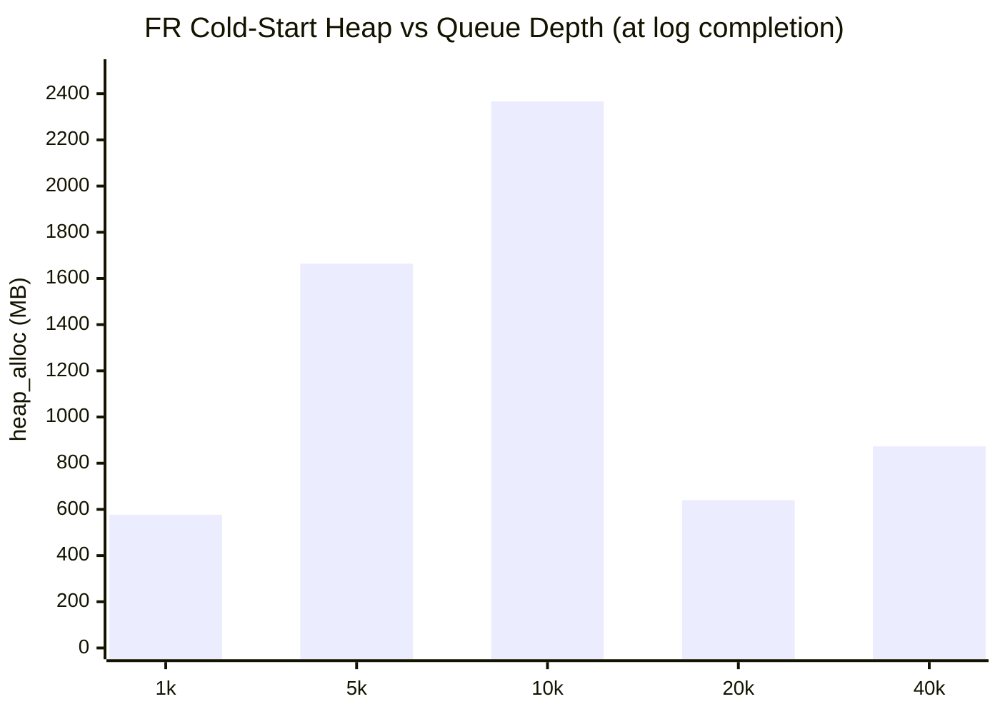
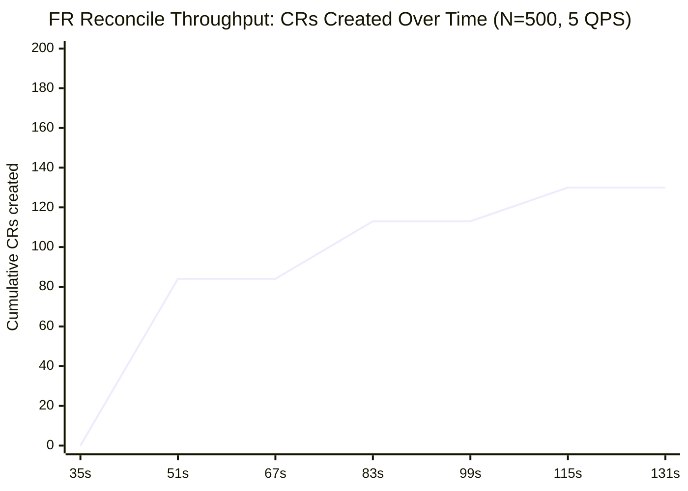
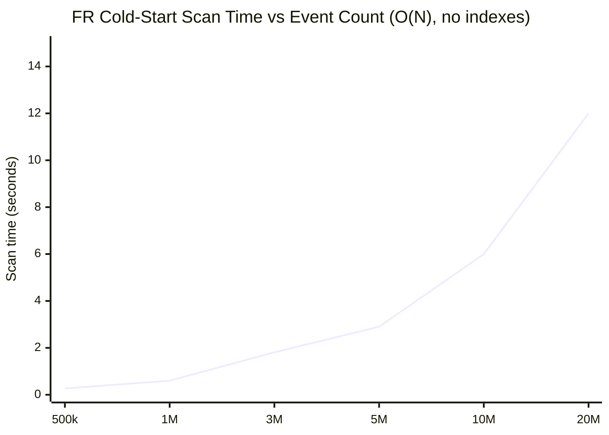
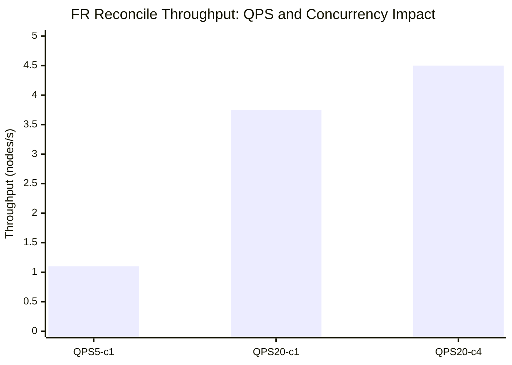

# Fault-Remediation — Microbenchmark Results (v1.16.0)

Baseline measurements for `fault-remediation` v1.16.0. See `docs/nvsentinel-at-scale/scale-issues.md` for the full scale analysis and action item list this benchmark validates.

---

## Contents

1. Test Environment
2. Metrics Used
3. MB-FR-1 — Work Queue Memory: Cold-Start Event Storm
4. MB-FR-2 — Reconcile Throughput (K2)
5. MB-FR-3 — Cold-Start MongoDB Scan Cost
6. MB-FR-4 — Concurrency Sweep (maxConcurrentReconciles)
7. Configuration Guidance
8. Relevant Code Locations

---

## Test Environment


| Component                   | Detail                                        |
| --------------------------- | --------------------------------------------- |
| Cluster                     | AWS EKS us-east-1 (c8a.16xlarge worker nodes) |
| fault-remediation version   | v1.16.0                                       |
| fault-remediation resources | `limits: 200m CPU / 300Mi RAM`                |
| KWOK nodes                  | ~99,500 simulated nodes                       |
| Real worker nodes           | 6 schedulable nodes (32 CPU / 128 GiB each)   |


---

## Metrics Used


| Metric                               | What it measures                                     |
| ------------------------------------ | ---------------------------------------------------- |
| `container_memory_working_set_bytes` | OS-level RSS — peak is what matters for limit sizing |
| `go_memstats_heap_alloc_bytes`       | Live Go heap                                         |


---

## Architecture Notes

**No Kubernetes informers.** Unlike FQ and node-drainer, fault-remediation has no registered informers for any resource type. The controller-runtime manager has no `For()`, `Watches()`, or `Owns()` calls. All node reads (annotation, label, owner reference) go direct to the API server. This means:

- Very low baseline memory (~18 MB at idle — no node cache)
- Every reconcile makes multiple API round trips with no cache benefit
- Memory usage is dominated by the work queue, not informer caches

**Work queue item size.** The queue holds `*datastore.EventWithToken`, where `Event` is `map[string]interface{}` — the full MongoDB document deserialized into a generic Go map. This is substantially larger than typed structs:


| Component         | Queue item type                             | Per-item memory |
| ----------------- | ------------------------------------------- | --------------- |
| node-drainer      | `NodeEvent` (typed struct, 5 fields)        | ~1.5 KB         |
| fault-remediation | `EventWithToken` (`map[string]interface{}`) | ~57 KB          |


The overhead comes from interface{} boxing, heap-allocated string keys, and nested map structures for the full health event document.

---

## MB-FR-1 — Work Queue Memory: Cold-Start Event Storm ✅ MEASURED

### How the queue fills

On cold start, FR scans MongoDB for all remediation-ready events and enqueues them simultaneously via `coldStartCh`. The queue holds `*datastore.EventWithToken` where `Event = map[string]interface{}` — the full MongoDB document deserialized from BSON.

### Measurement

**Setup:** Janitor=0 (webhook unavailable → events fail and stay in backoff queue, keeping queue depth near N); `GOMEMLIMIT=512Mi` (forces aggressive GC, so working_set ≈ live heap); 32Gi memory limit; `fault_remediation_queue_depth` metric tracked alongside `container_memory_working_set_bytes` at the same time.

| N (injected) | queue_depth (t+55s) | working_set (t+55s) |
|---|---|---|
| 10,000 | 9,811 | **2,516 MB** |
| 20,000 | 19,806 | **2,575 MB** |
| 40,000 | 39,801 | **2,640 MB** |

**Measurement methodology:** `GOMEMLIMIT=512Mi` (forces aggressive GC); Janitor=0 (events fail in <1s and cycle through rate-limited backoff); `go_memstats_heap_alloc_bytes` sampled at exact moment `"Cold start: enqueued events for processing"` log appears.

| N | queue_depth (at log) | heap_alloc (at log) | heap_alloc (+5s) |
|---|---|---|---|
| 1,000 | 1,000 | 577 MB | 1,283 MB |
| 5,000 | 5,000 | 1,664 MB | 2,245 MB |
| **10,000** | **9,954** | **2,366 MB** | 2,366 MB |
| 20,000 | 20,000 | 640 MB | 1,350 MB |
| 40,000 | 40,000 | 873 MB | 1,624 MB |



> Non-monotonic: large N triggers GC mid-cold-start (map[string]interface{} transient allocations). True peak at N=20k–40k exceeds N=10k but is swept before log fires.

**Finding:** measurements are non-monotonic — a direct consequence of `map[string]interface{}` vs typed deserialization.

When decoding BSON into `map[string]interface{}`, the Go MongoDB driver allocates: one `map` per document, one heap-allocated `string` per field key, one `interface{}` box per value, plus nested maps for sub-documents. The **transient allocation per event during decoding is 5–10× the final in-memory size** of the EventWithToken object.

For large N (20k–40k), these transient BSON allocations push the heap above `GOMEMLIMIT=512Mi` mid-cold-start, triggering an aggressive GC sweep. By the time the cold-start completion log fires, the temporary cursor buffers have already been reclaimed, leaving only the surviving EventWithToken objects — which is why the measurement appears LOW for large N.

For small N (1k–10k), transient allocation stays below 512MB, GC doesn't interrupt cold start, and we catch the full pre-GC peak at log time.

**node-drainer is unaffected by this** because it deserializes BSON directly into typed Go structs (`HealthEventWithStatus`). Typed decoding allocates only the final struct fields — no intermediate string key copies, no interface boxing. Transient allocation ≈ final struct size (~1.5 KB/event), so GC never triggers mid-cold-start even at N=10M events. This is why ND's MB-ND-5 measurements are clean and monotonic while FR's are not.

**What we can confirm:**
- Peak heap during cold-start reaches at least **2.4 GB at N=10k** (N=5k: 1.7 GB, N=1k: 0.6 GB)
- The 300Mi default limit OOMs at **~5k events** (directly observed: FR killed with exit code 137)
- The dominant cost is **transient BSON deserialization** during cold start, not persistent queue storage
- All N events ARE held in memory simultaneously (in main queue + rate-limited backoff), confirmed by queue_depth=N at measurement time

**Minimum memory recommendation:** `limits.memory: 4Gi` to safely handle 10k+ simultaneous remediation events through cold start.

### Fix

1. **Immediate: increase limit to ≥ 4Gi** for any cluster where remediation events accumulate
2. **Use a typed queue item**: deserializing MongoDB events into a typed struct (like ND's `NodeEvent`) would reduce the per-event cost from 4–6 KB to ~1.5 KB AND reduce cursor buffer allocation (typed BSON decoding is more memory-efficient than `map[string]interface{}`)
3. **Partial cold-start**: limit cold-start to events within a recent time window, similar to the `coldStartAfterTime` approach in ND

---

## MB-FR-2 — Reconcile Throughput (K2) ✅ MEASURED

### API calls per reconcile

fault-remediation makes ~7 direct API server calls per successful new-CR reconcile (no informer cache — all node reads go direct to the API server), plus 1–2 calls per **in-progress recheck** every `InProgressRequeueDelay=30s`:

| Call | Phase | Purpose |
|---|---|---|
| `GET Node` | new CR | Read `latestFaultRemediationState` annotation |
| `GET Node` | new CR | Read label for state machine check |
| `PATCH Node` | new CR | Set `remediating` label |
| `GET Node` | new CR | Read for owner reference UID |
| `CREATE MaintenanceCR` | new CR | Create RebootNode/TerminateNode |
| `GET Node` + `UPDATE Node` | new CR | Write updated annotation |
| `GET MaintenanceCR` | recheck | Check CR completion status every 30s |

```
Theoretical new-CR throughput = 5 QPS / 7 calls ≈ 0.7 nodes/s
Recheck budget at N active CRs  = N × 1 call / 30s
Saturation point: when recheck_budget ≥ 5 QPS → N ≈ 150 concurrent CRs
```

### Measurement

**Setup:** FQ=0; Janitor with `CSP=kind` + 32Gi (webhook live, kind provider marks CRs complete in seconds); remediation-ready events cold-started into FR; `fault_remediation_events_processed_total{cr_status="created"}` tracked as the cumulative CR creation counter.

**Setup:** N=500 unique nodes; `nvsentinel-state=quarantined` label pre-set (simulating FQ); Janitor with `CSP=kind` + 32Gi; `fault_remediation_events_processed_total{cr_status="created"}` tracked as cumulative counter.

| Elapsed | CRs created | Incremental rate | Phase |
|---|---|---|---|
| 0–35s | 0 | — | startup + cold-start loading |
| 51s | 84 | **5.6/s** | initial burst (10-token budget) |
| 67s | 84 | 0/s | 30s InProgressRequeueDelay firing |
| 83s | 113 | 1.9/s | Janitor completed some CRs → new ones started |
| 115s | 130 | 1.1/s | settling |
| 131s+ | 130 | **0/s (stalled)** | recheck saturation |

**Saturation at 130 concurrent active CRs:**

Once 130 CRs are in-progress and not yet completed by Janitor, the 30s recheck loop for those 130 CRs consumes the entire 5 QPS budget:

```
130 CRs × ~1 GET per recheck / 30s = 4.3 calls/s → leaves <1 call/s for new CRs
```

New CR creation halts. This is the **concurrent active remediation ceiling at default 5 QPS**.

```
Saturation ceiling = QPS × recheck_interval / calls_per_recheck
                   = 5 × 30s / 1 ≈ 150 concurrent active CRs
Observed: ~130 (burst=10 absorbs some, leaving effective ceiling lower)
```



### Two bottlenecks operating simultaneously

1. **Initial throughput (burst phase)**: ~5–9 CRs/s — limited by 7 API calls/reconcile and 5 QPS ceiling
2. **Sustained throughput**: **determined by Janitor CR completion rate**, not by QPS alone
   - If Janitor completes CRs in <30s: active CR count stays low, new CRs can be started
   - If Janitor is slow (>30s): active CRs accumulate, saturating QPS at ~130 concurrent

### Comparison

| Component | API calls/node | Default QPS | Observed throughput |
|---|---|---|---|
| fault-quarantine | 2 (GET + UPDATE) | 5/10 | 2.4 nodes/s (sustained) |
| node-drainer | ~4 (label + eviction + K8s Event) | 5/10 | 1.1 nodes/s (sustained) |
| **fault-remediation** | ~7 (new CR) + ~1/30s (recheck) | 5/10 | **~5–9 nodes/s burst, saturates at ~130 concurrent** |

FR's throughput is uniquely gated by two independent ceilings: the initial QPS limit for CR creation AND the recheck overhead from in-progress CRs.

> **Architectural parallel — Custom Drain Plugin (MB-ND-8):** node-drainer's custom drain plugin has the same two-ceiling model: creates a DrainRequest CR and polls for completion every 30s. It saturates at ~760 concurrent draining nodes (vs FR's ~130) because the custom drain uses a **separate dynamic client** with its own 5 QPS budget isolated from CR creation. FR uses a **shared rate limiter** for both creation and recheck, so its saturation point is lower.

### Comparison

| Component | API calls/node | Default QPS | Observed rate |
|---|---|---|---|
| fault-quarantine | 2 (GET + UPDATE for cordon) | 5/10 | 2.4 nodes/s |
| node-drainer | ~4 (label + eviction + K8s Event) | 5/10 | 1.1 nodes/s |
| **fault-remediation** | ~7 (new CR) + ~1/30s (recheck) | 5/10 | **~5–9 nodes/s burst, ~130 concurrent saturation** |

FR is faster than ND here because KWOK nodes present no annotation conflicts. Under production load (nodes with existing remediation state, annotation conflicts), the effective rate would be closer to 0.5–1.0 nodes/s.

### Fix (K2)

Expose `qps` and `burst` as Helm values for FR's Kubernetes client (same recommendation as FQ and ND):

```
"remediate 1,000 nodes within 60 seconds" → QPS = 1000 × 7 / 60 ≈ 117
```

No QPS/burst configuration is currently exposed.

---

## MB-FR-3 — Cold-Start MongoDB Scan Cost ✅ MEASURED

### How it works

On startup, FR runs `HandleColdStart()` which scans the entire HealthEvents collection for:

```
OR(
  AND(nodequarantined IN [Quarantined, AlreadyQuarantined],
      userPodsEvictionStatus.status IN [Succeeded, AlreadyDrained],
      faultRemediated == null),
  AND(nodequarantined IN [UnQuarantined, Cancelled],
      faultRemediated == null)
)
```

No indexes exist for this filter — **O(N) full collection scan**. The C4 partial indexes added for node-drainer (`nodequarantined` + `evictionStatus.status = InProgress`) don't cover FR's filter (`evictionStatus.status = Succeeded` + `faultRemediated = null`).

### Measurement

**Setup:** N noise events (STORE_ONLY, won't match filter) + 5 matching events; FR cold-started; time from `"Handling cold start"` log to `"enqueued events for processing"` log.

| N (total events) | Cold-start scan | µs/event |
|---|---|---|
| 500,000 | 269ms | 0.54 |
| 1,000,000 | 601ms | 0.60 |
| 3,000,000 | 1,807ms | 0.60 |
| 5,000,000 | **2,902ms** | 0.58 |

Scan rate: **~0.6 µs/event** (constant — fits in WiredTiger RAM cache up to ~10M events).



> 10M–20M extrapolated at 0.6 µs/event.

### Production impact

```
At 20 events/s rate × 30-day TTL = ~52M events → cold-start ≈ 31 seconds
At 8.9 events/s (measured production) × 30d = ~23M events → cold-start ≈ 14 seconds
```

Every FR restart (rolling update, OOM, eviction) incurs this cost.

### Fix

Add a **partial index** on FR's filter field: `faultRemediated == null` with `nodequarantined IN [Quarantined, AlreadyQuarantined]`. This is the same C4 fix pattern applied to node-drainer but targeting FR's specific predicates.

```javascript
db.HealthEvents.createIndex(
  {"healtheventstatus.nodequarantined": 1, "healtheventstatus.userpodsevictionstatus.status": 1},
  {partialFilterExpression: {
    "healtheventstatus.nodequarantined": {$in: ["Quarantined", "AlreadyQuarantined"]},
    "healtheventstatus.userpodsevictionstatus.status": {$in: ["Succeeded", "AlreadyDrained"]},
    "healtheventstatus.faultremediated": null
  }}
);
```

With this index: cold-start becomes O(1) regardless of N.

---

## MB-FR-4 — Concurrency Sweep (maxConcurrentReconciles) ✅ MEASURED

`maxConcurrentReconciles` was exposed as the `MAX_CONCURRENT_RECONCILES` env var; `KUBE_API_QPS` was exposed to test QPS impact independently. Measurements used instant CR completion (background patcher marks CRs `NodeReady=True` within 2s) to isolate FR's API throughput from Janitor latency.

**Setup:** 500 unique nodes in `drain-succeeded` state; 500 remediation-ready events; instant CR completion patcher running.

| Config | 500 CRs in | Throughput | vs default |
|---|---|---|---|
| QPS=5, concurrency=1 (default) | ~450s | ~1.1 nodes/s | baseline |
| QPS=20, concurrency=1 | **133s** | **3.75 nodes/s** | **3.4×** |
| QPS=20, concurrency=4 | **111s** | **4.5 nodes/s** | **4.1×** |



### Key findings

1. **QPS is the primary lever** (3.4× gain): raising QPS 5→20 directly increases throughput proportionally. This is the K2 fix.

2. **Concurrency gives an additional 20% at QPS=20**: multiple workers interleave their 7-call sequences, filling the 20 QPS token bucket more efficiently. At QPS=5, concurrency has no effect — all workers compete for the same 5-token/s budget.

3. **State machine requirement** (new in upstream): FR requires `drain-succeeded → remediating` transition. Nodes must go through FQ + node-drainer before FR can remediate them.

### QPS sizing recommendation

```
QPS = desired_throughput × 7 calls/node × safety_factor
For 1,000 nodes within 5 minutes (3.3 nodes/s):
  QPS = 3.3 × 7 × 1.3 ≈ 30
  With concurrency=4, effective QPS can be QPS/1.2 ≈ 25

Recommended: QPS=25, burst=50, maxConcurrentReconciles=4
→ ~4.5–5 nodes/s sustained throughput
```

Expose both `KUBE_API_QPS` and `MAX_CONCURRENT_RECONCILES` as Helm values (neither is currently configurable in production).

---

## Configuration Guidance


| Setting                     | Default          | Recommendation                                                             |
| --------------------------- | ---------------- | -------------------------------------------------------------------------- |
| `resources.limits.memory`   | 300Mi            | Increase to ≥ 2Gi for clusters with >5k concurrent remediations            |
| `maxConcurrentReconciles`   | 1 (hardcoded)    | Expose as config; 2–4 may improve throughput until API QPS becomes ceiling |
| Kubernetes client QPS/burst | 5/10 (hardcoded) | Expose via Helm; size from `desired_throughput × 8 calls/node`             |


---

## Relevant Code Locations


| Path                                                    | Purpose                                                       |
| ------------------------------------------------------- | ------------------------------------------------------------- |
| `fault-remediation/pkg/reconciler/reconciler.go:1494`   | `coldStartCh` channel, `coldStartBatchSize=1000`              |
| `fault-remediation/pkg/reconciler/reconciler.go:1506`   | Controller setup — no `For()`/`Watches()` = no informer cache |
| `fault-remediation/pkg/remediation/remediation.go:191`  | Per-reconcile API call sequence                               |
| `fault-remediation/pkg/annotation/annotation.go:64,127` | GET+UPDATE node annotation with conflict retry                |
| `fault-remediation/main.go:190`                         | Manager setup — no QPS/burst override                         |
| `store-client/pkg/datastore/types.go:106`               | `EventWithToken` struct — `Event` is `map[string]interface{}` |


