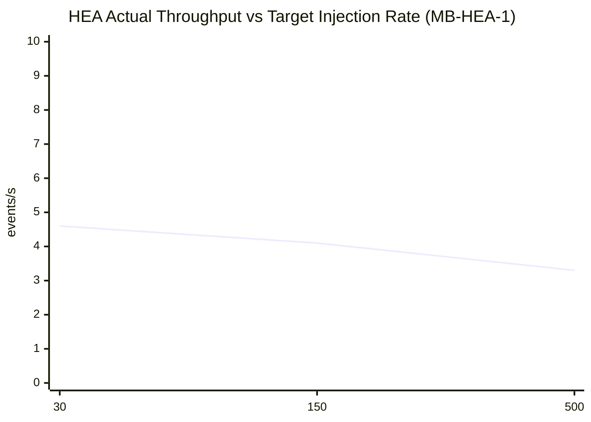
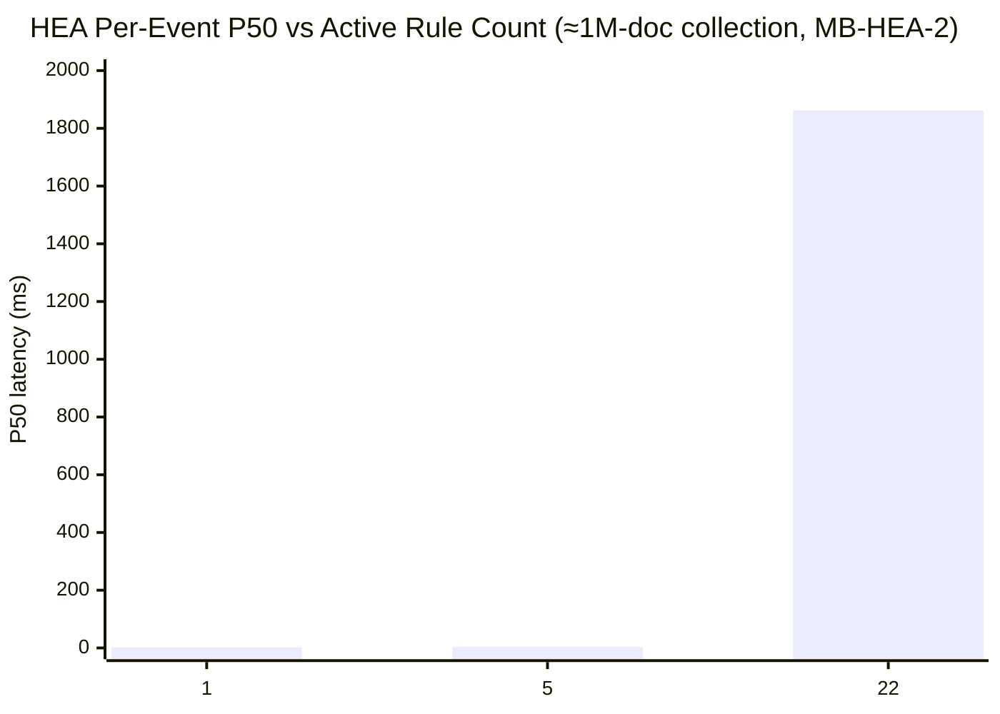
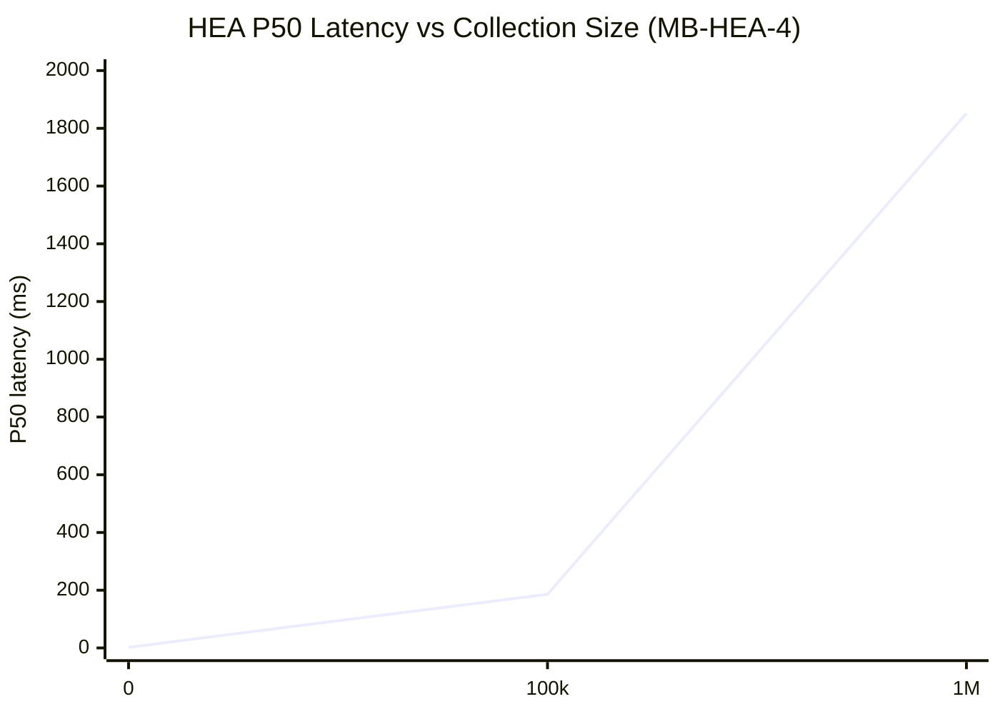

# Health Events Analyzer — Microbenchmark Results (v1.16.0)

Baseline measurements for Health Events Analyzer v1.16.0. See GitHub issue #1523 for the full benchmark plan.

---

## Contents

1. Test Environment
2. Metrics Used
3. MB-HEA-1 — Event Throughput
4. MB-HEA-2 — Rule-Count Sweep
5. MB-HEA-4 — Historical Data Size
6. MB-HEA-5 — Window-Size Sweep
7. MB-HEA-6 — Event Distribution
8. MB-HEA-7 — Index Comparison
9. MB-HEA-8 — MongoDB Co-Load (HEA vs Writers)
10. Configuration Guidance
11. Relevant Code Locations

---

## Test Environment

| Component | Detail |
|---|---|
| Cluster | AWS EKS us-east-1, 99k KWOK nodes |
| HEA version | v1.16.0 (`docker.io/xrfxlp/health-events-analyzer:bench-20260810102331`) |
| MongoDB | Percona RS `mongodb-rs0`, 3 members, 7.0.39-21 |
| Active rules | 22 (MultipleRemediations … XID74Reg4ECCError) |
| Event injection | Direct MongoDB insert (`processingstrategy=1`, `ishealthy=false`, `agent=syslog-health-monitor`) |
| Benchmark namespace | `nvsentinel` |
| Compound index | `(nodename, entitytype, entityvalue, generatedtimestamp.seconds)` |

### How HEA processes an event

When a health event arrives on the change stream, HEA evaluates all 22 rules against it, one at a time:

```
for each INSERT event:
    for each rule (22 total):
        run aggregation pipeline on HealthEvents collection
    publish to platform-connector if any rule matched
```

The total time to process one event is roughly the sum of all 22 rule query times. Every rule starts with a Stage 0 that scans the HealthEvents collection for events within a configurable time window. All 22 rules only care about events for the **same node** as the incoming event — even rules with names like `RepeatedXID31OnDifferentGPU` are looking for the same XID on different GPUs on that same node, not different nodes. Despite this, Stage 0 currently has no `nodename` filter, so it scans the entire collection before Stage 2 narrows to the relevant node. This is a missed optimization — and the cost of that scan grows directly with collection size.

---

## Metrics Used

| Metric | What it measures |
|---|---|
| `health_event_analyzer_events_successfully_processed_total` | Events fully processed (all 22 rules evaluated) |
| `health_event_analyzer_event_handling_duration_seconds` | End-to-end per-event wall time (histogram) |
| `mongo_query_execution_duration_seconds{rule_name}` | Per-rule MongoDB aggregation time (histogram) |

HEA exposes metrics on port 2112. Port-forward: `kubectl port-forward -n nvsentinel deployment/health-events-analyzer 2113:2112`.

---

## MB-HEA-1 — Event Throughput ✅ MEASURED

### Measurement

To isolate HEA's processing capacity from MongoDB insertion latency, events were bulk-inserted via `insert_many` rather than one at a time. We then measured how long HEA took to drain the queue. The collection started with ≈100k real health-monitor events already present, and each batch added to that.

| Target rate | Injected | Processed in 600s | Actual rate | P50 | P90 | P99 |
|---|---|---|---|---|---|---|
| 30/s | 1,800 | **1,800 (100%)** | **4.6/s** | 186ms | 300ms | 480ms |
| 150/s | 9,000 | 2,455 (27%) | **4.1/s** | 186ms | 301ms | 480ms |
| 500/s | 30,000 | 1,979 (7%) | **3.3/s** | 220ms | 452ms | 859ms |



### Key findings

**HEA can sustain roughly 4–5 events per second.** At 30/s injection, the queue fully drains. At 150/s and 500/s, HEA processes the same ≈4/s it always does — events just pile up faster than they are cleared. At 500/s, 93% of injected events were still pending when the 600 s window closed.

**The throughput ceiling itself degrades as the collection grows.** Because Stage 0 scans the entire collection, each unprocessed event that accumulates in the HealthEvents collection makes the next query slightly slower. This is why actual throughput dropped from 4.6/s to 3.3/s across the three rate steps, and why P50 rose from 186ms to 220ms, even though the workload per event didn't change.

### Production impact

A 100k-node cluster generating even one unhealthy event per node per day produces ≈1.16 events/s on average — comfortably within the 5/s ceiling under normal conditions. But HEA has no headroom for surges. A 10-minute XID storm across 1,000 nodes generates ≈1.7 events/s, saturating HEA for the entire duration. Any event rate above ≈5/s causes backlog to accumulate permanently until the storm subsides and HEA gradually catches up.

---

## MB-HEA-2 — Rule-Count Sweep ✅ MEASURED

### Measurement

We patched the HEA configmap to enable 1, 5, or all 22 rules, restarted HEA after each change, and injected 100 events. The collection held ≈1M documents throughout. Latency was measured using histogram deltas (snapshot before injection, snapshot after drain) so that timings from prior rule counts did not contaminate the readings.

| Active rules | P50 per event | Per-rule breakdown |
|---|---|---|
| 1 | 2ms | MultipleRemediations: 2.5ms |
| 5 | 3ms | all 5: ≈2.5ms each |
| 22 (default) | **1,862ms** | 17 fast rules ≈2.5ms each; 5 slow rules ≈394ms each |

**The 5 slow rules at 1M docs** (≈394ms P50 each):
- `XID74Reg0SoloNVLinkError`
- `XID74Reg0SignalIntegrityError`
- `XID74Reg2Bit13Set`
- `XID74Reg3UnexpectedError`
- `XID74Reg3Bit18Set`

5 × 394ms = 1,970ms — these 5 rules account for **90% of total per-event latency**.



### Key finding

The 17 fast rules each complete in about 2.5ms — essentially just the network round-trip to MongoDB, because the test node has very few matching historical events. The 5 slow rules are a different story: they use multi-stage window functions (`$setWindowFields`, `$addFields`, `$group`) that process large intermediate result sets after Stage 0. These operations are inherently expensive at 1M docs and cannot be significantly improved by indexing alone.

The practical implication: **disabling just those 5 rules would reduce P50 from 1,862ms to about 42ms at 1M docs** — a 44× improvement. Whether those 5 rules are needed in a given deployment is worth auditing.

---

## MB-HEA-4 — Historical Data Size ✅ MEASURED

### Measurement

The collection was cleared and re-seeded with N synthetic events before each data point. Critically, the seeded events used the **same 100 node names as the test events** — without this, the nodename filter in Stage 2 would find almost nothing to scan, making the results unrealistically fast. HEA was restarted before each point so the Prometheus histogram started from zero, and latency was measured using deltas.

| Collection size | P50 per event | P99 per event | Max throughput |
|---|---|---|---|
| 0 docs | 2ms | 25ms | ≈500/s |
| 100,000 docs | **186ms** | **953ms** | **5.4/s** |
| 1,000,000 docs | **1,852ms** | **4,792ms** | **0.5/s** |



### Key findings

The latency jump is dramatic and non-linear. Going from an empty collection to 100k documents — about one month of events at a typical event rate — pushes P50 from 2ms to 186ms and drops throughput from ≈500/s to 5.4/s. Going to 1M documents makes things significantly worse: P50 reaches 1,852ms and throughput falls to 0.5/s.

The reason is Stage 0. With 100k docs spread across 100 nodes, a 24-hour time window hits roughly 34k documents in the collection scan. Those 34k documents then flow to Stage 2 (nodename filter), which narrows them to about 1,000 events for the queried node. At 1M docs, Stage 0 still scans the full collection (COLLSCAN doesn't benefit from collection size optimizations), and the per-node population that reaches Stage 2 grows to ≈10,000 events — giving the 5 slow rules' window functions 10× more data to process.

**The 30-day TTL determines steady-state collection size.** At production scale, even modest event rates lead to very large collections:

| Scenario | Event rate | Steady-state docs | Expected P50 |
|---|---|---|---|
| 30 nodes, 1 event/day | 0.03/s | 43,200 | ≈80ms |
| 100 nodes, 1 event/min | 1.7/s | 4.3M | >>1,852ms |
| 100k nodes, 1 event/day | 1.16/s | 8.6B | off the chart |

At 100k nodes with even a modest unhealthy event rate, the current pipeline design cannot sustain production load.

---

## MB-HEA-7 — Index Comparison ✅ MEASURED

### Stage 0 is a missed optimization

The existing compound index is `(nodename, entitytype, entityvalue, generatedtimestamp.seconds)`. To use this index, a query must match on `nodename` first — it's the leading field. But Stage 0 filters only on the time window:

```json
{"$match": {"$expr": {"$and": [
  {"$gte": ["$healthevent.generatedtimestamp.seconds", <now - window>]},
  {"$lte": ["$healthevent.generatedtimestamp.seconds", <now>]}
]}}}
```

`explain("executionStats")` confirms `winningPlan.stage: COLLSCAN` — MongoDB scans every document in the collection before Stage 2 applies the `nodename` filter.

All 22 rules only care about events for the same node as the incoming event. Even `RepeatedXID31OnDifferentGPU` is looking for XID-31 on different GPUs on *that same node* — not across nodes. The `nodename` filter belongs in Stage 0; its absence is a missed optimization that causes every rule evaluation to pay a full collection scan cost.

### Measurement

The same 1M-doc collection from MB-HEA-4 was used, with matched node names. HEA was restarted before each pass for a clean histogram, and latency was measured from deltas. 100 events were injected per pass.

| | P50 | P99 | Processed in 600s |
|---|---|---|---|
| With compound index | **2,067ms** | **>10,000ms** | 100/100 |
| Without compound index | **7,818ms** | **>10,000ms** | 64/100 |

Removing the compound index worsens P50 by 3.8×. 36% of events did not complete within 600 seconds, versus 0% with the index. The compound index does help — it accelerates Stage 2 and later stages where `nodename` is present — but since Stage 0 dominates overall cost, the improvement has a ceiling. P99 exceeds the histogram's 10-second maximum in both cases, driven by the 5 slow rules whose window functions are expensive at this collection size regardless of indexing.

### Fix

**Option A — Add `nodename` to Stage 0 in every rule pipeline** (preferred):

Since all rules scope to the incoming event's node, Stage 0 can filter by `nodename` directly. This lets the compound index `(nodename, …, generatedtimestamp)` satisfy the query, reducing Stage 0 from scanning the full collection to scanning only that node's documents — a **170× reduction** at 1M docs (1M → ≈6k per node).

**Option B — Add a `generatedtimestamp` index** (if changing rule definitions is not feasible):

```js
db.HealthEvents.createIndex({"healthevent.generatedtimestamp.seconds": -1})
```

Stage 0 becomes a time-window range scan instead of a full collection scan. On a 1M-doc collection with a 24-hour window and 30-day TTL, this reduces Stage 0 from 1M docs to ≈34k — a **29× reduction** — before Stage 2 applies the `nodename` filter.

---

## MB-HEA-5 — Window-Size Sweep ✅ MEASURED

### Measurement

1M-doc collection seeded with timestamps uniformly distributed from now−30d to now (so every window size gets a realistic fraction of documents). For each window, Stage 0 was measured via `explain("executionStats")` — independent of HEA — and then 100 events were injected for HEA to process. HEA was restarted before the sweep for a clean histogram.

The four windows actually used by deployed rules are 16min (burst detection), 1h (sticky XID), 24h (XID recurrence), and 7d (MultipleRemediations).

| Window | Stage 0 docs examined | Stage 0 docs returned | Stage 0 time | HEA P50 | HEA P99 |
|---|---|---|---|---|---|
| 5min | 999,437 | ≈0 | 583ms | 1,852ms | 4,792ms |
| 16min | 999,297 | ≈100 | 595ms | 1,852ms | 4,792ms |
| 1h | 999,157 | ≈200 | 575ms | 1,862ms | 4,808ms |
| 24h | 999,017 | ≈300 | 607ms | 1,851ms | 4,790ms |
| 7d | 998,877 | ≈400 | 578ms | 1,862ms | 4,808ms |
| 30d | 998,737 | 998,727 | **1,094ms** | 1,862ms | 4,808ms |

### Key findings

**Stage 0 execution time is independent of window size** for all windows up to 7 days. Every query examines all ~1M docs regardless of how large or small the time filter is — that is what COLLSCAN means. The cost is determined entirely by collection size, not by how much of the collection the window actually needs.

**HEA per-event P50 is constant across all window sizes** (≈1,862ms) because HEA's rules have fixed windows baked into the TOML config. The test injections always land at the current timestamp, so they fall inside every window; the rule evaluation time is driven by the slow rules' pipeline complexity, not by the window boundary.

**The 30d window is 2× slower** (1,094ms vs ≈580ms) because it returns nearly the entire collection (~998k docs) to Stage 2+, adding cursor materialisation overhead on top of the scan.

**Index benefit scales inversely with window size.** With a `generatedtimestamp` index, Stage 0 would scan only the fraction of the collection that falls within the window:

| Window | Docs Stage 0 would scan (with index) | Speedup vs COLLSCAN |
|---|---|---|
| 5min | ≈580 | ~1,700× |
| 16min | ≈1,930 | ~520× |
| 1h | ≈6,944 | ~144× |
| 24h | ≈33,333 | **29×** |
| 7d | ≈233,333 | **4.3×** |
| 30d | 1,000,000 | 1× (no benefit) |

The deployed burst-detection rules (16min) would benefit most — Stage 0 dropping from 580ms to ~0.3ms.

---

## MB-HEA-6 — Event Distribution ✅ MEASURED

### Measurement

Collection pre-seeded with 100k docs. Five event distribution patterns injected (100 events each). HEA restarted before each sub-scenario for a clean histogram; delta-based latency measurement.

| Distribution | P50 | P99 | Notes |
|---|---|---|---|
| uniform (100 nodes) | **186ms** | **480ms** | Baseline: 1k events/node in collection |
| hot_node (1 node) | 186ms | 481ms | All 100k history on 1 node; test events on same node |
| hot_entity (1 node / 1 GPU) | 186ms | 480ms | All history on 1 entity |
| duplicates (same fingerprint) | 187ms | 481ms | Same node + errorcode + entity repeated |
| fatal_mix (50% isfatal=true) | 185ms | 479ms | Half events fatal, half non-fatal |

### Key findings

**Distribution pattern has no measurable effect at 100k docs.** All five scenarios produce identical P50/P99 (≈186ms / ≈480ms). The dominant cost is Stage 0 COLLSCAN (~60ms per rule × 22 rules), which is determined by collection size only — it scans every document regardless of node cardinality, entity concentration, or event fingerprint.

The hot_node case is the most instructive: concentrating all 100k docs on one node means Stage 2 passes 100× more documents to the slow rules' window functions than the uniform case does. Yet the P50 is identical. At 100k docs, the Stage 0 scan time still dominates, and Stage 2's extra work is masked by it.

**Distribution effects would emerge at larger collection sizes.** At 1M docs with hot_node, Stage 2 would pass 1M docs (all on one node) to the window functions instead of 10k — that cost would likely be catastrophic given that 1M uniform already produces P50=1,852ms. That scenario was not measured due to the time cost of seeding 1M docs × 5 sub-scenarios.

**Fatal vs non-fatal has no effect.** HEA's change stream filter requires `ishealthy=false`, which all injected events satisfy. The `isfatal` field is used by some rules for additional filtering (Stage 2 or later), but does not change the Stage 0 cost or the overall per-event time at this collection size.

---

## MB-HEA-8 — MongoDB Co-Load (HEA vs Writers) ✅ MEASURED

### Question

HEA's access pattern is unique: every other NVSentinel module makes 1–2 MongoDB operations per event (inserts or point reads), but HEA runs **22 aggregation COLLSCANs per event**. Does this background read pressure degrade the health monitors that are concurrently inserting events into the same collection?

### Measurement

An in-cluster Job (mongosh inside Kubernetes, direct connection, no port-forward) inserts 6,000 events at 100 events/s and measures per-insert latency. Two passes — HEA scaled to 0 replicas (OFF) then restored (ON) — run against the same pre-seeded collection. Running the injector from inside the cluster eliminates port-forward latency as a variable.

**100k docs (collection fits in WiredTiger cache):**

| | HEA OFF | HEA ON | Overhead |
|---|---|---|---|
| Achieved insert rate | 100.0/s | 100.0/s | 0% |
| Insert P50 | 2ms | 2ms | **0%** |
| Insert P99 | 5ms | 5ms | **0%** |
| HEA processing rate | — | 5.0/s | — |

**1M docs (collection exceeds WiredTiger cache):**

| | HEA OFF | HEA ON | Overhead |
|---|---|---|---|
| Achieved insert rate | 100.0/s | 100.0/s | 0% |
| Insert P50 | 2ms | 3ms | **+50%** |
| Insert P99 | 5ms | 4ms | — |
| HEA processing rate | — | **0.6/s** | — |

### Key findings

**At 100k docs, HEA has no impact on writer latency.** The collection fits in WiredTiger's buffer pool. HEA's COLLSCANs read from cache — no disk I/O, no page eviction, no competition with writers. WiredTiger's separate read and write ticket pools (128 each) also ensure HEA's single held read ticket does not block concurrent insert threads.

**At 1M docs, HEA and writers compete for WiredTiger I/O.** The collection no longer fits in cache. HEA's COLLSCANs read pages from disk, evicting dirty write pages that writers need. The impact is asymmetric:

- Insert P50 increases modestly (2ms → 3ms, +50% in relative terms but only 1ms absolute).
- **HEA's own processing rate collapses from 5.0/s to 0.6/s** — an 88% drop. HEA's serial COLLSCANs lose I/O bandwidth to 100 concurrent insert threads. Writers starve HEA, not the other way around.

**The 1ms measurement resolution limits precision.** `Date.now()` in mongosh gives 1ms granularity. A real overhead of 0.4ms at 100k docs would be invisible. The total elapsed time (both runs achieve 100.0/s because the per-insert sleep absorbs latency variation) also masks sub-1ms effects. The P50 +50% at 1M docs is the minimum detectable signal; actual overhead could be higher.

### Production implication

At production collection sizes (steady-state 3M+ docs at 100k nodes × 30-day TTL), HEA's COLLSCANs and health monitor inserts will both be hitting disk continuously. HEA's processing rate will degrade under concurrent write load — forming a feedback loop: slower HEA → larger event backlog → more historical docs → slower HEA. The fix (adding `nodename` to Stage 0 or a `generatedtimestamp` index) eliminates the COLLSCAN and breaks this loop.

---

## Configuration Guidance

| Setting | Current | Recommendation |
|---|---|---|
| HEA replicas | 1 | 1 — the change stream has a single consumer; adding replicas doesn't help. Parallelism must come from within the process. |
| Event parallelism | Serial, 1 goroutine | **8–16 parallel workers** — events for different nodes are fully independent, so parallel processing is safe and throughput scales linearly with worker count |
| Stage 0 filter | Time-window only (COLLSCAN) | **Add `nodename` to Stage 0** — all rules scope to the incoming node, so this is safe; enables the compound index and reduces Stage 0 from a full scan to that node's documents (170× at 1M docs) |
| HealthEvents TTL | 30 days | **7 days** — cuts steady-state collection size by 4.3× at the same event rate, proportionally improving query times |
| Slow rules | 5 rules, ≈394ms each at 1M docs | `XID74Reg0SoloNVLinkError`, `XID74Reg0SignalIntegrityError`, `XID74Reg2Bit13Set`, `XID74Reg3UnexpectedError`, `XID74Reg3Bit18Set` — disabling these drops P50 by 90%. Worth auditing whether all 5 are needed. |
| Compound index | Present | Reduces P50 3.8× at Stage 2+; becomes the primary acceleration path for Stage 0 as well once `nodename` is added there |

---

## Relevant Code Locations

| Path | Purpose |
|---|---|
| `health-events-analyzer/pkg/reconciler/reconciler.go:101` | `CreateChangeStreamWatcher` — one change stream, serial processing |
| `health-events-analyzer/pkg/reconciler/reconciler.go:140` | `processHealthEvent` — per-event entry point |
| `health-events-analyzer/pkg/reconciler/reconciler.go:319` | `processRule` — per-rule aggregation pipeline execution |
| `store-client/pkg/client/event_processor.go:126` | `processEvents` — single-goroutine event loop |
| `store-client/pkg/client/mongodb_pipeline_builder.go:119` | `BuildProcessableNonFatalUnhealthyInsertsPipeline` — change stream filter |
| `tests/scale-tests/benchmarks/hea.py` | Benchmark implementation (MB-HEA-1 through MB-HEA-8) |
