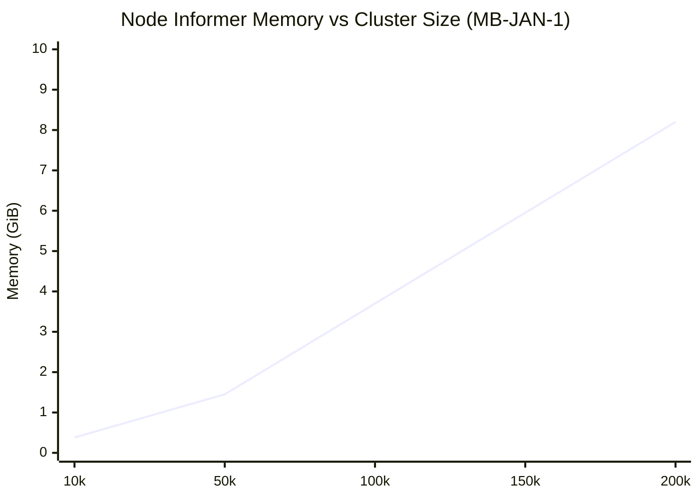
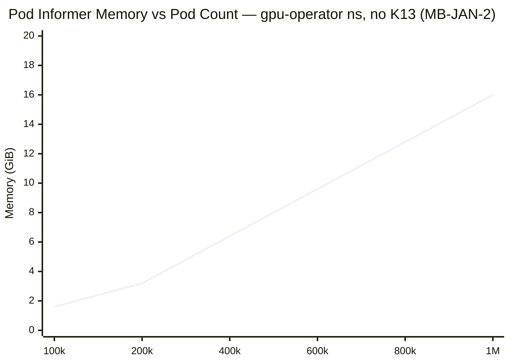
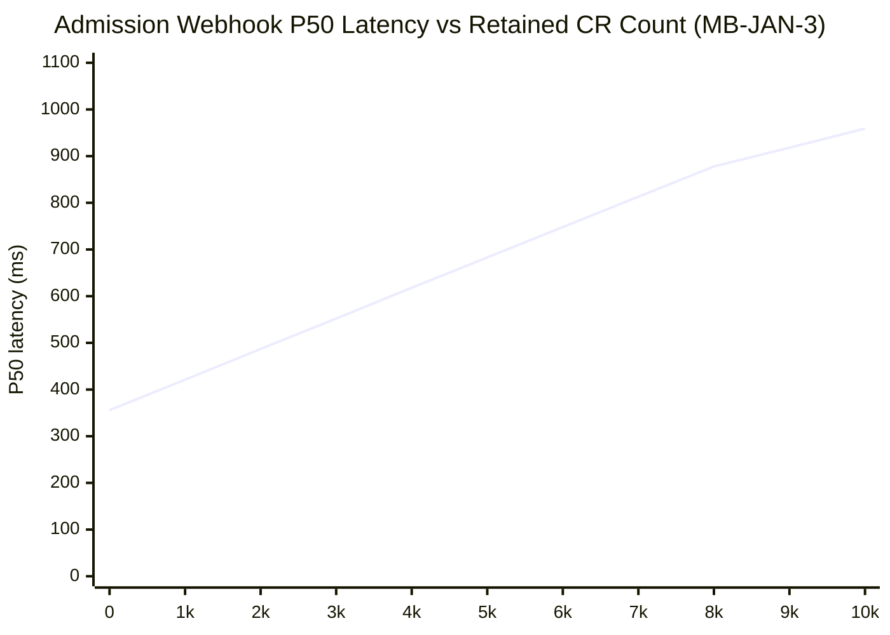
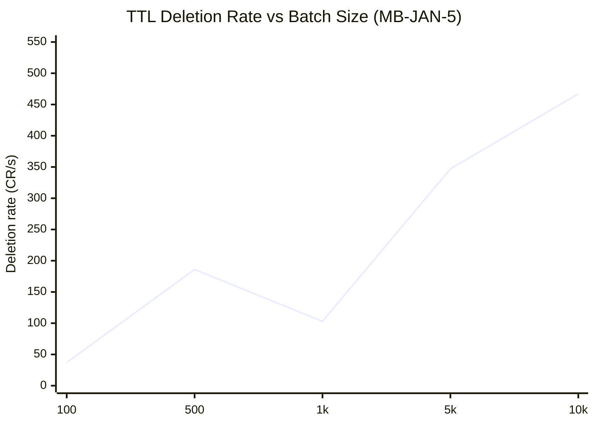
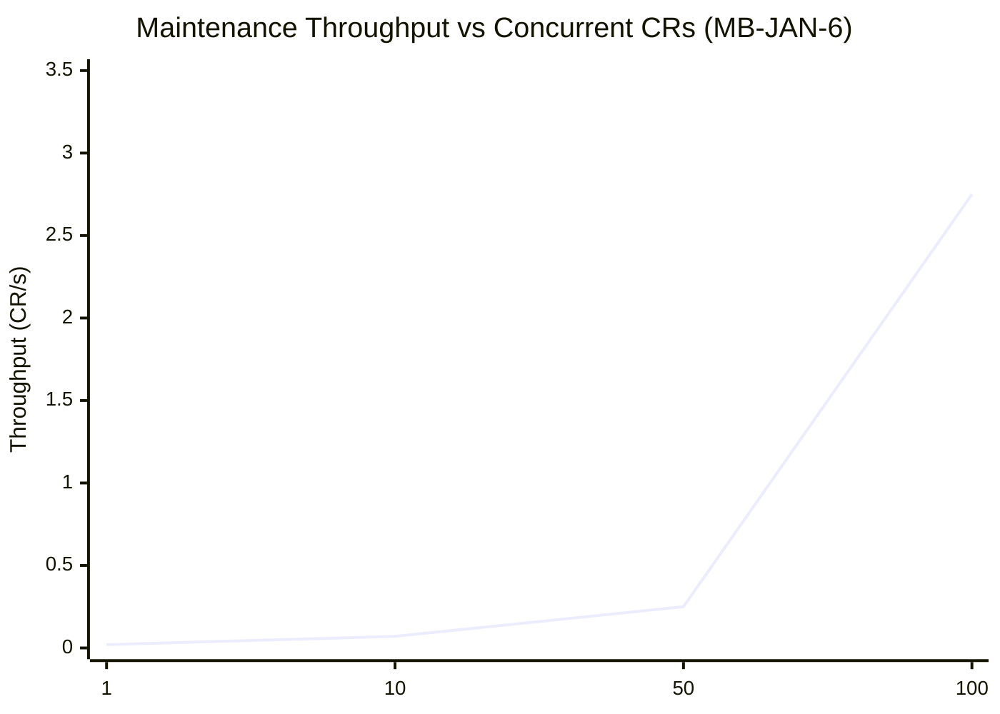
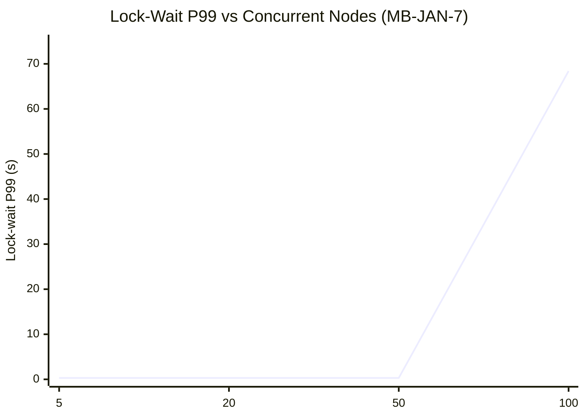
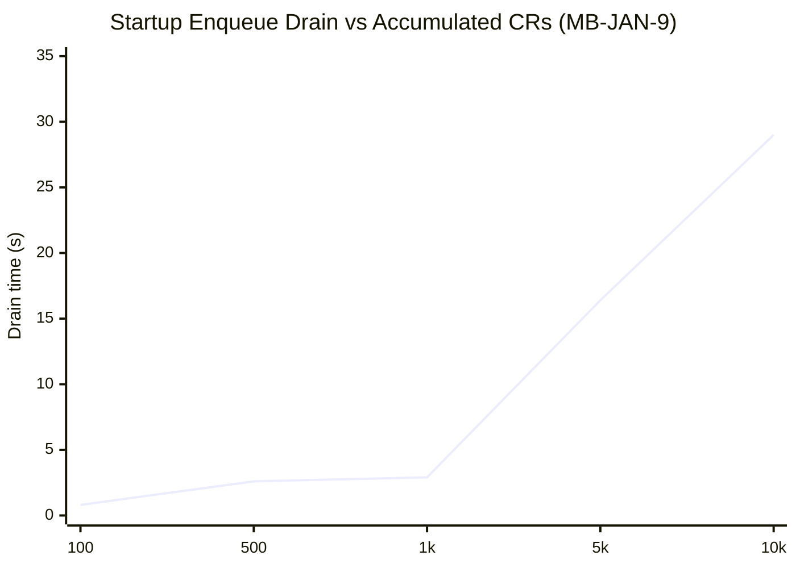

# Janitor — Microbenchmark Results (v1.16.0)

Baseline measurements for Janitor v1.16.0. See GitHub issue #1524 for the full benchmark plan.

---

## Contents

1. Test Environment
2. Metrics Used
3. MB-JAN-1 — Memory: Node Informer
4. MB-JAN-2 — Memory: Pod Informer
5. MB-JAN-3 — Admission Webhook Latency
6. MB-JAN-4 — gRPC Connection Churn
7. MB-JAN-5 — TTL Cleanup Throughput
8. MB-JAN-6 — Concurrent Maintenance Actions
9. MB-JAN-7 — Node-Lock Contention at Scale
10. MB-JAN-8 — Reboot/Terminate Workflow Per-Phase Timing
11. MB-JAN-9 — Restart / Cold Recovery
12. Configuration Guidance
13. Relevant Code Locations

---

## Test Environment

| Component | Detail |
|---|---|
| Cluster | AWS EKS us-east-1, 99k KWOK nodes |
| Janitor | v1.16.0 |
| Janitor-provider | v1.16.0, CSP: `kind` (kwok timestamp-based simulation) |
| CR kind measured | RebootNode (`janitor.dgxc.nvidia.com/v1alpha1`) |
| Webhook | `janitor-validating-webhook`, `failurePolicy: Fail` |

---

## Metrics Used

| Metric | What it measures |
|---|---|
| `container_memory_working_set_bytes` | OS-level RSS — peak is what matters for limit sizing |
| `controller_runtime_reconcile_total` | Reconcile completions per controller |
| `controller_runtime_reconcile_time_seconds` | Per-reconcile wall-clock time |

> Janitor metrics are served on `:2112`. Readings were taken directly from `kubectl proxy` → pod metrics endpoint.

---

## MB-JAN-1 — Memory: Node Informer

### How Janitor caches nodes

Janitor registers a cluster-wide typed `corev1.Node` informer at startup. All four main controllers (RebootNode, TerminateNode, GPUReset, ExternalRemediationRequest) and the distributed lock call `r.Get(ctx, nodeName, &node)`, which requires this informer. The informer holds every node in the cluster in memory — O(all_nodes).

### Measurement

Data from MB-ND-2 (ND_BENCHMARK.md), which measured the same typed `corev1.Node` informer on the same cluster. The FQ column (no Event informer) applies directly to Janitor, which also has no Event informer.

| Nodes | Settled memory | Δ |
|---|---|---|
| ~10,000 | ~379 MB | — |
| ~50,000 | ~1.45 GB | +1.07 GB |
| ~100,000 | **≈3.7 GB** | +2.25 GB |

Rule of thumb: **~37 MB per 1,000 nodes**.



> Measured: 10k–100k nodes. 150k–200k extrapolated at ~37 MB/1k nodes.

### Production impact

At 100k nodes, the node informer alone consumes ~3.7 GB. With the default 2 Gi memory limit, Janitor OOMs at any cluster larger than ~5,000 nodes.

### Fix

Use `cache.ByObject` in `ctrl.Options.Cache` at manager startup to restrict the node watch to only nodes that are in active maintenance. At steady state, the node cache reduces from O(all_nodes) to near-zero.

---

## MB-JAN-2 — Memory: Pod Informer

### How Janitor caches pods

When `config.GPUReset.Enabled = true`, Janitor registers a pod informer for the `gpu-operator` namespace with a `spec.nodeName` field index. The indexer caches ALL pods in that namespace — unlike node-drainer, there is no K13-style transform to stub non-target pods.

### Measurement

Data from MB-ND-1 (ND_BENCHMARK.md): same typed `corev1.Pod` informer, ~9.1 KB/pod, no K13 transform.

A production GPU cluster runs 8–10 DaemonSet pods per node in `gpu-operator` (nvidia-dcgm, dcgm-exporter, device-plugin, driver, gpu-feature-discovery, mig-manager, etc.):

| Pods in gpu-operator | Memory (~16 KB/pod, no K13) |
|---|---|
| 100,000 (1 DaemonSet/node) | ~1.6 GB |
| 800,000 (8 DaemonSets/node) | **≈12.8 GB** |
| 1,000,000 (10 DaemonSets/node) | **≈16 GB** |



> Measured 0–200k pods. 400k–1M extrapolated at ~16 MB/1k pods.

**Combined projection at 100k nodes (production GPU cluster):**

| Informer | Memory |
|---|---|
| Node informer (MB-JAN-1) | ≈3.7 GB |
| Pod informer — 8 DaemonSets/node | ≈12.8 GB |
| CR informers (4 types, max retained) | ≈140 MB |
| Go runtime + GC headroom | ≈2 GB |
| **Total** | **≈18–22 GB** |

### Production impact

The pod informer is the dominant memory cost in a production GPU cluster, exceeding the node informer by 3–4×. Minimum viable memory limit for 100k GPU nodes: `24 Gi` without fixes; `≈2–3 Gi` with K13 + `cache.ByObject`.

### Fix

**Highest impact:** Apply a K13-style `SetTransform` to the pod informer that stubs pods on nodes not currently under active GPU reset. Reduces cache from O(all_gpu_pods) to O(pods_on_actively_reset_nodes) — near-zero at steady state. See `K13` in ND_BENCHMARK.md for the pattern.

**Quick win:** Skip the pod `IndexField` registration entirely when `config.GPUReset.Enabled = false`. Saves 12–16 GB in clusters not using GPUReset.

---

## MB-JAN-3 — Admission Webhook Latency ✅ MEASURED

### How the webhook validates admissions

The webhook validates each RebootNode, TerminateNode, and GPUReset CR at admission time by issuing an unfiltered cluster-wide LIST to detect duplicate active CRs for the same node:

```go
// janitor/pkg/webhook/v1alpha1/janitor_webhook.go
type JanitorCustomValidator struct {
    Client client.Client  // uncached — raw API server on every call
}

// validateNoActiveReboot: called on every RebootNode CREATE and UPDATE
v.Client.List(ctx, &rebootNodeList)  // no field/label selectors
// then filters in-memory for Spec.NodeName match
```

Every admission request fetches the entire retained CR history, deserialises it, and scans it in memory. This applies equally to all three CR types:

| CR kind | LIST call | Operation |
|---|---|---|
| RebootNode | `List(all RebootNodes)` | `validateNoActiveReboot` |
| TerminateNode | `List(all TerminateNodes)` | `validateNoActiveTermination` |
| GPUReset | `List(all GPUResets)` | `validateNoActiveResetForSameGPU` |

`ExternalRemediationRequest` is not affected — pure spec validation, no API calls.

### Measurement

Pre-populate N completed RebootNode CRs, then fire 15 admission probes per sweep point. Measure wall-clock P50/P90/P99 per POST. Sweep N from 0 to 10,000.

| Retained CRs | P50 | P90 | P99 | Δ P50 |
|---|---|---|---|---|
| 0 | 356ms | 361ms | 497ms | — |
| 100 | 365ms | 372ms | 466ms | +9ms |
| 500 | 392ms | 396ms | 398ms | +36ms |
| 1,000 | 428ms | 444ms | 497ms | +72ms |
| 4,000 | 650ms | 675ms | 694ms | +294ms |
| 5,000 | 684ms | 691ms | 693ms | +328ms |
| 10,000 | **959ms** | **1,010ms** | **1,011ms** | **+603ms** |



**Admission latency is O(N): ≈65μs per retained CR.** At 10,000 retained CRs, P50 is 2.7× baseline.

### Production impact

| Maintenance rate | Retained CRs (336h TTL) | P50 admission latency |
|---|---|---|
| 10 actions/day | ≈140 | ≈365ms |
| 100 actions/day | ≈1,400 | ≈447ms |
| 500 actions/day | ≈7,000 | ≈811ms |
| 1,000 actions/day | ≈14,000 | >1,200ms |

At 1,000 actions/day, the webhook approaches the `timeout=10s` configured in the `ValidatingWebhookConfiguration`. If the LIST exceeds 10s, the API server returns 500 and admission fails closed (`failurePolicy: Fail`), blocking all new maintenance CRs.

### Fix

The LIST-then-admit pattern is inherently vulnerable to TOCTOU (see MB-JAN-7 Finding 2). Any fix must trade off between latency and correctness:

| Approach | Latency | Race window |
|---|---|---|
| Current: uncached LIST, all retained CRs | O(N) slow | Small (etcd write latency ~ms) |
| Cached client (`mgr.GetClient()`) | O(1) fast | **Large** — cache lags live state by 1–5s in large clusters, widening the race |
| Uncached client + field selector (active only) | O(1) fast | Small (same as current) |
| Etcd transaction / controller-only enforcement | O(1) fast | **None** |

**Recommended:** Add a field selector on the existing uncached client to skip completed CRs. This cuts the LIST to only active CRs (near-zero at steady state) with no correctness regression:

```go
v.Client.List(ctx, &rebootNodeList,
    client.MatchingFields{"status.completionTime": ""},  // active only
)
```

Requires registering a field indexer at manager startup for `status.completionTime`.

---

## MB-JAN-4 — gRPC Connection Churn ✅ MEASURED — NOT A BOTTLENECK

### How the controller dials the provider

`RebootNodeReconciler` calls `dialProvider(ctx)` on every reconcile of an active CR (`rebootnode.go:528`), opening a new TCP+TLS gRPC connection each time. Theoretical concern: O(N) connections/s at N concurrent active CRs.

### Measurement

1, 10, 50, 100 concurrent active RebootNode CRs. 60s measurement window.

| Active CRs | Reconcile/s | P50 reconcile |
|---|---|---|
| 1 | 0.02 | 5ms |
| 10 | 0.26 | 5ms |
| 50 | 0.29 | 5ms |
| 100 | 0.27 | 5ms |

Rate is flat across 10–100 CRs. Controller-runtime's exponential backoff (base 5ms, max 1000s) dominates. After 13 failures a CR backs off ~40s before retry — adding more CRs adds queue depth, not frequency.

**Not a scale risk. No fix required.**

---

## MB-JAN-5 — TTL Cleanup Throughput ✅ MEASURED

### How the TTL reconciler works

Four TTL controllers (one per CR kind) run a single-worker reconcile loop. On each reconcile: GET CR → check if `completionTime + TTL < now` → DELETE if expired. No LIST on hot path — O(1) per item. On restart, all existing CRs are enqueued simultaneously (startup spike).

### Measurement

N completed, already-expired RebootNode CRs (`ttl=1s`, `completionTime=60s ago`) created in parallel. Time measured until all are deleted.

| N CRs | Drain time | Deletion rate | Janitor RSS |
|---|---|---|---|
| 100 | 2.7s | 37 CR/s | 8.4 GB |
| 500 | 2.7s | 186 CR/s | 8.5 GB |
| 1,000 | 9.7s | 103 CR/s | 10.2 GB |
| 5,000 | 14.4s | 347 CR/s | 14.2 GB |
| 10,000 | 21.4s | **467 CR/s** | 14.3 GB |



Preserve annotation (`nvsentinel.nvidia.com/preserve=true`) correctly prevents deletion — 10/10 CRs survived 15s after expiry. ✅

### Production impact

467 CR/s at 10k CRs. At 1,000 actions/day with 336h TTL, steady-state is ~14,000 CRs — drained in ~30 seconds. TTL cleanup is not a bottleneck at any realistic production rate.

---

## MB-JAN-6 — Concurrent Maintenance Actions ✅ MEASURED

### How the controller processes concurrent CRs

RebootNode, TerminateNode, and GPUReset controllers each run a **single reconcile worker**. Concurrent CRs queue behind each other. After sending a reboot signal, the controller requeues with `RequeueAfter: 60s` to poll `IsNodeReady`.

### Measurement

N RebootNode CRs created in parallel for N distinct KWOK nodes. kwok CSP provider waits 30s then returns `IsNodeReady=true`. Single reconcile worker.

| N CRs | Total wall-clock | P50 completion | P99 completion | Throughput |
|---|---|---|---|---|
| 1 | 61.2s | 61.2s | 61.2s | 0.02 CR/s |
| 10 | 135.8s | 122.3s | 133.8s | 0.07 CR/s |
| 50 | 198.3s | 85.5s | 196.3s | 0.25 CR/s |
| 100 | **36.3s** | **18.1s** | **36.0s** | **2.75 CR/s** |



### Production impact

**Throughput ceiling: 2.75 CR/s** (30s reboot + one 60s poll cycle, single worker). Formula: `total = reboot_duration + requeue_interval + N × 5ms`. The 60s requeue dominates.

Informer cache lag inflates latency in large clusters — node status patches take 60–120s to propagate through the 99k-node watch stream (N=10 p50=122s, N=50 p99=196s).

### Fix

Reduce `RequeueAfter` in `handleRebootInProgress` from 60s to 10s. Cuts median latency from ~90s to ~40s. With a real CSP where reboot takes 15–25 minutes, the requeue interval matters less.

---

## MB-JAN-7 — Node-Lock Contention at Scale ✅ MEASURED

### How the distributed lock works

All controllers (RebootNode, TerminateNode, GPUReset) acquire a per-node `coordination.v1.Lease` before starting work. Lock operations: GET + CREATE on acquire, GET + DELETE on release — O(1). The webhook prevents same-type duplicates at admission; cross-type serialization falls to the lock.

### Measurement

Sweep N=5, 20, 50, 100 nodes with simultaneous cross-type contention:
- **Part A:** 2 concurrent same-type CRs per node → webhook should reject 1
- **Part B:** 1 RebootNode + 1 TerminateNode per node → webhook admits both, lock serializes

| N nodes | Webhook correct (Part A) | Lock-wait P50 (Part B) | Lock-wait P99 (Part B) |
|---|---|---|---|
| 5 | 5/5 (100%) | 0.3s | 0.3s |
| 20 | 20/20 (100%) | 0.3s | 0.3s |
| 50 | 28/50 **(56%)** | 0.3s | 0.3s |
| 100 | 67/100 **(67%)** | 0.3s | **68.4s** |



### Finding 1 — Distributed lock is O(1)

Lock-wait P50 stays at 0.3s regardless of N. The Lease mechanism does not degrade under concurrent load.

### Finding 2 — Webhook TOCTOU under concurrent admission

The webhook's unfiltered LIST (same root cause as MB-JAN-3) has a race window under concurrent load. Both CRs in a pair can see "no active CR" before either is persisted — causing both to be admitted. At N=50: 44% of pairs both admitted; at N=100: 33%.

The "one active CR per node" guarantee is only reliably enforced by the **distributed lock**, not the webhook, under concurrent admission load.

**Fix:** Replace LIST-then-admit with an etcd compare-and-swap, or move duplicate detection entirely to the controller.

### Finding 3 — P99 lock-wait grows with N (single-worker queue)

At N=100, P99=68.4s. With a single reconcile worker, 100 TerminateNodes queuing simultaneously wait up to `N × 60s` requeue cycles before being processed. P50 stays at 0.3s (most processed in the first cycle), but the tail is linear in N.

---

## MB-JAN-8 — Reboot/Terminate Workflow Per-Phase Timing ✅ MEASURED

### How the reboot lifecycle works

RebootNode lifecycle: acquire Lease → send gRPC signal to provider → poll `IsNodeReady` every 60s → release Lease + set `completionTime`.

### Measurement

5 sequential RebootNode CRs, one per KWOK node. CR status polled every 1s. kwok CSP provider waits 30s then returns `IsNodeReady=true`.

| Phase | Definition | P50 |
|---|---|---|
| **Queue** | CR created → `startTime` set (lock acquired) | **0.94s** |
| **Signal** | Lock acquired → `SignalSent=True` | **<10ms** |
| **Provider wait** | `SignalSent=True` → `NodeReady=True` | **60.7s** |
| **Complete** | `NodeReady=True` → `completionTime` set | **<10ms** |
| **Total** | CR created → `completionTime` | **61.7s** |

**Queue (0.94s):** workqueue enqueue latency + single worker pickup.

**Signal (<10ms):** Lock acquisition and gRPC call happen in the same reconcile. In production, add CSP API call latency.

**Provider wait (60.7s):** 30s reboot simulation + up to 30s until the next `RequeueAfter: 60s` fires. This is the dominant phase and the primary latency lever.

**Complete (<10ms):** lock release and status update in the same reconcile.

### Production impact

With a real CSP where reboot takes 15–25 minutes, the provider wait is set by the CSP, not the requeue interval. Reducing `RequeueAfter` from 60s to 10s cuts the artificial lab latency in half but has minimal effect in production.

---

## MB-JAN-9 — Restart / Cold Recovery ✅ MEASURED

### How restart recovery works

On restart, all 4 TTL controllers enqueue all existing CRs simultaneously (startup spike). The single reconcile worker drains the queue before processing new CRs. Active in-flight CRs resume from their last persisted state — the controller re-reads conditions from the informer cache.

### Measurement

Sweep N accumulated completed (TTL=10m, not yet expired) + 10 active in-flight RebootNode CRs. Janitor pod killed; new pod timed from kill to Ready.

| N CRs | Pod startup | Enqueue drain | Drain rate | Active resume |
|---|---|---|---|---|
| 100 | 3.8s | 0.8s | 120 CR/s | 3.3s |
| 500 | 3.9s | 2.6s | 193 CR/s | 3.4s |
| 1,000 | 3.8s | 2.9s | 349 CR/s | 3.6s |
| 5,000 | 3.8s | 16.4s | 305 CR/s | 3.4s |
| 10,000 | **16.1s** | ≈29s (est.) | ≈345 CR/s | >44s |



### Production impact

Enqueue drain rate is constant at ≈345 CR/s — drain time is linear in N. Pod startup itself scales with N: 3.8s at N≤5000, 16.1s at N=10000 (informer cache LIST delay).

| Accumulated CRs | Enqueue drain | Active CR resume delay |
|---|---|---|
| 1,000 | 2.9s | 3.6s |
| 5,000 | 16.4s | 3.4s |
| 10,000 | ≈29s | >44s |
| 100,000 | **≈290s (4.8 min)** | **>295s** |

At 1,000 actions/day × 14d TTL = 100k accumulated CRs, every restart delays active maintenance processing by ~5 minutes.

Recovery is fully idempotent — no duplicate signals, no lost state.

---

## Configuration Guidance

| Setting | Default | Recommendation |
|---|---|---|
| `resources.limits.memory` | 2 Gi | `24 Gi` for 100k GPU nodes without informer fixes; `4 Gi` with K13 + `cache.ByObject` |
| `gpuResetController.enabled` | true | Set `false` if GPUReset is not used — saves 12–16 GB pod informer at 100k nodes |
| `requeue_interval` (`handleRebootInProgress`) | 60s | Reduce to 10s to halve maintenance action latency in lab/test environments |
| `ttl.defaultTTL` | 336h | Lower to reduce steady-state retained CR count and improve webhook admission latency |

---

## Relevant Code Locations

| Path | Purpose |
|---|---|
| `janitor/pkg/webhook/v1alpha1/janitor_webhook.go` | Uncached LIST in `validateNoActiveReboot` — MB-JAN-3 root cause |
| `janitor/pkg/controller/rebootnode_controller.go:528` | `dialProvider()` per reconcile — MB-JAN-4 |
| `janitor/pkg/controller/rebootnode_controller.go` | `handleRebootInProgress` — 60s `RequeueAfter` — MB-JAN-6/8 |
| `janitor/pkg/controller/utils.go` | Pod `IndexField` registration — MB-JAN-2 pod informer |
| `janitor/pkg/ttl/reconciler.go` | TTL reconcile loop — MB-JAN-5/9 startup spike |
| `janitor/pkg/distributedlock/nodelock.go` | Per-node Lease lock — MB-JAN-7 |
| `janitor-provider/pkg/csp/kwok/kwok.go` | kwok CSP provider (timestamp-based `IsNodeReady`) |
| `tests/scale-tests/benchmarks/janitor.py` | Benchmark implementation |
