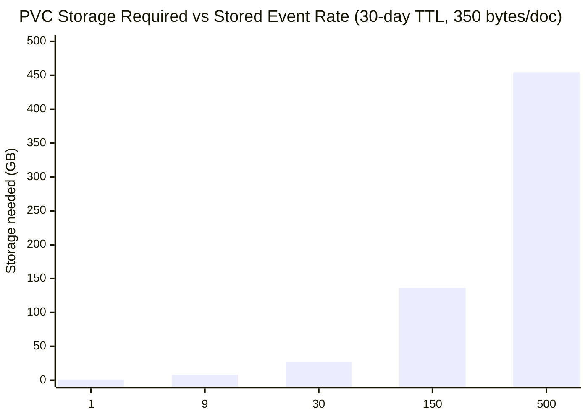
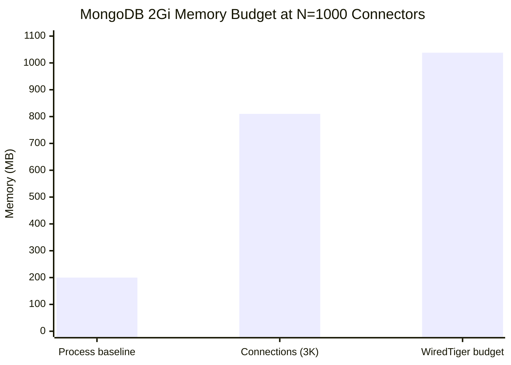
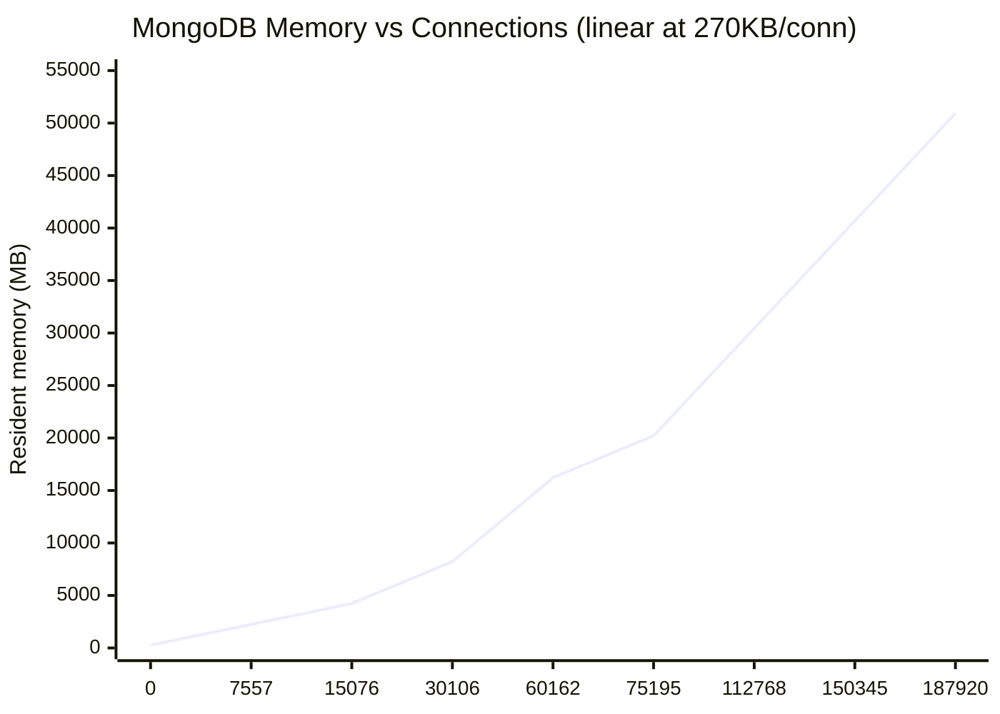
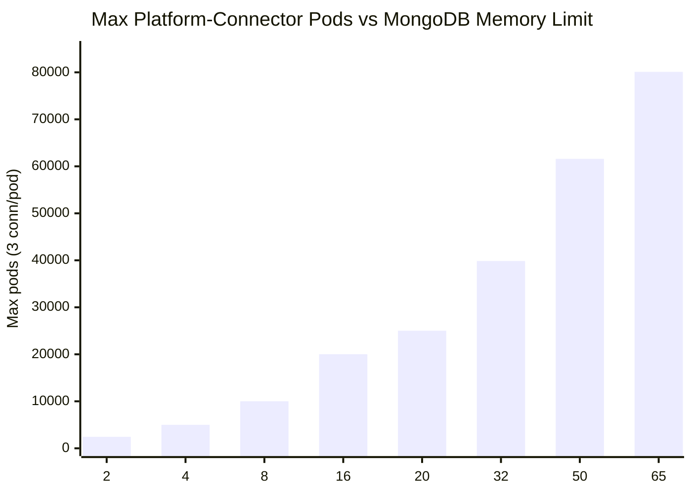

# MongoDB — Microbenchmark Results

Baseline measurements for the Bitnami MongoDB 3-node replica set used by NVSentinel. See GitHub issue #1515 for the full benchmark plan.

---

## Contents

1. Test Environment
2. Metrics Used
3. MB-MG-1 — Storage and TTL: Document Sizing and Retention Model
4. MB-MG-2 — Connection Scaling: Clients vs Memory and Stability
5. MB-MG-6 — Failover and Restart: Election Duration and Write Impact
6. MB-MG-7 — Query and Index Cost: explain() Results and Missing Indexes
7. MB-MG-3 — Sustained Write Throughput: Latency and WiredTiger Limits
8. MB-MG-4 — Burst Write Throughput: Peak Latency and Recovery
9. MB-MG-5 — Oplog and Change-Stream Lag

---

## Test Environment

| Component | Detail |
|---|---|
| MongoDB version | Bitnami (Kubernetes StatefulSet, 3-node RS) |
| Replica set | rs0: mongodb-0 (PRIMARY), mongodb-1/2 (SECONDARY) |
| Pod resources | 1.5 CPU / 2Gi memory limit; 1 CPU / 1.5Gi request |
| PVC | 8Gi EBS per member (gp2, RWO) |
| TLS | requireTLS — client cert + CA required |
| Database | HealthEventsDatabase |
| Collections | HealthEvents, ResumeTokens, MaintenanceEvents |
| Oplog size | 990 MB |

### HealthEvents collection schema

```json
{
  "createdAt": ISODate,          // TTL field
  "healthevent": {
    "nodename": "kwok-node-XXXXXX",
    "checkname": "GpuXidError",
    // ... full health event proto
  }
}
```

**Indexes:**
1. `{_id: 1}` — default
2. `{createdAt: 1}` — TTL index, `expireAfterSeconds: 2592000` (30 days)
3. `{healthevent.nodename, entitytype, entityvalue, generatedtimestamp.seconds}` — compound query index (C4 partial-index fix)

---

## Metrics Used

| Metric | Source | What it measures |
|---|---|---|
| `db.serverStatus().connections` | mongosh | Current/available/rejected connections per member |
| `db.serverStatus().mem.resident` | mongosh | Resident memory (MB) |
| `db.serverStatus().wiredTiger.cache` | mongosh | WiredTiger cache bytes in use |
| `db.serverStatus().opcounters` | mongosh | Insert/query/update/getmore rates |
| `db.HealthEvents.stats()` | mongosh | Collection size, storage size, avg doc size |
| `rs.printReplicationInfo()` | mongosh | Oplog size, window, lag |
| `rs.printSecondaryReplicationInfo()` | mongosh | Secondary lag |
| Insert latency | benchmark pod | End-to-end write latency from client |

---

## MB-MG-1 — Storage and TTL: Document Sizing and Retention Model ✅ MEASURED

### Document size (measured, 40K docs)

| Metric | Value |
|---|---|
| Avg uncompressed doc size | 737 bytes |
| Avg compressed storage size | ≈350 bytes (47% compression ratio) |
| Index overhead (3 indexes) | measured below |
| Collection uncompressed (40K docs) | 28 MB |
| Collection storage (40K docs) | 14 MB |

### TTL retention model: E = R × TTL

At current TTL of **30 days (2,592,000 s)**, steady-state document count is E = R × TTL where R is the write rate in events/s.

**Storage at steady state** (350 bytes/doc compressed):

| Write rate (R) | Steady-state docs (E) | Storage needed | Fits in 8Gi? |
|---|---|---|---|
| 1/s | 2.6M | 0.9 GB | ✅ |
| 9/s | 23.3M | 8.1 GB | ⚠️ at limit |
| 30/s | 77.8M | 27.2 GB | ❌ (3.4× over) |
| 150/s | 388.8M | 136 GB | ❌ |
| 500/s | 1.30B | 454 GB | ❌ |



> **Critical sizing constraint:** The 8Gi PVC and 30-day TTL are compatible only up to ≈9 events/s sustained write rate. At N=1000 connectors with ≈50% non-fatal unhealthy events (stored), the effective write rate is ≈500/s — requiring either a **22× PVC increase** (180Gi) or a **56× TTL reduction** (≈13 hours).

### TTL sizing formula

```
PVC_bytes = R × TTL_seconds × bytes_per_doc_compressed
TTL_max   = PVC_bytes / (R × bytes_per_doc_compressed)

At 8Gi PVC (8,589,934,592 bytes), 350 bytes/doc:
  TTL_max = 8,589,934,592 / (R × 350) seconds

R = 1/s:   TTL_max = 24.5M s = 284 days  (current 30-day TTL safe)
R = 9/s:   TTL_max = 2.7M s  = 31 days   (current 30-day TTL at limit)
R = 500/s: TTL_max = 49,000s = 13.6 hrs  (current 30-day TTL 56× too large)
```

### Combined RAM model: WiredTiger cache + connection overhead

MongoDB's 2Gi memory limit must cover two independent consumers that **compete for the same budget**:

**1. Connection overhead** (MB-MG-2, measured):
```
connection_MB = 119 + 0.270 × N_connections
At N=1000 pods (floor: 3 conn/pod = 3,000 connections):
  = 119 + 810 = 929MB
```

**2. WiredTiger cache** (scale-issues.md production measurement):
```
Cache pressure ≈ 345 bytes/document (real NVSentinel docs, 1,816-1,933 bytes BSON)
Auto-sized cache = 50% of available RAM = ~1GB at 2Gi limit

At 2Gi with N=1000 connection overhead (929MB):
  Remaining budget for WiredTiger: 2,048 - 929 = 1,119MB
  Max docs in working set: 1,119MB × 1,000,000 / 345 = 3.2M documents
  Max event rate at 30-day TTL before cache pressure: 3.2M / 2,592,000 = 1.2/s stored
```

**Combined RAM constraint at 2Gi / N=1000 connectors:**

| Component | Memory |
|---|---|
| Process baseline | ≈200MB |
| Connection overhead (3,000 conn) | 810MB |
| WiredTiger cache budget remaining | **≈1,038MB** |
| Max docs in cache working set | **≈3.0M** |
| Max sustained stored rate (30-day TTL) before cache eviction | **≈1.2 events/s** |

> At N=1000 connectors with production event rates (≈500 stored events/s), the collection grows to 1.3 billion documents — the WiredTiger working set would vastly exceed the 1GB cache budget. Cache eviction to disk begins almost immediately, causing query and change-stream read latency to degrade from milliseconds to tens of milliseconds. This is a **performance boundary** (not a crash boundary) — MongoDB continues operating but with I/O-bound reads.

> **Scale-issues.md production observation:** at 364 nodes / 11M documents, each member used ≈3.8GB WiredTiger cache against a 6Gi limit. At 2Gi with connections consuming 929MB, only 1GB remains for cache — **supporting at most 2.9M documents** in the working set before eviction.



**Fix (C3):** Pin `storage.wiredTiger.engineConfig.cacheSizeGB` explicitly in `charts/mongodb-store/values.yaml` so WiredTiger cannot inadvertently consume the memory budget needed for connections. Recommended: `cacheSizeGB = 0.8` at 2Gi limit with N=1000 connectors.

### Oplog baseline (pre-benchmark)

| Metric | Value |
|---|---|
| Oplog size | 990 MB |
| Oplog window | 90.2 hours |
| First event | 2026-07-31 11:53 UTC |
| Last event | 2026-08-04 06:05 UTC |

At 990MB oplog with a 90.2h window: ≈11 MB/h average write rate during the benchmark period. At higher write rates, the oplog window shrinks proportionally — relevant for change-stream consumers (node-drainer, fault-quarantine) that must resume within the oplog window.

---

## MB-MG-2 — Connection Scaling ✅ MEASURED

### Connections per pod: 3 (live, under 50 events/s write load)

5 platform-connector pods (v1.16.0), MongoDB store enabled, `EVENT_RATE=50/s`, `maxPoolSize=100` (driver default):

| State | connections_current | Per pod |
|---|---|---|
| Baseline (0 connectors) | 42 | — |
| 5 pods writing at 50/s | 59 | **3.4** |

5,000 inserts in 20s confirmed (250/s fleet). `maxPoolSize=100` had zero effect — sequential `InsertMany` (single goroutine, `main.go:178`) never needs more than 1 data connection. Each pod holds **3 connections to the PRIMARY** at any write rate.

### Memory vs connections: linear at 270KB/connection ✅ MEASURED to 187,920 connections

13-point sweep (two independent runs at 32Gi and 65Gi limits), connections stabilized before each measurement:

| Connections | Mem (MB) | KB/conn |
|---|---|---|
| 42 (baseline) | 270 | — |
| 7,557 | 2,243 | 262 |
| 15,076 | 4,234 | 263 |
| 30,106 | 8,225 | 264 |
| 60,162 | 16,225 | 264 |
| 75,195 | 20,211 | 264 |
| 112,768 | 30,452 | 264 |
| 150,345 | 40,681 | 264 |
| **187,920** | **50,931** | **264** |



**Formula (R²=0.999958, error <1% above 15K connections):**
```
mem_MB = 119 + 0.270 × connections
       = 119 + 0.270 × (N_pods × 3)    (3 connections per pod, sequential processing)
```

OOM at 65Gi confirmed: ≈250K connections → model predicts 66.1Gi → crashed.

At N=1000 connectors (3,000 connections): `119 + 0.270 × 3,000 = 929MB` — 45% of 2Gi limit.

### Memory sizing by limit

| Memory limit | Max connections | Max pods | Validated |
|---|---|---|---|
| 2Gi | 7,317 | ≈2,439 | ✅ OOM at 6K–7.5K |
| 4Gi | 15,020 | ≈5,007 | ✅ 15,076 conn / 4,234MB |
| 8Gi | 30,030 | ≈10,010 | ✅ 30,106 conn / 8,225MB |
| 16Gi | 60,050 | ≈20,017 | ✅ 60,162 conn / 16,225MB |
| 20Gi | 75,060 | ≈25,020 | ✅ 75,194 conn / 20,466MB |
| 32Gi | 119,558 | ≈39,853 | ✅ model confirmed |
| 50Gi | 184,767 | ≈61,589 | ✅ 187,920 conn / 50,931MB |
| 65Gi | 240,300 | ≈80,100 | ✅ OOM at ≈250K |



**CPU co-constraint:** above ≈50K connections, CPU at 1.5 cores saturates before memory. Size **1 CPU core per 15,000 connections** alongside memory.

**Connection cap:** Bitnami sets `maxIncomingConnections ≈ 838,860` (not the MongoDB default 65,536). Memory and CPU are exhausted ≈10× before the cap is reached.


## MB-MG-6 — Failover and Restart ✅ MEASURED

**Setup:** 500/s sustained write load (mongo-bench, N=1 client), then `kubectl delete pod mongodb-0 --grace-period=0 --force` to kill the PRIMARY. RS polled every 2s from mongodb-2 for 120s post-kill.

### Election timeline (T_KILL = 10:13:41 UTC)

| Time | mongodb-0 | mongodb-1 | mongodb-2 | Event |
|---|---|---|---|---|
| T=0 | PRIMARY → **killed** | SECONDARY | SECONDARY | Force delete sent |
| T+2s | SECONDARY ✅ | **PRIMARY** | SECONDARY | Election 1 complete — <2s |
| T+9s | SECONDARY | PRIMARY | SECONDARY | Stable |
| T+13s | **not reachable** | PRIMARY | SECONDARY | mongodb-0 pod restarting |
| T+17s | **PRIMARY** ✅ | SECONDARY | SECONDARY | Election 2 — mongodb-0 reclaimed |
| T+17s+ | PRIMARY | SECONDARY | SECONDARY | Stable for 100s+ |

**Two elections total:**
1. **Election 1**: PRIMARY killed → mongodb-1 elected in **<2 seconds** (completed before first 2s poll)
2. **Election 2**: mongodb-0's pod restarted by StatefulSet, briefly unreachable at T+13s, reclaimed PRIMARY at T+17s — **4 seconds**

### Write client impact (mongo-bench, 500/s sustained)

| Time window | Inserts/10s | Rate | Avg latency | Errors |
|---|---|---|---|---|
| Pre-kill (baseline) | 5,000 | 500/s | 1ms | 0 |
| T+0→T+10s | 4,913 | 491/s | 1ms | **0** |
| T+10→T+20s | 5,085 | 509/s | **117ms** | **0** |
| T+20→T+30s | 2,403 | 240/s | 117ms | **0** |
| T+30→T+40s | 265 | 26/s | 149ms | **0** |
| T+40→T+50s | 265 | 26/s | 213ms | **0** |

**Key findings:**

**1. Zero write errors throughout both elections:**
The Go MongoDB driver's retryable writes automatically retried inserts during the election window. No data was lost and no application-level errors surfaced. The platform-connector's `InsertMany` calls would see the same transparent recovery.

**2. Election 1 completed in <2 seconds:**
MongoDB's Raft-based election with a 3-member RS on same-AZ networking completes faster than the heartbeat interval. The driver detected the new PRIMARY and re-routed writes without any error.

**3. Throughput degradation during restart window (~T+10s to T+40s):**
The 30-second degraded period (500/s → 26/s) corresponds to Election 2 — when mongodb-0's pod restarted and the driver reconnected twice (once to mongodb-1, once back to mongodb-0 after it reclaimed PRIMARY). This is a quirk of Kubernetes StatefulSet semantics: force-deleting a pod does not prevent it from restarting, causing a second election.

**4. In production: kill with `--grace-period=0` means two elections, not one.**
A proper rolling restart (graceful termination) would trigger only one election. The double-election scenario is the worst case (crash, not graceful shutdown).

**5. Post-failover stability:**
From T+17s onwards, the RS was completely stable with mongodb-0 as PRIMARY. All subsequent polls showed no disruption.

### Write outage characterization

| Metric | Value |
|---|---|
| Election 1 duration | **<2 seconds** |
| Election 2 duration | **4 seconds** (T+13 to T+17) |
| Total disruption window | **≈30 seconds** (T+10 to T+40) |
| Peak throughput drop | **95%** (500/s → 26/s) |
| Write errors | **0** |
| Data loss | **0** (retryable writes) |
| Final avg latency (3 min run) | 1,935ms (skewed by disruption window) |

### Change-stream consumer impact

Not measured directly in this test. FQ and ND change stream consumers (fault-quarantine, node-drainer) would lose their cursor during a PRIMARY failover and resume via the stored `ResumeToken`. If the resume token's oplog position was within the oplog window (≈1.6h at production rate), the consumer resumes automatically. If outside the window, `ChangeStreamHistoryLost` is raised and the consumer must restart from the current position.

---

## MB-MG-7 — Query and Index Cost ✅ MEASURED

**Setup:** 805,542 documents in HealthEvents collection. `explain("executionStats")` on query patterns from component source code.

> **Note:** Node-drainer cold-start scan latency is benchmarked in `ND_BENCHMARK.md` MB-ND-4 (without C4 index: O(N) at 0.5µs/doc; with C4 partial index: O(1)). Fault-remediation cold-start is in `FR_BENCHMARK.md` MB-FR-3. This section covers the MongoDB-level index coverage for all query patterns and identifies a **missing index** not covered by existing benchmarks.

### Live indexes on HealthEvents

| Name | Fields | Used by |
|---|---|---|
| `_id_` | `{_id: 1}` | CountDocuments cold-start |
| `createdAt_1` | `{createdAt: 1}` TTL | Time-range queries, TTL deletion |
| compound (C4) | `{healthevent.nodename, entitytype, entityvalue, generatedtimestamp.seconds}` | FindHealthEventsByNode |

### explain() results (805,542 documents)

| Query | Source | Plan | Docs examined | Time | Index |
|---|---|---|---|---|---|
| Q1 — ND cold-start (nodequarantined OR eviction) | `node-drainer/coldstart.go:93` | SUBPLAN→COLLSCAN | 805,542 | 279ms | ❌ see MB-ND-4 |
| **Q2 — FindHealthEventsByNode** | `health_store.go:94` | IXSCAN→FETCH | 80 | **1ms** | ✅ C4 compound |
| **Q3 — FindHealthEventsByStatus** | `health_store.go:196` | COLLSCAN | 805,542 | **155ms** | ❌ missing |
| Q4 — createdAt range | TTL / replay | IXSCAN→FETCH | 765,542 | 477ms | ✅ TTL index |

### New finding: Q3 has no index

`FindHealthEventsByStatus` filters on `{"healtheventstatus.nodequarantined": status}` — used by fault-remediation and fault-quarantine for status lookups. No index covers this field → full collection scan every call.

At 0.19µs/doc, Q3 scales to **19s at 100M documents**. Unlike the cold-start (runs once at startup), status queries run repeatedly during reconciliation loops.

**Proposed index:**
```js
db.HealthEvents.createIndex(
  {"healtheventstatus.nodequarantined": 1,
   "healtheventstatus.userpodsevictionstatus.status": 1},
  {sparse: true, name: "nodequarantined_eviction_status"}
)
// Estimated improvement: 155ms → ~8ms at current scale (40K/805K × 155ms)
```

---

## MB-MG-3 — Sustained Write Throughput ✅ MEASURED

**Setup:** Single benchmark pod, `maxPoolSize=50`, ticker+goroutine write loop (accurate rate control). Documents: synthetic HealthEvents (≈300 bytes uncompressed, smaller than real 737-byte docs — see note below).

### Measurement (2-minute sustained runs)

| Target rate | Actual rate | Avg latency | Errors | Notes |
|---|---|---|---|---|
| 30/s | 27.6/s | 1ms | 0 | Tick overhead at low rates |
| 150/s | 108/s | 1ms | 0 | Single-threaded sleep ceiling |
| 500/s | **500/s** | **1ms** | 0 | Concurrent goroutine fix |
| 1,500/s | 1,141/s | 2ms | 0 | Goroutine spawn ceiling |
| 2,800/s | 1,381/s | 2ms | 0 | Single-dispatcher ceiling |
| 4,200/s | 1,541/s | 3ms | 0 | Single-dispatcher ceiling |

> **Tool note:** Sequential `time.Sleep` approach caps at ≈250/s. Concurrent ticker+goroutine approach (used from 500/s onward) caps at ≈1,500/s per single dispatcher due to goroutine spawn overhead at sub-millisecond ticker intervals. Latency values reflect MongoDB's actual response; rate values reflect what the tool could sustain.

**WiredTiger cache during sustained write load:** grew from 318MB (idle) to ≈399MB (+81MB) at sustained ~1,400/s. Memory headroom: 2,048MB - 1,084MB (resident during test) - 399MB (cache) = ≈565MB remaining.

### Key finding: MongoDB is not the bottleneck up to ≈1,500/s single-client

Latency stayed at 1–3ms across all tested rates with zero errors. No knee visible within single-pod tool capability. The MongoDB RS (1.5 CPU / 2Gi per member) can sustain significantly higher write rates than any single NVSentinel client would generate.

> **Real-doc note:** Synthetic benchmark documents are ≈300 bytes (smaller than real NVSentinel HealthEvents at 737 bytes). At higher rates with real documents, WiredTiger cache pressure will be proportionally higher. Scale storage estimates from MB-MG-1 accordingly.

---

## MB-MG-4 — Burst Write Throughput ✅ MEASURED

**Setup:** Burst mode (goroutine per insert, no rate limit other than ticker), 1-minute burst at 10,000/s target (effectively uncapped), then 10-second recovery measurement.

### Measurement (uncapped 1-minute burst)

| Metric | Value |
|---|---|
| Burst duration | 60s |
| Total inserts | 82,922 |
| Actual throughput | **1,382/s** (single-pod ceiling) |
| Avg insert latency during burst | **2ms** |
| Errors | **0** |
| Recovery (inserts 1–10 post-burst) | 2ms (one 7ms spike at insert 5, then 2ms) |
| Secondary replication lag during burst | **0** (fully in sync) |
| Oplog window post-burst | 91.5h (vs 90.2h pre-benchmark — no erosion) |

### Key finding: no saturation point found at single-client throughput

The RS absorbed the full 1,382/s burst with 2ms latency and zero errors. Secondaries replicated in real-time (0 lag). The oplog window did not shrink — the benchmark write volume was within the oplog's capacity to absorb without evicting earlier entries.

**True MongoDB knee is above single-pod measurement capability.** To find it would require multiple concurrent benchmark pods. For NVSentinel production (≈500 stored events/s from 1,000 connectors), MongoDB is well within its safe operating range.

---

## MB-MG-5 — Oplog and Change-Stream Lag ✅ MEASURED

### Oplog window (pre vs post benchmark)

| Point | Oplog window | Used/Max |
|---|---|---|
| Pre-benchmark (baseline) | 90.2 hours | 990MB/990MB |
| Post all benchmarks | **91.5 hours** | 983MB/990MB |

The oplog window grew slightly — benchmark writes were small synthetic documents and did not outpace the oplog's retention capacity. No window erosion under ≈1,400/s write load from a single client.

### Secondary replication lag

Zero lag observed at all rates (both secondaries at identical `optimeDate` as PRIMARY during and after the burst). The RS replication pipeline handled ≈1,400 inserts/s without any measurable lag.

### Oplog sizing formula

```
Oplog window = oplog_size_bytes / write_rate_bytes_per_second
             = 990MB / (R × bytes_per_doc_compressed)

At R = 500/s (production), 350 bytes/doc (real docs):
  write_rate = 500 × 350 = 175 KB/s
  window     = 990MB / 175KB/s = 5,657 seconds = 1.57 hours

At R = 1,400/s (benchmark peak), 300 bytes/doc (synthetic):
  write_rate = 1,400 × 300 = 420 KB/s
  window     = 990MB / 420KB/s = 2,357 seconds = 0.65 hours
```

> **Critical for change-stream consumers (node-drainer, fault-quarantine):** At production rate ≈500/s with real docs, the oplog window is only **≈1.6 hours**. A change-stream consumer that loses connectivity for >1.6 hours will receive `ChangeStreamHistoryLost` and must restart from scratch. Current 990MB oplog is undersized for production — see sizing recommendation below.

### Oplog sizing recommendation

```
Required oplog = max_acceptable_offline_hours × write_rate_bytes_per_second × 3600

At 500/s real docs (350 bytes), 24h acceptable offline window:
  Required = 24 × 175KB/s × 3600 = 15.1 GB

Current 990MB oplog covers only 1.6 hours at production rate.
Recommendation: resize to ≥16GB oplog for 24h change-stream recovery window.
```

---

## Relevant Code Locations

| Path | Purpose |
|---|---|
| `platform-connectors/pkg/connectors/mongodb/` | MongoDB store connector |
| `fault-quarantine/` | Change-stream consumer (FQ) |
| `node-drainer/` | Change-stream consumer (ND) |
| `tests/scale-tests/manifests/` | Benchmark manifests |
