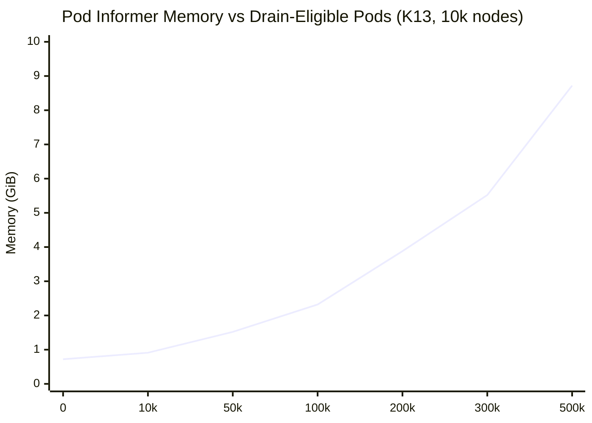
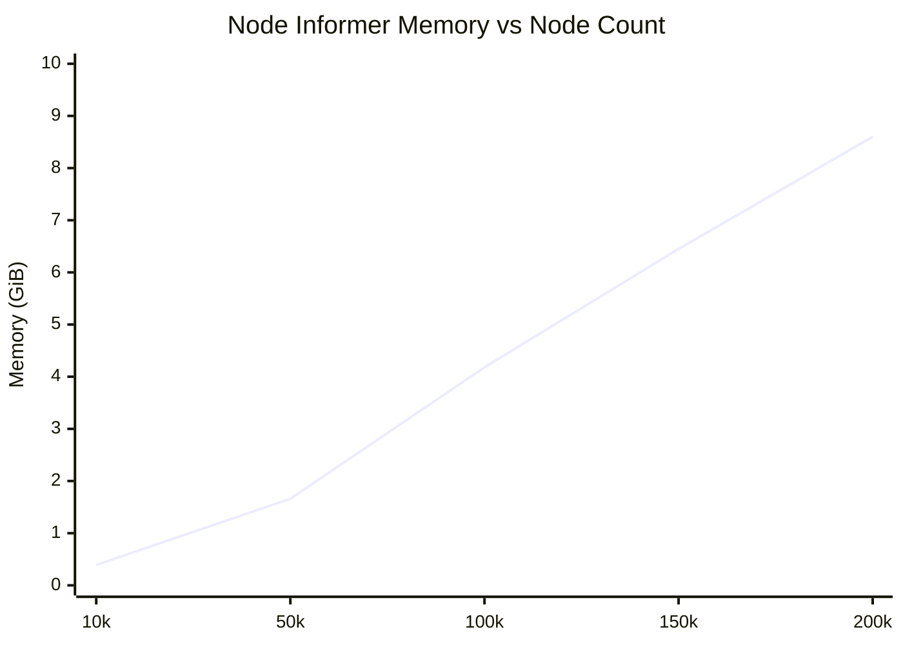
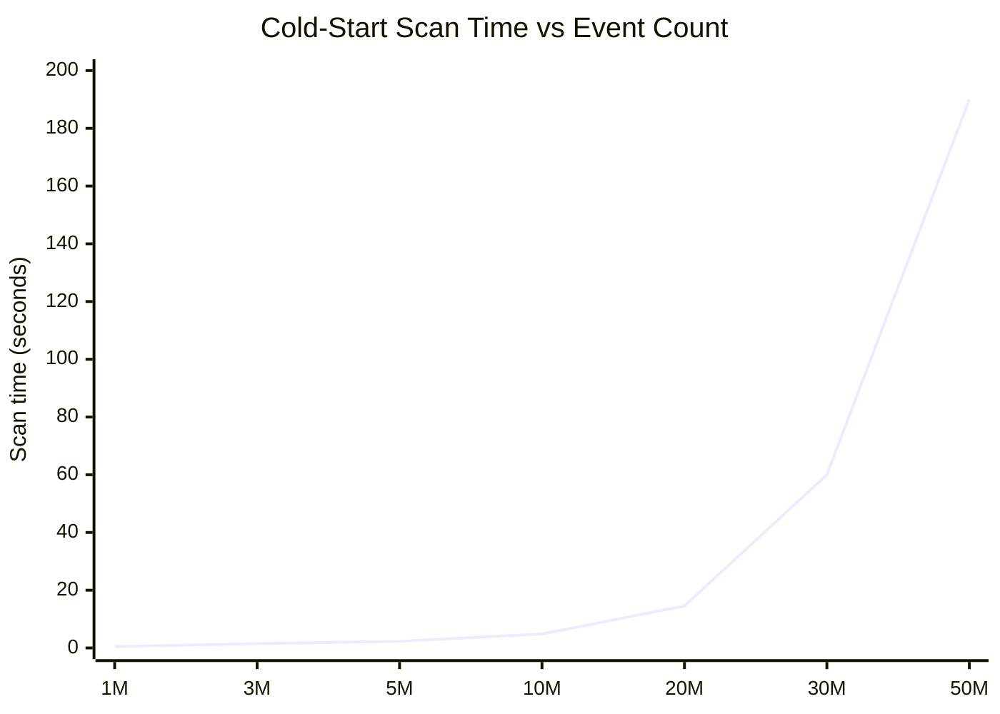
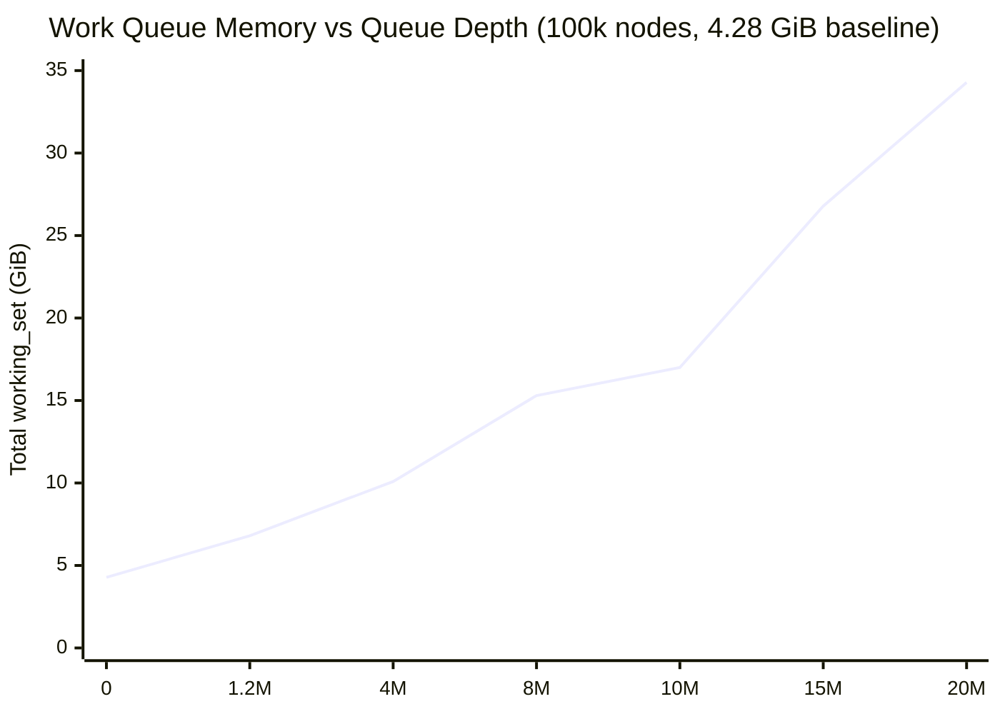
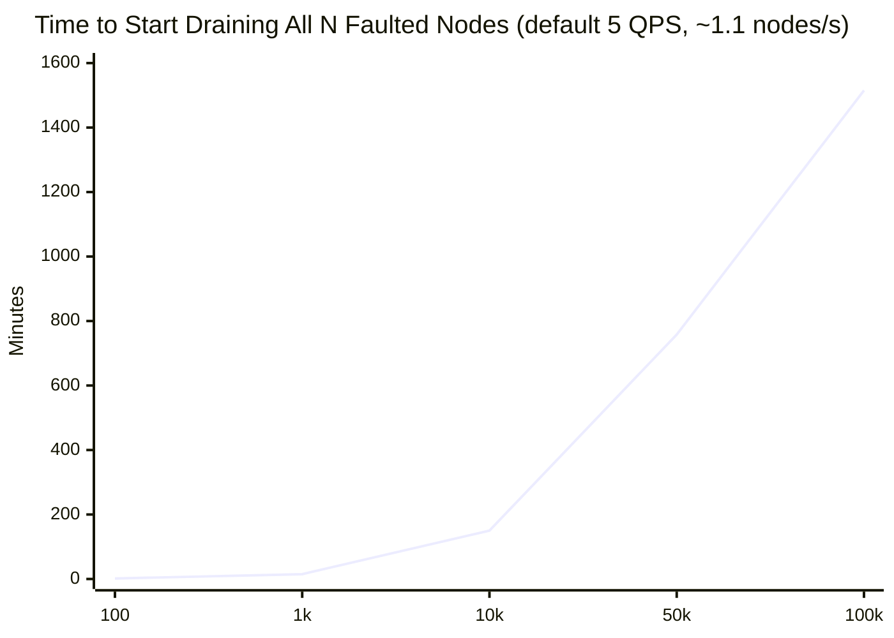
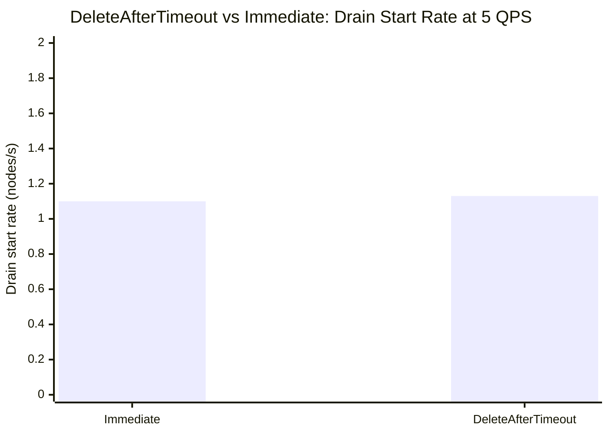
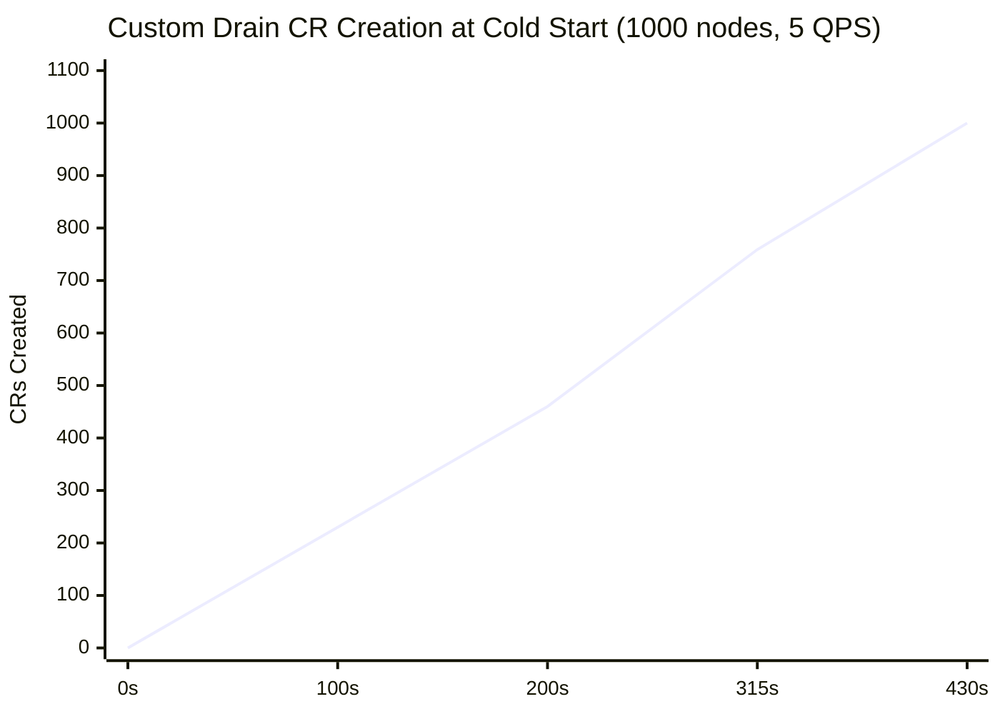

# Node-Drainer — Microbenchmark Results (v1.16.0)

Baseline measurements for `node-drainer` v1.16.0. See `docs/nvsentinel-at-scale/scale-issues.md` for the full scale analysis and action item list this benchmark validates.

---

## Contents

1. Test Environment
2. Metrics Used
3. MB-ND-1 — Memory: Pod Informer (K13)
4. MB-ND-2 — Memory: Node Informer
5. MB-ND-4 — Cold-Start MongoDB Scan Cost (C4)
6. MB-ND-5 — Work Queue Memory: Single-Node Event Storm
7. MB-ND-6 — CappedPositionLost: Node-Drainer Change Stream
   - Reproduction 1 — STORE_ONLY / STORE_AND_ANALYSE event burst
   - Reproduction 2 — EXECUTE_REMEDIATION event burst
8. MB-ND-7 — Drain Throughput (K2)
9. MB-ND-7b — Drain Throughput: DeleteAfterTimeout Mode
10. MB-ND-8 — Custom Drain Plugin: CR Creation Throughput and Polling Saturation
10. MB-ND-3 — Event Informer (Unnecessary — K4)
10. Configuration Guidance
11. Relevant Code Locations

---

## Test Environment


| Component              | Detail                                                                        |
| ---------------------- | ----------------------------------------------------------------------------- |
| Cluster                | AWS EKS us-east-1 (c8a.16xlarge worker nodes)                                 |
| node-drainer version   | v1.16.0                                                                       |
| node-drainer resources | `limits: 2 CPU / 32Gi RAM`                                                    |
| KWOK nodes             | 10,005 simulated nodes with real c8a.16xlarge status payloads (~13.4 KB each) |
| Pod size               | ~9.1 KB padded pods (matching benchmark pod size used in KOM sweep)           |
| Real worker nodes      | 6 schedulable nodes (32 CPU / 128 GiB each)                                   |


---

## Metrics Used


| Metric                               | What it measures                                                   |
| ------------------------------------ | ------------------------------------------------------------------ |
| `container_memory_working_set_bytes` | OS-level RSS — peak is what matters for limit sizing               |
| `go_memstats_heap_alloc_bytes`       | Live Go heap — lower noise than working_set for stable comparisons |


> **Note:** node-drainer metrics are served on port `:2112` but are not scraped by Prometheus in this cluster. Readings were taken directly from `kubectl proxy` → pod metrics endpoint.

---

## MB-ND-1 — Memory: Pod Informer (K13)

### How node-drainer caches pods

Node-drainer holds a **cluster-wide typed Pod informer** — it caches every pod in the cluster regardless of namespace, including DaemonSet-owned pods and system namespace pods that will never be drained. This is O(P) where P = total cluster pod count.

Unlike KOM (which uses `unstructured.Unstructured`), node-drainer uses typed Go structs for its pod informer. Typed structs are more memory-efficient because field names are in the struct definition rather than allocated per-object.

### K13 SetTransform implementation

K13 adds a `SetTransform` handler to the pod informer that intercepts each pod before it is stored in the cache. Pods excluded from drain decisions — those in system namespaces or owned by DaemonSets — are replaced with minimal identity-only stubs. The full pod object is never stored.

```
// Pseudocode for excludedPodTransform
func excludedPodTransform(systemNamespacesRegex) TransformFunc:
    return func(obj) -> (obj, error):
        pod = obj as Pod
        if pod.Namespace matches systemNamespacesRegex:
            return stub(pod)       // system namespace → stub
        if pod has OwnerRef{Kind=DaemonSet}:
            return stub(pod)       // DaemonSet-owned → stub
        return pod                 // drain-eligible → keep full

// Stub contains only cache identity fields; NodeName is cleared
// so excluded pods do not appear in node indexes
func stub(pod) -> Pod:
    return Pod{
        Name:            pod.Name,
        Namespace:       pod.Namespace,
        UID:             pod.UID,
        ResourceVersion: pod.ResourceVersion,
        // NodeName intentionally omitted
    }
```

The `systemNamespaces` config field (existing regex pattern) is passed to `NewInformers()` and used to build the transform. No new configuration is required — operators already set `systemNamespaces` in the node-drainer configmap.

### Measurement methodology

Eleven namespaces were created, each with ~9.1 KB pods:

- `nd-bench-0`: 1,000 pods
- `nd-bench-1` through `nd-bench-10`: 10,000 pods each

**All namespaces started in `systemNamespaces`** (all pods as stubs). Namespaces were progressively removed from the regex to expose them as full drain-eligible pods. After each configmap change, node-drainer was restarted and peak + settled `container_memory_working_set_bytes` was recorded.

```
# Configmap change to expose nd-bench-1 (move from stubs to full objects):
systemNamespaces = "^(benchmark|nd-bench-0|nd-bench-2|...|nd-bench-10|...)$"
                                        ↑ nd-bench-1 removed → becomes full pods
```

The `benchmark` namespace (100k pods) was kept as stubs throughout the nd-bench sweep, then exposed separately for the 200k data point.

### Pod informer memory sweep (K13 enabled, 10k nodes)


| Full pods    | Stub pods | Peak  | Settled | Δ settled vs baseline |
| ------------ | --------- | ----- | ------- | --------------------- |
| 0 (baseline) | ~201k     | 1.4G  | 734M    | —                     |
| 10,000       | ~191k     | 1.75G | 936M    | +202M                 |
| 50,000       | ~151k     | 2.85G | 1.56G   | +826M                 |
| 100,000      | ~101k     | 3.23G | 2.37G   | +1.64G                |
| 200,000      | ~1k       | 5.33G | 3.97G   | +3.24G                |


Rule of thumb: **~16 MB per 1,000 drain-eligible pods** (at ~9.1 KB/pod, typed Go informer with K13 transform active).



> Measured: 0–200k pods. 300k–500k extrapolated at ~16 MB/1k pods.

> **Baseline breakdown (734M settled):** Node informer for 10k nodes + Event informer + ~201k pod stubs + Go runtime. Pod stubs contribute negligibly — the dominant cost at baseline is the node informer.

### K13 impact: before vs after


| Config                             | Pods in cache     | Settled memory                   |
| ---------------------------------- | ----------------- | -------------------------------- |
| Before K13 (all full)              | 201k full pods    | ~2.37G + baseline (extrapolated) |
| After K13 (all stubs)              | ~201k stubs       | **734M**                         |
| After K13 (100k full + 101k stubs) | 100k full + stubs | **2.37G**                        |


**Before K13 baseline:** node-drainer with all pods as full objects settled at **~2.2G** for 100k benchmark pods + 10k nodes (measured with v1.16.0 before K13 was deployed).

The K13 transform reduced memory from ~2.2G to ~734M (66% reduction) for the equivalent configuration where all benchmark/nd-bench pods are system-namespace stubs.

### Comparison: typed vs unstructured informer


|                       | node-drainer (typed) | KOM (unstructured) |
| --------------------- | -------------------- | ------------------ |
| Per 1k pods (~9.1 KB) | ~16 MB               | ~110 MB            |
| Ratio                 | 1×                   | **~7× more**       |


Node-drainer's typed Pod informer is ~7× more memory efficient than KOM's unstructured informer for the same pod size. KOM's higher cost is inherent to its CEL generic policy model.

---

## MB-ND-2 — Memory: Node Informer ✅ MEASURED

Node-drainer holds a **typed Node informer** — same structure as fault-quarantine's node informer. Both use `informerFactory.Core().V1().Nodes().Informer()` with typed Go structs against the same Node objects.

### Measurement

Measured directly on node-drainer with 0 drain-eligible pods (all pods as stubs via K13), varying KWOK node count. Settled `container_memory_working_set_bytes` recorded after GC stabilized.


| Nodes   | Settled | Δ from prev                        |
| ------- | ------- | ---------------------------------- |
| ~9,500  | ~400M   | —                                  |
| ~49,500 | ~1.7G   | +1.3G for 40k nodes (~32.5 MB/1k)  |
| ~99,500 | ~4.28G  | +2.58G for 50k nodes (~51.6 MB/1k) |


Rule of thumb: **~43 MB per 1,000 nodes** for node-drainer total (node informer + Event informer + runtime).



> Measured: 10k–100k nodes. 150k–200k extrapolated at ~43 MB/1k nodes.

**Comparison with FQ (node informer only, no Event informer):**


| Nodes    | node-drainer settled | FQ settled | Δ (Event informer overhead) |
| -------- | -------------------- | ---------- | --------------------------- |
| ~10,000  | ~400M                | ~379M      | ~21M                        |
| ~50,000  | ~1.7G                | ~1.45G     | ~250M                       |
| ~100,000 | ~4.28G               | ~3.70G     | ~580M                       |


The ~580M delta at 100k nodes is the Event informer overhead — which K4 (replacing with `EventRecorder`) would eliminate entirely.

---

## MB-ND-4 — Cold-Start MongoDB Scan Cost ✅ MEASURED

### How it works

On startup, node-drainer runs `coldstart.Handle()` which scans the **entire** HealthEvents collection looking for in-progress drains and unprocessed quarantine events:

```
filter: {$or: [
  {healtheventstatus.userpodsevictionstatus.status: "InProgress"},
  {healtheventstatus.nodequarantined: "Quarantined",   evictionStatus: {$in: ["", "NotStarted"]}},
  {healtheventstatus.nodequarantined: "AlreadyQuarantined", evictionStatus: {$in: ["", "NotStarted"]}},
]}
```

No secondary indexes exist on these fields — MongoDB performs a full collection scan. Cost is **O(N)** where N = total retained HealthEvents = R × TTL.

### Measurement

Injected STORE_ONLY noise events (`processingstrategy=2`, `nodequarantined=""`) as haystack. Measured time from `"Handling cold start"` log to `"Processing cold start batch"` log.


| N (total events) | Cold-start scan | µs/event                 |
| ---------------- | --------------- | ------------------------ |
| 4,310 (baseline) | 0.017s          | —                        |
| 1,000,000        | 0.503s          | ~0.50                    |
| 3,000,000        | 1.501s          | ~0.50                    |
| 5,000,000        | 2.320s          | ~0.46                    |
| 10,000,000       | 4.825s          | ~0.48                    |
| 20,000,000       | 14.556s         | ~0.73 (disk reads begin) |


Scan rate is **~0.5 µs/event** up to ~10M events (fits in WiredTiger RAM cache). Above that, cache misses cause disk reads and the rate degrades.



> Measured: 1M–20M events. 30M–50M extrapolated (disk-read regime, ~3.8 µs/event). At 20 events/s storm rate with 30-day TTL: ~52M events → ~190s cold-start. With C4 partial indexes: ~0.010s at any scale.

### Production impact

Using the measured production rate of **8.9 events/s** and default **30-day TTL**:

```
E = 8.9 × 30 × 86400 = ~23M events → cold-start ≈ 17 seconds per restart
```

At fault-storm rates:


| Event rate                  | Events after 30d | Cold-start |
| --------------------------- | ---------------- | ---------- |
| 1/s (quiet)                 | 2.6M             | ~1.5s      |
| 8.9/s (measured production) | 23M              | **~17s**   |
| 100/s (storm)               | 259M             | **~190s**  |


Every node-drainer restart (rolling update, OOM, eviction) incurs this cost. At storm rates, cold-start can take **3+ minutes**.

### Fix (C4) — Partial indexes ✅ IMPLEMENTED AND MEASURED

A standard compound index on `(nodequarantined, status)` provides no benefit because the vast majority of events have `nodequarantined=""` — MongoDB still scans all N entries in the index. The correct fix is **partial indexes** that only index the rare documents matching the cold-start conditions:

```javascript
// Only indexes documents where a drain is in-progress
db.HealthEvents.createIndex(
  {"healtheventstatus.nodequarantined": 1},
  {partialFilterExpression: {
    "healtheventstatus.nodequarantined": {$in: ["Quarantined", "AlreadyQuarantined"]}
  }}
);

// Only indexes documents with active eviction
db.HealthEvents.createIndex(
  {"healtheventstatus.userpodsevictionstatus.status": 1},
  {partialFilterExpression: {
    "healtheventstatus.userpodsevictionstatus.status": "InProgress"
  }}
);
```

With partial indexes, MongoDB skips all noise events and jumps directly to the handful of matching documents. Cold-start becomes effectively **O(1)** regardless of collection size.

**Before vs after at N=20M events:**


| N (events) | Without index | With partial indexes | Improvement |
| ---------- | ------------- | -------------------- | ----------- |
| 20,000,000 | 14.556s       | **0.010s**           | **1,456×**  |


`coldStartAfter` in the resume-control ConfigMap is a workaround, not a fix — it requires manual operator updates and risks missing legitimate in-progress events if set incorrectly.

---

## MB-ND-5 — Work Queue Memory: Single-Node Event Storm ✅ MEASURED

### How it works

Node-drainer holds a `TypedRateLimitingQueue[NodeEvent]` (client-go workqueue). Every health event from the MongoDB change stream or cold-start replay is enqueued as a `NodeEvent` struct:

```go
type NodeEvent struct {
    NodeName         string       // ~30 bytes
    EventID          string       // ~24 bytes (MongoDB ObjectID as hex)
    DocumentID       interface{}  // ~28 bytes (ObjectID + interface overhead)
    HealthEventStore interface{}  // shared pointer, ~16 bytes
    Database         interface{}  // shared pointer, ~16 bytes
}
```

There is **no per-node event cap** — every unique event gets its own `NodeEvent` in the queue regardless of how many events have already been queued for the same node. In `AllowCompletion` mode, events that fail (drain waiting for pods) are re-queued with exponential backoff, but deduplication by `NodeName:EventID` prevents duplicates. The queue depth grows monotonically as new events arrive for a draining node.

### Measurement setup

- **Node:** `kwok-node-090600` with 50 KWOK pods in `drain-test` namespace
- **Drain mode:** `AllowCompletion` — KWOK pods never complete → drain permanently blocked
- **Cluster:** 100k KWOK nodes (node informer baseline = 4.28 GiB)
- **Events:** XID 95 health events with `nodequarantined=Quarantined`, `evictionStatus=InProgress`, injected directly into MongoDB and replayed via cold-start + change stream
- **Metric:** `container_memory_working_set_bytes{container="node-drainer"}`

### Results


| Queue depth (health events) | Total `working_set` | Δ from node baseline | KB/event |
| --------------------------- | ------------------- | -------------------- | -------- |
| 0 (node informer only)      | **4.28 GiB**        | —                    | —        |
| 1,200,000                   | **6.8 GiB**         | +2.52 GiB            | ~2.1     |
| 4,000,000                   | **10.09 GiB**       | +5.81 GiB            | ~1.45    |
| 8,000,000                   | **15.3 GiB**        | +11.02 GiB           | ~1.38    |
| 10,000,000                  | **17 GiB**          | +12.72 GiB           | ~1.27    |


The per-event cost converges to **~1.3–1.5 KB/event** at production scale (Go's allocator becomes more efficient with larger structures).



> Measured: 0–10M events. 15M–20M extrapolated at ~1.5 KB/event. OOM thresholds at 100k nodes: **8 Gi limit → OOM at ~2.5M events**, **16 Gi → ~7.9M**, **32 Gi → ~18.8M**.

### Sizing formula

```
ws ≈ node_informer(N) + Q × 1.5 KB

  node_informer(N) = N/1000 × 43 MB   (from MB-ND-2)
  Q                = events in work queue
```

### OOM thresholds (100k nodes, 4.28 GiB node informer)


| Memory limit | Headroom for queue | Max events before OOM |
| ------------ | ------------------ | --------------------- |
| 8 Gi         | ~3.72 GiB          | ~2.5M events          |
| 16 Gi        | ~11.72 GiB         | ~7.9M events          |
| 32 Gi        | ~27.72 GiB         | ~18.8M events         |


A single GPU node generating XID 95 at 1 event/s for 16 hours = **57,600 events** — well within safe limits. But a burst of 16M events (noisy GPU failing rapidly) pushes to **~28 GiB** queue memory. With 100k node informer overhead, this exceeds any limit below 32 Gi.

### Production impact

Without a per-node queue cap:

1. **OOM:** A single noisy node can fill all available memory regardless of cluster health
2. **Detection latency:** With 10M events in queue and serial processing, new fatal events for other nodes wait behind the backlog (see `node_drainer_queue_depth`)

### Fix

Add a per-node event cap in the workqueue (e.g., max 1,000 pending events per node). Additional events for a node already at the cap should be dropped or sampled. This bounds both memory and detection latency independent of how many events a single node generates.

---

## MB-ND-6 — CappedPositionLost: Node-Drainer Change Stream ✅ REPRODUCED

Node-drainer uses `BuildNodeQuarantineStatusPipeline()` — a **fundamentally different** filter from FQ:

```go
// Only watches UPDATE operations where FQ sets nodequarantined status
operationType: "update"
$or: [
  nodequarantined == "Quarantined",
  nodequarantined == "AlreadyQuarantined",
  nodequarantined == "UnQuarantined",
  nodequarantined == "Cancelled",
]
```

This makes node-drainer **more vulnerable** to CappedPositionLost than FQ:

- **FQ cursor** advances at FQ's change stream read rate (fast, serial but continuous)
- **Node-drainer cursor** resume token is only saved when FQ UPDATES a document with quarantine status — bounded by FQ's cordon rate (~2.5 updates/s)

### Why node-drainer's token goes stale

MongoDB change streams internally advance the cursor position through all oplog entries, but node-drainer only **stores** a resume token to the `ResumeTokens` collection when it receives a matching event (an UPDATE with `nodequarantined` in the watched set). Between consecutive matching events, the stored token does not move.

If the oplog cycles past the stored token's position before the next matching event arrives, the token becomes unrecoverable — CappedPositionLost.

**FQ is less vulnerable** because it watches INSERTs (every new health event), so its token advances with every incoming event regardless of type. **Node-drainer is more vulnerable** because it only advances its token when FQ quarantines a node, which is gated by FQ's cordon rate.

---

### Reproduction 1 — STORE_ONLY / STORE_AND_ANALYSE event burst ✅ REPRODUCED

**Setup:**

- Fresh MongoDB (990 MB oplog, empty HealthEvents collection after PVC recreation)
- node-drainer started fresh against empty collection (change stream at "now")
- 2 documents inserted and updated to `nodequarantined=Quarantined` (anchoring cursor; cold-start processing confirmed these events)
- STORE_ONLY events flooded at ~50 workers → ~5M+ events injected total
  - STORE_ONLY events have `processingstrategy=0` — FQ passes them through without quarantining
  - No matching UPDATEs → node-drainer's resume token only saved once (at the 2 initial quarantine events)
  - 5M+ INSERTs × ~800 bytes/event ≈ 4 GB oplog writes → oplog (990 MB) cycled ~4×
- MongoDB went to primary re-election (`NotPrimaryOrSecondary: node is recovering`) during the flood
- node-drainer crashed: `"Failed to watch change stream ... node is recovering"`

**Result on restart (2026-07-30T10:03:13Z):**

```
{"msg":"ResumeToken found","token":"MQAAAAJfZGF0YQAhAAAA..."}
{"msg":"Resume token is unrecoverable, deleting token and starting fresh","client":"node-drainer"}
{"msg":"Successfully recovered from stale resume token, stream started fresh","client":"node-drainer"}
```

**Confirmed CappedPositionLost.** The stored resume token (from the 2 initial quarantine events at ~10:03:07–08 UTC) was only ~5–6 seconds old when the flood overwrote that oplog position.

**Recovery:** node-drainer started fresh (no token) then ran cold-start query, found the 2 Quarantined events via C4 partial index, and re-queued them correctly. The C4 fix mitigates the cold-start penalty but does not prevent the event blackout window during the flood.

**Event blackout window:** Any quarantine events that occur while the oplog has cycled past the last token AND before the next restart+cold-start complete are not delivered via change stream and must be recovered via cold-start. This window is bounded by the time between token-saving events (quarantine UPDATEs).

---

### Reproduction 2 — EXECUTE_REMEDIATION event burst ✅ REPRODUCED

**Setup:**
- Fresh MongoDB (990 MB oplog, empty HealthEvents collection after full PVC recreation)
- 1 EXECUTE_REMEDIATION event inserted (`processingstrategy=2`) and updated to `nodequarantined=Quarantined` — anchoring node-drainer's resume token
- Token confirmed saved in `ResumeTokens` collection pointing to that UPDATE
- EXECUTE_REMEDIATION flood: 50 workers × 500 batch, `processingstrategy=2`, no nodequarantined UPDATE (simulates events arriving faster than FQ can quarantine)
  - ~33,000 events/s → 1.75M events injected
  - Oplog write rate: ~26 MB/s → 990 MB oplog cycled in ~38 seconds (~1.4× total)
  - Token position overwritten

**Result on restart (2026-07-30T12:05:34Z):**
```
{"msg":"ResumeToken found","token":"zQAAAAJfZGF0YQC9AAAA..."}
{"msg":"Resume token is unrecoverable, deleting token and starting fresh","client":"node-drainer"}
{"msg":"Successfully recovered from stale resume token, stream started fresh","client":"node-drainer"}
{"msg":"Processing cold start batch","count":1}
```

**Confirmed CappedPositionLost.** The EXECUTE_REMEDIATION flood overran the oplog. Node-drainer recovered via cold start, finding the 1 Quarantined event via C4 partial index.

**Why ND is more vulnerable than FQ for EXECUTE_REMEDIATION:**

| | FQ | node-drainer |
|---|---|---|
| Change stream filter | INSERT with `processingstrategy=2` | UPDATE with `nodequarantined` ∈ {Quarantined, AlreadyQuarantined, …} |
| Token update rate | Every new EXECUTE_REMEDIATION event | Only when FQ quarantines a node (~2.5/s) |
| Token age during storm | Milliseconds | Seconds to minutes |
| CappedPositionLost risk | Lower (token stays current) | Higher (token falls behind injection rate) |

FQ's cursor advances with every incoming event at the full injection rate. ND's token only advances when FQ quarantines a node. Under sustained EXECUTE_REMEDIATION flood where events arrive faster than FQ processes them, ND's token ages while FQ's does not.

---

## MB-ND-7 — Drain Throughput (K2) ✅ MEASURED

### How node-drainer uses the Kubernetes API per drain

Pod visibility (which pods are on a node) comes from the **pod informer cache** — a local lookup, no API call. The QPS rate limiter only applies to direct API calls through the clientset.

For each node entering the drain queue, node-drainer makes the following direct API calls:

1. **PATCH node** — set `nvsentinel-state=draining` label
2. **DELETE pod/eviction** — one call per drain-eligible pod (N pods on the node)
3. **LIST events** — check existing K8s Events for deduplication (K4 issue)
4. **CREATE/UPDATE event** — write drain Event for the node

With 1 pod per node in `Immediate` mode, that is approximately **4 API calls per node**. node-drainer inherits client-go's default **QPS=5, Burst=10** with no configuration knob exposed.

```
Theoretical max drain rate = QPS / calls_per_node = 5 / 4 ≈ 1.25 nodes/s
```

> **Note:** Items 3–4 are the K4 issue (unnecessary Event informer + LIST-and-write). They consume the same QPS budget as the actual drain calls. Fixing K4 alone (replacing with `EventRecorder`) reduces calls per node from ~4 to ~2, doubling throughput without changing QPS settings.

### Measurement

**Setup:**
- 1,000 KWOK nodes (kwok-node-090495 → kwok-node-091495)
- 1 `pause` pod per node in `k2-test` namespace (`evictionMode = Immediate`)
- All 1,000 health events pre-quarantined in MongoDB → node-drainer cold-started with all 1,000 in queue simultaneously
- Measured time from node-drainer startup to nodes receiving `nvsentinel-state=draining` label
- Cluster: AWS EKS us-east-1, 100k KWOK nodes

**Result:**

| Nodes labeled `draining` | Elapsed | Observed rate |
|---|---|---|
| 780 / 1,000 | 695s | **~1.1 nodes/s** |

Throughput is consistent with the client-go rate limiter ceiling at 5 QPS / ~3 calls per node (≈1.67 nodes/s theoretical). The ~0.5 nodes/s gap reflects additional overhead: periodic pod status polls, MongoDB resume token writes, and retries.

**Comparison with fault-quarantine (MB-FQ-2):**

| Component | API calls/node | Default QPS | Observed rate |
|---|---|---|---|
| fault-quarantine | 2 (GET + full UPDATE for cordon) | 5 / 10 | 2.4 nodes/s |
| node-drainer | ~4 (label PATCH + eviction + event LIST + event write) | 5 / 10 | ~1.1 nodes/s |

node-drainer is **~2× slower** than FQ per node. The difference is the K4 event LIST+write overhead consuming 2 of the 4 API calls per drain. At 1,000 simultaneously faulted nodes, full drain initiation takes **~15 minutes** vs FQ's 7 minutes to cordon.

### Production impact

At 1.1 nodes/s, the first node begins draining within seconds of cold start (burst allows 10 immediate API calls). But for large simultaneous fault events:

| Faulted nodes | Time to start draining all nodes |
|---|---|
| 100 | ~90s |
| 1,000 | ~15 min |
| 10,000 | ~2.5 hours |

During this window, newly detected faults for other nodes queue behind the backlog. Drain initiation latency grows linearly with batch size.



> Measured: 100–1k nodes. 10k–100k extrapolated at 1.1 nodes/s. A 100k-node fleet fault takes **~25 hours** to begin draining all nodes at default QPS.

### Fix (K2)

Expose `qps` and `burst` as Helm values for node-drainer's Kubernetes client. Size from an explicit fleet drain budget:

```
"drain 1,000 nodes within 60 seconds" → QPS = 1000 × 3 / 60 = 50
```

**File:** node-drainer's client-go initialization (parallel to `fault-quarantine/pkg/informer/k8s_client.go:61-68`).

---

## MB-ND-7b — Drain Throughput: DeleteAfterTimeout Mode ✅ MEASURED

### How DeleteAfterTimeout differs from Immediate

| | Immediate | DeleteAfterTimeout |
|---|---|---|
| Pod eviction | Eviction API call per pod | None — waits for natural completion |
| Pod listing | Informer cache (no API call) | Informer cache (no API call) |
| Initial drain API calls | ~4 (label PATCH + eviction + event LIST + event write) | ~2 (label PATCH + K8s Event create) |
| Re-check API calls | None (drain completes immediately) | 1-2 K8s Event update calls per node per interval |
| Re-check interval | N/A | 10s → 20s → 40s → ... → 2min (exponential backoff) |
| Drain completes at | Pod deleted | `event.createdAt + deleteAfterTimeoutMinutes` |

Because DeleteAfterTimeout skips the eviction API call, drain START rate is faster than Immediate mode. But while drains are pending (waiting for the timeout), periodic K8s Event writes compete with new drain starts for the same 5 QPS budget, causing throughput degradation.

### Measurement

**Setup:** 750 k2-test KWOK nodes (1 Running pod each, `k2-test` namespace → `DeleteAfterTimeout` via `*` wildcard, `deleteAfterTimeoutMinutes=4320`); 750 Quarantined health events cold-started into node-drainer at T=0. Nodes uncordoned, no stale labels.

**Results (clean run — FQ disabled, no interference, using `node_drainer_waiting_for_timeout` metric):**

| Metric | Value |
|---|---|
| Nodes | 750 |
| Time to all 750 in `waiting_for_timeout` | **663s** |
| Average drain start rate | **1.13 nodes/s** |
| Events received | 1,255 (includes re-check retries) |
| Queue depth at completion | 700 (all nodes in 10s-2min re-check backoff cycle) |



### Key finding: no meaningful throughput difference

The hypothesis that DeleteAfterTimeout would be faster (no eviction API call → fewer calls per drain start) is **not confirmed**. Both modes achieve ~1.1 nodes/s at default 5 QPS because the K4 overhead (K8s Event LIST + write, 2 extra API calls) dominates equally in both.

DeleteAfterTimeout per drain start: ~4 calls (label PATCH + Event create + 2 more from K4 redundancy)
Immediate per drain start: ~4 calls (label PATCH + eviction + Event LIST + Event write)

Without the K4 fix, both modes hit the same effective ceiling.

### Comparison: Immediate vs DeleteAfterTimeout

| | Immediate mode | DeleteAfterTimeout mode |
|---|---|---|
| Drain start rate | **1.1 nodes/s** | **1.13 nodes/s** (~same) |
| Drain completion | When pod is deleted (seconds) | After `deleteAfterTimeoutMinutes` (3 days by default) |
| Re-check overhead | None | 1-2 Event updates per node per 10s-2min interval |
| Queue depth after all started | 0 (done) | N (all waiting, re-checking) |
| Production risk | None specific | Re-check writes accumulate; at scale may compete with new drain starts |

### QPS Sizing

Since both modes have the same effective drain start rate (~1.1 nodes/s at 5 QPS), the K2 sizing formula from MB-ND-7 applies to both:

```
QPS = desired_drain_start_rate × ~4 calls/node

Example: drain 1,000 nodes within 10 minutes
  QPS = (1000/600) × 4 = 6.7 → recommend 10 QPS with headroom
```

For DeleteAfterTimeout at very large scale (thousands of concurrent draining nodes), add re-check budget:
```
QPS_extra = concurrent_draining_nodes × 2 / avg_recheck_interval_s
          = 1000 × 2 / 120s = 16.7 additional calls/s
          → At 1000+ concurrent drains: raise QPS by ~17 above the start-rate budget
```

**File:** node-drainer's client-go initialization; `pkg/informers/informers.go:697-771` (`DeletePodsAfterTimeout`); `pkg/queue/queue.go:42` (exponential backoff 10s→2min).

---

## MB-ND-8 — Custom Drain Plugin: CR Creation Throughput and Polling Saturation ✅ MEASURED

### How the custom drain plugin works

When `customDrain.enabled=true`, node-drainer replaces direct pod eviction with a CR-based delegation pattern:

1. For each draining node: render a Go template → `Create` a DrainRequest CR
2. Poll CR status every **30s** (hard-coded): `List` CRs for node + `Get` CR by name = 2 API calls
3. When the external operator sets `status.conditions[type=Complete, status=True]` → drain complete → `Delete` CR

All CR operations use a **separate `dynamic.Interface` client** with its own independent 5 QPS / 10 burst rate limiter (not shared with the main typed clientset).

### API calls per node

| Phase | Calls | Client |
|---|---|---|
| CR creation | `List` (check if exists) + `Create` = 2 calls | dynamic, hits API server |
| CR polling (every 30s) | `List` + `Get` = 2 calls per cycle | dynamic, hits API server |
| CR cleanup | `Delete` = 1 call | dynamic, hits API server |

> Pod listing (to populate `podsToDrain`) uses the pod **informer cache** — no API call.

### Measurement: Cold-Start CR Creation Throughput

**Setup:** 1,000 nodes quarantined in MongoDB; node-drainer cold-started with all 1,000 queued simultaneously; no external operator (CRs never complete → polling runs indefinitely).

**Result:**

```
Observed rate: 2.3 CRs/s (flat, rate-limiter ceiling)
Theoretical:   5 QPS / 2 calls per node = 2.5 CRs/s
Time to create CRs for 1,000 nodes: ~430s (~7 minutes)
```



> Measured: 0–759 CRs (creation stalled at saturation, see below). 759–1000 extrapolated.

### Measurement: Polling Saturation Point

Every active DrainRequest CR is polled every 30s — 2 API calls per poll (List + Get). These poll calls go through the same 5 QPS dynamic client rate limiter as CR creates. As more CRs accumulate, poll traffic grows, eating into the rate limiter budget. At some point the poll rate consumes the entire 5 QPS, leaving **zero budget for new CR creates**. New drain requests queue behind poll traffic and never get scheduled until existing drains complete and their poll traffic disappears.

**Observed:** CR creation stalled permanently at **759 CRs** (~315s into the run). The remaining 241 nodes never got CRs created — they were stuck indefinitely behind poll traffic.

**Why 759?** CR creation and poll arrival are linked — polls arrive at the same rate CRs were created:

```
Poll call rate = (CRs created / time taken) × 2 calls per poll
              = (759 / 315s) × 2 = 4.8 calls/s ≈ 5 QPS → fully saturated
```

This means the saturation ceiling is self-reinforcing: the faster you create CRs (higher QPS), the faster polls accumulate, and the ceiling stays proportional to QPS regardless of the absolute number of drains.

```
Saturation ceiling = QPS × poll_interval / (2 calls per poll)
                   = 5 × 30s / 2 = 75 nodes (theoretical, with simultaneous poll arrivals)

Observed ~760 because polls are spread over the 315s creation window rather
than all arriving at once — giving more breathing room between bursts.
```

### Redundant `List` on every poll cycle

`ExistsForNode` issues a namespace-scoped `List` with label selector on every poll, even though the CR name is deterministic (`drain-{nodeName}-{eventID}`). Replacing with a direct `Get` by name halves the poll call count:

```
Current:  List + Get = 2 calls/poll → saturation at ~760 concurrent drains
With fix: Get only  = 1 call/poll  → saturation at ~1,500 concurrent drains
```

### Production impact

| Concurrent active drains | What happens to new drain requests |
|---|---|
| < 75 | Handled within burst budget, no queuing |
| ~760 | Poll traffic consumes the full 5 QPS; new creates queue indefinitely |
| > 760 | New drain requests **never start** until existing drains complete and their poll traffic drops |

**Concrete scenario:** 1,000 nodes fault simultaneously. Node-drainer creates CRs for the first ~760 nodes over ~7 minutes. The remaining 240 nodes sit in the work queue forever — their create requests are perpetually pushed back by poll calls from the 760 already-active drains. If the external operator takes 2 hours per drain, those 240 nodes don't begin draining for 2 hours, regardless of how urgent the fault is.

### Fixes

1. **K2 for custom drain**: Expose `dynamicClientQPS` / `dynamicClientBurst` as configmap fields — separate from the main clientset QPS since this is a different client.
2. **Replace `List → Get` in polling**: `ExistsForNode` uses a label-selector `List`; the CR name is deterministic so a single `Get` suffices. Doubles the saturation ceiling for free.
3. **Watch-based polling**: Replace 30s poll loop with a CR informer/watch. Eliminates all sustained polling API calls; completion detected in milliseconds.

---

## MB-ND-3 — Event Informer (Unnecessary — K4)

Node-drainer holds a Kubernetes Event informer scoped to `default` namespace to deduplicate drain Events before writing them. This is redundant — Kubernetes `EventRecorder` in client-go deduplicates natively by incrementing `count` on existing Events with the same source/reason/involvedObject.

The event informer is small (only `default` namespace Events) and does not grow with cluster scale. However, it represents unnecessary code complexity and an extra informer sync at startup.

**Fix (K4):** Replace the event informer + manual deduplication with `record.EventRecorder` from `k8s.io/client-go/tools/record`.

---

## Configuration Guidance


| Setting                   | Default | Recommendation                                                                                                            |
| ------------------------- | ------- | ------------------------------------------------------------------------------------------------------------------------- |
| `systemNamespaces`        | `""`    | Set to regex matching system namespaces (kube-system, nvsentinel, gpu-operator, etc.) to enable K13 stub transform        |
| `resources.limits.memory` | varies  | `max(node_limit + pod_limit, 2Gi)` where `node_limit = nodes/10k × 370MB` and `pod_limit = drain_eligible_pods/1k × 16MB` |


---

## Relevant Code Locations


| Path                                       | Purpose                                                |
| ------------------------------------------ | ------------------------------------------------------ |
| `node-drainer/pkg/informers/informers.go`  | Pod, node, event informers; K13 `excludedPodTransform` |
| `node-drainer/pkg/initializer/init.go`     | Passes `systemNamespaces` to `NewInformers()`          |
| `node-drainer/pkg/config/config.go`        | `systemNamespaces` regex config field                  |
| `docs/nvsentinel-at-scale/scale-issues.md` | K13, K4 action items                                   |


