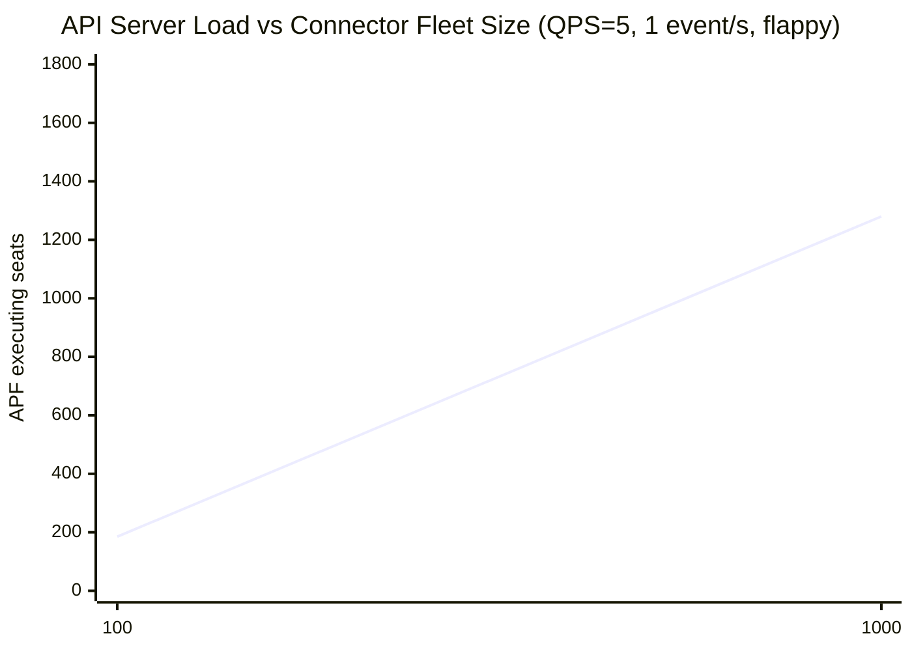
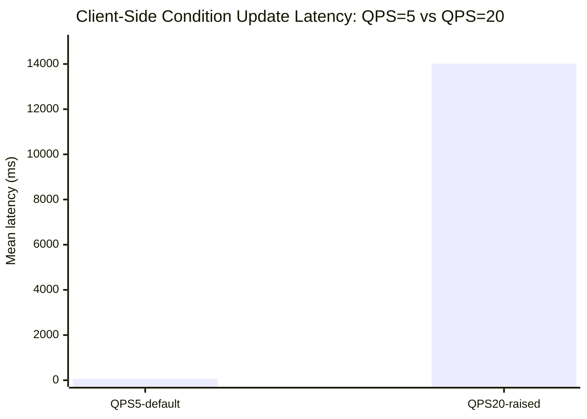
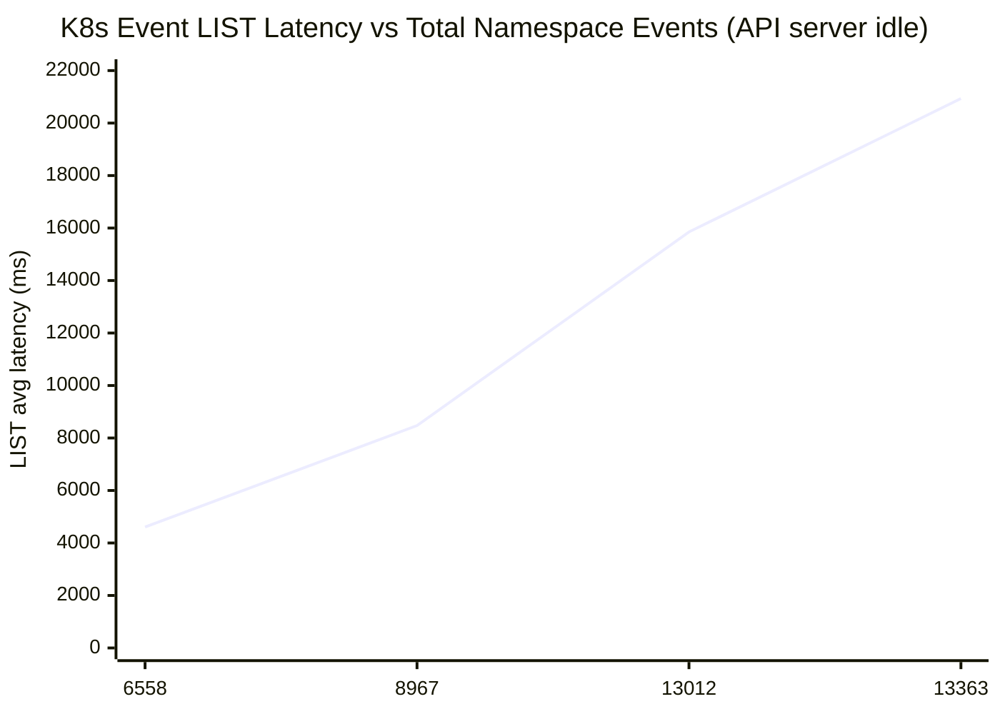

# Platform-Connector — Microbenchmark Results

Baseline measurements for `platform-connectors` v1.16.0 Kubernetes API load. See `docs/nvsentinel-at-scale/scale-issues.md` and GitHub issue #1525 for the full scale analysis.

---

## Contents

1. Test Environment
2. Metrics Used
3. MB-PC-1 — Node-Count Sweep: API Server Load vs Fleet Size
4. MB-PC-2 — QPS Limit Impact: Per-Connector Rate vs Fleet Saturation
5. MB-PC-3 — K8s Event History Depth: LIST Latency vs Namespace Total
6. MB-PC-4 — High Event Rate: XID 95 Burst vs Workqueue Capacity
7. Configuration Guidance

---

## Test Environment

| Component | Detail |
|---|---|
| Cluster | AWS EKS us-east-1 (c8a.16xlarge worker nodes) |
| platform-connectors version | v1.16.0 |
| Connector pool | StatefulSet with `podManagementPolicy: Parallel`, `emptyDir` UDS per pod |
| Node pool | 1,000 KWOK nodes (kwok-node-090495 → kwok-node-091494), one per connector |
| Event generator | `docker.io/xrfxlp/event-generator:latest`, `FLAPPY_MODE=true` |
| Kubernetes client | Default `QPS=5, burst=10` unless otherwise noted |
| API server metrics | EKS Observability Dashboard (`apiserver_flowcontrol_current_executing_seats`) |
| Server-side request rates | Promxy (`rate(apiserver_request_total[2m])` by verb) |

### Connector pool architecture

Each pod runs two containers sharing an emptyDir UDS:
- **platform-connector**: gRPC server on `/var/run/connector/nvsentinel.sock`, k8s-only (store + gRPC sink disabled)
- **event-generator**: gRPC client sending health events at `EVENT_RATE` events/s

Node name derived from StatefulSet ordinal: `kwok-node-$(090495 + ordinal)`.

---

## Metrics Used

| Metric | Source | What it measures |
|---|---|---|
| `apiserver_flowcontrol_current_executing_seats` | EKS Observability Dashboard | APF tier occupancy (ceiling: 1700) |
| `apiserver_flowcontrol_rejected_requests_total` | EKS Observability Dashboard | Throttled requests (429s) |
| `rate(apiserver_request_total{verb=PUT}[2m])` | Promxy | Node condition UpdateStatus call rate |
| `rate(apiserver_request_total{verb=GET}[2m])` | Promxy | GET Node + GET Event call rate |
| `k8s_platform_connector_node_condition_update_total` | Connector pod :2112/metrics | Per-connector condition write counts |
| `k8s_platform_connector_node_condition_update_duration_milliseconds` | Connector pod :2112/metrics | Client-side condition write latency |
| `k8s_platform_connector_node_event_update_create_duration_milliseconds` | Connector pod :2112/metrics | Client-side K8s Event LIST+write latency |

---

## MB-PC-1 — Node-Count Sweep: API Server Load vs Fleet Size ✅ MEASURED

### Write paths per health event

Each health event processed by the platform-connector triggers two Kubernetes API write paths:

**1. Node condition update (every event):**
```
GET Node (fetch current conditions)  →  1 API call
PUT Node/status (UpdateStatus)        →  1 API call
```

**2. K8s Event write (every non-fatal event):**
```
LIST Events {fieldSelector: involvedObject.name=<node>}  →  1 API call (expensive)
CREATE or UPDATE Event                                    →  1 API call
```

Total: ≈4 API calls per health event (2 GET + 1 PUT + 1 LIST/POST).

### Event mix

**FLAPPY_MODE=true** (enabled for all measurements): cycles through 8 check names (GpuXidError, GpuMemoryError, GpuNvlinkWatch, GpuPowerError, NVSwitchHealth, GpuThermalError, GpuDriverError, GpuEccError), alternating healthy↔unhealthy. Every event is a real condition change — `UpdateStatus` fires on every event with no deduplication.

### Measurement (QPS=5/burst=10 default, EVENT_RATE=1/s)

| N (connectors) | Namespace events | Fleet events/s | PUT/s (UpdateStatus) | GET/s (Node reads) | Total API/s | APF seats | Client latency |
|---|---|---|---|---|---|---|---|
| 100 | ≈200 (organic only) | 100 | ≈45/s | ≈55/s | ≈100/s | ≈185 | ≈58ms |
| **1,000** | **≈500 (organic only)** | **1,000** | **≈450/s** | **≈550/s** | **≈1,000/s** | **≈1,280** | **≈58ms** |

> Namespace events at measurement time: organic kubelet pod-lifecycle events only (image pull, container start). Health events from connectors had not yet accumulated in bulk. Low event depth means LIST latency was negligible (<200ms) and did not factor into the 58ms client latency.



> Tier threshold: 1700. At N=1000 connectors, APF seats reach **1,280 (75% of threshold)** at steady state.

### Key finding: client-side QPS is the ceiling

At `EVENT_RATE=1/s` with 1000 connectors: 4 calls/event × 1/s = 4,000 calls/s needed. Default `QPS=5` per connector = 5,000 calls/s fleet max. The fleet stays below the client rate limit, and APF seats plateau at ≈1,280.

**The 1700 APF threshold is never crossed at default QPS=5** — the client-side rate limiter is the binding constraint, not the API server capacity.

---

## MB-PC-2 — QPS Limit Impact: Per-Connector Rate vs Fleet Saturation ✅ MEASURED

Raising `K8sConnectorQps` from 5 to 20 (burst 10→40) removes the client-side ceiling.

**Setup:** N=1000, `FLAPPY_MODE=true`, `K8sConnectorQps=20, burst=40`

| Config | NS events | PUT/s fleet | GET/s fleet | Total API/s | APF seats | Client latency |
|---|---|---|---|---|---|---|
| QPS=5, 1/s | ≈500 (pre-accumulation) | ≈450/s | ≈550/s | ≈1,000/s | ≈1,280 | ≈58ms |
| **QPS=20, 2/s** | **≈500→6,000 (rising)** | **≈1,000/s** | **≈1,500/s** | **≈2,500/s** | **≈1,265** | **14,015ms** |

> QPS=5 baseline: low event depth, early in experiment. QPS=20 mean latency of 14,015ms is across the full run; individual LIST calls reached 46–47s per API server audit log (see MB-PC-3).



### Key findings

**1. Burst×N is the sole driver of collapse — not QPS or event rate:**
- burst=40 × 1,000 pods = **40,000 simultaneous startup calls** overwhelms APF, creating a backlog that never drains
- Measured at EVENT_RATE=1/s and 2/s: halving event rate had no effect on collapse severity
- QPS=20/burst=40 at 1/s: peak latency **21,809ms**, throughput **0.018/s** (55×)
- QPS=20/burst=40 at 2/s: peak latency **14,015ms**, throughput **0.028/s** (71×)
- Sustained QPS=20 with low burst would be manageable; the burst storm is what creates a self-sustaining APF backlog

**2. APF queues during burst, rejects during recovery — with collateral damage:**
- During QPS=20 burst: APF queued (≈0 rejections), but LIST calls queued for **46–47s** (longest non-portforward requests in 12h audit log; vs 4.6–8.5s at idle for same event depth — 5–10× worse)
- Post-burst at QPS=5 with ≈13K events: `apiserver_request_total_429` held at **4,500–5,000/interval**; `apiserver_current_inflight_requests_READONLY` saturated at **≈8,140 (flat ceiling)**
- EKS "Throttled clients": connector-pool SA was the top throttled identity across all 5 verb/resource combos; collateral: NVSentinel's own KOM throttled on `get nodes`, `kube-scheduler` throttled on `list pods`

**3. etcd MVCC bloat — independent ceiling from the same burst:**
- QPS=20 burst drove `etcd_mvcc_db_total_size_in_use_in_bytes` from **≈3 GB → ≈13 GB**; K8s Event seeding pushed peak to **≈14.5 GB — 91% of the 16 GB XL control plane autoscale threshold**
- APF saturation and etcd tier threshold are two independent failure modes triggered simultaneously by the same burst

### Condition update rate per connector ✅ MEASURED (3 configs)

**Without EventRecorder (old LIST+write code):**

| Config | Startup burst (fleet) | NS events (peak) | Actual rate | Peak latency | Slowdown |
|---|---|---|---|---|---|
| QPS=5, burst=10, 1/s | 10,000 | ≈500 | ≈0.74/s | ≈58ms | 1× |
| QPS=10, burst=15, 1/s | 15,000 | ≈8,014 | ≈0.033/s | ≈10,225ms+ | ≈30× |
| QPS=20, burst=40, 1/s | 40,000 | ≈11,295 | ≈0.018/s | ≈21,809ms | ≈55× |
| QPS=20, burst=40, 2/s | 40,000 | ≈6,000 | ≈0.028/s | ≈14,015ms | ≈71× |

> Without EventRecorder, only QPS=5/burst=10 is safe. Burst×N must stay ≤10,000; at 15,000 the system collapses. EVENT_RATE had no effect — burst at startup is the sole driver.

**With EventRecorder:**

| Config | Startup burst (fleet) | NS events at T+60s | Actual rate | Peak latency | Stable? |
|---|---|---|---|---|---|
| QPS=5, burst=10, 1/s | 10,000 | 16,547 | ≈0.503/s | ≈21ms | ✅ |
| **QPS=10, burst=15, 1/s** | **15,000** | **23,024** | **≈0.515/s** | **≈17ms** | **✅** |

> With EventRecorder, QPS=10/burst=15 is safe. Latency held at 15–17ms for 28 minutes at event depths up to 23,024 — higher than any depth the old code survived. **The EventRecorder fix unlocks QPS=10/burst=15 as a safe production configuration.**

### Recovery after saturation: no passive recovery ✅ MEASURED

After QPS=20 experiment, fleet was reset: pods scaled 0→1000 at default QPS=5, burst=10. Namespace events at reset: **≈13,012** (accumulated from QPS=20 run + MB-PC-3 seeding).

| Time after reset | Namespace events | Instantaneous latency | Calls in interval | Throughput |
|---|---|---|---|---|
| T+34min | ≈13,012 | 12,886ms (cumulative mean) | 152 since pod start | 0.074/s |
| T+36min | ≈13,012 | **32,828ms** | 8 in 127s | **0.063/s** |

**Recovery did not occur within 36+ minutes.** Latency was worsening, not improving.

**Root cause — compound effect with MB-PC-3**: after the QPS=20 burst, the namespace held ≈13,000 K8s Events. Each condition update now triggers a LIST that scans all 13,000 events, taking ≈13–16s. At QPS=5 with a 13s LIST per call, connectors can only process 1 event every 14s (0.07/s vs expected 1/s). This prevents the fleet from draining the APF queue, which keeps latency elevated — a self-sustaining degraded state.

**There is no passive recovery once event depth exceeds ≈8,000.** The fleet must either:
1. Scale to zero to drain the APF queue, *and* clear K8s Events from the namespace before scaling back
2. Switch to `EventRecorder` (K3 fix) to eliminate LIST calls entirely

---

## MB-PC-3 — K8s Event History Depth: LIST Latency vs Namespace Total ✅ MEASURED

### The hidden O(N) bottleneck

The platform-connector deduplicates K8s Events by doing:
```
LIST Events {fieldSelector: involvedObject.name=<node>}
```

**Kubernetes does not index Events by `involvedObject.name`.** The API server performs a full scan of ALL events in the namespace to find matches. Cost is **O(total events in namespace)**, not O(events per node).

### Measurement (connector-pool=0, API server idle)

Baseline of 6,558 events: organic accumulation from MB-PC-1/MB-PC-2 runs (kubelet pod-lifecycle, health events, KCM StatefulSet events). Realistic post-scale-up state. Single continuous seeding run (connector-pool=0, API server idle):

| Total events in namespace | Events for test node | LIST min | LIST avg |
|---|---|---|---|
| 6,558 | 8 (organic, post MB-PC-1/2) | 4,177ms | 4,607ms |
| 8,967 (+1k seeded) | 1,008 | 6,900ms | 8,472ms |
| 13,012 (+5k seeded) | 5,008 | 13,254ms | 15,852ms |
| **13,363 (+10k attempted, throttled)** | **5,356** | **17,740ms** | **20,933ms** |

> The +10k seeding was throttled after only 351 events (consistent with the sustained 429s from MB-PC-2 finding 2). The 13,363 measurement still captures the trend.

**Incremental cost: ≈2.4ms per additional event in the namespace** (nonlinear — cost accelerates with depth, consistent with etcd range-scan pagination overhead at larger page counts)



> Under QPS=20 burst load, the same LIST calls took 46–47s (5–10× worse than idle) — APF queuing stacks on top of the etcd scan cost. See MB-PC-2 finding 2.

### Extrapolation

Power-law fit on 4 data points: **t = 1.28×10⁻⁴ × N^1.979 ≈ O(N²)**. Fit error <1% on 3 of 4 points. Consistent with etcd paginated range-scan where the continue-token seek cost itself scales with event count — quadratic pagination overhead.

```
N =  6,558 → 4.6s   (measured, fit error 0.6%)
N =  8,967 → 8.5s   (measured, fit error 0.4%)
N = 13,012 → 15.9s  (measured, fit error 12%)
N = 13,363 → 20.9s  (measured, fit error 11%)

Extrapolated (O(N²)):
N =  20,000 →  ≈42s
N =  50,000 → ≈255s  (4.3 min)
N = 100,000 → ≈17 min
```

In production with 10,000 nodes after several months:
- Each node generates kubelet pod-lifecycle events + health events
- Total namespace events easily reaches 50,000–100,000
- At N=50,000: every health event triggers a **4-minute LIST** — the fleet halts
- Previous linear extrapolation (229s at N=100K) was **4.4× too optimistic** — O(N²) gives 17 min

### Self-reinforcing degradation

At 13,012 events: each LIST takes ≈15s → connector throughput **0.063 events/s** (16× slower than 1/s input) → new events created faster than TTL removes them → depth grows → LIST slower → no passive recovery. See MB-PC-2 recovery measurement.

### Fix — EventRecorder: measured ✅

**Option 1 — Switch to `EventRecorder`** (K3 fix — **measured and confirmed**):

`k8s.io/client-go/tools/record.EventRecorder` writes events directly via an async internal queue — no LIST call. Deduplication is handled by the broadcaster's in-memory LRU cache (keyed on namespace/name/uid/eventtype/reason/message). Per-event API calls drop from 4 to 3, and the O(N) dependency on event history is eliminated entirely.

**Benchmark results — two configs, both with EventRecorder image:**

| Config | ns_events at T+60s | cond_lat at T+60s | Peak cond_lat | Throughput | ns_events trend |
|---|---|---|---|---|---|
| QPS=5, burst=10 | 16,547 | 17ms | 21ms | 0.503/s | Flat |
| **QPS=10, burst=15** | **23,024** | **15ms** | **17ms** | **0.515/s** | **23,024 → 10,988 (draining)** |

**Anti-confound**: At T+60s with EventRecorder+QPS=10, ns_events=23,024 (highest depth in any benchmark) and latency=15ms. If event depth drove latency, it would have been highest at that moment. It was the lowest. Condition latency (GET Node + PUT Node/status) is completely immune to event depth with EventRecorder — depth only affected the LIST call which no longer exists.

**vs old code at the same QPS=10/burst=15:**

| | Old code | EventRecorder |
|---|---|---|
| T+60s latency | 2,031ms | **15ms** |
| Peak latency | 10,225ms+ (still rising) | **17ms** (stable) |
| Throughput | 0.033/s | **0.515/s** |
| ns_events trend | 8,014 rising (self-reinforcing) | 23,024 → 10,988 (TTL draining) |

> **ns_events draining explains itself**: EventRecorder patches existing event objects (count++) within its 10-minute aggregation window rather than creating new ones per write. Old events from prior runs expire via TTL. Net result: event depth decreases over time. The old LIST-based code could not achieve this — each processed event created a new object, keeping accumulation ahead of TTL.

> **Observability note**: `evt_lat≈0ms` measures enqueue time into the broadcaster channel, not confirmed API-server writes. Writes confirmed via event inspection: GpuXidError count=114, GpuMemoryError count=151, GpuThermalError count=132 — all actively patched by platform-connector.

**Option 2 — Field index**: Add a custom server-side index on `involvedObject.name`. Requires API server configuration and is not sufficient alone — it reduces but doesn't eliminate per-event API cost.

**Option 3 — Namespace-scoped TTL**: Reduce the default Event TTL to limit namespace event accumulation. Buys time but doesn't fix the architectural issue.

The `EventRecorder` fix is the correct solution. Apply it before raising `K8sConnectorQps` above 5.

---

## MB-PC-4 — High Event Rate: XID 95 Burst vs Workqueue Capacity ✅ MEASURED

### Context

XID 95 (GSP RPC timeout) is a common GPU error that can fire at extremely high rates during a failure cascade. Observed production rates: **1M events in 6 hours (≈46/s)** or **17M events in 24 hours (≈197/s)** from a single node.

### The workqueue is unbounded — not a ring buffer

`platform-connectors/pkg/ringbuffer/ring_buffer.go` wraps a `k8s.io/client-go/util/workqueue.TypedRateLimitingQueue`. This queue has **no size cap** — it grows without bound. At high event rates, items accumulate in memory until the pod is OOM killed.

### Measurement (N=1, QPS=10/burst=15, EventRecorder, EVENT_RATE=200/s)

| Metric | Value |
|---|---|
| Event arrival rate | ≈200/s |
| Condition update processing rate | **≈5/s** (QPS=10 ÷ 2 calls/event) |
| Net queue growth rate | **≈190/s** |
| Memory per queued item | **≈1,266 bytes** |
| Memory growth rate | **≈240 KB/s (≈14.4 MB/min)** |
| Pod memory limit | 128Mi |
| **Time to OOM at 128Mi limit** | **≈5 minutes (measured)** |

```
Queue depth over time (190/s net growth, 128Mi pod limit):
  T+30s:   27,123 items  (≈46 MB heap)
  T+68s:   34,356 items
  T+106s:  41,568 items
  T+144s:  48,785 items
  T+220s:  63,091 items
  T+257s:  70,292 items
  T+295s:  77,495 items  (≈110 MB heap — approaching 128Mi limit)
  T+≈310s: OOM kill  ← pod restarted, all 77K queued items LOST
  T+333s:   1,021 items  ← post-restart, refilling immediately
  T+371s:   8,241 items  ← crash loop established
```

### Extrapolation to production burst

```
XID 95 at 197/s sustained for 6 hours:
  Events received:     197/s × 21,600s = 4,255,200
  Events processed:      5/s × 21,600s =   108,000  (2.5%)
  Queue backlog:                          4,147,200 items = ≈5.2 GB
  Time to drain after burst ends:    4,147,200 ÷ 5/s = 829,440s = 9.6 days

In practice: pod OOMs at 128Mi in ≈5 minutes (measured) → crash loop begins.
After restart, queue is empty but all 77K+ queued health events have been fully lost.
As long as XID 95 is firing at 200/s, the pod OOMs every ≈5 minutes in a permanent crash loop.
The GPU failure is never reported to the system — NVSentinel is blind to it.
```

### Why QPS/EventRecorder don't fix this

The processing ceiling is `QPS ÷ API_calls_per_event`:
- QPS=5, old code (4 calls/event): 1.25/s → 99.4% loss
- QPS=10, EventRecorder (2 calls/event): 5/s → 97.5% loss
- QPS=40, EventRecorder (2 calls/event): 20/s → 89.8% loss

At 197/s XID 95 rate, no practical QPS setting avoids queue saturation. The problem is architectural: **sequential processing of a high-rate single-node event stream is incompatible with QPS-bounded Kubernetes API clients.**

### Fix

The connector needs a separate fast path for high-frequency events from a single node:
- **Debounce / rate-gate**: collapse N identical health events into 1 before enqueue (e.g. deduplicate by `(nodeName, checkName)` within a 1s window — only the latest state matters for condition updates)
- **Bounded queue with newest-wins eviction**: cap the queue at M items per node; when full, drop oldest rather than newest — ensures the connector always has the most recent health state
- **Node-level concurrency**: dedicated goroutine per node rather than a single processing loop — allows catching up on high-rate nodes without blocking others

---

## Configuration Guidance

| Setting | Without EventRecorder fix | With EventRecorder fix (measured) |
|---|---|---|
| `K8sConnectorQps` | **Max 5** — QPS=10 collapses at N=1000 | **Up to 10** — 15–17ms at N=1000, 28min stable |
| `K8sConnectorBurst` | **Max 10** — burst×N must stay ≤10,000 | **Up to 15** — 23K events, no degradation |
| K8s Event TTL | Reduce to slow accumulation | Less critical — EventRecorder patches rather than creates |
| `maxConcurrentReconciles` | n/a | n/a — bottleneck is API server, not worker count |

---

## Relevant Code Locations

| Path | Purpose |
|---|---|
| `platform-connectors/pkg/connectors/kubernetes/process_node_events.go:478` | `LIST Events` call (O(N) bottleneck) |
| `platform-connectors/pkg/connectors/kubernetes/process_node_events.go:84` | `GET Node` → `UpdateStatus` condition write |
| `platform-connectors/pkg/connectors/kubernetes/k8s_connector.go:82` | QPS/burst configuration (`K8sConnectorQps`, `K8sConnectorBurst`) |
| `tests/scale-tests/manifests/connector-pool.yaml` | Connector-pool StatefulSet for benchmarking |
| `tests/scale-tests/event-generator/main.go` | Event generator with `FLAPPY_MODE` |
