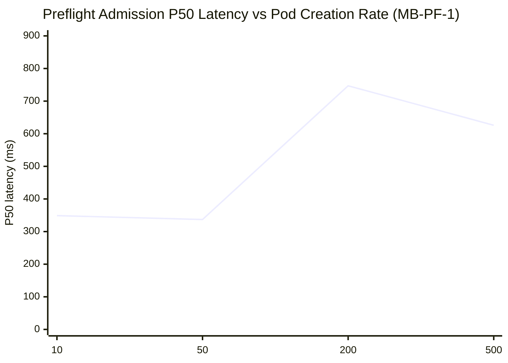
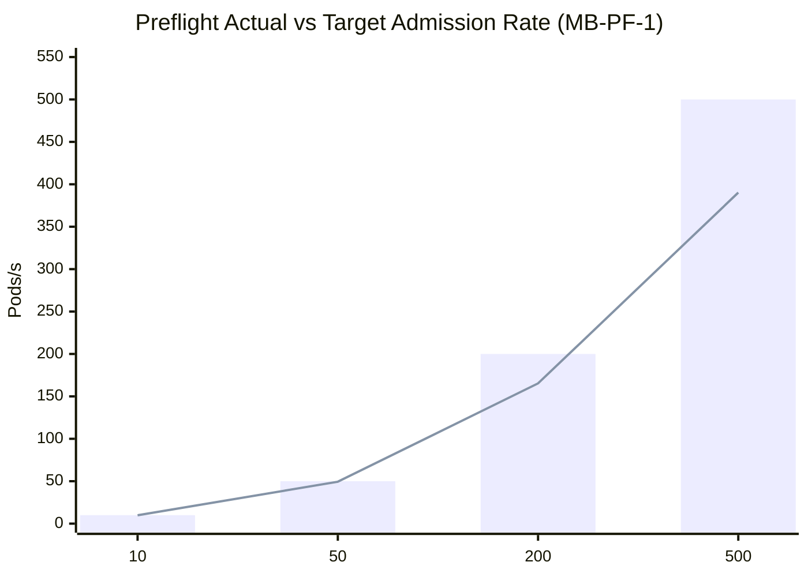
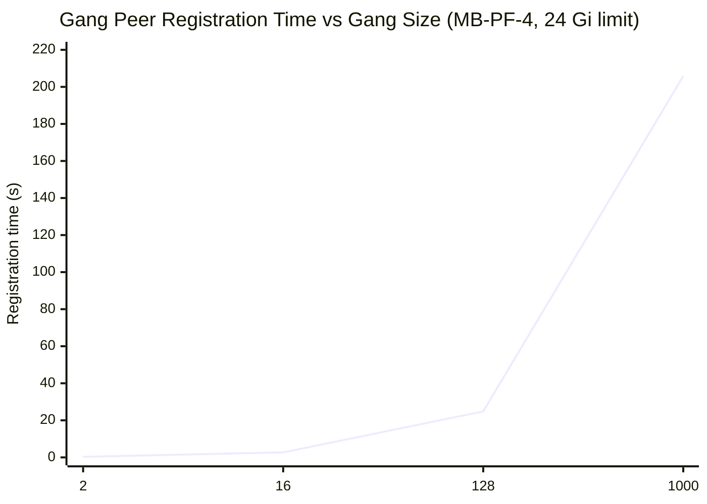
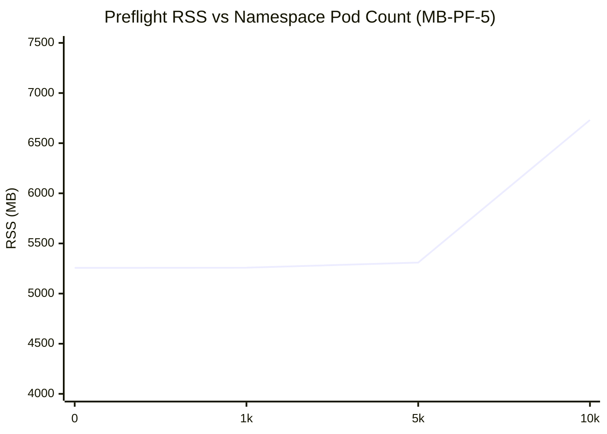

# Preflight — Microbenchmark Results (v1.16.0)

Baseline measurements for Preflight v1.16.0. See GitHub issue #1522 for the full benchmark plan.

---

## Contents

1. Test Environment
2. Metrics Used
3. MB-PF-1 — Admission Webhook Throughput
4. MB-PF-2 — Pod-Spec Size vs Mutation Latency
5. MB-PF-3 — Check-Count vs Injection Latency
6. MB-PF-4 — Gang Coordination Scaling
7. MB-PF-5 — Cluster Pod Population
8. MB-PF-8 — Restart / Cold Recovery
9. Configuration Guidance
10. Relevant Code Locations

---

## Test Environment

| Component | Detail |
|---|---|
| Cluster | AWS EKS us-east-1, 99k KWOK nodes |
| Preflight | v1.16.0 (`docker.io/xrfxlp/preflight:bench-20260807140420`) |
| Benchmark namespace | `preflight-bench` (label: `nvsentinel.nvidia.com/preflight=enabled`) |
| Gang discovery | Volcano PodGroup CRD (`scheduling.volcano.sh/v1beta1`) |
| Init containers | 3 (`preflight-dcgm-diag`, `preflight-nccl-loopback`, `preflight-nccl-allreduce`) |
| Pod type | GPU-requesting (`nvidia.com/gpu: 1`) on KWOK nodes (never actually run) |
| Webhook failurePolicy | `Ignore` (benchmarks); `Fail` in production |

---

## Metrics Used

| Metric | What it measures |
|---|---|
| Wall-clock POST latency | Client-side admission round-trip (API server → webhook → response) |
| Actual admission rate | Successful Pod creations per second over the measurement window |
| `process_resident_memory_bytes` | Preflight RSS from controller-runtime metrics on `:8080` |

> Preflight exposes no application-level Prometheus metrics. Timing data is collected via client-side measurement.

---

## MB-PF-1 — Admission Webhook Throughput ✅ MEASURED

### How the webhook processes admissions

On each Pod CREATE in a labeled namespace:

1. Decode the incoming `AdmissionRequest` pod spec
2. Look up `DiscovererResolver` (in-memory, namespace-keyed) for gang config
3. Check `hasGPUResources()` — skip injection if pod requests no GPU/network resources
4. Run `Injector.InjectInitContainers()` — generate JSON patch (in-memory, no API calls when gang coordination is disabled)
5. Return `AdmissionResponse` with patch

**Zero Kubernetes API calls per admission** when gang coordination is disabled.

### Measurement

GPU-requesting pods created at increasing rates. Each rate swept for 30 seconds with concurrent workers.

| Target rate | Actual rate | P50 | P90 | P99 | Errors |
|---|---|---|---|---|---|
| 10/s | 9.9/s | 349ms | 361ms | 498ms | 0% |
| 50/s | 49.4/s | 337ms | 477ms | 829ms | 0% |
| 200/s | 165.3/s **(83%)** | 747ms | 918ms | 1,248ms | 0% |
| 500/s | 390.2/s **(78%)** | 626ms | 1,377ms | 1,826ms | 0% |





### Production impact

**Throughput ceiling: ~165/s per replica.** At 200/s target, the webhook saturates at 165/s (83%) — P50 doubles to 747ms. At 500/s target, actual rate caps at 390/s (78%), P99=1,826ms — approaching the 2–5s admission timeout.

At 100k nodes with a gang restart storm, peak admission rates can exceed 1,000/s. A single replica cannot sustain this.

### Fix

**Scale the webhook horizontally.** Preflight is stateless per-admission. At 165/s per replica, 6 replicas achieve ~1,000/s. With gang coordination enabled, the bottleneck shifts to the ConfigMap conflict storm (see MB-PF-4).

---

## MB-PF-2 — Pod-Spec Size vs Mutation Latency ✅ MEASURED

### How injection scales with pod size

The webhook generates a JSON patch adding init containers, volumes, and pull secrets. Processing is pure in-memory — no API calls, no I/O.

### Measurement

10 repetitions per size. Varying container count, env var count, and volume count.

| Pod size | P50 | P99 | Patch size |
|---|---|---|---|
| Minimal (1 container, no env) | 336ms | 368ms | 5.4 KB |
| Typical GPU (1 container, 10 env) | 337ms | 340ms | 7.1 KB |
| Large (3 containers, 30 env each, 5 vols) | 344ms | 598ms | 17.6 KB |
| Max realistic (5 containers, 50 env each, 8 vols) | 365ms | 615ms | 38.8 KB |

P50 is flat (336→365ms). Latency is dominated by the TLS round-trip, not spec processing. Patch size scales 7× but does not affect latency at production sizes.

At 390 pods/s with max-spec pods (38.8 KB patches): ~15 MB/s outbound from the webhook pod — well within typical 1 Gbps pod network limits.

---

## MB-PF-3 — Check-Count vs Injection Latency ✅ MEASURED

### How check count affects injection

`nvsentinel.nvidia.com/preflight-checks` annotation selects which init containers are injected. Each check adds ~1 KB to the patch.

### Measurement

| Checks | P50 | P99 | Patch size |
|---|---|---|---|
| 1 (`preflight-dcgm-diag`) | 336ms | 340ms | 3.7 KB |
| 2 (dcgm + nccl-loopback) | 336ms | 339ms | 4.6 KB |
| 3 all (default) | 335ms | 443ms | 5.5 KB |

No measurable latency difference between 1 and 3 checks. Check injection is pure in-memory JSON generation — not a scaling concern at any practical count.

---

## MB-PF-4 — Gang Coordination Scaling ✅ MEASURED (N=2/16/128/1000, 24 Gi limit)

### How gang peer discovery works

When a pod gets an IP, the `GangController` reconciles and calls `DiscoverPeers`:

```go
// preflight/pkg/gang/discoverer/kubernetes.go:462
func (w *KubernetesDiscoverer) findPeers(ctx, namespace, podGroup) {
    var podList corev1.PodList
    w.client.List(ctx, &podList, client.InNamespace(namespace))  // ALL pods, no selector
    // then filters in-memory for matching gang ID
}
```

`w.client` is `mgr.GetClient()` — the cached controller-runtime client. The List hits the **in-memory informer cache**, not the API server. The bottleneck is **not** the List — it is the ConfigMap PATCH conflict storm.

For an N-member gang: all N reconcile events fire nearly simultaneously. Each does a `ConfigMap.Patch` to append its peer entry to a single shared ConfigMap. N concurrent writers → etcd conflicts → `retry.RetryOnConflict` → exponential backoff.

### Measurement

End-to-end gang formation with Volcano PodGroups on K8s 1.34. Pod IPs manually assigned to trigger GangController reconciles.

**Time from all IPs assigned → all peers registered in ConfigMap:**

| Gang size N | Peer registration | Peer rate | Notes |
|---|---|---|---|
| 2 | **0.3s** | 6.7/s | — |
| 16 | **2.7s** | 5.9/s | — |
| 128 | **24.8s** | 5.2/s | — |
| 1,000 | **198.4s** | **5.0/s** | Peak RSS 11.2 GB (baseline 5.5 GB + 5.7 GB gang overhead) — OOMKills at 8 Gi; 12 Gi sufficient |



The 24.8s for N=128 measures the single reconcile worker draining 128 queued ConfigMap PATCH operations with retry-on-conflict. In production, total gang formation time = pod scheduling time + peer registration time.

**Pod List cost** (API server, for reference — the controller uses the in-memory cache):

| Namespace pod count | List P50 | Response size | Bytes per pod |
|---|---|---|---|
| 2 | 605ms | 12 KB | 6,262 B |
| 16 | 618ms | 97 KB | 6,223 B |
| 128 | 1,942ms | 746 KB | 5,969 B |
| 1,000 | 2,387ms | 5.5 MB | 5,666 B |

Per-reconcile in-memory scan touches ~6 KB per pod. With N=1,000 reconciles and 1,000 pods in namespace: ~5.5 GB total memory bandwidth — not a wall-clock concern (microseconds in cache) but relevant for GC pressure at scale.

### Production impact

**Gang size N=1,000 peaks at 11.2 GB RSS** (baseline 5.5 GB + 5.7 GB from workqueue state, retry tracking, and ConfigMap data during the conflict burst). OOMKills at 8 Gi; 12 Gi is sufficient. Converges in 198s at 5.0 peers/s.

**ConfigMap conflict storm** (wall-clock bottleneck): all N reconciles write to the same ConfigMap simultaneously. Peer registration rate declines from 5.9/s at N=16 to 4.9/s at N=1,000 due to etcd conflict retries with exponential backoff.

**Unfiltered namespace pod scan** (GC pressure): each reconcile scans ALL pods in the namespace regardless of gang membership. At 10,000 background pods, the extra scan work is negligible for latency but adds GC load.

### Fix

**1. Per-pod ConfigMaps** (eliminates conflict storm): create one ConfigMap per pod instead of appending all pods to a single shared key. Zero write conflicts.

**2. Label selector on `findPeers`** (eliminates unnecessary scan):
```go
w.client.List(ctx, &podList,
    client.InNamespace(namespace),
    client.MatchingLabels{"scheduling.k8s.io/pod-group": podGroup},
)
```
Requires the webhook to set the label at injection time.

---

## MB-PF-5 — Cluster Pod Population ✅ MEASURED

### How pod count affects preflight

Preflight registers a cluster-wide typed `corev1.Pod` informer (no namespace scoping, no K13 transform). RSS scales with total cluster pod count.

### Measurement

Background (non-GPU) pods created in the bench namespace. Gang discovery latency re-tested at each pod count.

| Background pods | Preflight RSS | Gang(16) P50 |
|---|---|---|
| 0 (cluster baseline) | 5,256 MB | 3.0s |
| 1,000 | 5,258 MB (+2 MB) | 3.0s |
| 5,000 | 5,309 MB (+53 MB) | 3.0s |
| 10,000 | **6,731 MB (+1,475 MB)** | 3.0s |



**Gang discovery latency is unaffected.** P50 stays at 3.0s across all pod counts — the in-memory `findPeers` scan adds ~10ms at 10k pods, lost against the 3.0s ConfigMap PATCH time.

**Baseline RSS: 5,256 MB at 99k KWOK nodes** (nodes only, no pod objects). At 100k GPU nodes × 8-10 DaemonSet pods = 800k–1M pods, the cluster-scoped pod informer adds 12–16 GB (same model as JANITOR_BENCHMARK.md MB-JAN-2: ~16 MB/1k pods).

**RSS growth is non-linear** — slow at 0–5k pods (GC absorbs), then spikes +1.5 GB at 10k pods from GC pressure. The cluster already holds 99k node objects (~3.7 GB), so the baseline is already high.

### Fix

Apply a `SetTransform` to the pod informer. Stub pods in non-preflight namespaces:

```go
podInformer.SetTransform(func(obj interface{}) (interface{}, error) {
    pod := obj.(*corev1.Pod)
    if !tracker.isEnabled(pod.Namespace) {
        return stub(pod), nil
    }
    return pod, nil
})
```

`tracker` is a `sync.RWMutex`-protected map updated by a namespace watcher at runtime. **No warm-up needed on label add** — preflight only processes pods that went through the webhook (new pods, not pre-existing ones). Pre-existing pods in a newly-labeled namespace stay as stubs and are never touched by the webhook or GangController.

---

## MB-PF-8 — Restart / Cold Recovery ✅ MEASURED

### How preflight restarts

Preflight is stateless — no accumulated work queue. Startup cost is the pod informer cache sync (all cluster pods from the API server). Unlike Janitor (MB-JAN-9), there is no TTL enqueue spike.

### Measurement

Pod killed (forced restart), 3 repetitions. 99k KWOK nodes in cluster.

| Rep | Pod startup | First admission | Notes |
|---|---|---|---|
| 1 | 3.7s | 4.1s | Warm node image cache |
| 2 | 10.5s | 10.8s | Cold start |
| 3 | 10.5s | 10.9s | Consistent cold-start |

**Startup: 3.7–10.5s.** Cold start is entirely the pod informer sync time — 10.5s for 99k nodes. First admission follows ~0.4s after Ready.

**No startup spike.** Webhook is immediately ready once the informer syncs — no backlog to clear.

Scale projection: at 200k nodes, sync ≈ 21s (linear). Readiness probe `initialDelaySeconds` should exceed the expected sync time.

---

## Configuration Guidance

| Setting | Default | Recommendation |
|---|---|---|
| `replicaCount` | 1 | `ceil(peak_admission_rate / 165)` replicas at 100k nodes |
| `gangCoordination.enabled` | true | Disable if gang checks not needed — removes 3-5 API calls per admission |
| `webhook.failurePolicy` | `Fail` | Keep `Fail` in production; `Ignore` only in dev/test |
| `resources.limits.memory` | varies | **12 Gi** for N=1,000 gangs at 99k nodes (peak 11.2 GB measured). Scale to 16-24 Gi at 100k GPU nodes with full pod informer |
| Max gang size | — | N=1,000 converges in 206s with 24 Gi. Fix ConfigMap conflict storm (per-pod ConfigMaps) to support larger gangs without the memory spike |

---

## Relevant Code Locations

| Path | Purpose |
|---|---|
| `preflight/pkg/webhook/injector.go:182` | `InjectInitContainers` — injection entry point; `hasGPUResources` gates on GPU resources |
| `preflight/pkg/controller/gang_controller.go` | `GangController.Reconcile` — triggers `DiscoverPeers` on pod IP assignment |
| `preflight/pkg/gang/discoverer/kubernetes.go:462` | `findPeers` — unfiltered in-memory scan of all namespace pods |
| `preflight/pkg/gang/coordinator/coordinator.go` | `RegisterPeerInConfigMap` — `retry.RetryOnConflict` on shared ConfigMap — conflict storm root cause |
| `tests/scale-tests/benchmarks/preflight.py` | Benchmark implementation (MB-PF-1 through MB-PF-8) |
