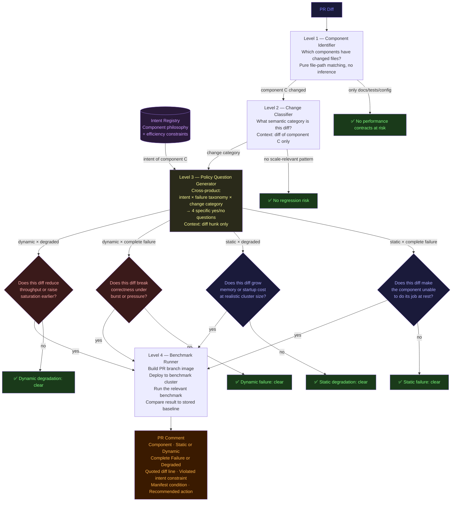

# PR Scale-Impact Review Agent

Automated detection of pull requests that invalidate or affect NVSentinel scale benchmarks.

---

## Contents

1. Problem Statement
2. Performance Failure Taxonomy
3. Component Intent Registry
4. Agent Architecture
5. Level 4 — Benchmark Execution
6. Grounding and Substantiation
7. Human Review Interface
8. Validation Plan
9. Implementation Plan
10. Limitations and Known Gaps

---

## Problem Statement

PRs to NVSentinel components should not cause regressive performance at scale. A change that looks correct in unit tests and code review may:

- Increase memory usage for the node-drainer informer cache (silently OOMs a 100k-node cluster)
- Reduce fault-quarantine cordon throughput (slows response to a GPU XID storm)
- Increase platform-connector API call rate (pushes the API server past its APF tier threshold)
- Regress fault-remediation's cold-start scan time (delays recovery after a restart under load)

The functional test suite does not cover these behaviors. CI runs on small clusters with few nodes and no load. A change that degrades performance at scale ships silently.

The scale benchmarks in this directory establish **baseline performance contracts** for each component. A performance regression is any PR that weakens one of these contracts without an intentional, documented decision to do so.

**Goal:** For every PR, automatically identify which performance contracts it may weaken and surface this to reviewers before merge — with enough specificity that the reviewer can make an informed decision, not just a gut check.

---

## Performance Failure Taxonomy

Before describing the agent, we define what "regression" means. Every performance failure in NVSentinel falls into one of four cells:

|  | **Static** (no load, component just running) | **Dynamic** (component under operational load) |
|---|---|---|
| **Complete failure** | Component OOMs at startup with realistic cluster size; crash loop | Component crashes or loses correctness under burst or sustained pressure (e.g. CappedPositionLost, API 429 cascade, etcd timeout) |
| **Degraded performance** | Component baseline memory or startup time grows; cold-start latency increases | Throughput ceiling drops; P99 latency increases; saturation point reached at lower N |

**Static failures** are detectable from the code alone — they don't require a running system. A change that adds a new in-memory cache, expands a queue item's struct, or adds a full-collection scan to startup can be reasoned about statically.

**Dynamic failures** require understanding how the component behaves under pressure from a backing service (API server, MongoDB, etcd) or a peer component (FQ cordoning nodes faster than ND can drain, a STORE_ONLY burst overrunning the MongoDB oplog). These require understanding the interaction between the changed code and the pressure source.

Both dimensions apply to **any NVSentinel component** — not just ND or FQ. Any component that talks to Kubernetes or MongoDB can exhibit both kinds of failure.

---

## Component Intent Registry

Each NVSentinel component has a **intent** — the intended behavior of what it does and the efficiency constraint it holds. The intent is not the implementation; it is the invariant that all correct implementations must satisfy, stated in the most resource-minimal terms possible.

The intent is important because it makes scale and performance **implicit** rather than a separate concern. "Do the job with enough efficacy while consuming as little resource as possible" is already embedded in the intent. A PR that violates the intent in either dimension — correctness or resource efficiency — is a regression.

| Component | Intent | Efficiency constraint (what "as little as possible" means here) |
|---|---|---|
| **fault-quarantine** | Cordon and taint a node in response to a health event | One health event → at most two Kubernetes API calls (GET + UpdateStatus). No polling after completion. Memory proportional to in-flight cordons, not cluster size. |
| **node-drainer** | Drain pods from a quarantined node without disrupting other workloads | Memory proportional to active drains, not total cluster node count. No per-node state beyond what is currently draining. Cold-start reads only what is needed, not the full event history. |
| **fault-remediation** | Create a MaintenanceCR for nodes ready for remediation | API calls proportional to new remediation events. No background polling beyond what the operator return signals. Memory proportional to in-flight CRs, not event history. |
| **kubernetes-object-monitor** | Evaluate CEL policies against Kubernetes objects and annotate matching nodes | Memory proportional to watched object count, not policy count. Startup cost proportional to node count once, not per-rule. |
| **platform-connectors** | Write node conditions and Kubernetes Events from raw health events | One health event → one node condition write + at most one K8s Event write. No fan-out. API call rate proportional to per-node event rate. |
| **store-client** (shared) | Deliver health events reliably from producers to consumers via MongoDB | Change stream cursor position advances with event flow. No cursor staleness under sustained load. Cold-start query cost O(matching events), not O(total events). |

The intent registry is maintained here, not inside the agent. When a new component is added to NVSentinel, its intent is written here first, and the agent automatically inherits the ability to reason about PRs that touch it.

---

## Agent Architecture

The analysis runs in four hierarchical levels. Each level is more specific than the previous. The key property: **Level 3 questions are not hardcoded — they are generated by crossing the component intent with the failure taxonomy**. This means the agent works for any component without a maintained per-file path registry.

### Cross-product that generates policy questions

For each changed component and each failure cell, the question is:

```
"Does this diff violate the component's intent × [failure cell]?"

failure cell = (static | dynamic) × (complete failure | degraded performance)
```

Example for fault-quarantine, dynamic × degraded:

```
Intent:    "One health event → at most two Kubernetes API calls (GET + UpdateStatus)"
Cell:    dynamic × degraded
Question: "Does this diff increase the number of Kubernetes API calls per event,
           reduce the sustainable cordons-per-second rate, or add polling behavior
           that grows with concurrent in-flight cordons?"
```

The agent does not need to know the benchmark number (2.4 nodes/s from MB-FQ-2) to ask this question. The intent generates the question. At Level 4, the agent does not just consult the benchmark table — it **runs the benchmark** against the PR branch and compares the result to the stored baseline.



### Change-category taxonomy

Level 2 classifies each diff into one or more change categories. This is the only place where semantic knowledge about scale-relevant patterns lives. The list is not exhaustive — it expands as new benchmarks are added.

| Change category | Static or Dynamic | Failure mode examples |
|---|---|---|
| **Memory allocation** — new map, cache, informer, ring buffer, larger struct | Static | OOM at startup at realistic cluster size |
| **Startup scan / cold-start query** — new MongoDB query at init, new Kubernetes LIST | Static | Cold-start latency grows O(N); timed out at large N |
| **Rate limit / QPS / retry** — client QPS, burst, backoff interval | Dynamic | Throughput ceiling drops; queue backs up under load |
| **Work queue item** — queue item type, size, deduplication | Static + Dynamic | Memory OOM (static); queue saturation (dynamic) |
| **Persistence cursor / change stream** — MongoDB pipeline filter, resume token | Dynamic | CappedPositionLost under event burst |
| **Polling / recheck interval** — InProgressRequeueDelay, 30s poll, watch | Dynamic | Polling saturation ceiling at concurrent N |
| **Kubernetes API call path** — new verb, removed cache read, added GET | Dynamic | API server APF seat consumption grows with fleet size |
| **Informer / cache scope** — cluster-scoped vs namespace, new watch | Static | Informer memory grows with O(N) objects |

Level 3 does **not** match file paths. It matches **semantic patterns** in the diff — a new `make(map[string]interface{})`, a new `time.Sleep`, a removed `informer.Get()` replaced by a direct API call. This makes it applicable to any component without a maintained path registry.

---

## Level 4 — Benchmark Execution

When Level 3 returns yes for any failure cell, Level 4 does not guess at severity — it **builds the PR branch, deploys it to the benchmark cluster, runs the relevant benchmark, and compares the result to the stored baseline.**

### Why run benchmarks automatically rather than flag for humans

Flagging potential regressions and asking engineers to re-run manually does not work in practice:
- It adds review latency — the engineer has to schedule and run the benchmark separately
- It is easy to dismiss — "probably fine, will monitor in production"
- The signal degrades with time — each unflagged regression makes the next harder to detect

Running the benchmark on the PR means:
- The verdict is **data, not opinion** — "15% regression confirmed" vs "might regress"
- Dismissal requires overriding a measured number, not a heuristic
- The baseline stays current — each PR that passes can update the baseline

### Benchmark baseline registry

Each benchmark has a machine-readable baseline alongside its markdown doc:

```yaml
# tests/scale-tests/baselines/ND.yaml
mb-nd-1:
  description: Pod informer memory per 1k drain-eligible pods
  metric: mb_per_1k_pods
  baseline: 16.0
  tolerance_pct: 10
  measurement_cmd: python3 tests/scale-tests/scripts/nd_memory_sweep.py --n=100000
  cluster_requirements:
    kwok_nodes: 100000

mb-nd-7:
  description: Drain start throughput (Immediate mode, default QPS)
  metric: nodes_per_second
  baseline: 1.1
  tolerance_pct: 15
  measurement_cmd: python3 tests/scale-tests/scripts/nd_throughput.py --n=1000

mb-fq-2:
  description: Cordon throughput at default QPS
  metric: nodes_per_second
  baseline: 2.4
  tolerance_pct: 10
  measurement_cmd: python3 tests/scale-tests/scripts/fq_throughput.py --n=1000

mb-fr-3:
  description: Cold-start MongoDB scan cost
  metric: us_per_event
  baseline: 0.6
  tolerance_pct: 20
  measurement_cmd: python3 tests/scale-tests/scripts/fr_cold_start.py --n=1000000
```

### What Level 4 does

```
1. Build image from PR branch
   → ko build github.com/nvidia/nvsentinel/{component}

2. Deploy to benchmark cluster
   → update deployment image, wait for rollout

3. Run benchmark
   → execute measurement_cmd, capture metric value

4. Compare to baseline
   if result > baseline × (1 + tolerance_pct / 100):  REGRESSION
   if result < baseline × (1 - tolerance_pct / 100):  IMPROVEMENT
   else:                                               PASS

5. Post result to PR comment with data
```

### Report structure: Theory → Hypothesis → Experiment → Conclusion

The agent does not report raw numbers. It argues a case in four steps, each grounded in the previous:

**Theory** (from intent + failure taxonomy)
: The general principle that this class of change could violate. Sourced from the component intent registry. Does not reference the diff.

**Hypothesis** (from Level 3 analysis of the diff)
: A specific, falsifiable prediction about what this particular diff will do. States a claim that the experiment can confirm or refute. Quotes the diff line that generates the prediction.

**Experiment** (Level 4 benchmark run)
: The benchmark executed, the metric measured, the baseline compared. Raw data only — no interpretation yet.

**Conclusion** (agent synthesis — the approved verdict)
: Given the theory, hypothesis, and experimental data, the agent states whether the hypothesis was confirmed or refuted, and therefore whether the performance contract is intact. The human does not need to interpret the numbers independently.

---

### Example: regression confirmed

> **node-drainer — STATIC · DEGRADED PERFORMANCE**
>
> **Theory**
> node-drainer's memory must be proportional to the number of drain-eligible pods, not total cluster pod count. The efficiency constraint is ~16 MB per 1k drain-eligible pods (MB-ND-1). The function `filterEvictablePods` determines which pods enter the informer cache.
>
> **Hypothesis**
> This diff adds `PodUnknown` to the eligible phase set in `filterEvictablePods` (line 389). In production, PodUnknown pods exist when nodes are unresponsive. At 100k nodes with ~5% unresponsive at peak, this expands the eligible pod set. Prediction: memory per 1k eligible pods increases above the 16 MB baseline.
>
> **Experiment**
> Ran MB-ND-1 against PR branch (`xrfxlp/node-drainer:pr-1847`), 100k KWOK nodes, 5% PodUnknown pods.
> - Baseline: 16.0 MB / 1k drain-eligible pods
> - Measured: 18.4 MB / 1k drain-eligible pods
> - Delta: +15% (tolerance: 10%) ❌
>
> **Conclusion — Hypothesis confirmed. Regression.**
> The expanded filter increases informer memory by 15% per eligible pod. At 200k drain-eligible pods this adds ~480 MB; the OOM threshold at 8Gi drops from ~18.8M to ~16.5M queued events. The memory contract is broken. This PR requires either a fix or an explicit documented acceptance of the new 18.4 MB/1k baseline.

---

### Example: hypothesis refuted

> **fault-quarantine — DYNAMIC · DEGRADED PERFORMANCE**
>
> **Theory**
> fault-quarantine's cordon ceiling is QPS / calls_per_cordon. Any change that adds a sequential API call or increases latency on the critical path lowers the ceiling below the measured 2.4 nodes/s (MB-FQ-2).
>
> **Hypothesis**
> This diff adds a CEL expression log statement in `evaluateNodeRule` (line 142), which runs on every health event before cordoning. Prediction: if logging adds meaningful latency, sustained cordon rate drops below 2.4 nodes/s.
>
> **Experiment**
> Ran MB-FQ-2 against PR branch, 1000 KWOK nodes, 1 event/s per node.
> - Baseline: 2.4 nodes/s
> - Measured: 2.39 nodes/s
> - Delta: -0.4% (tolerance: 10%) ✅
>
> **Conclusion — Hypothesis refuted. No regression.**
> The log statement adds negligible latency. Cordon throughput is unchanged within measurement noise. The performance contract holds.

---

## Grounding and Substantiation

### What "grounded" means here

An output is grounded if every claim it makes can be traced to one of:
1. A specific line in the PR diff
2. A specific row in a benchmark measurement table
3. A specific sentence in a benchmark doc section

An output that says "this might affect memory" without quoting the diff line or the measurement table is ungrounded and should be suppressed.

### How each level is forced to stay grounded

| Level | Grounding mechanism |
|---|---|
| 1 — Router | Pure code: `git diff --name-only` matched against the static registry. No model inference needed. |
| 2 — Path mapper | Model receives only the diff of the affected component. It must return exact file:line references. Schema validation rejects responses without line numbers. |
| 3 — Benchmark matcher | Model receives only the specific doc section (e.g., "MB-ND-1 § K13 SetTransform implementation") and the changed hunk. The prompt requires a direct quote from the doc to answer "yes". |
| 4 — Impact quantifier | Model receives only the measurement table and the Level 3 output. It must reference a specific row (e.g., "the 16 MB/1k pods row at 100k full pods"). If it cannot, it must output `needs_re_measurement: true` rather than invent a number. |

### What the model is NOT asked to do

- It is never asked "what are the scale implications of this change?" (open-ended → hallucination surface)
- It is never given the entire scale-issues.md as context (too broad → irrelevant facts leak in)
- It is never asked to generate new benchmark numbers (it can only say whether existing numbers still apply)

---

## Human Review Interface

The agent posts a structured PR comment. Every claim links to its evidence.

### Example output

> *The agent posts a structured comment on the PR:*
>
> ## Scale-Impact Analysis
> 
> **Verdict:** ⚠️ 2 potential regressions detected
> 
> ---
> 
> ### node-drainer — STATIC · DEGRADED PERFORMANCE
> 
> **Contract at risk:** Pod informer memory baseline (MB-ND-1)
> **Category:** Memory allocation — change to `filterEvictablePods`
> 
> ### MB-ND-1 — Pod Informer Memory (K13) — POTENTIAL REGRESSION
> 
> **Changed path:** `node-drainer/pkg/informers/informers.go:387–409` (`filterEvictablePods`)
> 
> **What the benchmark measured:**
> > "K13 reduces pod informer memory from ~2.2G to ~734M (66% reduction) for the 
> > equivalent configuration where all benchmark/nd-bench pods are system-namespace stubs."
> > — MB-ND-1 § "K13 impact: before vs after"
> 
> **What changed:**
> ```diff
> - if pod.Status.Phase == v1.PodSucceeded || pod.Status.Phase == v1.PodFailed {
> + if pod.Status.Phase == v1.PodSucceeded || pod.Status.Phase == v1.PodFailed ||
> +    pod.Status.Phase == v1.PodUnknown {
> ```
> 
> **Assessment:** The filter now excludes an additional pod phase from drain consideration.
> This changes which pods are counted as "drain-eligible" vs stubs. The 16 MB/1k pods
> rule was measured with the old filter set. Whether PodUnknown pods were present in the
> benchmark dataset is unknown.
> 
> **Risk:** If PodUnknown pods are present in production at scale, the effective memory 
> per 1k drain-eligible pods may be lower than the measured 16 MB/1k baseline, 
> changing the OOM threshold calculation.
> 
> **Recommended action:** Re-run MB-ND-1 memory sweep to confirm the 16 MB/1k rule 
> still holds with the expanded filter. If it degrades, this PR regresses the memory 
> contract for node-drainer at 100k nodes.
> 
> ---
> 
> ### MB-FQ-2 — Cordon Throughput — NO IMPACT
> 
> Changed files in fault-quarantine (`pkg/informer/cel_evaluator.go`) do not touch
> the Kubernetes client QPS/burst or the GET+UpdateStatus call path. Throughput ceiling
> unchanged.
> 
> ---
> 
> *Generated by scale-impact-agent v0.1. Each finding links to a diff line and a doc 
> section. Claims without both links are suppressed.*

### What reviewers should check

1. **Is the diff quote accurate?** Copy the line reference and verify it matches the actual PR diff.
2. **Is the doc quote accurate?** Click the section link in the benchmark doc and verify the quote is not taken out of context.
3. **Is the assessment conservative?** The agent should say "needs re-measurement" rather than "no impact" when uncertain. If it says "no impact" for a change you believe matters, that is a false negative to log.
4. **Is the recommended action specific?** "Re-run MB-ND-1" is specific. "Consider scale testing" is not and should be flagged as a low-quality output.

---

## Validation Plan

### Phase 1 — Retrospective validation on known PRs (before deploying)

Run the agent against closed PRs with known ground truth:

| PR | Expected findings | Pass if |
|---|---|---|
| K13 SetTransform PR | MB-ND-1 flagged | Agent cites the 16 MB/1k row and the correct diff lines |
| C4 partial indexes PR | MB-ND-4 flagged | Agent cites the 1456× improvement row |
| FQ K2 QPS change | MB-FQ-2 flagged | Agent cites the 2.4 nodes/s ceiling |
| CEL predicate change | MB-KOM-C2.1 flagged | Agent cites the CEL overhead table |
| Unrelated UI change | Nothing flagged | Agent returns empty findings list |

A finding is **correct** if: (a) the right benchmark is named, (b) the quoted diff lines are real, (c) the quoted doc section is real.

A finding is a **false positive** if: the benchmark is named but neither the diff nor doc quote is accurate.

A finding is a **false negative** if: a changed path is in the registry and the benchmark is well-documented, but the agent returned "no impact".

Target before deployment: 0 false positives, ≤1 false negative across 10 retrospective PRs.

### Phase 2 — Shadow mode (deploy but don't post comments)

Run on all new PRs for 4 weeks. Store outputs privately. Engineers who reviewed those PRs manually rate each output:
- Correct and useful
- Correct but too verbose
- False positive
- False negative
- Unclear / ungrounded

Iterate on prompts and the path registry based on ratings.

### Phase 3 — Active mode (post comments, require dismissal)

Post the comment to PRs. Require the PR author to explicitly dismiss each finding with a reason:
- "Re-measured, results unchanged" (attach new benchmark run)
- "Change doesn't affect this benchmark because..." (free text, logged)
- "False positive, filing issue" (creates tracking issue)

This dismissal record becomes the long-term dataset for tuning the agent.

---

## Implementation Plan

### Phase 1 — Skeleton (2 days): make it run on one PR

Three files to create:

- `.github/workflows/scale-review.yml` — GitHub Action trigger
- `.github/scripts/scale_review.py` — 4-level orchestrator
- `tests/scale-tests/intent_registry.yaml` — machine-readable version of the intent table

---

### `tests/scale-tests/intent_registry.yaml`

The agent reads this file, not the markdown. When a new component is added, add an entry here and the agent inherits the ability to analyze PRs touching it.

```yaml
components:
  fault-quarantine:
    paths: ["fault-quarantine/**"]
    intent: "Cordon and taint a node in response to a health event"
    efficiency:
      - "One health event → at most two Kubernetes API calls (GET + UpdateStatus)"
      - "Memory proportional to in-flight cordons, not cluster size"
    benchmarks:
      throughput: "tests/scale-tests/FQ_BENCHMARK.md#mb-fq-2"
      memory: "tests/scale-tests/FQ_BENCHMARK.md#mb-fq-1"

  node-drainer:
    paths: ["node-drainer/**", "store-client/**"]
    intent: "Drain pods from a quarantined node without disrupting other workloads"
    efficiency:
      - "Memory proportional to active drains, not cluster size"
      - "Cold-start reads only matching events, not full event history"
    benchmarks:
      memory: "tests/scale-tests/ND_BENCHMARK.md#mb-nd-1"
      cold_start: "tests/scale-tests/ND_BENCHMARK.md#mb-nd-4"
      throughput: "tests/scale-tests/ND_BENCHMARK.md#mb-nd-7"

  fault-remediation:
    paths: ["fault-remediation/**"]
    intent: "Create a MaintenanceCR for nodes ready for remediation"
    efficiency:
      - "API calls proportional to new remediation events, not in-progress CR count"
      - "Memory proportional to in-flight CRs, not event history"
    benchmarks:
      throughput: "tests/scale-tests/FR_BENCHMARK.md#mb-fr-2"
      cold_start: "tests/scale-tests/FR_BENCHMARK.md#mb-fr-3"
      memory: "tests/scale-tests/FR_BENCHMARK.md#mb-fr-1"

  kubernetes-object-monitor:
    paths: ["kubernetes-object-monitor/**", "health-monitors/kubernetes-object-monitor/**"]
    intent: "Evaluate CEL policies against Kubernetes objects and annotate matching nodes"
    efficiency:
      - "Memory proportional to watched object count, not policy count"
      - "Startup cost proportional to node count once, not per-rule"
    benchmarks:
      memory: "tests/scale-tests/KOM_BENCHMARK.md#mb-21"
      startup: "tests/scale-tests/KOM_BENCHMARK.md#b7"

  platform-connectors:
    paths: ["platform-connectors/**"]
    intent: "Write node conditions and Kubernetes Events from raw health events"
    efficiency:
      - "One health event → one node condition write + at most one K8s Event write"
      - "API call rate proportional to per-node event rate, not fleet size"
    benchmarks:
      api_load: "tests/scale-tests/PC_BENCHMARK.md#mb-pc-1"

  store-client:
    paths: ["store-client/**"]
    intent: "Deliver health events reliably via MongoDB change stream"
    efficiency:
      - "Change stream cursor advances continuously; no staleness under sustained load"
      - "Cold-start query cost O(matching events), not O(total events)"
    benchmarks:
      cursor: "tests/scale-tests/ND_BENCHMARK.md#mb-nd-6"
      cold_start: "tests/scale-tests/ND_BENCHMARK.md#mb-nd-4"
```

### `.github/scripts/scale_review.py`

```python
import anthropic, subprocess, yaml, sys, os, json
from github import Github

client = anthropic.Anthropic()
gh = Github(os.environ["GH_TOKEN"])
repo = gh.get_repo(os.environ["REPO"])

CHANGE_CATEGORIES = """
- memory_allocation: new map, cache, informer, ring buffer, larger struct, new field on queue item
- startup_scan: new MongoDB query at init, new Kubernetes LIST at startup, new cold-start path
- rate_limit: client QPS, burst, backoff interval, retry count, rate limiter config
- work_queue: queue item type or size, deduplication logic, queue depth cap
- persistence_cursor: MongoDB pipeline filter, resume token handling, change stream config
- polling_recheck: poll interval, InProgressRequeueDelay, watch loop, background ticker
- api_call_path: new Kubernetes verb, removed informer cache read replaced by direct GET, new API call
- informer_scope: cluster-scoped vs namespace-scoped, new watch added, existing watch removed
"""

def level1_components(pr_files: list[str], registry: dict) -> list[str]:
    """Pure Python — no LLM. Match changed files to component intent registry."""
    import fnmatch
    affected = []
    for component, data in registry["components"].items():
        for path in pr_files:
            if any(fnmatch.fnmatch(path, pattern) for pattern in data["paths"]):
                affected.append(component)
                break
    return affected

def level2_classify(component_diff: str) -> list[str]:
    """What change categories appear in this diff?"""
    r = client.messages.create(
        model="claude-opus-5", max_tokens=300,
        system=f"Change categories:\n{CHANGE_CATEGORIES}\nReturn a JSON array of matching category names only.",
        messages=[{"role": "user", "content": f"Diff:\n{component_diff[:4000]}"}]
    )
    return json.loads(r.content[0].text)

def level3_policy_questions(intent: dict, categories: list[str], diff_hunk: str) -> list[dict]:
    """Cross-product: intent × failure_taxonomy × category → answered yes/no questions."""
    prompt = f"""Component intent: {intent['intent']}
Efficiency constraints:
{chr(10).join('- ' + e for e in intent['efficiency'])}
Detected change categories: {categories}

For each of the four failure cells below, generate ONE yes/no question derived
from the intent and efficiency constraints, then answer it from the diff.
If the answer is yes, quote the exact diff line that supports it.
If uncertain, answer no.

Failure cells:
1. static × complete_failure: component cannot function at all at rest
2. static × degraded: memory or startup cost grows at realistic cluster size
3. dynamic × complete_failure: component loses correctness under burst/pressure
4. dynamic × degraded: throughput ceiling drops or saturation occurs at lower N

Return JSON array of: {{cell, question, answer (yes/no), diff_quote (null if no)}}"""

    r = client.messages.create(
        model="claude-opus-5", max_tokens=800,
        messages=[{"role": "user", "content": f"{prompt}\n\nDiff:\n{diff_hunk[:3000]}"}]
    )
    return json.loads(r.content[0].text)

def level4_severity(finding: dict, benchmark_text: str) -> dict:
    """At what N/rate does this manifest? What is the violated contract?"""
    r = client.messages.create(
        model="claude-opus-5", max_tokens=400,
        system="You quantify performance regression severity from benchmark measurement tables.",
        messages=[{"role": "user", "content":
            f"Finding: {finding}\n\nRelevant benchmark section:\n{benchmark_text[:2000]}\n\n"
            "Return JSON: {severity: complete_failure|degraded, manifest_at: str, "
            "violated_contract: str, recommended_action: str}"}]
    )
    return json.loads(r.content[0].text)

def get_component_diff(pr_number: int, component_paths: list[str]) -> str:
    result = subprocess.run(
        ["git", "diff", f"origin/{pr.base.ref}...HEAD", "--", *component_paths],
        capture_output=True, text=True
    )
    return result.stdout

def load_benchmark_section(path_ref: str) -> str:
    file_path, section = path_ref.split("#") if "#" in path_ref else (path_ref, "")
    with open(file_path) as f:
        content = f.read()
    # extract the section if specified
    if section:
        anchor = section.replace("-", " ").upper()
        # rough extraction: find heading, return next ~50 lines
        lines = content.split("\n")
        for i, line in enumerate(lines):
            if anchor in line.upper():
                return "\n".join(lines[i:i+50])
    return content[:2000]

def format_comment(findings_by_component: dict) -> str:
    if not any(f for findings in findings_by_component.values() for f in findings):
        return "## Scale-Impact Analysis\n\n✅ No performance contracts at risk."
    
    lines = ["## Scale-Impact Analysis\n"]
    for component, findings in findings_by_component.items():
        for f in findings:
            cell = f["finding"]["cell"].replace("_", " × ").replace("×", "·")
            lines.append(f"### {component} — {cell.upper()}\n")
            lines.append(f"**Question asked:** {f['finding']['question']}\n")
            lines.append(f"**Violated constraint:** {f['severity']['violated_contract']}\n")
            lines.append(f"**Manifests at:** {f['severity']['manifest_at']}\n")
            lines.append(f"**Diff evidence:** `{f['finding']['diff_quote']}`\n")
            lines.append(f"**Recommended action:** {f['severity']['recommended_action']}\n")
            lines.append("---\n")
    lines.append("*Generated by scale-review-agent. Each finding cites a diff line and a benchmark contract.*")
    return "\n".join(lines)

if __name__ == "__main__":
    pr_number = int(sys.argv[1])
    pr = repo.get_pull(pr_number)
    pr_files = [f.filename for f in pr.get_files()]

    with open("tests/scale-tests/intent_registry.yaml") as f:
        registry = yaml.safe_load(f)

    affected = level1_components(pr_files, registry)
    if not affected:
        print("No scale-sensitive components changed.")
        sys.exit(0)

    findings_by_component = {}
    for component in affected:
        intent = registry["components"][component]
        diff = get_component_diff(pr_number, intent["paths"])
        if not diff.strip():
            continue
        categories = level2_classify(diff)
        if not categories:
            continue
        questions = level3_policy_questions(intent, categories, diff)
        yes_findings = [q for q in questions if q["answer"] == "yes"]
        component_findings = []
        for finding in yes_findings:
            # find most relevant benchmark
            bm_ref = list(intent["benchmarks"].values())[0]
            bm_text = load_benchmark_section(bm_ref)
            severity = level4_severity(finding, bm_text)
            component_findings.append({"finding": finding, "severity": severity})
        findings_by_component[component] = component_findings

    comment = format_comment(findings_by_component)
    pr.create_issue_comment(comment)
```

### `.github/workflows/scale-review.yml`

```yaml
name: Scale Impact Review
on:
  pull_request:
    types: [opened, synchronize]
    paths-ignore: ["**.md", "docs/**", "tests/scale-tests/**"]

jobs:
  scale-review:
    runs-on: ubuntu-latest
    permissions:
      pull-requests: write
      contents: read
    steps:
      - uses: actions/checkout@v4
        with:
          fetch-depth: 0
      - uses: actions/setup-python@v5
        with: {python-version: "3.12"}
      - run: pip install anthropic PyGithub pyyaml
      - run: python .github/scripts/scale_review.py ${{ github.event.pull_request.number }}
        env:
          ANTHROPIC_API_KEY: ${{ secrets.ANTHROPIC_API_KEY }}
          GH_TOKEN: ${{ secrets.GITHUB_TOKEN }}
          REPO: ${{ github.repository }}
```

### Phase 2 — Shadow mode (1 week): validate before trusting

Deploy the action but post comments **minimized** (as HTML `<details>` blocks so they don't add review noise). Collect signal:

- PR author labels `scale-review: false-positive` or `scale-review: missed`
- Weekly review of labeled PRs against the retrospective validation set
- Iterate on Level 2 change-category prompts and Level 3 policy questions

**Target before going active:** fewer than 10% false positives across 20 shadow PRs.

### Phase 3 — Active mode

Promote to visible comments. Require the PR author to explicitly dismiss each finding before the PR can be merged:

- "Re-measured, result unchanged" — attach benchmark run artifact
- "Change does not affect this benchmark because..." — free text, logged
- "False positive" — creates a tracking issue, feeds back into Phase 2 calibration

### What you need to start

1. Add `ANTHROPIC_API_KEY` as a GitHub Actions secret
2. Create `tests/scale-tests/intent_registry.yaml` from the table above
3. Run locally first: `python .github/scripts/scale_review.py <closed-PR-number>` against a PR with known ground truth (e.g. the K13 PR that added SetTransform)
4. Confirm it flags the right component and failure cell before enabling the Action

---

## Limitations and Known Gaps

| Limitation | Impact | Mitigation |
|---|---|---|
| Path registry requires manual maintenance | New scale-sensitive code added without updating the registry → silent miss | Add a check: any new file in a scale-sensitive directory that isn't in the registry triggers a "registry needs update" comment |
| Level 3 requires the benchmark doc to describe the specific code path | If the doc is high-level, the matcher has no anchor to quote | Write benchmark docs to reference specific file:line paths (already done for ND, FR, partially for FQ) |
| The agent cannot run benchmarks | It can only flag that re-measurement is needed, not confirm impact | Benchmark re-runs must be triggered manually; the agent provides the flag and the recommended command |
| Cross-component changes are harder | A store-client change may affect ND, FQ, and FR cold-start simultaneously | Level 2 runs in parallel per component; a shared-library change propagates to all affected benchmarks |
| No coverage for emergent interactions | A change to component A and component B individually has no impact, but together creates a new bottleneck | Out of scope for v1; document as known gap |
