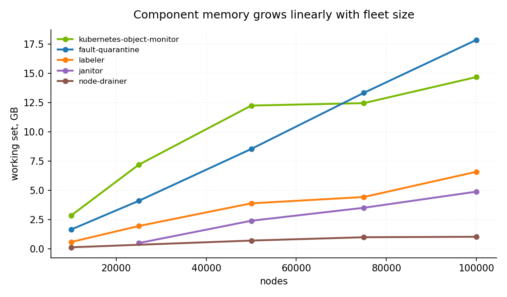
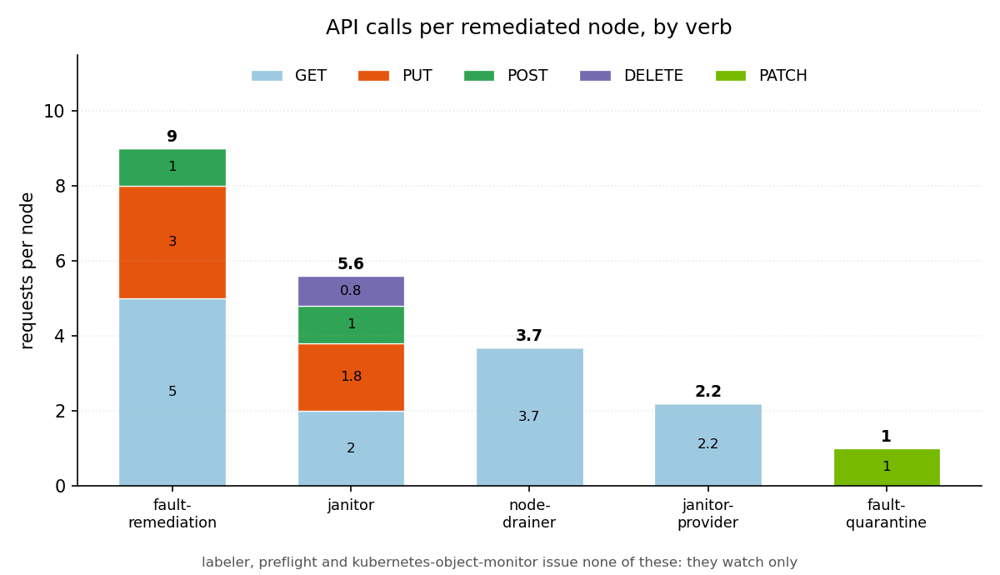
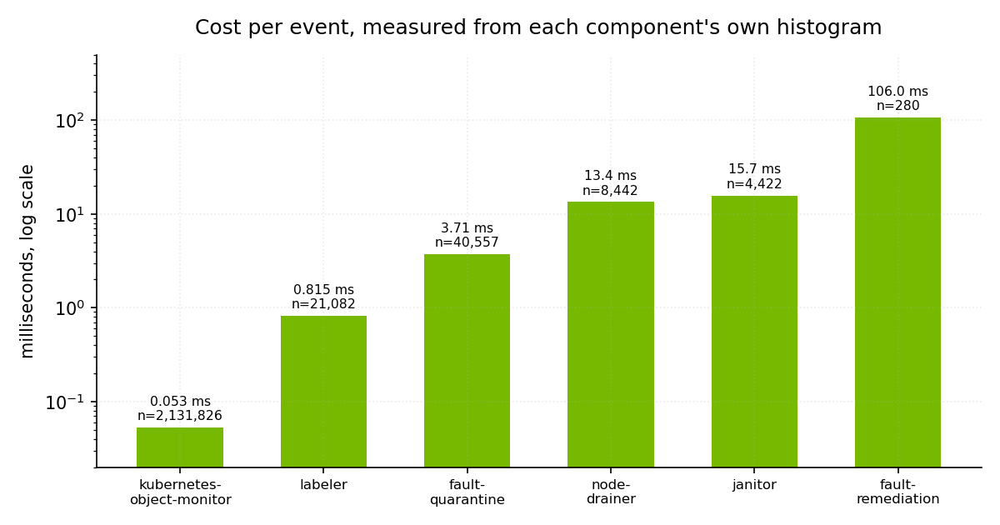
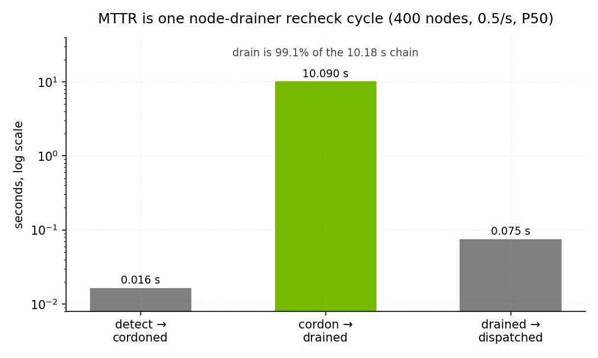
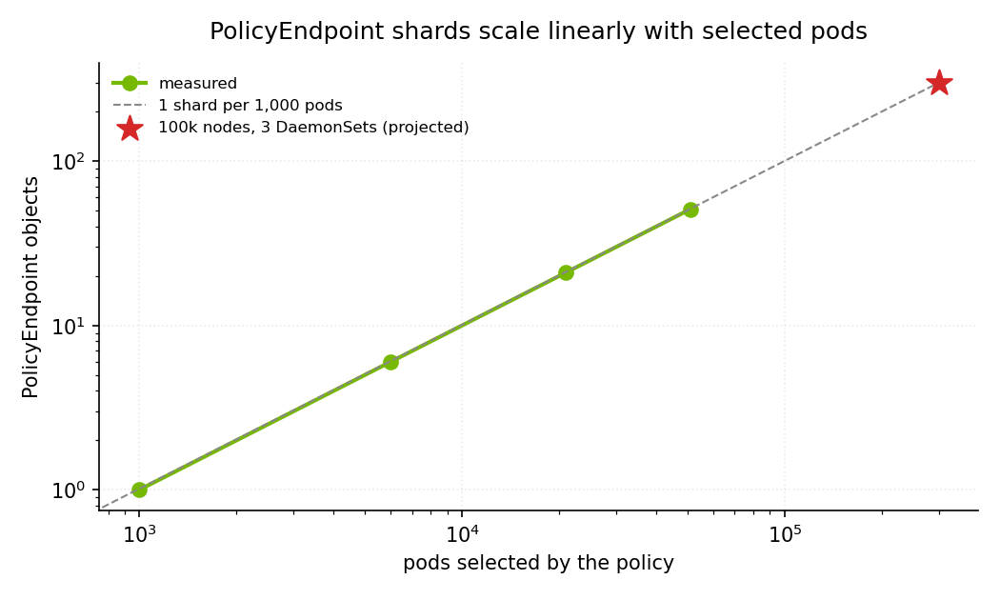

# NVSentinel end-to-end scale test — report

Markers: `[M]` measured, `[S]` simulated harness constant, `[I]` reader-supplied input.

## Table of contents

- [Summary](#summary)
- [A1. Component sizing](#a1-component-sizing)
  - [kubernetes-object-monitor](#kubernetes-object-monitor)
  - [fault-quarantine](#fault-quarantine)
  - [labeler](#labeler)
  - [node-drainer](#node-drainer)
  - [preflight](#preflight)
  - [fault-remediation](#fault-remediation)
  - [health-events-analyzer](#health-events-analyzer)
  - [janitor](#janitor)
  - [QPS](#qps)
- [A2. Load on external components](#a2-load-on-external-components)
  - [Kubernetes API](#kubernetes-api)
  - [etcd](#etcd)
  - [MongoDB](#mongodb)
  - [What etcd actually holds](#what-etcd-actually-holds-m)
  - [What a remediation costs the API server](#what-a-remediation-costs-the-api-server-m)
  - [MongoDB per member](#mongodb-per-member)
  - [Cost per event, by component](#cost-per-event-by-component-m)
- [A3. Customer-facing SLAs](#a3-customer-facing-slas)
  - [Continuous load, 0.47 nodes/s](#continuous-load-047-nodess-m)
  - [Full-chain run, 200-node burst](#full-chain-run-200-node-burst-m)
  - [MTTR decomposition](#mttr-decomposition)
  - [Event consumption rate](#event-consumption-rate-m)
  - [Drain latency with real pods](#drain-latency-with-real-pods-m)
  - [Burst absorption](#burst-absorption)
    - [Namespace eviction mode governs whether a drain can complete](#namespace-eviction-mode-governs-whether-a-drain-can-complete)
- [Appendix](#appendix)
  - [API server load produced by the simulation harness](#api-server-load-produced-by-the-simulation-harness-m)
    - [Node heartbeats and pod status](#node-heartbeats-and-pod-status)
  - [Simulated nodes and the AWS cloud-controller-manager](#simulated-nodes-and-the-aws-cloud-controller-manager-m)
  - [NetworkPolicy enforcement broke and stayed broken](#networkpolicy-enforcement-broke-and-stayed-broken-m)
  - [The EBS CSI provisioner runs out of memory at fleet scale](#the-ebs-csi-provisioner-runs-out-of-memory-at-fleet-scale-m)
  - [Methodology](#methodology)
    - [Deployed configuration](#deployed-configuration)
    - [Traps](#traps)

---

## Summary

NVSentinel has been tested upto 100k nodes, resource consumption grows predictably with fleet size and stays within ordinary limits with reasonable throughputs.

The whole control plane costs about 235 GB of memory at 100,000 nodes. NVSentinel's own components are 65 GB of that and MongoDB is the remaining 170 GB combined across all replicas, which it spends on per-node database connections rather than on data. [ADR-052](../../docs/designs/052-deployment-platform-connector.md) removes those connections, and once it lands the same fleet is projected at about 75 GB.

Two components are most of the component total. At 100,000 nodes with a pod on every node, kubernetes-object-monitor is 33.9 GB and fault-quarantine 17.9 GB; labeler is 6.6 GB, janitor 4.9 GB, node-drainer 1.0 GB, and nothing else exceeds 0.6 GB.

CPU was never a constraint. The busiest component peaked at 2.00 cores, four cores each is sufficient with headroom, and nothing recorded a single throttled CFS period.

Cordon completes in 26 ms P50 and 165 ms P99 under continuous load, and a node carrying one evictable pod is drained about ten seconds after that, which is one of node-drainer's recheck cycles. Detection to drained is 10.11 s P50 and 10.29 s P99; five hundred nodes failing at once stretches that to 55.5 s with every node completing.

What broke during testing was the infrastructure around NVSentinel, not NVSentinel: the AWS VPC CNI stopped rebuilding `PolicyEndpoint` objects and went on enforcing stale rules, the EBS CSI provisioner ran out of memory and stopped attaching volumes cluster-wide, and etcd's 16 GB threshold put the cluster into read-only. Each took MongoDB down with it. The first two are described in the appendix; etcd's budget is in A2.

---

## A1. Component sizing

**Memory at a glance.** The control plane costs about 2.35 MB per node, with no meaningful fixed term. Two components are most of NVSentinel's own share: at 100k nodes KOM is 33.9 GB and fault-quarantine 17.9 GB, together four-fifths of the 64.9 GB component total; labeler is 6.6 GB, janitor 4.9 GB, and everything else under 1.1 GB. At 50,000 nodes the same order holds at 11.8 / 8.6 / 3.9 / 2.4 GB. The marginal cost from 25k to 100k is **0.71 GB per 1,000 nodes**.




| Nodes   | Control plane | MongoDB       | NVSentinel components |
| ------- | ------------- | ------------- | --------------------- |
| 10,000  | ~22 GB        | ~17 GB `[M]`  | 4.6 GB `[M]`          |
| 25,000  | ~54 GB        | ~43 GB `[M]`  | 11.4 GB `[M]`         |
| 50,000  | ~113 GB       | ~85 GB `[M]`  | 27.5 GB `[M]`         |
| 100,000 | **~235 GB**   | ~170 GB `[M]` | **64.9 GB** `[M]`     |


Each component column is the sum of the per-component tables below at that fleet size. The 100,000-node row is the loaded fleet, with a pod on every node; the smaller rows carry 731 pods. labeler is measured with two pods per node throughout, because the DCGM and driver DaemonSets scale with the fleet.

After the deployment-model platform connector lands, MongoDB stops holding a connection per node, and the same 100,000-node fleet is projected at about 75 GB rather than 235 GB.


One note should be called here: memories in the graph above were considered to that of peak and not steady state, this sometimes differs by large margin because of the pruning that we do inside the modules like FQ (strip `node.status.*`) which makes it temporarily store the full raw object. As an example:


| Component        | peak    | settled | peak per node | vs raw wire |
| ---------------- | ------- | ------- | ------------- | ----------- |
| labeler          | 6.54 GB | 2.0 GB  | 247,550 B     | 4.5x        |
| fault-quarantine | 4.09 GB | 1.68 GB | 151,570 B     | 2.7x        |


Similar things happened with the pods:


| Component                 | settled B/pod | peak B/pod | computed B from transform            |
| ------------------------- | ------------- | ---------- | ------------------------------------ |
| kubernetes-object-monitor | ~3,700        | ~4,400     | ~175                                 |
| node-drainer              | ~4,900        | ~6,200     | 599 if drain eligible, 205 otherwise |
| preflight                 | ~4,200        | ~5,200     | ~110                                 |


Lets walk over component by component:


### kubernetes-object-monitor

Node + Pod watches, one per enabled policy; CEL-derived transform (#1720). Per-node cost 174,175 B/node. Per pod cost: ~3,700 B/pod settled, 4,400 B at peak


| Nodes   | Pods     | CPU med/peak `[M]` | Working set med/peak `[M]` | Rec. request | Rec. limit |
| ------- | -------- | ------------------ | -------------------------- | ------------ | ---------- |
| 4,933   | 731      | 0.06 / 0.09        | 1.12 / 1.13 G              | 2 Gi         | 4 Gi       |
| 9,990   | 731      | 0.10 / 0.13        | 1.84 / 1.84 G              | 4 Gi         | 8 Gi       |
| 25,005  | 731      | 0.36 / 0.38        | 4.53 / 4.58 G              | 6 Gi         | 12 Gi      |
| 50,005  | 731      | 0.33 / 0.43        | 11.76 G                    | 6 Gi         | 12 Gi      |
| 53,513  | 642,243  | 1.64 / 2.00        | 16.52 G                    | 20 Gi        | 40 Gi      |
| 75,005  | ~100,000 | 0.74 / 1.62        | 24.90 G                    | 28 Gi        | 48 Gi      |
| 100,005 | 731      | 0.58 / 1.05        | 21.24 G                    | 20 Gi        | 40 Gi      |
| 100,005 | ~100,000 | 0.61 / 1.21        | 33.90 G                    | 28 Gi        | 48 Gi      |


### fault-quarantine

Per-node cost **161,516 B/node**; retained bytes/node `33,144-34,337` `[I]`. Events sent at 0.1 events per second per node with 1:4 ratio of fatal and non-fatal.


| Nodes   | CPU med/peak `[M]` | Working set peak `[M]` | Rec. request | Rec. limit |
| ------- | ------------------ | ---------------------- | ------------ | ---------- |
| 4,933   | 0.03 / 0.03        | 0.87 G                 | 1 Gi         | 2 Gi       |
| 9,990   | 0.07 / 0.09        | 1.66 G                 | 2 Gi         | 4 Gi       |
| 25,005  | 0.14 / 0.19        | 4.11 G                 | 6 Gi         | 12 Gi      |
| 50,005  | 0.20 / 0.24        | 8.55 G                 | 6 Gi         | 12 Gi      |
| 75,005  | **0.14 / 0.19**    | **13.35 G**            | 16 Gi        | 32 Gi      |
| 100,005 | 0.29 / 0.46        | 16.17 G                | 12 Gi        | 18 Gi      |
| 100,005 | **0.18 / 0.32**    | **17.88 G**            | 20 Gi        | 40 Gi      |


### labeler

Eager informers: one for Nodes with a fixed field projection, and **four pod informers**, each label-scoped -- `app in (dcgm, driver)`, the driver-component label excluding that app, `k8s-app=<gke-installer>`, and ResourceSlice objects. 


| Nodes   | Labelled pods           | Settled    | Sync peak  | CPU med/peak | Rec. request | Rec. limit |
| ------- | ----------------------- | ---------- | ---------- | ------------ | ------------ | ---------- |
| 100,005 | 200,010 (DCGM + driver) | **6.60 G** | **7.0 G**  | 0.06 / 0.16  | 8 Gi         | 16 Gi      |
| 75,005  | 150,000 (DCGM + driver) | **4.44 G** | **5.53 G** | 0.11 / 0.78  | 6 Gi         | 12 Gi      |
| 50,005  | 100,000 (DCGM + driver) | **3.90 G** | **3.97 G** | 0.11 / 0.45  | 5 Gi         | 10 Gi      |
| 25,005  | 50,000 (DCGM + driver)  | **1.96 G** | **2.58 G** | 0.05 / 0.33  | 3 Gi         | 6 Gi       |
| 10,005  | 20,000 (DCGM + driver)  | **0.59 G** | **0.59 G** | 0.01 / 0.19  | 1 Gi         | 2 Gi       |


### node-drainer

Node drainer strips pods depending on whether they are drain eligible or not:


| Pod type        | Cost per pod | Basis                                                                                         |
| --------------- | ------------ | --------------------------------------------------------------------------------------------- |
| drain-eligible  | **4,850 B**  | measured: 731 -> 200,731 pods at fixed 10,000 nodes, on 44,593 B pod objects                  |
| DaemonSet-owned | **3,406 B**  | derived: 2.34 GB at 53,513 nodes / 642,243 pods, minus the node term, on ~9,626 B pod objects |


Now the scale sweep:


| Nodes   | Pods     | CPU med/peak `[M]` | Working set peak `[M]` | Rec. request | Rec. limit |
| ------- | -------- | ------------------ | ---------------------- | ------------ | ---------- |
| 10,005  | 0        | 0.01 / 0.01        | 0.14 G                 | 512 Mi       | 1 Gi       |
| 50,005  | 0        | 0.08 / 0.16        | 0.715 G                | 512 Mi       | 1 Gi       |
| 75,005  | 0        | 0.09 / 0.21        | 0.898 G                | 512 Mi       | 1 Gi       |
| 75,005  | ~100,000 | 0.19 / 0.48        | 1.00 G                 | 1 Gi         | 2 Gi       |
| 100,005 | 0        | 0.13 / 0.20        | 1.01 G                 | 1 Gi         | 2 Gi       |
| 100,005 | ~100,000 | 0.10 / 0.38        | 1.04 G                 | 2 Gi         | 4 Gi       |


These figures are with an empty queue; see queue memory below.

### preflight

Pod informer only; no Node cache.


| Nodes   | Pods     | CPU med/peak `[M]` | Working set peak `[M]` | Rec. request | Rec. limit |
| ------- | -------- | ------------------ | ---------------------- | ------------ | ---------- |
| 4,933   | 731      | 0.01 / 0.01        | 0.24 G                 | 512 Mi       | 1 Gi       |
| 10,000  | 364,217  | 0.01 / 0.02        | 1.92 G                 | 1 Gi         | 2 Gi       |
| 25,005  | 731      | 0.01 / 0.01        | 0.24 G                 | 512 Mi       | 1 Gi       |
| 75,005  | ~100,000 | **0.02 / 0.04**    | **0.44 G**             | 1 Gi         | 2 Gi       |
| 100,005 | ~100,000 | **0.03 / 0.16**    | **0.54 G**             | 1 Gi         | 2 Gi       |


### fault-remediation

No Kubernetes watches, and Node reads bypass the cache (`Client.Cache.DisableFor`). Working set is **flat at 0.014-0.019 GB from 4,933 to 53,513 nodes**, and unaffected by pod count. CPU 0.09 med / 0.18 peak.


| Nodes   | Pods     | CPU med/peak `[M]` | Working set peak `[M]` | Rec. request | Rec. limit |
| ------- | -------- | ------------------ | ---------------------- | ------------ | ---------- |
| 4,933   | 731      | 0.09 / 0.18        | 0.015 G                | 2 Gi         | 4 Gi       |
| 53,513  | 642,243  | 0.09 / 0.18        | 0.019 G                | 2 Gi         | 4 Gi       |
| 75,005  | ~100,000 | **0.07 / 0.08**    | **0.07 G**             | 2 Gi         | 4 Gi       |
| 100,005 | ~100,000 | **0.01 / 0.04**    | **0.02 G**             | 2 Gi         | 4 Gi       |


The flat profile is the point: this component is sized by its remediation rate, not by fleet size.

These figures are with an empty queue; see queue memory below.

Recommended **2 Gi / 4 Gi**. The working set is a rounding error, but a queued backlog is not: 4 Gi covers roughly half a million events on the live path.

### health-events-analyzer

Not a Kubernetes API consumer; it reads the event stream from MongoDB, so its cost follows event rate rather than fleet size.


| Event rate    | CPU peak `[M]` | Working set `[M]` | Rec. request | Rec. limit |
| ------------- | -------------- | ----------------- | ------------ | ---------- |
| idle          | 0.002          | 25.5 MB           | 128 Mi       | 256 Mi     |
| 36.9 events/s | **0.214**      | 19.6-20.1 MB      | 128 Mi       | 256 Mi     |


Wall time per event held between 17.5 and 19.4 ms across measured rates from 1.8 to 55 events/s, so the ceiling is flat rather than degrading with load.

Memory is a fixed cost of about 25 MB at any rate. Throughput is set by wall time per event, not by CPU: the component consumes its stream in a single serial loop (`store-client/pkg/client/event_processor.go`) and spends most of each event blocked on a MongoDB aggregation, so the **17.6 ms** its own `health_event_analyzer_event_handling_duration_seconds` histogram reports per event gives a ceiling near **55 events/s**. CPU is about 5.8 ms of that 17.6 ms, which is why the container draws 0.2 cores at saturation and why more cores do not raise the ceiling. A 100,000-node fleet at 0.1 events per node per second offers 10,000 events/s.

Recommended **256 Mi / 512 Mi**, and CPU is not a sizing lever here. At saturation the container draws about 0.2 cores against a 2-core limit and records **zero** throttled CFS periods, so it is blocked on MongoDB rather than short of CPU. The deployed 500m request already covers the saturated draw; raising it does not raise throughput.

### janitor

Node informer created **lazily** on the first `TerminateNode` reconcile, so an idle janitor is **flat at 0.022 GB regardless of fleet size**. Once triggered it costs **19,616 B/node.**

Retained bytes/node `~10,120` computed `[I]`; the measured 19,616 B is 1.94x that, the gap being Go map and pointer overhead. **Size for the triggered case**: 1 GB at 50k nodes, not the 22 MB an idle pod shows. Recommended **2 Gi / 4 Gi** at 50k.

Per scale point, for the triggered case. An untriggered janitor reads 0.022-0.055 G at every fleet size, so the idle row is not a sizing figure.


| Nodes   | Pods     | CPU med/peak `[M]` | Working set peak `[M]`           | Rec. request | Rec. limit |
| ------- | -------- | ------------------ | -------------------------------- | ------------ | ---------- |
| any     | any      | 0.01 / 0.01        | 0.03 G untriggered               | —            | —          |
| 25,005  | 731      | 0.02 / 0.04        | 0.93 G sync peak, 0.50 G settled | 1 Gi         | 2 Gi       |
| 50,005  | 731      | 0.03 / 0.07        | 2.41 G                           | 2 Gi         | 4 Gi       |
| 75,005  | ~100,000 | 0.13 / 0.29        | 3.52 G                           | 4 Gi         | 8 Gi       |
| 100,005 | 731      | 0.05 / 0.09        | 4.17 G                           | 6 Gi         | 12 Gi      |
| 100,005 | ~100,000 | 0.10 / 0.36        | 4.90 G                           | 6 Gi         | 12 Gi      |


### Queue memory

Both components hold one entry per pending event, so a backlog is memory the sizing tables above do not include. Two points each:

| Component | Backlog source | Queued events | Working set | Per event `[M]` |
| --- | --- | --- | --- | --- |
| node-drainer | replay | ~200,000 | 182 → 315 MB | 0.67 KB |
| node-drainer | replay | 1,048,415 | 255.7 → 979.7 MB | 0.69 KB |
| fault-remediation | cold start | 200,668 | 41.5 → 133.7 MB | 0.47 KB |
| fault-remediation | live stream | 1,389,136 | 791 → 9,463 MB | 7.79 KB |

node-drainer queues a node name, event ID and document ID on either path, and its two points agree at 0.67 and 0.69 KB. fault-remediation queues a document ID on cold start and the whole decoded event on the live path, which is the 16x difference between its two rows.

### QPS

The last column is the one to compare across rows: a client limit only means something once it is divided by what that component spends per node. A component with a high limit and an expensive path can be the bottleneck while one with a low limit and a single call is not.


| Component                 | `--kube-api-qps` / burst | API calls per node                                                                                                                           | Nodes/s at the limit                                 | Throughput measured                                |
| ------------------------- | ------------------------ | -------------------------------------------------------------------------------------------------------------------------------------------- | ---------------------------------------------------- | -------------------------------------------------- |
| fault-quarantine          | 100 / 200                | 1 PATCH per cordon                                                                                                                           | **100**                                              | 41.2 cordons/s (100-node burst)                    |
| node-drainer              | 400 / 800                | 3.7 mean per node over a 100-node burst (audit logs, mostly nodes with nothing to evict), plus 3.0 per evictable pod, so 18.7 at 5 pods/node | **108** with nothing to evict, **21** at 5 pods/node | 19.2 evictions/s = 3.85 nodes/s (1,000-node burst) |
| labeler                   | 500 / 1000               | 1 PATCH per relevant event                                                                                                                   | **500**                                              | 53,513 nodes labelled in 18.3 min                  |
| fault-remediation         | unset, so unlimited      | 9 per remediated node: 5 GET, 3 PUT, 1 POST                                                                                                  | unbounded client-side                                | 1.1 nodes/s at 10.4 req/s                          |
| janitor                   | unset, so unlimited      | >=5.7 per reboot: 2 GET, 1.8 PUT, 1 POST, 0.8 DELETE                                                                                         | unbounded client-side                                | —                                                  |
| kubernetes-object-monitor | unset, so unlimited      | 1 PUT per policy-match transition, cache-served read                                                                                         | —                                                    | —                                                  |


health-events-analyzer is absent from the table because it makes no Kubernetes API calls at all.

Normalised this way the two rate-limited stages of the fault path are close to balanced -- fault-quarantine at 100 nodes/s and node-drainer at 108 -- which is the right shape, since a cordon that outruns the drain behind it only builds a queue. That balance holds only at the measured 3.7 calls per node. node-drainer's cost adds 3.0 calls per evictable pod on top of that baseline, so a fleet running 5 evictable pods per node costs 18.7 calls and puts it at 21 nodes/s, making it the binding stage at roughly a fifth of fault-quarantine's budget.

## A2. Load on external components

*Measured at 50,021 nodes carrying 642,243 pods*

The three columns are conditions on that fleet, not scale points -- idle, continuous load at 0.47 nodes/s, and a 100-node burst. 

### Kubernetes API

Rates per second. Idle and continuous differ mainly in KWOK lease traffic, not in NVSentinel's own load.


|                    | Idle  | Continuous | Burst (med / peak) |
| ------------------ | ----- | ---------- | ------------------ |
| GET                | 172   | 81         | 78 / 185           |
| PUT                | 2,965 | 1,664      | 1,657 / 2,930      |
| PATCH              | 1,462 | 1,427      | 1,457 / 1,513      |
| LIST               | 7.5   | 8.0        | 7.8                |
| WATCH              | 6.0   | 6.7        | 6.6 / 8.6          |
| APF seats of 1,085 | 92    | 55         | 64 / **116**       |
| APF rejections     | **0** | **0**      | **0**              |


PUT is almost entirely simulated-node lease renewal and pod status rather than anything NVSentinel does; the breakdown is in the appendix. `[S]` APF never exceeded 11% of its seats and never queued a request, so the API server is far from a limit at this size. 

Per node in a 100-node burst: fault-remediation 9, janitor 6, node-drainer 3.7, janitor-provider 2.2, fault-quarantine 1, labeler and preflight. Taken from EKS audit logs, which cover the three components that register no client-go metrics; cross-checked against `rest_client_requests_total` where both exist and they agree (0.49 vs 0.50/s, 9 calls/node from both). `[M]`

### etcd


|                         | Idle            | Continuous                                  | Burst                                        |
| ----------------------- | --------------- | ------------------------------------------- | -------------------------------------------- |
| DB size, file-allocated | 16.73-16.75 GB  | 16.70 GB                                    | 15.76-16.75 GB                               |
| growth                  | none over 139 s | +288 objects / 638 s (0.45 obj/s, ~449 B/s) | +97 objects per 97 remediated nodes, ~94 KiB |


All growth under continuous load is RebootNode CRs at 993 B median; pods and nodes are unchanged. `apiserver_storage_size_bytes` varies by up to 983 MB between consecutive scrapes, because each API server instance reports its own etcd backend's file size and those files are allocated independently. It also never shrinks, since freed space is reused inside the file rather than returned. The etcd threshold is 16 GB across tiers, but in-use size is published only through CloudWatch, and CloudWatch itself degrades under the load that matters. Its peak reading of 14.59 GB, about 91% of the 4XL tier's 16 GB, is therefore the only signal available rather than an authoritative measurement, and neither that figure nor the 91% derived from it should be used as a margin. The gap is genuine -- no in-cluster metric reports in-use size, since `apiserver_storage_size_bytes` is file-allocated:


### MongoDB


|             | Idle                                                       | Continuous                                                    | Burst, 100 nodes                                           |
| ----------- | ---------------------------------------------------------- | ------------------------------------------------------------- | ---------------------------------------------------------- |
| fleet       | 50,021 nodes                                               | 50,021 nodes                                                  | 10,005 nodes                                               |
| connections | 350,174                                                    | 350,174                                                       | **70,143**                                                 |
| ops/s       | insert 0.0, update 7.3, delete 7.1, query 7.8, getmore 4.0 | insert 3.1, update 15.3, delete 3.8, query 11.7, getmore 20.6 | insert 0.6, update 0.6, delete 0.0, query 0.7, getmore 2.3 |
| command/s   | 7,966                                                      | 10,059                                                        | **2,017** (primary, 30,059 connections)                    |
| oplog       | 27 entries / 139 s, +0.01 MB                               | 1.03 GB over 17.1 h                                           | **612 entries, +402 KB**                                   |
| storage     | 0.144 GB / 1.21M docs                                      | 0.13 GB / 1.25M docs                                          | **+196 docs**, storage unchanged                           |


Most of the command rate is the driver checking on the server, not work: each client heartbeats every member every 10 seconds. The rates in the table are measured `command/s` from `serverStatus`, not derived from the connection counts beside them -- 2,017/s on the primary alongside 30,059 connections, and about 10,000/s alongside 350,174. Each node opens 3 connections to the primary and 2 to each secondary, and that does not change under load.

Connections do not slow the pipeline. With 70,143 connections open, injecting 100 fatal events took 144 ms with no errors and all 100 nodes were cordoned within 31 seconds, each carrying a drain-eligible pod. `[M]`

A remediated node costs **6.1 oplog entries, about 4 KB, and 1.96 stored documents** -- the event itself and its status record. Allocated storage does not move at this size, because those documents fit inside an extent the collection already holds. `[M]`

### What etcd actually holds `[M]`

etcd holds the live objects plus every revision written in the last five minutes, so its size is live data plus five minutes of churn. At 25,000 nodes that churn is about 2 GB:


| Source                         | Rate      | Bytes per 5 min | Share   |
| ------------------------------ | --------- | --------------- | ------- |
| `leases/update`                | 1,114.6/s | 290 MB          | 14%     |
| `nodes/patch` + `nodes/update` | 97.9/s    | **1.62 GB**     | **79%** |
| `pods/patch`                   | 42.1/s    | 122 MB          | 6%      |
| `events/create`                | 24.5/s    | ~7 MB           | <1%     |
| **total**                      | 1,285/s   | **~2.04 GB**    |         |


Node size is the lever. A lease is 869 B and a node 55 KB, so node heartbeats are 8% of the writes and 79% of the bytes.

Bulk changes inflate this badly, because their revisions sit in the window too. 140,000 node creates and 90,000 deletes in an hour took the in-use size to a CloudWatch-reported **14.59 GB, about 91% of the 4XL tier's threshold** -- a figure from the unreliable source noted above, so treat it as indicative -- against a settled floor of 2.33 GB at 10,000 nodes. Measure after churn has aged out, not during.

100,000 nodes was run twice, and the pod population decided whether it held. With **100,005 nodes and 101,533 pods** the cluster ran normally. With the same fleet and **203,411 pods** at the 50 KB user profile, etcd crossed the threshold and refused every write, including the deletes needed to recover; it came back only after compaction aged the churn out. Nodes alone are about 5.5 GB, so at 100,000 nodes the usable pod budget is roughly 100,000 at that object size. `[M]`

### What a remediation costs the API server `[M]`

What a remediation costs, per node, during a 100-node burst:




| Component          | Requests per node | Breakdown                                                                                                   |
| ------------------ | ----------------- | ----------------------------------------------------------------------------------------------------------- |
| fault-remediation  | **9**             | 5 get, 3 update, 1 create                                                                                   |
| janitor            | **6**             | 2 get, 2 update, 1 create, 1 delete                                                                         |
| node-drainer       | 3.7               | get                                                                                                         |
| janitor-provider   | 2.2               | get                                                                                                         |
| fault-quarantine   | **1**             | 1 patch, the cordon                                                                                         |
| labeler, preflight | **0**             | not on the remediation path; labeler's cost is 1 PATCH per relevant event, preflight's is per pod admission |


kubernetes-object-monitor is not in that table because its cost is per policy-match transition, not per remediated node. Each transition writes one PUT of a full Node object (`pkg/annotations/manager.go`); a conflict retry adds another, and a reconcile that changes nothing costs nothing.

Those add up to about 22 requests per node, so remediating an entire 53,513-node fleet costs roughly 1.2 million requests. Compressed into ten minutes that is 2,000 requests a second -- about what the simulation harness already generates on its own, and well inside APF, which peaked at 116 of 1,085 seats.

The costs hold within 20% under sustained load at 0.50 nodes/s: fault-remediation 11 requests per node against 9 in the burst, janitor 5.9 against 6, the extra GETs being retries spread over a longer wall clock.

Sustained load also surfaced something the burst did not: **7 `POST 409` conflicts across 300 remediations**, node-lock contention at 2.3%, all retried successfully.

### MongoDB per member


| Member        | Role      | Connections | Resident | WiredTiger cache | Oplog window |
| ------------- | --------- | ----------- | -------- | ---------------- | ------------ |
| mongodb-rs0-0 | primary   | 150,066     | 30.6 GB  | 1.17 GB of 51 GB | 17.1 h       |
| mongodb-rs0-1 | secondary | 100,058     | 25.3 GB  | 2.22 GB          | 17.0 h       |
| mongodb-rs0-2 | secondary | 100,050     | 29.1 GB  | 2.04 GB          | 16.9 h       |


The memory is connections, not data: 85.0 GB resident across the three members against 350,174 connections, with the cache 2% used. It scales with node count and cannot be tuned away.

### Cost per event, by component `[M]`



Every component publishes a histogram of its own handling time, so this cost is read straight off the components rather than inferred from CPU counters. Lifetime means across this session's runs:


| Component                 | Metric                                              | Events timed | Mean     |
| ------------------------- | --------------------------------------------------- | ------------ | -------- |
| kubernetes-object-monitor | `workqueue_work_duration_seconds`                   | 2,131,826    | 0.053 ms |
| labeler                   | `labeler_event_handling_duration_seconds`           | 21,082       | 0.815 ms |
| fault-quarantine          | `fault_quarantine_event_handling_duration_seconds`  | 40,557       | 3.71 ms  |
| node-drainer              | `node_drainer_event_handling_duration_seconds`      | 8,442        | 13.4 ms  |
| janitor                   | `workqueue_work_duration_seconds`                   | 4,422        | 15.7 ms  |
| fault-remediation         | `fault_remediation_event_handling_duration_seconds` | 280          | 106 ms   |


The spread is the shape of the pipeline. kubernetes-object-monitor and labeler mostly decide that nothing happened and return, fault-quarantine writes one node patch, and node-drainer, janitor and
fault-remediation each make several API calls and wait on the cluster. The expensive end is also the low-volume end, so the cost per node failure stays small even though the slowest handler is two
thousand times the fastest.

A node update that matters to nobody is cheaper still. Patching 5,000 nodes with an irrelevant label drove 17,803 items through kubernetes-object-monitor's workqueue at **0.045 ms each**, in line with
its lifetime mean; the other components' handling counts did not move, because the update reaches their informer caches and never becomes an event. At the 250 node writes per second this fleet does when idle, that is under two percent of one core across the whole system.

---

## A3. Customer-facing SLAs

### Continuous load, 0.47 nodes/s `[M]`

Measured in burst-free windows, so the tails are steady-state rather than burst contention. The cordon row comes from a 314-node window on the 50,000-node fleet; the drain, remediation and MTTR rows come from a later 400-node run at 0.5 nodes/s in which every node carried a drain-eligible pod, which the earlier window did not have. Each row states which.


| SLA                                  | P50                                              | P90         | P99         | Max         | Conditions                                                                                                                                                                                                                                                                               |
| ------------------------------------ | ------------------------------------------------ | ----------- | ----------- | ----------- | ---------------------------------------------------------------------------------------------------------------------------------------------------------------------------------------------------------------------------------------------------------------------------------------- |
| Time to cordon                       | 26 ms                                            | 48 ms       | 165 ms      | 373 ms      | 50k nodes, 11 pods/node, all DaemonSet                                                                                                                                                                                                                                                   |
| Time to label                        | 59 s                                             | 61 s        | 61 s        | 61 s        | driver and DCGM pods appear on a new node → labels on the node object, across 200 nodes `[M]`. The band is tight because labeler applies labels on its 30-second informer resync rather than on the event, so the wall time is two resync cycles; handling itself is 3.8 ms (see A1 QPS) |
| Time to drain                        | 10.09 s                                          | 10.14 s     | 10.27 s     | 10.92 s     | cordon → drained across 400 nodes at 0.5 nodes/s, each carrying one drain-eligible pod in an `Immediate` namespace `[M]`. The band is one node-drainer recheck cycle: it evicts, requeues at its 10 s base backoff, confirms the pod is gone, and marks the node drained                 |
| Time to remediate                    | 0.08 s                                           | 0.09 s      | 0.17 s      | 0.24 s      | drained → remediation dispatched across 400 nodes at 0.5 nodes/s `[M]`. Under a 200-node burst the same stage is 3.20 s, essentially all of it change-stream queue wait                                                                                                                  |
| **NVSentinel MTTR**                  | **10.11 s**                                      | **10.16 s** | **10.29 s** | **10.94 s** | detect → drained, same 400-node run `[M]`. Almost all of it is the drain recheck cycle; detection to cordon is 17 ms at the median                                                                                                                                                       |
| **NVSentinel MTTR, excluding drain** | **0.091 s**                                      | **0.101 s** | **0.241 s** | **0.529 s** | detect → remediation dispatched with each node's own drain wait subtracted, across 400 nodes at 0.5 nodes/s `[M]`. Detect to cordon is 16 ms and drained to dispatch is 75 ms; everything else is the drain recheck cycle                                                                |
| Simulated reboot wait `[S]`          | 46.5 s                                           | 77.0 s      | 81.0 s      | 82.0 s      | CR created → `NodeReady=True`, across 200 nodes `[M]`. Excluded from MTTR and not physical: the simulated reboot is 5 s, the remainder is janitor's readiness re-poll. Of it, CR → `SignalSent` is p50 13 s / p99 30 s                                                                   |
| Customer end-to-end MTTR `[I]`       | 10.19 s + R                                      | 10.24 s + R | 10.43 s + R | 11.02 s + R | detect → remediation dispatched across 400 nodes at 0.5 nodes/s `[M]`, plus **R**, the reader's own reboot-to-Ready time. Substituting this harness's R gives 57 s end-to-end at the median `[S]`                                                                                        |
| Sustained fault rate supported       | 0.47 nodes/s sustained with no degradation `[M]` |             |             |             | far below saturation                                                                                                                                                                                                                                                                     |
| Burst absorption                     | see below                                        |             |             |             |                                                                                                                                                                                                                                                                                          |


Percentiles are computed from per-document timestamps, so they are exact rather than snapped to Prometheus histogram buckets.

Drain is 10.09 s of the 10.18 s detect-to-dispatch chain measured in that run, 99.1% of it, and it is a wait rather than work: node-drainer evicts the pod, requeues at its 10 s base backoff, confirms the pod is gone and marks the node drained. Everything NVSentinel does outside that wait totals 91 ms, two orders of magnitude below the backoff constant, so MTTR at this fleet size is set by that constant rather than by anything that grows with node count.



### Full-chain run, 200-node burst `[M]`

The rows above for remediation and reboot come from a single injection of 200 fatal `SysLogsXIDError` events, one per node, into 200 nodes with no prior remediation history (selected by the absence of the `dgxc.nvidia.com/nvsentinel-state` label, `Ready=True` and schedulable; the five real EC2 nodes were excluded). All 200 reached `faultRemediated: true` within 32 seconds of injection and all 200 subsequently reached `NodeReady=True`. This is the first run in which the whole chain completed end to end, so it supersedes the earlier per-stage figures taken on already-quarantined nodes.


| Stage                               | p50         | p90         | p99         | max         |
| ----------------------------------- | ----------- | ----------- | ----------- | ----------- |
| detect → quarantined                | 2.94 s      | 4.73 s      | 5.10 s      | 5.14 s      |
| quarantined → drained               | 16.18 s     | 19.94 s     | 21.34 s     | 21.47 s     |
| drained → remediation dispatched    | 3.20 s      | 5.21 s      | 5.77 s      | 5.77 s      |
| **detect → remediation dispatched** | **21.10 s** | **28.79 s** | **30.51 s** | **30.70 s** |
| CR created → `SignalSent=True`      | 13.0 s      | 27.0 s      | 30.0 s      | 31.0 s      |
| CR created → `NodeReady=True`       | 46.5 s      | 77.0 s      | 81.0 s      | 82.0 s      |
| **detect → node back in service**   | **70.0 s**  | **86.0 s**  | **89.0 s**  | **90.0 s**  |


These are burst figures. Two hundred events arrive in a single insert, so each stage's tail measures queue position rather than per-node work; the warm single-event path through fault-remediation is 0.05 s against the 3.20 s median here. For continuous load use the steady-state rows above.

CR-derived rows carry the API server's one-second timestamps; the MongoDB-derived rows are exact.

This run used a fault-remediation build with the Node cache disabled. On `v1.21.0` the first remediation after a restart pays a one-time 43 s informer sync.

The drain figures come from a workload simulator (`--mode=workload` in `k8s-object-scaler`) running against `test-workload`, a namespace outside node-drainer's system-namespace exclusion, with pods carrying no `ownerReferences` so they are not treated as DaemonSet-owned. Jobs arrive at 5/s, 30% as gangs of 8-64 pods on consecutive nodes and the rest as singletons, each living 30 minutes, reaching a counted steady state of 109,000 pods.

That load also gave node-drainer's per-pod memory cost, which A1 previously left open: 2.04 GB with no eligible pods, rising linearly to 2.56 GB at 109,000, or **4.9 KB per drain-eligible pod**. Three independent fits agree within 10%.

### MTTR decomposition


| Phase                                     | Measured? | Notes                                                                                                                                                                                                                       |
| ----------------------------------------- | --------- | --------------------------------------------------------------------------------------------------------------------------------------------------------------------------------------------------------------------------- |
| Detect → cordon                           | yes `[M]` | 17 ms P50 continuous; 3.47 s P50 under a 500-node burst                                                                                                                                                                     |
| Cordon → drained                          | yes `[M]` | 10.09 s P50 continuous with one drain-eligible pod per node; 52.06 s P50 under a 500-node burst. One recheck cycle under continuous load, several under a burst                                                             |
| Drained → remediation CR created          | yes `[M]` | 0.08 s P50 continuous; 3.20 s P50 / 5.77 s P99 under a 200-node burst, which is change-stream queue wait rather than work. On `v1.21.0` the first remediation after a restart also pays a one-time ~43 s Node informer sync |
| CR created → signal sent to provider      | yes `[M]` | 13.0 s P50 / 30.0 s P99 over 200 nodes                                                                                                                                                                                      |
| CR created → provider returns             | no `[S]`  | simulated constant, carries no physical meaning (`simulatedRebootDuration: 5s`)                                                                                                                                             |
| Provider returns → back in service        | yes `[M]` | CR creation → `NodeReady=True` 46.5 s P50 / 81.0 s P99 over 200 nodes. Dominated by janitor's readiness re-poll, not by the reboot                                                                                          |
| **Whole chain, detect → back in service** | yes `[M]` | **70.0 s P50 / 89.0 s P99** under a 200-node burst, correlated per node. Under continuous load the NVSentinel share of that falls to 10.19 s, leaving the reboot as the whole cost                                          |


### Event consumption rate `[M]`

Measured directly, with an empty collection and a change stream opened at the current oplog position:


| Offered | Written | Handled by fault-quarantine | Per event | Nodes cordoned |
| ------- | ------- | --------------------------- | --------- | -------------- |
| 50/s    | 29.6/s  | 33.4/s                      | 4.0 ms    | 50 of 50       |
| 200/s   | 106.0/s | 74.3/s                      | 3.9 ms    | 200 of 200     |


At the lower rate it handled more than was written, because it also consumes the status updates it writes itself, so it was fully caught up. At the higher rate it sustained **74 events/s** and cordoned every target node. Per-event cost is **about 4 ms**.

The ceiling is bracketed rather than found. At 200/s offered, consumption still trailed the write rate, so the limit sits somewhere above 74/s. An empty collection is the friendly extreme; a long-lived cluster with a large oplog is the other, and a consumer that has fallen behind one reads far lower. An earlier figure of 17 events/s came from exactly that state, with the component walking a 10.4-million-entry oplog and doing a document lookup per change, and it measures how fast a starved consumer catches up rather than what it can handle.

Two of the component's own metrics mislead while it is behind. `event_backlog_count` reads 0, because the in-process queue is empty and the real queue is the oplog. `events_received_total` reads 0 while the handling histogram counts past 31,000, so it is not wired to this path.

### Drain latency with real pods `[M]`

Two runs, both on brand-new nodes that had never been quarantined, each carrying one drain-eligible pod in `e2e-pods`, the only namespace node-drainer maps to `Immediate` eviction. Percentiles come from the per-document protobuf timestamps on each health event, so they are exact rather than bucketed.


| Stage                            | Continuous, 400 nodes at 0.5/s | Burst, 500 nodes at once |
| -------------------------------- | ------------------------------ | ------------------------ |
| detect → quarantined             | 0.017 s                        | 3.47 s                   |
| cordon → drained                 | **10.09 s**                    | **52.06 s**              |
| detect → drained                 | 10.11 s                        | 55.54 s                  |
| drained → remediation dispatched | 0.08 s                         | 10.52 s                  |


P90 sits within a second of P50 in every continuous row and within eight seconds in every burst row; all 500 burst nodes and all 400 continuous nodes completed.

Under continuous load a drain costs one node-drainer recheck cycle. It evicts the pod, requeues at its 10 s base backoff, sees the pod gone, and marks the node drained, which is why the whole distribution sits in a 0.8-second band around 10 s rather than spreading out. Under a burst the same cycle repeats while the node waits its turn, giving 52 s for five hundred nodes arriving together.

This supersedes an earlier reading taken at 100,005 nodes that showed 45% of drains in a 10-30 s bucket and 16% between 300 and 600 s. That run was recorded as a histogram rather than per-document timestamps, so it could not resolve a median, and it ran with concurrent fault injection and a workload simulator against the same fleet. Its long tail was queueing behind kwok-controller confirming pod deletion, which the clean runs above do not show at all.

### Burst absorption

N nodes fail simultaneously. Method: brand-new KWOK nodes that had never existed before (zero quarantine history), 5 pods/node placed by round-robin (not gang/random), no concurrent fault or burst injection during the window.

Each burst size was run **once**, so every figure below is a single observation with no run-to-run variance behind it. They show the shape of burst absorption; they are not SLA percentiles in the sense the continuous-load table is, and a repeat run would be needed before quoting them as such.


| Burst      | Detect->cordon P50/P99 | Cordon->drained P50/P99 | MTTR P50/P99      |
| ---------- | ---------------------- | ----------------------- | ----------------- |
| 100 nodes  | 1.1 s / 2.2 s          | 268.0 s / 271.7 s       | 269.1 s / 273.9 s |
| 500 nodes  | 5.9 s / 15.7 s         | 215.2 s / 233.5 s       | 221.1 s / 249.2 s |
| 1000 nodes | 28.0 s / 42.7 s        | 250.3 s / 279.0 s       | 278.3 s / 321.7 s |


All three bursts reached **100% drain completion**, confirmed by direct tracking every 20 seconds: 100/100 by t=160s, 500/500 by t=200s, 1000/1000 by t=260s, with no further change over the following four minutes of observation.

Those completion times and the cordon-to-drained medians above them are inconsistent: a 100-node burst cannot finish 160 s after injection if its median cordon-to-drain was 268 s, and cordon precedes drain, so no difference in reference point accounts for it. The two sets were not produced by the same measurement, and which run each came from was not recorded, so they should not be read against each other. Completion was polled every 20 seconds, so those figures are upper bounds rounded up to the next poll. Stating a single consistent timeline needs a re-run that takes both from the same per-node records.

Cordon time scales with burst size, 1.1 s to 5.9 s to 28.0 s at the median, because fault-quarantine consumes its change stream serially and absorption is roughly node count times a per-event cost.

Drain wall-clock looks flat across the same range, 268 s to 215 s to 250 s, which is easy to read as insensitivity to burst size. The throughput behind it says the opposite. Completion came at t=160s, t=200s and t=260s, and at 5 pods/node with one API call per evictable pod that works out as:


| Burst      | Evictions | Time  | Throughput           | Share of the 400 QPS budget |
| ---------- | --------- | ----- | -------------------- | --------------------------- |
| 100 nodes  | 500       | 160 s | 3.1 evictions/s      | 0.8%                        |
| 500 nodes  | 2,500     | 200 s | 12.5 evictions/s     | 3.1%                        |
| 1000 nodes | 5,000     | 260 s | **19.2 evictions/s** | **4.8%**                    |


Throughput rises sixfold while wall-clock stays flat, so larger bursts pipeline better. The client-side rate limit is not what stops it: at the largest burst node-drainer uses under 5% of its budget on a one-call-per-pod assumption, or about 15% once the measured 3.0 calls per pod is applied. What holds aggregate drain throughput down is the recheck cadence, not API rate limiting. node-drainer requeues each node at a 10 s base backoff and only marks it drained once it has confirmed the pod is gone, so under continuous load a drain takes exactly one cycle (10.09 s P50 across 400 nodes) and under a burst it takes as many cycles as the queue is deep (52.06 s P50 across 500 nodes arriving together). `[M]`

These numbers come from `node-drainer-bench`, running `--kube-api-qps=400 --kube-api-burst=800`. The `20 / 40` in the QPS table belongs to the `node-drainer` deployment, which was at zero replicas throughout.

The calls-per-pod figure was checked directly. Five evictable pods on one node, one fatal event: all five were evicted, but they took 15 eviction calls rather than 5. node-drainer issues the evictions, logs `immediate eviction completed, requeuing for status verification`, and re-evicts every pod still present on each requeue. Here the pods took about 90 s to disappear, spanning three retry cycles. The multiplier therefore tracks how long a pod takes to terminate rather than how many pods there are, and pods honouring a real `terminationGracePeriodSeconds` will cost more than the zero-grace pods used here. `[M]`

#### Namespace eviction mode governs whether a drain can complete

node-drainer's deployed config maps namespaces to eviction modes: `e2e-pods` is `Immediate`, and the catch-all `*` is `AllowCompletion`, which waits indefinitely for pods to exit on their own.

Any drain measurement must therefore place its pods in an `Immediate` namespace. Pods in a namespace matching `*` are never evicted by node-drainer within the measurement window, so cordon-to-drain times taken there record the harness, not the component.

---

## Appendix

The material here is either how the measurements were taken, or behaviour of the environment they
were taken in rather than of NVSentinel. It is separated so that the sections above describe the
product and this one describes the harness and the cloud underneath it.

### API server load produced by the simulation harness `[M]`

Almost none of the API traffic on this cluster is NVSentinel's. Over a five-minute idle window the API server handled 585,415 audited requests, and **568,470 of them -- 97.1% -- came from `kwok`**. Every component combined sits in the noise beside the harness: node-drainer 1.85/s, fault-remediation 0.49/s and that entirely leader-election lease renewal, and fault-quarantine, labeler, preflight and kubernetes-object-monitor below the reporting threshold.

#### Node heartbeats and pod status

Heartbeats are most of the write traffic, and their volume is set by fleet size rather than by activity. Across 50,021 nodes the API server sees 247 node PATCHes a second idle and 193 under load -- roughly one per node every three and a half minutes -- alongside 1,600 to 2,900 lease PUTs a second. A simulated node renews its lease every 30.6 seconds where a real kubelet on the same cluster renews every 10.3, because KWOK sets `leaseDurationSeconds` to 120 against the kubelet's 40.

Lease renewal is only part of that PUT traffic. 53,540 leases renewing every 30.6 seconds accounts for roughly 1,750 a second; the rest is pod status. Broken down by resource on a 10,005-node fleet carrying 20,733 pods, **78% of PUTs are `pods/status`** at 3,074/s, followed by endpoints at 161/s, nodes at 138/s and a tail of controller status subresources. Every KWOK pod has its status written periodically by the kwok controller, so pod count drives PUT volume more than node count does -- which is why the 642,243-pod fleet showed PUT traffic the lease arithmetic could not account for. `[M]`

The CNI policy controller is the one thing in this list that breaks rather than bends. A namespace with a few narrow NetworkPolicies has four `PolicyEndpoint` shards; a single namespace-wide selector produces 83, and beyond that the controller stalls and does not recover on its own.

### Simulated nodes and the AWS cloud-controller-manager `[M]`

A simulated node has no EC2 instance behind it, and the cloud-controller-manager reacts badly to that in two ways. Neither is configurable on a managed control plane. The tagging controller never gives up. It reads an instance ID from `spec.providerID`, fails to parse it, and requeues the node with no rate limit -- **579 log lines a second** across 53,513 nodes, the largest single source of control-plane load in this cluster. Three values were tried on live nodes: empty and `kwok://<name>` both fail to parse and spin locally; `aws:///us-east-1a/i-<17 hex>` parses and is worse, because it turns the local spin into real EC2 `CreateTags` calls that fail and requeue. The fleet therefore runs with no providerID at all.

Upstream fixed this. `cloud-provider-aws` now skips nodes whose instance ID cannot be valid, with a comment naming KWOK directly, but the CCM in this EKS control plane predates that and returns an error instead. The issue behind it, [cloud-provider-aws#325](https://github.com/kubernetes/cloud-provider-aws/issues/325), was closed `NOT_PLANNED` in 2022.

Meanwhile the node-lifecycle controller deletes the fleet, at 2.3 nodes a second once it gets the chance -- about 72 minutes to clear 10,000 nodes -- because the instances it looks for do not exist.

The two problems hide each other. At 53,513 nodes the tagging loop saturates the controller and node deletion never runs, so the fleet is stable. At 10,000 there is spare capacity and the fleet quietly decays. **A KWOK fleet on EKS survives only while the control plane is too busy to clean it up.**

The control plane also stops publishing its own metrics under load. The AWS/EKS stream stopped four minutes after etcd peaked and stayed down for six days, every metric ending at the same timestamp, then resumed within minutes of rebuilding the fleet at 10,000 nodes. Nothing flagged it -- `describe-cluster` health stayed `null` -- so it is no use as a warning near the tier limit. Audit logging was unaffected, which is why the API attribution in this report was possible at all.

### NetworkPolicy enforcement broke and stayed broken `[M]`

The AWS VPC CNI expands each `NetworkPolicy` into `PolicyEndpoint` objects, sharded by how many pods the selector matches. The sharding is strictly linear: driving a namespace-wide selector from 1,000 to 51,000 pods produced 1, 6, 21 and 51 shards at those points, exactly **1,000 pod endpoints per shard**, with no deviation. A policy therefore costs one object per thousand pods it selects, and every one of them is rewritten when membership changes.



NVSentinel ships a policy that selects a whole namespace. `metrics-access`, from the top-level chart (`distros/kubernetes/nvsentinel/templates/networkpolicy.yaml`), selects `app.kubernetes.io/name NotIn [incluster-file-server]` -- every pod in the namespace except one. Every per-component chart uses a narrow positive selector; only this one is namespace-wide, written that way because the components share no common label to select on. Alongside only NVSentinel it costs a single shard, so nothing is visibly wrong until something large shares the namespace.

The benchmark put roughly 158,000 pods there. Eighty-three shards existed and no more appeared, and the policies stayed in that state until they were deleted by hand. Whether the controller stopped, and why, was never established: it runs inside the EKS managed control plane, its logs are not exported, and the node agent containers are distroless, so nothing on either side could be read.

Whatever the cause, enforcement continued from what had last been programmed. `mongodb-networkpolicy` held a source-IP list of three pods that no longer existed, so every mongod created afterwards was denied on port 27017. Two policies deleted by `helm uninstall` sat `Terminating` on a finalizer for three days, still isolating the pods they selected while programming no rules. A replacement policy allowing 27017 never received a `PolicyEndpoint` at all.

That took a long time to diagnose, because the symptom looks like an application bug. Port 9216 on the same pods stayed reachable, since its rule granted `0.0.0.0/0` and had no source list to go stale. Enforcement itself was correct throughout, and MongoDB, TLS, DNS and the CNI agent were all investigated first. A partial discriminator is that a port with no listener usually returns a RST while a port blocked by policy times out, but a timeout on its own is inconclusive -- routing and security-group filtering produce one too. Test a port with a known listener, and read the `PolicyEndpoint` source-IP rules before attributing a timeout to policy enforcement.

Deleting the 83 stale shards restored connectivity in about two minutes, by leaving the mongod pods selected by no policy at all. That is a fail-open step and should be treated as one: between the deletion and the replacement policies taking effect, MongoDB's 27017 was reachable from anywhere the network allowed, with no policy-level restriction. Anyone repeating it should put a replacement allowlist in place first or concurrently, and confirm both that approved sources can reach 27017 and that others cannot, before calling the recovery complete. The namespace was afterwards moved onto narrow policies with no namespace-wide selector.

Where the controller stops keeping up was not found, because it kept up across the whole measured range and rebuilt shards correctly at 51,000 selected pods. The stall therefore begins somewhere between that and the 158,000 that broke it, and pushing further risks reproducing it on a control plane that cannot be restarted. The ratio is the useful figure rather than a breaking point.

Two details from AWS's own documentation bear on this. A known bug leaves `PolicyEndpoints` uncleaned after pods are deleted, but it is specific to VPC CNI 1.19.3-eksbuild.1 and this cluster ran **v1.21.1-eksbuild.3** with network-policy-agent v1.3.1, so it is not the explanation. More relevant, AWS states that the network policy agent [only supports pods created by a Deployment or ReplicaSet](https://docs.aws.amazon.com/eks/latest/userguide/network-policies-troubleshooting.html) and that behaviour with standalone pods may be inconsistent. The benchmark scaler creates pods directly, standalone or DaemonSet-owned, so the population that triggered the sharding sat outside the supported configuration. That does not explain a controller that never recovers, but it does mean this was not a clean reproduction of a production workload.

The exposure is not confined to the benchmark. NVSentinel's own DaemonSets -- `platform-connectors`, `metadata-collector` and one of the two `gpu-health-monitor` DCGM variants -- put three pods per node in this namespace by default, so a clean install at 100,000 nodes selects roughly 300,000 pods and needs about 300 shards, well past the 83 seen here. AWS has open reports of chunked `PolicyEndpoint` sets degrading as that count rises, from clusters far smaller than this one. What the right change is on our side is not settled, and is tracked in [#1792](https://github.com/NVIDIA/NVSentinel/issues/1792).

### The EBS CSI provisioner runs out of memory at fleet scale `[M]`

`csi-provisioner` in `kube-system/ebs-csi-controller` watches PersistentVolumeClaims and PersistentVolumes cluster-wide, and its cache grows with the objects on the cluster rather than with the volumes it manages. At this node count it exceeded its 10 GiB limit and was OOM-killed repeatedly -- 267 restarts -- after which no `VolumeAttachment` was created for any new pod.

MongoDB is the visible casualty. Its pods are a StatefulSet with EBS-backed volumes, so a mongod that restarts for any reason cannot get its volume back and stays in `PodInitializing` indefinitely; the fault-handling components then fail their datastore connection and the pipeline stops. Nothing in that chain names the provisioner, which is what makes it slow to diagnose.

Raising the limit to 24 GiB resolved it, and MongoDB recovered 112 seconds later without further intervention. The controller still shows the restart history from that period.

### Methodology

How every number in this report was produced, and what it was produced on.

**Cluster.** AWS EKS, control-plane scaling tier 4XL. Five real EC2 nodes carry the NVSentinel control plane and MongoDB; the fleet is KWOK-simulated. All components run `v1.22.0` except `janitor-provider`, which is on a bench build supplying a simulated-reboot CSP.

**Reference object profile.** `retained_bytes` in A1 is computed by applying each component's transform to this shape, so a reader substituting their own object shape re-derives those columns:


| Object        | Serialised size | Composition                                                                          |
| ------------- | --------------- | ------------------------------------------------------------------------------------ |
| Node          | 55,138 B        | ~~40,650 B padding in an annotation, ~172 labels (~~8.6 KB), taints, standard status |
| Pod           | 9,626 B         | DaemonSet-owned, no padding                                                          |
| Lease         | 869 B           | one per node                                                                         |
| RebootNode CR | 993 B           | one per remediation                                                                  |


Node size was chosen to match production GPU workers (53.6 KB, measured in #1718). Padding sits in an annotation deliberately: transforms that drop annotations should show a slope of zero against it, which doubles as a transform-correctness check.

**Fleet control.** `tests/scale-tests/cmd/k8s-object-scaler` run in-cluster from the `e2e-runner` pod, using the service-account token. It creates ~2,500 nodes/s and deletes ~12,000/s. Never run bulk operations through `kubectl` per object: the kubeconfig uses a Teleport exec credential plugin, so every invocation spawns a credential fetch and 53k of them will saturate it.

**Reading memory.** Container working set from cAdvisor via Prometheus is the number to provision against. Live heap (`go_memstats_heap_alloc_bytes`) sawtooths between collections, so only the trough across a window approximates the live set — a 2-minute window over a 10 GB heap read 47% high against a 16-minute one.

**Reading CPU.** `rate(container_cpu_usage_seconds_total{namespace="nvsentinel",pod="<pod>",container!="",container!="POD"}[5m])`, which reads directly in cores and is the same counter the CFS quota enforces a limit against. The `container!=""` filter matters: cAdvisor also exports a pod-level roll-up with an empty container label, and summing without it double-counts. The A1 med/peak columns are the median and maximum of that rate across a sampling window at each scale point. Two companions are worth reading alongside it: `container_cpu_cfs_throttled_seconds_total` shows whether a limit is actually biting, which a usage figure alone cannot; and the component's own `process_cpu_seconds_total` from `/metrics` isolates the Go process from any sidecar in the same pod, and should track the container rate closely when it does not have one. For per-event attribution rather than steady state, `usageCoreNanoSeconds` from the kubelet summary API is a cumulative counter that can be differenced across a burst window — with the noise-floor caveat in A2.

**Component measurement protocol.** For each scale point: set the fleet, restart every measured component, wait for rollouts to complete, wait for informers to sync, then sample. The restart is essential — Go does not return freed heap promptly, so a component measured at 5k straight after 25k still reports the larger figure. Pods are held constant across points so the node term is isolated.

**Restart the component before you measure it, or the number is wrong.** Reading the same six components at 50,000 nodes without restarting them — after the fleet had been reduced from 100,000 — gave 31.2 GB against 24.7 GB restarted, because none of them returns memory when the fleet shrinks.

**Driving faults.** Health events are inserted directly into MongoDB, bypassing platform-connector. The document shape is unforgiving and fails silently when wrong: the event nests under `healthevent`, field names are their Go names lowercased, `generatedtimestamp` must be a `{seconds, nanos}` subdocument, `recommendedaction` is the enum integer, `errorcode` is an **array**, and `healtheventstatus.userpodsevictionstatus` must be an empty document rather than null. `agent` must match the deployed fault-quarantine ruleset.

**Timing the chain.** Percentiles come from per-document timestamps (`generatedtimestamp`, `quarantinefinishtimestamp`, `drainfinishtimestamp`, `lastremediationtimestamp`), which are exact. CR-derived timings inherit the API server's one-second granularity. `faultRemediated: true` marks **dispatch, not recovery** — join to the maintenance CR's `NodeReady` condition for end-to-end figures.

**Reading API load.** Per-component `rest_client_requests_total` differenced against an idle control of comparable length. fault-quarantine, labeler and preflight register no client-go metrics, so those come from EKS audit logs via CloudWatch Logs Insights. Wait for the workload to complete before sampling — sampling mid-burst understated these figures ~4x.

**Reading MongoDB.** Two counters mislead. `stats().count` is an estimate that lags badly -- it reported 0 documents against 38,178 actual -- so any document delta must come from `countDocuments`. And the oplog carries about 2.5 entries/s of background traffic on an idle cluster, so a burst's cost has to be measured against an identical quiet window; without that subtraction a 100-node burst reads 9.8 oplog entries per node instead of 6.1.

**Reading etcd.** `apiserver_storage_size_bytes` is file-allocated and reports whichever of three members answered, varying ~983 MB with no load; it cannot measure growth. Use `apiserver_storage_objects` per resource, which is exact but recomputed periodically.

#### Deployed configuration

Every figure in this report depends on what the components were actually configured to do, so the deployed configuration is reproduced here rather than described. This is read from the live cluster, not from the chart defaults.

**kubernetes-object-monitor** watches two policies. Its per-node and per-pod memory is a function of these, since each enabled policy adds a watch on its resource kind:

```toml
[controller]
  maxConcurrentReconciles = 100

[[policies]]
  name = "NodeNotReady"
  enabled = true
  [policies.resource]
    group = "";  version = "v1";  kind = "Node"
  [policies.predicate]
    expression = "has(resource.status.conditions) && resource.status.conditions.exists(c, c.type == \"Ready\" && c.status == \"False\")"
  [policies.healthEvent]
    componentClass = "Node";  isFatal = true;  errorCode = ["NODE_NOT_READY"]
    recommendedAction = "CONTACT_SUPPORT";  message = "Node is not ready"

[[policies]]
  name = "PodOnUnschedulableNode"
  enabled = true
  [policies.resource]
    group = "";  version = "v1";  kind = "Pod"
  [policies.predicate]
    expression = "resource.status.phase == \"Failed\" && lookup('v1', 'Node', '', resource.spec.nodeName).spec.unschedulable == true"
  [policies.nodeAssociation]
    expression = "resource.spec.nodeName"
  [policies.healthEvent]
    componentClass = "Node";  isFatal = false;  errorCode = ["POD_ON_UNSCHEDULABLE_NODE"]
    recommendedAction = "CONTACT_SUPPORT";  message = "Pod failed on an unschedulable node"
```

The Pod policy is why kubernetes-object-monitor holds a Pod cache at all, and therefore why it is the largest component at 100,000 nodes with a pod on every node. Its `--resync-period=24h` means the fleet-wide relist that would otherwise dominate CPU does not occur within a measurement window. Its cache sync timeout is 10m.

**fault-quarantine** cordons on one ruleset, and every injected event in this report is shaped to match it:

```toml
label-prefix = "k8saas.nvidia.com/"
[circuitBreaker]
percentage = 50
duration = "5m"

[[rule-sets]]
  enabled = true;  version = "1";  priority = 0
  name = "GPU fatal error ruleset"
  [[rule-sets.match.all]]
    kind = "HealthEvent"
    expression = "event.agent == 'gpu-health-monitor' && event.componentClass == 'GPU' && event.isFatal == true"
  [[rule-sets.match.all]]
    kind = "Node"
    expression = "!('k8saas.nvidia.com/ManagedByNVSentinel' in node.metadata.labels && node.metadata.labels['k8saas.nvidia.com/ManagedByNVSentinel'] == 'false')"
  [rule-sets.cordon]
    shouldCordon = true
```

The circuit breaker is configured at 50% over 5 minutes but disabled on the command line (`--circuit-breaker-enabled=false`), so none of the burst results were shaped by it. An event whose agent is anything other than `gpu-health-monitor` matches nothing and produces no cordon, which from outside is indistinguishable from a stalled pipeline.

**node-drainer** decides per namespace whether a drain can complete, which governs every drain figure in A3:

```toml
evictionTimeoutInSeconds = "60"
systemNamespaces = "^(nvsentinel|kube-system|gpu-operator|gmp-system|network-operator|skyhook)$"
deleteAfterTimeoutMinutes = 60
notReadyTimeoutMinutes = 5
drainGPUPods = false
partialDrainEnabled = false

[[userNamespaces]]
name = "e2e-pods";  mode = "Immediate"
[[userNamespaces]]
name = "*";  mode = "AllowCompletion"
```

`drainGPUPods = false` means a pod requesting `nvidia.com/gpu` is never evicted, so drain-latency measurements must place pods that request none.

**Client rate limits, as deployed.** These are the values behind the QPS table:


| Component                 | Flags                                                                                 |
| ------------------------- | ------------------------------------------------------------------------------------- |
| kubernetes-object-monitor | `--max-concurrent-reconciles=100 --resync-period=24h`, no QPS flags                   |
| fault-quarantine          | `--kube-api-qps=100 --kube-api-burst=200`, `--circuit-breaker-enabled=false`          |
| labeler                   | `--kube-api-qps=500 --kube-api-burst=1000`, `--require-dcgm-ready-for-bootstrap=true` |
| node-drainer-bench        | `--kube-api-qps=400 --kube-api-burst=800`                                             |
| janitor                   | `--enable-ttl=false --default-ttl=336h`, no QPS flags                                 |
| fault-remediation         | `--leader-elect=true --enable-log-collector=false`, no QPS flags                      |
| preflight                 | `--config=/etc/preflight/config.yaml`, no QPS flags                                   |
| health-events-analyzer    | `--processing-strategy=EXECUTE_REMEDIATION`, no QPS flags                             |


A component with no QPS flag and a controller-runtime client gets that library's `GetConfig` default, which sets `cfg.QPS = -1` when the loaded value is zero, disabling client-side rate limiting and leaving the API server's own fairness rules as the only limit. Every module here builds against controller-runtime v0.25.0. This applies to the controller-runtime path only; a component constructing a client-go client directly would take client-go's defaults instead, and the effective values per component were not enumerated.

**labeler** takes no resync flag; the period is hard-coded to 30 seconds at `labeler/pkg/initializer/init.go:61`, which is what sets the two-cycle time-to-label in A3.

**janitor** runs all three controllers with a 25-minute timeout and reaches the CSP through a bench provider:

```yaml
global:
  timeout: 25m
  manualMode: false
  cspProviderHost: janitor-provider.nvsentinel.svc.cluster.local:50051
rebootNodeController:   {enabled: true, timeout: 25m}
terminateNodeController: {enabled: true, timeout: 25m}
gpuResetController:      {enabled: true, timeout: 25m}
```

**fault-remediation** maps recommended actions onto janitor CRs. `COMPONENT_RESET`, `RESTART_BM` and `RESTART_VM` all create a `RebootNode` completing on `NodeReady`; `REPLACE_VM` creates a `TerminateNode` completing on `NodeTerminated`. Both templates carry a 336-hour TTL annotation. Since 62% of production events recommend `COMPONENT_RESET`, the reboot path is the one that matters for MTTR.

**health-events-analyzer** runs 8 rule sets covering 20 named rules, all correlation rules over the event history: `MultipleRemediations`, `RepeatedXIDErrorOnSameGPU`, `RepeatedXID31OnSameGPU`, `RepeatedXID31OnDifferentGPU`, `RepeatedXID13OnSameGPCAndTPC`, `RepeatedXID13OnDifferentGPCAndTPC`, `XIDErrorSoloNoBurst`, and thirteen XID74 register-decoding and NIC rules. Each incoming event is evaluated against all of them, which is where its 5.8 ms per event goes.

#### Traps

The health-event collection is never wiped between runs. Any SLA query must bound `createdAt` to the run — without it this run's cordon P99 read 11 s instead of 1.4 s.

Documents predating the schema fix store `generatedTimestamp` as a BSON date and abort aggregations doing arithmetic on it; queries need a numeric type guard.

A component that cannot reach MongoDB is not necessarily a MongoDB problem. Read the `PolicyEndpoint` objects (`networking.k8s.aws/v1alpha1`) before investigating the database, the certificates or DNS: they carry the source-IP allow-lists that are actually enforced, and they go stale silently. A useful one-line discriminator is that a port with no listener returns a RST ("Connection refused") whereas a port blocked by policy times out; if an unlisted port times out, enforcement is active and the allow-list is the thing to read.

`fault-quarantine`, `fault-remediation` and `node-drainer` expose readiness on an HTTP metrics server that comes up before the datastore connection is attempted, so `ready=True` does not mean the component reached MongoDB. Confirm from the log line `Successfully pinged database to confirm connectivity`. Trusting readiness produced two false recoveries during this run.

**A controller can hold a cluster-wide informer that its watch registration never mentions.** controller-runtime creates informers lazily, on the first cached read of a GVK, so `SetupWithManager` lists only what is watched eagerly. janitor registers no Node watch, yet one `TerminateNode` CR takes it from 11 MB to 500-870 MB on a 25,005-node fleet as the informer lists the fleet inside a single reconcile. An idle pod's memory therefore says nothing about the component at scale, and the first real unit of work after a restart blocks for the full list-and-sync. Audit by checking which client each constructor receives, not by grepping for `Watches`.

