# NVSentinel end-to-end scale test — report

Markers: `[M]` measured, `[S]` simulated harness constant, `[I]` reader-supplied input.

## Table of contents

- [Summary](#summary)
- [A1. Component sizing](#a1-component-sizing)
  - [kubernetes-object-monitor](#kubernetes-object-monitor)
  - [fault-quarantine](#fault-quarantine)
  - [labeler](#labeler)
  - [node-drainer](#node-drainer)
  - [fault-remediation](#fault-remediation)
  - [preflight](#preflight)
  - [health-events-analyzer](#health-events-analyzer)
  - [janitor](#janitor)
  - [Node agents, per GPU node](#node-agents-per-gpu-node-m)
  - [platform-connector, deployment mode](#platform-connector-deployment-mode-m)
    - [Connections to the datastore](#connections-to-the-datastore)
    - [Resources against fleet size](#resources-against-fleet-size)
    - [Ingest rate and sizing](#ingest-rate-and-sizing)
    - [Scaling out](#scaling-out)
- [A2. Load on external components](#a2-load-on-external-components)
  - [Kubernetes API](#kubernetes-api)
  - [Health-monitor authentication](#health-monitor-authentication-m)
  - [etcd](#etcd)
  - [MongoDB](#mongodb)
  - [Network bandwidth and ports](#network-bandwidth-and-ports-m)
  - [What etcd actually holds](#what-etcd-actually-holds-m)
  - [QPS](#qps)
  - [What a remediation costs the API server](#what-a-remediation-costs-the-api-server-m)
  - [MongoDB per member](#mongodb-per-member)
  - [Cost per event, by component](#cost-per-event-by-component-m)
- [A3. Customer-facing SLAs](#a3-customer-facing-slas)
  - [Continuous load](#continuous-load-m)
  - [Full-chain run, 200-node burst](#full-chain-run-200-node-burst-m)
  - [MTTR decomposition](#mttr-decomposition)
  - [Correctness under load](#correctness-under-load-m)
  - [Event consumption rate](#event-consumption-rate-m)
  - [Drain latency with real pods](#drain-latency-with-real-pods-m)
  - [Publish latency](#publish-latency)
  - [Against the DaemonSet](#against-the-daemonset)
  - [Recovery from a full outage](#recovery-from-a-full-outage)
  - [Losing a MongoDB member](#losing-a-mongodb-member)
  - [Loss, duplication and upgrades](#loss-duplication-and-upgrades)
  - [Burst absorption](#burst-absorption)
  - [Circuit breaker](#circuit-breaker-m)
- [Appendix](#appendix)
  - [Fanning out node-local writers](#fanning-out-node-local-writers-m)
  - [DaemonSet queue under burst](#daemonset-queue-under-burst-m)
  - [Majority acknowledgement against replication lag](#majority-acknowledgement-against-replication-lag-m)
  - [Connector memory: connections against label cache](#connector-memory-connections-against-label-cache-m)
  - [Connector mode latency breakdown](#connector-mode-latency-breakdown-m)
  - [Scale-out rebalancing](#scale-out-rebalancing-m)
  - [Rolling upgrade during a burst](#rolling-upgrade-during-a-burst-m)
  - [API server load produced by the simulation harness](#api-server-load-produced-by-the-simulation-harness-m)
    - [Node heartbeats and pod status](#node-heartbeats-and-pod-status)
  - [Simulated nodes and the AWS cloud-controller-manager](#simulated-nodes-and-the-aws-cloud-controller-manager-m)
  - [NetworkPolicy enforcement broke and stayed broken](#networkpolicy-enforcement-broke-and-stayed-broken-m)
  - [The EBS CSI provisioner runs out of memory at fleet scale](#the-ebs-csi-provisioner-runs-out-of-memory-at-fleet-scale-m)
  - [Component versions](#component-versions)
  - [Methodology](#methodology)
    - [Deployed configuration](#deployed-configuration)
    - [Traps](#traps)

---

## Summary

NVSentinel has been tested upto 100k nodes, resource consumption grows predictably with fleet size and stays within ordinary limits with reasonable throughputs.

At 100,000 nodes with a pod on every node, the whole control plane needs about 187 GB of memory in deployment mode: 84 GB of NVSentinel modules and 103 GB (32 Gi per member) for MongoDB's three members at 0.01 events per node per second. The platform connector is the largest module at 47.7 GB across three replicas, 15.9 GB in each when MongoDB accepts events more slowly than they arrive and every publisher connection holds a waiting request (7.6 GB each when MongoDB keeps up), then kubernetes-object-monitor at 19.8 GB (15 GB with minimal pods), labeler at 6.6 GB, janitor 4.9 GB, fault-quarantine 3.3 GB, node-drainer 1.0 GB, and nothing else above 0.6 GB. MongoDB is sized by event rate, not connections: its members need 4 Gi at 10,000 nodes, 12 Gi at 25,000, 24 Gi at 50,000 and 32 Gi at 100,000 (see [Sizing the WiredTiger cache](#sizing-the-wiredtiger-cache)).

CPU constrains one component. kubernetes-object-monitor uses 0.99 to 3.24 cores at 75,005 nodes and 4.09 to 5.48 at 100,005, so it needs four cores and eight respectively. Every other component stayed well inside its limit with no throttling.

Under continuous load, time to cordon is 26 ms P50 and 165 ms P99, and time to remediate -- drained to the remediation CR being created -- is 0.08 s P50 and 0.17 s P99. Everything NVSentinel does outside the drain totals 91 ms P50. The drain itself is the one term that does not belong to NVSentinel's speed: a node carrying one evictable pod takes about ten seconds, which is one of node-drainer's recheck cycles rather than eviction time, and five hundred nodes failing at once stretches it to 52 s with every node completing.

What broke during testing was the infrastructure around NVSentinel, not NVSentinel. Two failures took MongoDB down with them. The AWS VPC CNI stopped rebuilding `PolicyEndpoint` objects and went on enforcing stale rules, which blocked MongoDB's traffic; the EBS CSI provisioner ran out of memory and stopped attaching volumes cluster-wide, which stranded MongoDB's volumes. A third failure did not touch MongoDB: etcd crossing its 16 GB threshold put the cluster into read-only, so the Kubernetes API refused writes while the running database carried on serving. The first two are described in the appendix; etcd's budget is in A2.

**DaemonSet or Deployment platform connector.** Either works below a few thousand nodes; from about 10,000 nodes, use the Deployment. The DaemonSet opens 7 MongoDB connections per node, which costs MongoDB about 1.7 MB per node (85 GB measured at 50,000 nodes); the Deployment's replicas cost about 0.5 MB per node. The Deployment gives up burst capacity (a fixed ceiling of about 3,500 events/s at 100,000 nodes) and adds about 1,700-2,000 TokenReviews/s to the API server.

---

## A1. Component sizing

**Memory at a glance.** The control plane costs about 1.87 MB per node, with no meaningful fixed term, and the marginal cost from 25,000 to 100,000 nodes is 1.66 GB per 1,000 nodes. The table below gives the split, and the sections after it take each module in turn.

Those totals are the central modules, paid once for the fleet. The node agents are paid per node instead: a GPU node runs gpu-health-monitor, syslog-health-monitor and metadata-collector for about 0.002 cores and 84 MB, measured on real A100 hardware rather than on the simulated fleet. The chart reserves far more than that, 300m CPU and 384Mi per node, which is the number that multiplies by fleet size.

**How the recommendations are derived.** Request is the measured working-set peak rounded up to the next whole Gi, and limit is 1.5x the request. Request tracks the peak rather than a steady state because working set here is a high-water mark the process holds for its lifetime: `heap_released` stays at 0.26 GB, so freed memory is never returned to the OS and a request set at steady state would be an overcommit the scheduler cannot see. The limit is headroom against an OOM kill rather than against throttling, since memory is incompressible. Two rows depart from this: fault-remediation and health-events-analyzer are sized for a queued backlog and a triggered path respectively, neither of which an idle pod's working set shows, and both say so in their own sections.

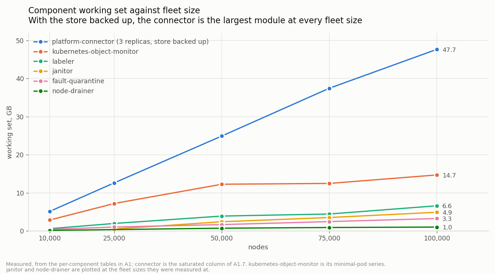


| Nodes   | Total   | platform-connector | kubernetes-object-monitor | fault handling | other services | MongoDB  |
| ------- | ------- | ------------------ | ------------------------- | -------------- | -------------- | -------- |
| 10,000  | ~22 GB  | 5.1 GB             | 2.9 GB                    | 0.5 GB         | 0.9 GB         | 12.9 GB  |
| 25,000  | ~62 GB  | 12.6 GB            | 7.2 GB                    | 1.5 GB         | 2.2 GB         | 38.7 GB  |
| 50,000  | ~123 GB | 24.9 GB            | 12.3 GB                   | 4.8 GB         | 4.1 GB         | 77.3 GB  |
| 100,000 | ~187 GB | 47.7 GB            | 19.8 GB                   | 9.2 GB         | 7.2 GB         | 103.1 GB |


Fault handling is fault-quarantine, node-drainer, fault-remediation and janitor; other services is labeler, preflight and health-events-analyzer. Each column sums those services' tables below at that fleet size, with the connector's figure for when MongoDB falls behind, from the ten-point sweep in A1.7. The 100,000-node row is the loaded fleet, with a pod on every node. labeler is measured with two pods per node throughout, because the DCGM and driver DaemonSets scale with the fleet. MongoDB is the recommended container limit across its three members at 0.01 events per node per second (4, 12, 24 and 32 Gi per member), from [Sizing the WiredTiger cache](#sizing-the-wiredtiger-cache).

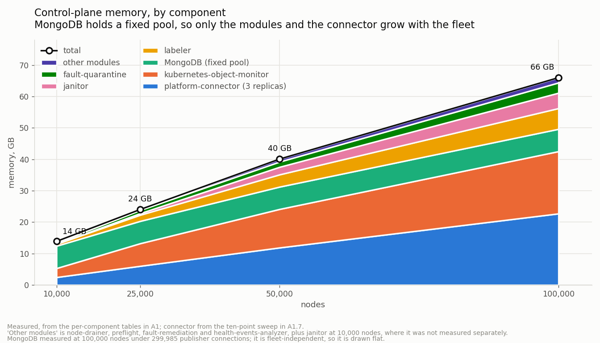

One note should be called here: memories in the graph above were considered to that of peak and not steady state, this sometimes differs by large margin because a module that prunes an object still holds the full one while it does so. As an example:


| Component | peak    | settled | peak per node | vs raw wire |
| --------- | ------- | ------- | ------------- | ----------- |
| labeler   | 6.54 GB | 2.0 GB  | 247,550 B     | 4.5x        |


Similar things happened with the pods:


| Component                 | settled B/pod | peak B/pod | computed B from transform            |
| ------------------------- | ------------- | ---------- | ------------------------------------ |
| kubernetes-object-monitor | ~3,700        | ~4,400     | ~175                                 |
| node-drainer              | ~4,900        | ~6,200     | 599 if drain eligible, 205 otherwise |
| preflight                 | ~4,200        | ~5,200     | ~110                                 |


Lets walk over component by component:

### kubernetes-object-monitor

Node + Pod watches, one per enabled policy; CEL-derived transform (#1720). The shipped Pod policy is cluster-wide, so the pods it watches are every pod on the cluster; the benchmark policy used for the grid below is scoped to one namespace so the watched-pod count is the controlled variable. Marginal per-node cost **132,000 B/node**, from 2.86 G at 10,005 nodes to 14.70 G at 100,005 with no watched pods, both taken on a process that was not CPU-limited.

**The Pod transform throws away almost the whole object.** A pod arrives at 40,644 B on the wire and the CEL-derived transform keeps eight fields of it -- `apiVersion`, `kind`, five pieces of `metadata`, `spec.nodeName` and `status.phase` -- which is **~175 B, under half a percent of what was sent**. Everything else, and in a production pod that is mostly container spec and env, is dropped before it reaches the cache.

Every row is a restarted process left to converge, with the benchmark Pod policy described under Deployed configuration.


| Nodes   | Watched pods | CPU limit | CPU med/peak `[M]` | Throttled `[M]` | Working set peak `[M]` | Rec. request | Rec. limit |
| ------- | ------------ | --------- | ------------------ | --------------- | ---------------------- | ------------ | ---------- |
| 10,005  | 0            | 2         | 0.06 / 0.07        | 0.0%            | 2.86 G                 | 3 Gi         | 5 Gi       |
| 10,005  | 25,000       | 2         | 0.08 / 0.29        | 0.0%            | 4.05 G                 | 4 Gi         | 6 Gi       |
| 10,005  | 50,000       | 2         | 0.07 / 0.08        | 0.0%            | 5.15 G                 | 5 Gi         | 8 Gi       |
| 10,005  | 100,000      | 2         | 0.07 / 0.78        | 0.0%            | 11.86 G                | 12 Gi        | 18 Gi      |
| 25,005  | 0            | 2         | 0.16 / 0.32        | 0.1%            | 7.20 G                 | 7 Gi         | 11 Gi      |
| 25,005  | 25,000       | 2         | 0.16 / 0.20        | 0.1%            | 8.29 G                 | 8 Gi         | 12 Gi      |
| 25,005  | 50,000       | 2         | 0.17 / 0.41        | 0.1%            | 9.68 G                 | 10 Gi        | 15 Gi      |
| 25,005  | 100,000      | 2         | 0.56 / 0.64        | 3.7%            | 12.26 G                | 12 Gi        | 18 Gi      |
| 50,005  | 0            | 2         | 0.36 / 0.59        | 0.7%            | 12.26 G                | 12 Gi        | 18 Gi      |
| 50,005  | 25,000       | 2         | 0.34 / 0.84        | 0.7%            | 12.19 G                | 12 Gi        | 18 Gi      |
| 50,005  | 50,000       | 2         | 0.33 / 0.69        | 0.4%            | 12.26 G                | 12 Gi        | 18 Gi      |
| 50,005  | 100,000      | 2         | 1.02 / 1.81        | 5.3%            | 12.47 G                | 12 Gi        | 18 Gi      |
| 75,005  | 0            | 4         | 0.99 / 1.54        | 0.9%            | 12.47 G                | 12 Gi        | 18 Gi      |
| 75,005  | 25,000       | 4         | 1.06 / 1.39        | 2.2%            | 12.31 G                | 12 Gi        | 18 Gi      |
| 75,005  | 50,000       | 4         | 1.72 / 2.52        | 6.2%            | 13.02 G                | 13 Gi        | 20 Gi      |
| 75,005  | 100,000      | 4         | 3.24 / 3.68        | 4.3%            | 17.57 G                | 17 Gi        | 26 Gi      |
| 100,005 | 0            | 8         | 4.09 / 5.37        | 4.6%            | 14.70 G                | 14 Gi        | 21 Gi      |
| 100,005 | 25,000       | 8         | 5.34 / 5.37        | 5.0%            | 14.28 G                | 14 Gi        | 21 Gi      |
| 100,005 | 50,000       | 8         | 5.28 / 5.41        | 5.2%            | 14.84 G                | 14 Gi        | 21 Gi      |
| 100,005 | 100,000      | 8         | 5.48 / 6.12        | 2.0%            | 19.81 G                | 19 Gi        | 29 Gi      |


CPU has to be sized with the fleet: the process uses 0.06 cores at 10,005 nodes, 0.36 at 50,005, one to 3.24 at 75,005 depending on watched pods and 4.09 to 5.48 at 100,005, so size it at 2 cores to 50,000 nodes, 4 to 75,000 and 8 at 100,000. Undersizing costs memory rather than latency -- the identical 100,005-node, zero-pod configuration reads 19.33 G under a 2-core limit and 14.70 G under 8, because a process that cannot run its collector lets the heap run ahead of it -- and it shows up as a CPU figure that stops moving with the workload, not as throttling, which sits at a few percent of periods costing 0.3-0.5 ms each even with ample headroom.

**Working set is a high-water mark, not a measure of retained data.** It is set by the initial informer sync and then held: `heap_sys` reaches ~12.25 GB while syncing 50,005 nodes and `heap_released` stays at 0.26 GB, so the container keeps ~12.26 GB whatever happens afterwards. That is why the 50,005-node rows are flat at 12.2-12.5 GB across a 100,000-pod range -- the pod data fits inside slack the process already held. Where the node cache is small there is no slack to hide in, and the same pods are fully visible: at 10,005 nodes the first 50,000 pods cost 2.29 GB of working set.

Heap tells the other half, and it is consistent where measured. At 50,005 nodes, median `go_memstats_heap_alloc_bytes` over the same window:


| Watched pods | heap median | per pod |
| ------------ | ----------- | ------- |
| 0            | 8.77 GB     | --      |
| 25,000       | 9.75 GB     | 39 KB   |
| 50,000       | 10.47 GB    | 34 KB   |
| 100,000      | 10.76 GB    | 20 KB   |


So the live cost of a watched pod is about **20 KB**, matching the 20,039 B of annotations the transform retains, while the working-set cost ranges from nothing to 134 KB per pod depending purely on how much sync headroom the node cache left behind.

The practical consequence for sizing is that the limit has to cover the sync peak, and sync happens on every restart, rollout and leader change rather than only at install. Provisioning from a settled steady-state figure under-provisions for the event that occurs most often.

### fault-quarantine

Per-node cost **32,567 B/node**; retained bytes/node `33,144-34,337` `[I]`. fault-quarantine derives, from the configured rules, the label and annotation keys it actually reads, and drops the rest as each object enters the informer, so what it caches per node is a function of the rules rather than of the node:


| Nodes   | CPU med/peak `[M]` | Working set peak `[M]` | B/node | Rec. request | Rec. limit |
| ------- | ------------------ | ---------------------- | ------ | ------------ | ---------- |
| 10,005  | 0.015 / 0.017      | 0.390 G                | 38,980 | 1 Gi         | 2 Gi       |
| 25,010  | 0.052 / 0.152      | 1.024 G                | 40,944 | 2 Gi         | 3 Gi       |
| 50,010  | 0.061 / 0.187      | 1.660 G                | 33,193 | 2 Gi         | 3 Gi       |
| 75,010  | 0.116 / 0.199      | 2.448 G                | 32,636 | 3 Gi         | 5 Gi       |
| 100,010 | 0.123 / 0.204      | 3.257 G                | 32,567 | 4 Gi         | 6 Gi       |


Per-node cost settles at about **32.3 KB**, converging from 50,000 nodes upward; the smaller fleets sit near 39-41 KB because a fixed term has not yet amortised.

One qualification on using these rows for sizing. They were measured with no event load, so they cover the cache rather than the cache plus a working event stream. On a build measured both ways at 100,000 nodes, driving 0.1 events per second per node with a 1:4 ratio of fatal to non-fatal cost 1.71 G above idle, which is the order of headroom the request column does not include.

### labeler

Eager informers, five in total: one for Nodes with a fixed field projection, **three pod informers**, each label-scoped -- `app in (dcgm, driver)`, the driver-component label excluding that app, and `k8s-app=<gke-installer>` -- and one for ResourceSlice objects.


| Nodes   | Labelled pods           | Settled | Sync peak | CPU med/peak | Rec. request | Rec. limit |
| ------- | ----------------------- | ------- | --------- | ------------ | ------------ | ---------- |
| 100,005 | 200,010 (DCGM + driver) | 6.60 G  | 7.0 G     | 0.06 / 0.16  | 7 Gi         | 11 Gi      |
| 75,005  | 150,000 (DCGM + driver) | 4.44 G  | 5.53 G    | 0.11 / 0.78  | 6 Gi         | 9 Gi       |
| 50,005  | 100,000 (DCGM + driver) | 3.90 G  | 3.97 G    | 0.11 / 0.45  | 4 Gi         | 6 Gi       |
| 25,005  | 50,000 (DCGM + driver)  | 1.96 G  | 2.58 G    | 0.05 / 0.33  | 3 Gi         | 5 Gi       |
| 10,005  | 20,000 (DCGM + driver)  | 0.59 G  | 0.59 G    | 0.01 / 0.19  | 768 Mi       | 2 Gi       |


The bootstrap sweep is serial, one node and one PATCH at a time, and labeler runs raw client-go informers rather than a controller-runtime manager, so there is no concurrency setting to raise.

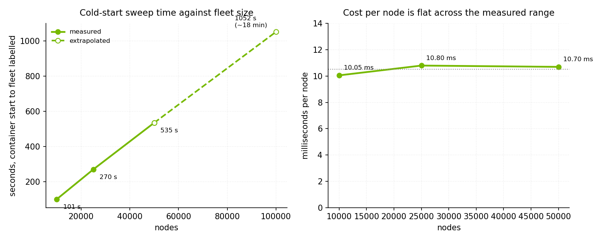

Measured as a first-install cold start: a freshly created fleet carrying none of labeler's labels, a Ready DCGM pod and a Ready driver pod on every node so the full label path runs, and KWOK verified renewing node leases throughout. Timed from container start to the `Completed initial node label reconciliation` line, so informer sync is included. `[M]`


| Nodes  | Cold start | Per node |
| ------ | ---------- | -------- |
| 10,005 | 100.6 s    | 10.06 ms |
| 25,005 | 270 s      | 10.80 ms |
| 50,005 | 535 s      | 10.70 ms |


Cost per node is flat across a 5x change in fleet size, which puts a 100,000-node first install at roughly **18 minutes**. That point is extrapolated: it needs 200,010 pods, and the harness could not keep that many consistently Running and Ready. Each node costs one PATCH whatever changes, and the sweep writes four labels.

The sweep repeats on every restart and leader election, but only a first install pays that price. Restarting against an already-labelled fleet costs **0.50 ms per node** -- 5.0 s for the same 10,005 nodes that took 100.6 s cold, with no writes at all -- because the patcher drops an empty patch and skips the API call. A restart at 100,000 nodes is therefore seconds rather than the 18 minutes a first install costs. `[M]`

`--kube-api-qps=500` is slack throughout. At 10.5 ms per node a serial sweep issues under 100 PATCHes per second, a fifth of the limit, and the steady-state path writes only on relevant events.

### node-drainer

Node drainer strips pods depending on whether they are drain eligible or not:


| Pod type        | Cost per pod | Basis                                                                                         |
| --------------- | ------------ | --------------------------------------------------------------------------------------------- |
| drain-eligible  | 4,850 B      | measured: 731 -> 200,731 pods at fixed 10,000 nodes, on 44,593 B pod objects                  |
| DaemonSet-owned | 3,406 B      | derived: 2.34 GB at 53,513 nodes / 642,243 pods, minus the node term, on ~9,626 B pod objects |


Now the scale sweep:


| Nodes   | Pods     | CPU med/peak `[M]` | Working set peak `[M]` | Rec. request | Rec. limit |
| ------- | -------- | ------------------ | ---------------------- | ------------ | ---------- |
| 10,005  | 0        | 0.01 / 0.01        | 0.14 G                 | 256 Mi       | 512 Mi     |
| 50,005  | 0        | 0.08 / 0.16        | 0.715 G                | 768 Mi       | 2 Gi       |
| 75,005  | 0        | 0.09 / 0.21        | 0.898 G                | 1 Gi         | 2 Gi       |
| 75,005  | ~100,000 | 0.19 / 0.48        | 1.00 G                 | 1 Gi         | 2 Gi       |
| 100,005 | 0        | 0.13 / 0.20        | 1.01 G                 | 1 Gi         | 2 Gi       |
| 100,005 | ~100,000 | 0.10 / 0.38        | 1.04 G                 | 1 Gi         | 2 Gi       |


Those figures are with an empty queue. node-drainer holds one entry per pending event, so a backlog is memory they do not include. It queues a node name, event ID and document ID whichever path the event arrives on, and the two runs agree:


| Backlog source | Queued events | Working set      | Per event `[M]` |
| -------------- | ------------- | ---------------- | --------------- |
| replay         | ~200,000      | 182 → 315 MB     | 0.67 KB         |
| replay         | 1,048,415     | 255.7 → 979.7 MB | 0.69 KB         |


### fault-remediation

No Kubernetes watches, and Node reads bypass the cache (`Client.Cache.DisableFor`). Working set is **flat at 0.014-0.019 GB from 4,933 to 53,513 nodes**, and unaffected by pod count. CPU 0.09 med / 0.18 peak.


| Nodes   | Pods     | CPU med/peak `[M]` | Working set peak `[M]` | Rec. request | Rec. limit |
| ------- | -------- | ------------------ | ---------------------- | ------------ | ---------- |
| 4,933   | 731      | 0.09 / 0.18        | 0.015 G                | 2 Gi         | 4 Gi       |
| 53,513  | 642,243  | 0.09 / 0.18        | 0.019 G                | 2 Gi         | 4 Gi       |
| 75,005  | ~100,000 | 0.07 / 0.08        | 0.07 G                 | 2 Gi         | 4 Gi       |
| 100,005 | ~100,000 | 0.01 / 0.04        | 0.02 G                 | 2 Gi         | 4 Gi       |


The flat profile is the point: this component is sized by its remediation rate, not by fleet size.

Those figures are with an empty queue, and the queue is where this component's memory actually goes. It holds one entry per pending event, retaining a document ID rather than the decoded event on either path.


| Backlog source | Queued events | Per event `[M]` |
| -------------- | ------------- | --------------- |
| cold start     | 1,037,329     | 0.55 KB         |
| live stream    | 1,113,804     | 1.40 KB         |


Each per-event figure is the working-set increase over that run's own baseline divided by the events queued, and the same axes put node-drainer's two paths beside them:

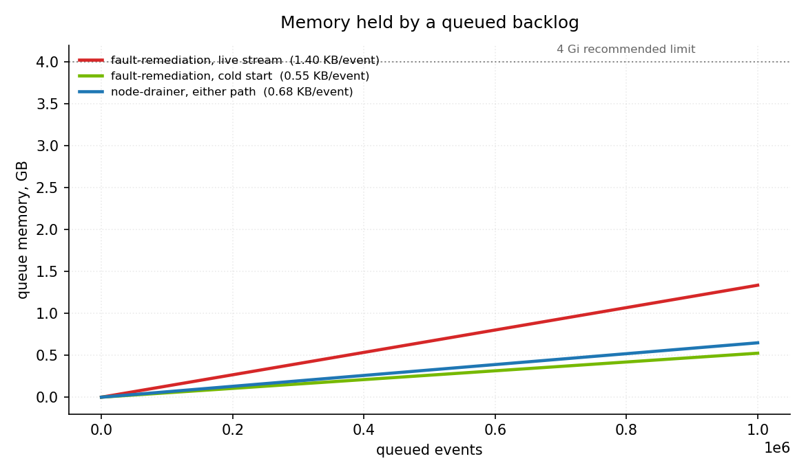

Recommended **2 Gi / 4 Gi**. The working set is a rounding error, but a queued backlog is not: 4 Gi covers roughly three million events on the live path.

### preflight

Pod informer only; no Node cache.


| Nodes   | Pods     | CPU med/peak `[M]` | Working set peak `[M]` | Rec. request | Rec. limit |
| ------- | -------- | ------------------ | ---------------------- | ------------ | ---------- |
| 4,933   | 731      | 0.01 / 0.01        | 0.24 G                 | 256 Mi       | 512 Mi     |
| 10,000  | 364,217  | 0.01 / 0.02        | 1.92 G                 | 2 Gi         | 3 Gi       |
| 25,005  | 731      | 0.01 / 0.01        | 0.24 G                 | 256 Mi       | 512 Mi     |
| 75,005  | ~100,000 | 0.02 / 0.04        | 0.44 G                 | 512 Mi       | 768 Mi     |
| 100,005 | ~100,000 | 0.03 / 0.16        | 0.54 G                 | 768 Mi       | 2 Gi       |


Preflight is the only component on the Pod admission path, so its cost is per admission rather than per node. The webhook's own handling is cheap and does not saturate: pods created into a selected namespace were admitted at **3 ms P50 and 5 ms P99, flat to 380 admissions/s** on one replica, with no rejections. `[M]`

What a pod creation actually pays is larger than that handling time, and it is worth stating separately because it applies to every ordinary pod, not only to gangs. Identical non-gang pods were created into two namespaces, one carrying `nvsentinel.nvidia.com/preflight: enabled` and one not, alternating between the two so API-server load fell on both equally, with `spec.nodeName` preset so the scheduler was out of the path:


| Arrival       | With preflight | Without       | Added       |
| ------------- | -------------- | ------------- | ----------- |
| serial        | 357.6 ms P50   | 352.1 ms P50  | **+5.6 ms** |
| 32 concurrent | 797.2 ms mean  | 787.3 ms mean | **+9.9 ms** |


So preflight adds roughly **6 to 10 ms per pod creation**, against a baseline of about 350 ms for a GPU-requesting pod through the API server. That is more than the 3 ms of webhook handling above, and the difference is not overhead in the webhook: an admitted pod carries three injected init containers and an extra volume, so the CREATE persists a larger object. Under concurrency the P90 and P99 are within 2 ms of each other in both namespaces, because the tail there belongs to API-server queueing rather than to admission, which is why the mean rather than a percentile is the figure quoted for that row. Injection was confirmed by reading back the admitted pods: those in the selected namespace carry all three init containers, those in the control namespace carry none. `[M]`

Gang coordination is the expensive path and the only one that calls the Kubernetes API, doing one peer discovery and one ConfigMap write per gang member. Each gang was created as one burst from 64 concurrent writers into a namespace of its own, with the three shipped checks configured, on one replica; the rate is gang members admitted per second, since every CREATE blocks on the webhook:


| Gang size | Admitted in | Members/s | Admission P50 | Admission P99 | `fail_open` | Peers registered |
| --------- | ----------- | --------- | ------------- | ------------- | ----------- | ---------------- |
| 512       | 5.1 s       | 99.9      | 14.8 ms       | 24.9 ms       | 0           | 512 of 512       |
| 1,028     | 8.4 s       | 122.8     | 15 ms         | 25 ms         | 0           | 1,028 of 1,028   |
| 2,048     | 14.2 s      | 143.8     | 14.6 ms       | 24.8 ms       | 0           | 2,048 of 2,048   |


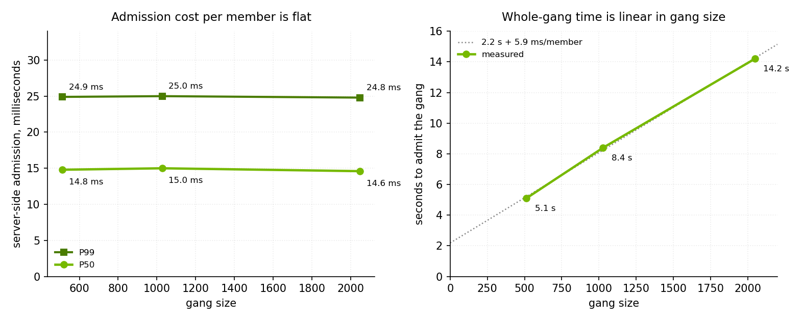

Per-member admission cost does not move across a 4x change in gang size, and every gang registered all of its peers with no fail-open. Gang size is therefore not a scaling axis for preflight: a gang costs what its members cost, and the ConfigMap write per member does not get more expensive as the file grows. Whole-gang time fits 2.2 s + 5.9 ms per member across the three points, but that slope belongs to the API server and the 64-writer harness, not to preflight, whose share is 15 ms spread across 64 concurrent admissions.

Members/s is not a preflight ceiling, which is why it rises with gang size rather than falling. Client-observed CREATE latency sits at 0.37-0.43 s P50 against 15 ms of webhook time, so almost all of it is the API server and the writers rather than preflight, and the larger gangs simply amortise the harness ramp better. At 15 ms per admission, 64 concurrent writers would have to reach roughly 4,000/s before preflight itself became the constraint.

Preflight carries no client-side rate limit and no setting to impose one, which is what makes this work. It is synchronous on admission, so a limit becomes latency against the webhook's fixed 10 s deadline rather than queueing: the 1,028 gang run against a build limited to 5 QPS took 167.0 s, sat at 17,500 ms admission P50, failed the API server open 1,006 times, and left the gang stuck at 51 registered peers out of 1,028, a count that had not moved five minutes later. That is a permanently incomplete gang advertising a quorum that never existed, which is worse than none. `[M]`

### health-events-analyzer

Not a Kubernetes API consumer; it reads the event stream from MongoDB, so its cost follows event rate rather than fleet size.


| Event rate    | CPU peak `[M]` | Working set `[M]` | Rec. request | Rec. limit |
| ------------- | -------------- | ----------------- | ------------ | ---------- |
| idle          | 0.002          | 25.5 MB           | 128 Mi       | 256 Mi     |
| 36.9 events/s | 0.214          | 19.6-20.1 MB      | 128 Mi       | 256 Mi     |


Memory is a fixed cost of about 25 MB at any rate, and CPU is not a sizing lever: the component spends most of each event blocked on a MongoDB aggregation, so it uses about 0.2 cores at saturation against a 2-core limit and records zero throttled CFS periods. Recommended **256 Mi / 512 Mi**; the deployed 500m CPU request already covers the saturated draw and raising it does not raise throughput.

Throughput is set by that per-event round trip and by how many run at once. The component's `health_event_analyzer_event_handling_duration_seconds` histogram reports **17.6 ms** per event, about 5.8 ms of it CPU, and per-event wall time held between 17.5 and 19.4 ms from 1.8 to 55 events/s, so cost per event is flat under load. One worker tops out near 55 events/s regardless of fleet size. `--workers` partitions events by node across concurrent workers and defaults to 1.

Measured by injecting a 20,000-event backlog onto a live change stream at 100,010 nodes and reading the drain rate from that histogram:


| Workers | Sustained throughput `[M]` | Speedup |
| ------- | -------------------------- | ------- |
| 1       | 54.3 events/s              | --      |
| 8       | 308.8 events/s             | 5.7x    |


Both arms drained the full backlog, so these are sustained rates rather than peaks. Eight workers return 5.7x rather than 8x because the per-event cost is a database round trip and MongoDB becomes the shared bottleneck, so the useful worker count is bounded by what the datastore absorbs rather than by CPU on this container. A 100,000-node fleet at 0.1 events per node per second offers 10,000 events/s, which is well above either figure, so the worker count has to be sized against the expected event rate rather than left at its default.

### janitor

Node informer created **lazily** on the first `TerminateNode` reconcile, so an idle janitor is **flat at 0.022 GB regardless of fleet size**. Once triggered it costs **19,616 B/node.**

Retained bytes/node `~10,120` computed `[I]`; the measured 19,616 B is 1.94x that, the gap being Go map and pointer overhead. **Size for the triggered case**: 1 GB at 50k nodes, not the 22 MB an idle pod shows. Recommended **2 Gi / 4 Gi** at 50k.

Per scale point, for the triggered case. An untriggered janitor reads 0.022-0.055 G at every fleet size, so the idle row is not a sizing figure.


| Nodes   | Pods     | CPU med/peak `[M]` | Working set peak `[M]`           | Rec. request | Rec. limit |
| ------- | -------- | ------------------ | -------------------------------- | ------------ | ---------- |
| any     | any      | 0.01 / 0.01        | 0.03 G untriggered               | —            | —          |
| 25,005  | 731      | 0.02 / 0.04        | 0.93 G sync peak, 0.50 G settled | 1 Gi         | 2 Gi       |
| 50,005  | 731      | 0.03 / 0.07        | 2.41 G                           | 3 Gi         | 5 Gi       |
| 75,005  | ~100,000 | 0.13 / 0.29        | 3.52 G                           | 4 Gi         | 6 Gi       |
| 100,005 | 731      | 0.05 / 0.09        | 4.17 G                           | 4 Gi         | 6 Gi       |
| 100,005 | ~100,000 | 0.10 / 0.36        | 4.90 G                           | 5 Gi         | 8 Gi       |


### Node agents, per GPU node `[M]`

Everything above is a central component whose cost is paid once for the fleet. These four run as DaemonSets, so their cost is paid once per node and multiplies by fleet size. They could not be measured on the simulated fleet -- KWOK nodes run no containers, and metadata-collector exits immediately on a node without NVML -- so this section was measured on a separate cluster of real 8-GPU A100 nodes (`Standard_ND96amsr_A100_v4`) running the agents at v1.23.0, three nodes, median per node.


| Agent                 | Idle CPU | Idle working set | Under load | Load working set |
| --------------------- | -------- | ---------------- | ---------- | ---------------- |
| gpu-health-monitor    | 0.0009   | 37.9 MB          | 0.0010     | 38.8 MB          |
| syslog-health-monitor | 0.0010   | 17.0 MB          | 0.0188     | 18.0 MB          |
| metadata-collector    | 0.0001   | 28.9 MB          | 0.0007     | 41.4 MB          |
| platform-connector    | 0.0011   | 21.2 MB          | —          | —                |


A GPU node pays about **0.003 cores and 105 MB** at rest, rising to roughly 0.021 cores and 120 MB under the loads below.

**Only the syslog monitor responds to a noisy journal, and only to kernel messages.** 1,622 kernel lines per second per node took it from 0.0010 to 0.0188 cores, 19x, with memory flat. User-space log volume is free: 5,628 lines per second through `logger` on a separate cluster moved nothing, because the monitor matches `_TRANSPORT=kernel` inside the journald query and resumes from a stored cursor, so non-kernel entries are excluded before it reads them.

**Pod density reaches metadata-collector.** 80 additional pods on one node took it from 0.0005 to 0.0007 cores and from 34 to 41 MB. Its mapper lists all pods from the kubelet `/pods` endpoint, so it tracks total pods on the node rather than GPU-allocated ones.

**Network is not a term.** The three loaded nodes ran 2.4-2.9 Mbit/s in and 4.0-4.3 Mbit/s out, against medians of 2.09 and 2.86 Mbit/s across all 26 GPU nodes on that cluster, so the agents' contribution is inside the noise. conntrack sat at 1,134-1,666 entries of 262,144, about 0.5%.

**The requests are the cost that matters, not the usage.** The chart requests 100m CPU and 128Mi for each of the three health agents, so a GPU node reserves 300m and 384Mi to run work measured at about 3m and 105 MB. That is roughly a hundredfold over-reservation on CPU, and on a 1,000-node GPU fleet it reserves 300 cores for what three would serve.

Two limits on these numbers. Per-pod network and CFS throttling are not included because `container_network_`* and `container_cpu_cfs_throttled_seconds_total` are not scraped on that cluster, so node-level network is used instead and throttling against the 500m limit is unverified. And the agents ran with `STORE_AND_ANALYSE` rather than the shipped `EXECUTE_REMEDIATION`, since a real DCGM fault would otherwise have cordoned a shared cluster's nodes; that changes what happens after detection, not the detection work being measured.

### platform-connector, deployment mode `[M]`

The platform connector runs as a central Deployment that publishers reach over gRPC, enabled by `platformConnector.deployment.enabled`. Measured on upstream main, three replicas. Each publisher holds one gRPC connection and each node runs three, so a fleet-shaped run carries three per node -- 299,985 of them at 100,000 nodes. Runs that use a different connection count say so.

#### Connections to the datastore

The database connection count collapses to a fixed 48 sockets, whatever the fleet does. Eighteen are monitoring connections, two per replica-set member per connector replica, which the driver opens regardless of load and never closes. The rest is the write pool, and it appears only on the primary, since read preference is Primary and writes go there: bounded per server at `DATASTORE_MAX_CONNECTIONS`, three replicas hold at most thirty. The pool grows to the peak number of concurrent writes and does not shrink back: removing every publisher leaves the count where it was. So 48 is both the ceiling and what a connector that has once been busy goes on holding.

Against the DaemonSet arrangement, which opens seven connections per node -- three to the primary and two to each secondary -- that is four orders of magnitude, and it replaces a per-node term with one fixed by replica count and pool size. It is also what removes MongoDB's per-node memory: 170 GB resident across three members at 100,000 nodes, against the 7.1 GB A2 measures at the same fleet.

#### Resources against fleet size

Measured at ten fleet sizes with three connections per node -- one for each health-monitor DaemonSet a GPU node runs -- over nodes carrying the label set the chart ships. Each connection publishes 0.3 events a minute, about 1,500 events/s at the 100,000-node point, which is well inside the ingest ceiling, so nothing here is waiting on the store. What a blocked connection costs instead is in [Ingest rate and sizing](#ingest-rate-and-sizing).


| Nodes   | Connections | Total working set | Per replica | Per replica, MongoDB behind | CPU, three replicas | Rec. memory request | Rec. memory limit | Rec. CPU request | Rec. CPU limit |
| ------- | ----------- | ----------------- | ----------- | --------------------------- | ------------------- | ------------------- | ----------------- | ---------------- | -------------- |
| 2,000   | 6,000       | 515 MB            | 172 MB      | 361 MB                      | 0.04                | 1 Gi                | 2 Gi              | 50m              | 100m           |
| 5,000   | 15,000      | 1,231 MB          | 410 MB      | 861 MB                      | 0.08                | 1 Gi                | 2 Gi              | 50m              | 100m           |
| 7,500   | 22,500      | 1,842 MB          | 625 MB      | 1,313 MB                    | 0.12                | 1 Gi                | 2 Gi              | 50m              | 100m           |
| 10,000  | 30,000      | 2,441 MB          | 814 MB      | 1,709 MB                    | 0.15                | 1 Gi                | 2 Gi              | 50m              | 100m           |
| 15,000  | 45,000      | 3,621 MB          | 1,214 MB    | 2,549 MB                    | 0.22                | 2 Gi                | 3 Gi              | 100m             | 150m           |
| 25,000  | 75,000      | 6,009 MB          | 2,003 MB    | 4,206 MB                    | 0.35                | 2 Gi                | 4 Gi              | 150m             | 250m           |
| 35,000  | 105,000     | 8,346 MB          | 2,784 MB    | 5,846 MB                    | 0.46                | 3 Gi                | 6 Gi              | 200m             | 300m           |
| 50,000  | 150,000     | 11,863 MB         | 3,954 MB    | 8,303 MB                    | 0.74                | 4 Gi                | 8 Gi              | 250m             | 400m           |
| 75,000  | 224,985     | 17,797 MB         | 5,945 MB    | 12,485 MB                   | 1.70                | 6 Gi                | 12 Gi             | 600m             | 900m           |
| 100,000 | 299,985     | 22,698 MB         | 7,566 MB    | 15,889 MB                   | 1.94                | 8 Gi                | 15 Gi             | 650m             | 1000m          |


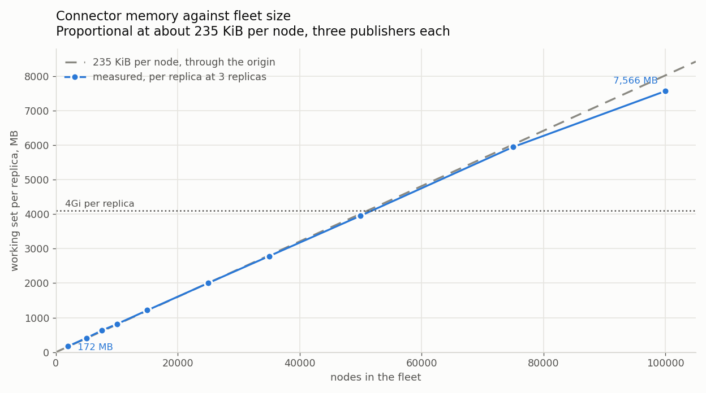

Memory is proportional to fleet size at about 235 KiB per node, flat to within 6.5% across a fiftyfold range. About 97% of that is the connections a node holds and 3% the labels cached for it, so one publisher fewer per node moves about a third of the cost where emptying `allowedLabels` moves 3%. The measurement is in [Connector memory: connections against label cache](#connector-memory-connections-against-label-cache-m).

Requests and limits are per replica, with the CPU figures the measured usage divided by three.

The working-set columns are from the **quiet** sweep: MongoDB kept up, so almost no request was waiting and a connection cost about 79 KiB. MongoDB falls behind when it accepts events more slowly than publishers send them. Each connection then also holds a request waiting for its write, and costs 165-171 KiB, about 2.1x quiet. The "MongoDB behind" column is the quiet per-replica figure times 2.1, and the memory limit is set to cover it, rounded up to the next whole Gi. The 1.5x rule the rest of this report uses does not apply to this component, because its memory tracks requests in flight and the quiet sweep has none. Requests stay as measured; a limit costs nothing until it is used.

#### Ingest rate and sizing

Ingest throughput is capped by the chart's datastore connection pool, not by the connector or by MongoDB. Driving the same 40,000 connections at one event per second per node -- a 20,000 events/s offer -- the path settles at 4,925 events/s and publishers block for seconds waiting their turn. Neither CPU nor memory is what blocks them: the connector and mongod both sit well inside their limits with no throttling. The pool is what is at a limit, and the chart sets it per replica:

```
DATASTORE_MAX_CONNECTIONS=10
```

The driver applies that bound per server rather than per client, so each replica may hold up to ten connections to each of the three members. Writes go only to the primary, so what bounds ingest is three replicas times ten against that one member: thirty writes in flight. A write takes the 6-7 ms the P50 above holds steady at, which is 4,300-5,000 events/s. Raising the bound to 30 per replica and changing nothing else:


|                     | Pool 10 per replica | Pool 30 per replica                |
| ------------------- | ------------------- | ---------------------------------- |
| Achieved rate       | 4,925 events/s      | 10,525 events/s, peaking at 13,367 |
| Connector memory    | 7.4 GB              | 6.4 GB                             |
| Busiest replica CPU | 0.51 of 2 cores     | 0.89 of 2 cores                    |
| CPU per event       | 0.237 ms            | 0.132 ms                           |


The ceiling is the pool divided by how long one write occupies a pooled connection, and almost all of that time is the majority write concern rather than the write. Measured on the primary, a write executes in 130 microseconds at 2,000 events/s and 223 at saturation, and nothing inside the server is contended. What costs is the acknowledgement, which the store client asks for explicitly:

Writing to the primary alone costs 0.8 ms and scales to 26,667 inserts/s, so MongoDB's write capacity is not involved; waiting for a second member costs an order of magnitude more, and throughput is the pool divided by that wait. The wait is not a constant -- it tracks how far the secondaries are behind, under 1.3 ms caught up and about 5 ms two seconds behind -- which is the feedback that makes the pool's returns diminish: tripling it returned 2.1x rather than 3x ([measurements](#majority-acknowledgement-against-replication-lag-m)).

Dividing through with the range measured here: 30 pooled connections at 4,925 events/s implies 6.1 ms per operation, and 90 at 10,525 implies 8.5 ms, both inside the band above. A pooled connection spends under 4% of its time writing and the rest waiting for a second member, so the pool is a concurrency budget for waiting, and the chart sets it to 10 per replica.

The acknowledgement these numbers depend on is a property of the replica set and its placement -- three members in one cluster on gp3 EBS volumes here, where members spread across zones or regions would be slower again -- so a value tuned in one environment does not transfer.

The remedy is to raise `DATASTORE_MAX_CONNECTIONS` rather than add replicas, which cost memory (see [Scaling out](#scaling-out)). MongoDB can absorb far more concurrency than three pools of ten give it. Lowering the write concern would raise the ceiling severalfold and should not be done, because the majority acknowledgement is what makes a stored fault event durable.

**Recommended default: `DATASTORE_MAX_CONNECTIONS=30`.** It is the measured setting. It more than doubles the ceiling, to 10,525 events/s, and the connector uses less memory than at 10 because fewer publishers sit blocked. The primary does not notice the extra concurrency: it accepts 26,667 inserts/s when it does not wait for a second member.

**Pool or replicas.** They fix different limits. The pool sets throughput: raise it when the event rate you need is above the ceiling. Replicas set how many connections the deployment can hold: add one when connections per replica exceed what the memory limit allows, step 2 of the recipe below. Scaling out to buy throughput works, but spends a replica's memory on what a larger pool gives without it.

In proportion: a 50,000-node fleet at the 0.3 events/node/minute used elsewhere in this report is 250 events/s, against 4,925 at the shipped default, so the default is ample for steady state. It binds during a burst, and when it does the path does not drop events -- it blocks publishers.

A blocked publisher is memory the connector holds, which is how the pool comes to set memory as well as the ceiling. Events in flight on a replica are its throughput times the time a write takes, capped by the connection count, so raising the pool from 10 to 30 cut memory 14% across the same 40,000 connections, 7.4 GB down to 6.4 GB, while doubling throughput. The [sweep](#resources-against-fleet-size) measures the quiet case, so sizing from its slope leaves nothing for a slow store: a blocked connection costs about 1.85x a quiet one, roughly 89 KB per held event.

Per replica:

```
M_replica  =  M_fixed  +  a x (connections per replica)  +  b x (events held per replica)

M_fixed ~ 8 MB         a ~ 78 KiB per connection      b ~ 89 KB per event held
events held per replica  =  min(connections per replica, throughput x how long a write takes)
```

The `min` is the bound: in-flight can never exceed connections, and the worst case is a store slow enough that every connection is blocked at once. That puts a saturated connection at `a + b`, about 167 KiB against 78 quiet -- the same 40,000 connections cost 4.0 GB quiet and 7.4 GB saturated.

Size the pool first and the replica count second:


| Step | Quantity                                                                        | Basis                                                                                                                        |
| ---- | ------------------------------------------------------------------------------- | ---------------------------------------------------------------------------------------------------------------------------- |
| 1    | connections per replica = target throughput x how long a write takes / replicas | the write time measured on the cluster being sized, at that throughput rather than at rest                                   |
| 2    | connections per replica `<= M_limit / (a + b)`                                  | 26,000 at a 4Gi limit if the store saturates, 56,000 if `W` stays low                                                        |
| 3    | `R = ceil(publisher connections / connections per replica)`                     | how many publishers the fleet has                                                                                            |
| 4    | leave about 30% per-replica headroom                                            | the PodDisruptionBudget permits one down and the survivors absorb its connections: 2,265 MB to 2,851 MB per replica measured |


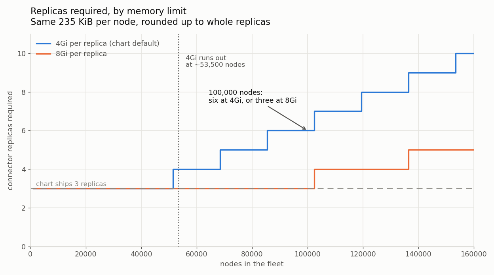

At three publishers per node and MongoDB falling behind, step 2 puts three replicas at 4Gi at about **26,000 nodes**, or 17,000 with one replica down. A 100,000-node fleet needs about 15 GiB per replica, so it is three replicas at 15Gi or twelve at 4Gi. Replicas buy throughput as well as memory, so scaling for one moves the other, with nothing in the chart or the metrics saying so, and they are not a free substitute for the reason in [Scaling out](#scaling-out). CPU never binds either way: 1.94 cores across three replicas at 100,000 nodes against the 2 each is allowed.

#### Scaling out

Adding a replica rebalances on its own in about twelve minutes -- nothing moves a connection except the client redialling, and `MaxConnectionAge` is 10m -- so scale out before the ceiling, not on crossing it. Each replica keeps its own verdict cache, but with one token per publisher that does not add TokenReviews (see [Health-monitor authentication](#health-monitor-authentication-m)).

## A2. Load on external components

*Measured at 50,021 nodes carrying 642,243 pods*

Where a table below shows three columns they are conditions on that fleet, not scale points -- idle, continuous load at 0.47 nodes/s, and a 100-node burst.

**Why 50,000 nodes and not 100,000.** etcd, not NVSentinel, set this ceiling. A fleet of 100,000 nodes carrying a pod each already sits close to the 16 GB threshold of the 4XL control-plane tier, and the run that carried 203,411 pods crossed it: etcd refused every write, including the deletes needed to recover, and only came back after compaction aged the churn out. Shrinking the simulated node would not have bought much room, because the bytes in etcd's five-minute revision window are overwhelmingly simulated-kubelet churn rather than anything NVSentinel writes. A 50,000-node fleet carrying 642,243 pods runs well clear of that edge, so the measurements are taken on a stable cluster rather than one on the verge of going read-only.

**Extrapolating to 100,000.** The quantities in this section are per-node or per-event costs, and those are the things that hold. A remediation costs a fixed number of API requests regardless of fleet size, and the two instantaneous stages scale linearly with how many nodes fail at once -- cordon holds 61-71 nodes/s and CR creation 11.9-13.0 nodes/s across a 10x range of burst sizes ([Burst absorption](#burst-absorption)). So at the same fault rate, doubling the fleet doubles the external load, and the difference between continuous and burst conditions is the event rate rather than the fleet size. What does not extrapolate is anything bounded by the 16 GB etcd threshold, which is a cliff rather than a slope: at 100,000 nodes the usable pod budget is roughly 100,000 at the 50 KB object size, and beyond it the cluster stops rather than slows.

**Almost none of this traffic is NVSentinel's.** Over a five-minute idle window the API server handled 585,415 audited requests and 568,470 of them -- **97.1%** -- came from `kwok` simulating kubelets. Broken down by resource on a 10,005-node fleet, 78% of PUTs are `pods/status`, written periodically by the kwok controller for every simulated pod, and the rest is lease renewal. Every NVSentinel component combined sits in the noise beside it: node-drainer at 1.85 requests/s and fault-remediation at 0.49/s, the latter entirely leader-election lease renewal, with the rest below the reporting threshold. That matters twice over. It means the API server and etcd figures here are dominated by the harness and bound NVSentinel's cost from above rather than measuring it, and it means a real cluster of the same size sees the same kubelet traffic from real kubelets, so the etcd budget is not an artifact. The full breakdown is in [API server load produced by the simulation harness](#api-server-load-produced-by-the-simulation-harness-m).

### Kubernetes API

NVSentinel's own request rate against the API server, measured from each component's `rest_client_requests_total` and from EKS audit logs for the three that register no client-go metrics:


| Component                 | Steady-state rate `[M]` | Per remediated node `[M]`   | What it spends it on                                                                                       |
| ------------------------- | ----------------------- | --------------------------- | ---------------------------------------------------------------------------------------------------------- |
| node-drainer              | 1.85/s                  | 3.7 + 3.0 per evictable pod | pod GETs on each recheck, plus a POST to the pod's `eviction` subresource (`PolicyV1().Evictions().Evict`) |
| fault-remediation         | 0.49/s                  | 9                           | 5 get, 3 update, 1 create                                                                                  |
| janitor                   | below threshold         | 6                           | 2 get, 2 update, 1 create, 1 delete                                                                        |
| janitor-provider          | below threshold         | 2.2                         | get                                                                                                        |
| fault-quarantine          | below threshold         | 1                           | 1 patch, the cordon                                                                                        |
| kubernetes-object-monitor | below threshold         | not per node                | 1 PUT per policy-match transition                                                                          |
| labeler                   | below threshold         | 0                           | 1 PATCH per relevant event                                                                                 |
| preflight                 | below threshold         | 0                           | per pod admission                                                                                          |


fault-remediation's steady-state 0.49/s is entirely leader-election lease renewal; it does no work until an event arrives. The per-node column is the burst measurement broken down in [What a remediation costs the API server](#what-a-remediation-costs-the-api-server-m), and it totals about 22 requests per remediated node on nodes with nothing to evict.

node-drainer is the one row that does not stay fixed, because it evicts. Its 3.7 is the baseline on a node with no drain-eligible pods; each evictable pod adds 3.0 calls, not one, because node-drainer re-evicts every pod still present on each recheck rather than waiting -- five pods on one node took 15 eviction calls over three retry cycles. A fleet at 5 evictable pods per node therefore costs 18.7 calls per node, which is what makes node-drainer the binding stage in the QPS table above.

Flow control has headroom that the fleet size does not threaten. APF peaked at **116 of 1,085 seats**, 11%, and rejected nothing in any window. That seat figure is whole-cluster, so it includes the simulation harness, which generates 97% of the requests on this cluster -- NVSentinel's own share of those seats is correspondingly smaller, and the 11% is an upper bound rather than NVSentinel's cost.

### Health-monitor authentication `[M]`

Authentication costs the API server a TokenReview on most events, and that cost is set by the fleet rather than by the fault rate. The check runs in a unary interceptor, so it is on the path of every RPC, and a positive verdict is held for a fixed two minutes rather than until the token expires -- TokenReview is the only check that notices the bound pod being deleted, so that TTL is also the window in which a deleted pod's token still works.

The cache is keyed by token. In production every publisher has its own token on its own connection, so a token is only checked by the replica that its connection lands on. Measured with one token per connection, 5,000 connections each sending one event per minute:


| Replicas | TokenReviews/s | Publish P50 | Publish P99 |
| -------- | -------------- | ----------- | ----------- |
| 3        | 17.2           | 4.6 ms      | 53 ms       |
| 5        | 19.8           | 4.5 ms      | 47 ms       |


Adding replicas barely changes the TokenReview rate. What extra replicas add is budget: each replica may send up to `TokenReviewQps` (1,000) reviews per second. A 100,000-node fleet with five publishers per node has 500,000 tokens, 100 times the measured run, so it needs about 1,700-2,000 TokenReviews/s. On three replicas that is about 570-660 per replica, under the budget.

A publisher that sends less often than the two-minute TTL needs a fresh review on every send. Timed from the publisher side, at 1,000 events/s through 40,000 connections, publishers sending every 200 seconds saw 12.7 ms P50 and 127 ms P99, against 10.5 ms and 65 ms for publishers that hit the cache.

Over the budget, publishes are not queued. Each review has 8 seconds to complete (`DefaultTokenReviewRetryWindow`). When the rate limiter cannot fit a review into that window, the connector answers `Unavailable` at once and the publisher retries. In steady state the budget is not reached. After a connector restart, every publisher needs a fresh review at once. Each replica admits about 8,000 reviews in the window, so at 100,000 nodes most first publishes are refused and retried, and the fleet is reviewed again in about three minutes at 1,000 per second per replica. That is inside the publisher's five-minute retry window. The three minutes is derived from the measured behaviour, not measured at 100,000 nodes.

Negative verdicts are not cached, so every request with a bad token costs a review, and it uses the same per-replica budget as good publishers. To show this, the budget was lowered to 15 reviews per second across three replicas and 500 publishers with bad tokens were added. The good publishers' successful sends fell from 16 to 5 per second, 2,565 of their publishes failed in 204 seconds, and their P90 rose from 37 ms to 5.4 s.

CPU does not bind at any fleet size measured: 1.94 cores across three replicas at 100,000 nodes, against the six they are allowed. Per event the marginal cost is about 0.2 ms, and raising the event rate tenfold at fixed fleet size raised CPU 2.5x, most of it the fixed cost of holding connections rather than per-event work.

### etcd


|                         | Idle            | Continuous                                  | Burst                                        |
| ----------------------- | --------------- | ------------------------------------------- | -------------------------------------------- |
| DB size, file-allocated | 16.73-16.75 GB  | 16.70 GB                                    | 15.76-16.75 GB                               |
| growth                  | none over 139 s | +288 objects / 638 s (0.45 obj/s, ~449 B/s) | +97 objects per 97 remediated nodes, ~94 KiB |


All growth under continuous load is RebootNode CRs at 993 B median; pods and nodes are unchanged. `apiserver_storage_size_bytes` varies by up to 983 MB between consecutive scrapes, because each API server instance reports its own etcd backend's file size and those files are allocated independently. It also never shrinks, since freed space is reused inside the file rather than returned. The etcd threshold is 16 GB across tiers, but in-use size is published only through CloudWatch, and CloudWatch itself degrades under the load that matters. Its peak reading of 14.59 GB, about 91% of the 4XL tier's 16 GB, is therefore the only signal available rather than an authoritative measurement, and neither that figure nor the 91% derived from it should be used as a margin. The gap is genuine -- no in-cluster metric reports in-use size, since `apiserver_storage_size_bytes` is file-allocated:

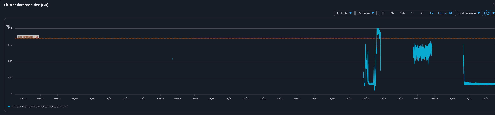

### MongoDB

Every figure below is from **Percona Server for MongoDB 8.0.12-4**, operator `crVersion` 1.21.1, a three-member replica set with each member limited to 8 cores and 4 Gi on a 32 Gi volume. The operator derives the WiredTiger cache from that limit, so each member runs `--wiredTigerCacheSizeGB=1.50` and resident memory is bounded rather than left to fill. That is the datastore NVSentinel is moving to. The chart still ships Bitnami MongoDB 8.0.3 as the default because the migration has not landed yet, so these runs set `mongodb-store.useBitnami` to `false` and measure the incoming default rather than the outgoing one. [#1516](https://github.com/NVIDIA/NVSentinel/issues/1516) benchmarked the two against each other and found write throughput identical, 500.0/s against 499.9/s sustained and 1,382/s against 1,361/s on an uncapped burst. Its connection-memory fit of 0.651 MB per connection does not apply here, because the connection count no longer scales with the fleet: the whole replica set holds 166 connections at 100,000 nodes. Encryption at rest is enabled and makes no visible difference.

Measured at **100,000 nodes** with 299,985 publishers connected to the three connector replicas, which is the fleet the deployment connector was sized at rather than the 50,021 the rest of A2 uses. Rates are `serverStatus` counter deltas over a measured 617-second window:


|                      | Idle                              | Under load, 1,495 events/s                                          |
| -------------------- | --------------------------------- | ------------------------------------------------------------------- |
| MongoDB connections  | 135 (51 / 44 / 40)                | 166 (81 / 44 / 41)                                                  |
| resident, per member | 1.86 / 0.74 / 1.60 GB             | 2.27 / 2.20 / 2.13 GB                                               |
| ops/s, primary       | --                                | insert 1,495.3, update 0.1, delete 0.5, query 10.4, getmore 1,875.8 |
| command/s, primary   | --                                | 2,016.5                                                             |
| oplog window         | 9.65 h                            | 1.32 h                                                              |
| storage              | 9,694 MB across 39,534,386 events | +785.40 MB across +2,735,879 events                                 |


The offered load is three times the fleet rate used elsewhere in this report. Each node holds three publisher connections and each publishes at 0.3 events per minute, so the fleet offers 0.9 per node per minute rather than 0.3. Inserts matched sends exactly, 1,495.3/s against 1,495/s, so nothing was buffered or lost, and the figures are conservative for a fleet running at 0.3.

Most of the command rate is work rather than chatter, which is the opposite of the DaemonSet arrangement: with 166 connections there is almost no heartbeat traffic left, and the primary's 2,016.5 command/s sits against 1,495.3 inserts. The secondaries carry `getmore` from replication and nothing else -- 1,734.3/s on one, and 6.8 command/s total on the other, which is the member not being tailed. Connections do not change under load beyond the write pool opening: 135 idle to 166 busy, against seven per node in the DaemonSet arrangement.

A remediated node costs **6.1 oplog entries, about 4 KB, and 1.96 stored documents** -- the event itself and its status record. Allocated storage does not move at this size, because those documents fit inside an extent the collection already holds. `[M]`

### Network bandwidth and ports `[M]`

Neither is close to binding. Across the 100,000-node runs the busiest real node peaked at 3.27 Gbit/s in and 3.17 Gbit/s out, 13% of the 25 Gbit/s baseline on a `c8a.16xlarge`, and conntrack peaked at 11,013 entries against a limit of 2,097,152, half a percent. Five real nodes carry the whole simulated fleet's traffic between them, so this is an aggregate rather than a per-node cost, and a production node running one agent sits far below it.

Ports are not the constraint on the connection side. With the deployment connector the whole replica set holds 166 connections at 100,000 nodes, so the per-node term that made ports worth checking is gone; what remains is the 299,985 gRPC connections the three connector replicas terminate, which are spread across three pods rather than concentrated on a database.

The host TCP counters are not the signal to read here: `node_netstat_Tcp_CurrEstab` peaked at 27, because node-exporter sees only the host network namespace while pod traffic runs in its own. conntrack covers the NAT'd paths and is the number quoted above.

### What etcd actually holds `[M]`

etcd holds the live objects plus every revision written in the last five minutes, so its size is live data plus five minutes of churn. None of that churn is NVSentinel's -- at 25,000 nodes it is about 2 GB of simulated kubelet traffic, broken down in [Node heartbeats and pod status](#node-heartbeats-and-pod-status). NVSentinel's own contribution is the remediation cost above: 1.96 stored documents per remediated node, which does not move allocated storage at this size.

Bulk changes inflate this badly, because their revisions sit in the window too. 140,000 node creates and 90,000 deletes in an hour took the in-use size to a CloudWatch-reported **14.59 GB, about 91% of the 4XL tier's threshold** -- a figure from the unreliable source noted above, so treat it as indicative -- against a settled floor of 2.33 GB at 10,000 nodes. Measure after churn has aged out, not during.

100,000 nodes was run twice, and the pod population decided whether it held. With **100,005 nodes and 101,533 pods** the cluster ran normally. With the same fleet and **203,411 pods** at the 50 KB user profile, etcd crossed the threshold and refused every write, including the deletes needed to recover; it came back only after compaction aged the churn out. Nodes alone are about 5.5 GB, so at 100,000 nodes the usable pod budget is roughly 100,000 at that object size. `[M]`

### QPS

The last column is the one to compare across rows: a client limit only means something once it is divided by what that component spends per node. A component with a high limit and an expensive path can be the bottleneck while one with a low limit and a single call is not.


| Component                 | `--kube-api-qps` / burst | API calls per node                                                                                                                           | Nodes/s at the limit                         | Throughput measured                                |
| ------------------------- | ------------------------ | -------------------------------------------------------------------------------------------------------------------------------------------- | -------------------------------------------- | -------------------------------------------------- |
| fault-quarantine          | 100 / 200                | 1 PATCH per cordon                                                                                                                           | 100                                          | 41.2 cordons/s (100-node burst)                    |
| node-drainer              | 400 / 800                | 3.7 mean per node over a 100-node burst (audit logs, mostly nodes with nothing to evict), plus 3.0 per evictable pod, so 18.7 at 5 pods/node | 108 with nothing to evict, 21 at 5 pods/node | 19.2 evictions/s = 3.85 nodes/s (1,000-node burst) |
| labeler                   | 500 / 1000               | 1 PATCH per relevant event                                                                                                                   | 500                                          | 50,005-node cold start in 535 s                    |
| fault-remediation         | unset, so unlimited      | 9 per remediated node: 5 GET, 3 PUT, 1 POST                                                                                                  | unbounded client-side                        | 1.1 nodes/s at 10.4 req/s                          |
| janitor                   | unset, so unlimited      | >=5.7 per reboot: 2 GET, 1.8 PUT, 1 POST, 0.8 DELETE                                                                                         | unbounded client-side                        | —                                                  |
| kubernetes-object-monitor | unset, so unlimited      | 1 PUT per policy-match transition, cache-served read                                                                                         | —                                            | —                                                  |
| preflight                 | unset, so unlimited      | per gang admission, not per node: 1 peer discovery and 1 ConfigMap write per gang member                                                     | unbounded client-side                        | 143.8 members/s admitting a 2,048-pod gang         |


health-events-analyzer is absent from the table because it makes no Kubernetes API calls at all.

The limits in the first column are this cluster's values rather than what the chart ships. The templates for fault-quarantine, node-drainer and labeler all fall back to 5 QPS and a burst of 10 when no value is supplied, so a stock install runs those three far tighter than the rows above. For background controllers that is queueing and survivable. Preflight carries no client-side limit and is not configurable to take one, because it sits synchronously on the Pod admission path where throttling becomes admission latency against a fixed webhook deadline.

Normalised this way the two rate-limited stages of the fault path are close to balanced -- fault-quarantine at 100 nodes/s and node-drainer at 108 -- which is the right shape, since a cordon that outruns the drain behind it only builds a queue. That balance holds only at the measured 3.7 calls per node. node-drainer's cost adds 3.0 calls per evictable pod on top of that baseline, so a fleet running 5 evictable pods per node costs 18.7 calls and puts it at 21 nodes/s, making it the binding stage at roughly a fifth of fault-quarantine's budget.

### What a remediation costs the API server `[M]`

What a remediation costs, per node, during a 100-node burst:

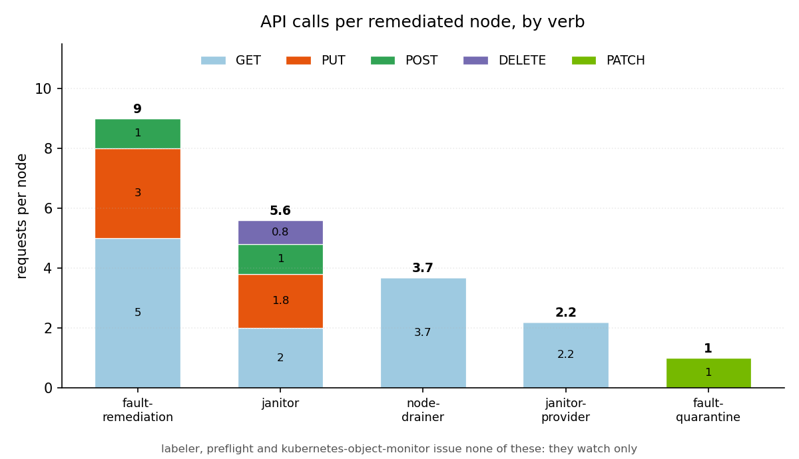

kubernetes-object-monitor is absent from the per-node column above because its cost is per policy-match transition, not per remediated node. Each transition writes one PUT of a full Node object (`pkg/annotations/manager.go`); a conflict retry adds another, and a reconcile that changes nothing costs nothing.

The per-component figures add up to about 22 requests per node, so remediating an entire 53,513-node fleet costs roughly 1.2 million requests. Compressed into ten minutes that is 2,000 requests a second -- about what the simulation harness already generates on its own, and well inside APF, which peaked at 116 of 1,085 seats.

The costs hold within 20% under sustained load at 0.50 nodes/s: fault-remediation 11 requests per node against 9 in the burst, janitor 5.9 against 6, the extra GETs being retries spread over a longer wall clock.

Sustained load also surfaced something the burst did not: **7 `POST 409` conflicts across 300 remediations**, node-lock contention at 2.3%, all retried successfully.

### MongoDB per member


| Member        | Role      | Connections | Resident | WiredTiger cache | Non-cache | Oplog window |
| ------------- | --------- | ----------- | -------- | ---------------- | --------- | ------------ |
| mongodb-rs0-0 | primary   | 81          | 2.27 GB  | 1.31 of 1.50 GB  | 0.96 GB   | 1.32 h       |
| mongodb-rs0-1 | secondary | 44          | 2.20 GB  | 1.20 of 1.50 GB  | 1.00 GB   | 1.32 h       |
| mongodb-rs0-2 | secondary | 41          | 2.13 GB  | 1.18 of 1.50 GB  | 0.94 GB   | 1.32 h       |


7.1 GB resident across the three members at a 4 Gi limit per member; [Sizing the WiredTiger cache](#sizing-the-wiredtiger-cache) gives the limit a fleet needs. Most of each member is cache, which the 4 Gi limit bounds at 1.50 GB; what is left after cache is about 1 GB per member and barely moves between idle and load. No member restarted or was OOM-killed across the run.

The capped cache is not free. Application threads evicted 406 pages on the primary and none on either secondary over the 617-second window, so no writer stalled waiting for space. Pages read into cache over the same window were 5,312,670 on the primary, about 8,600 per second against a 1.50 GB bound -- the churn a 10 GB dataset produces when the cache cannot hold it. At this fleet size that churn slows writes; the sizing section below measures by how much.

### Sizing the WiredTiger cache

Size MongoDB by event rate. Each member needs this container memory limit at 0.01 events per node per second:


| Fleet   | Events/s | Memory limit | Cache   | Publish mean | Volume IOPS | Queue depth |
| ------- | -------- | ------------ | ------- | ------------ | ----------- | ----------- |
| 10,000  | ~100     | 4 Gi         | 1.5 GB  | 11 ms        | 1,474       | 2.2         |
| 25,000  | ~250     | 12 Gi        | 5.5 GB  | 11 ms        | 2,013       | 4.3         |
| 50,000  | ~500     | 24 Gi        | 11.5 GB | 14 ms        | 2,539       | 6.7         |
| 100,000 | ~1,000   | 32 Gi        | 15.5 GB | 19.8 ms      | 2,739       | 6.9         |


The operator sets the WiredTiger cache to `(limit - 1Gi) / 2`, so choosing the limit also chooses the cache. Do not set the cache higher than that: a 10.25 GB cache in a 12 Gi container was OOM-killed.

**How the limits were measured.** Each fleet size ran at its production event rate while the limit was stepped down. A limit passed when:

- every publish succeeded, and the store took in what the fleet sent
- no member restarted or was OOM-killed
- the secondaries kept up

Publish time and the volume's queue depth showed when a limit started to slow the store. The recommended limit is the smallest that passed without slowing it, on a default gp3 volume (3,000 IOPS).

**One step lower.** Nothing is lost, but publishing is slower: 15 ms at 8 Gi for 25,000 nodes, 17 ms at 16 Gi for 50,000, and 24.4 ms at 16 Gi for 100,000, where the volume also went past 3,000 IOPS with a queue depth of 11.3.

**Too low.** The store falls behind before it runs out of memory. At 8 Gi for 100,000 nodes, each write took about 33 ms. The connector's pool of ten per replica could then carry about 900 events/s, against the 973 the fleet sent. The backlog grew until 91,000 publishes failed. No limit in the sweep was OOM-killed.

**Disk.** At 100,000 nodes the volume serves about 2,500 write IOPS for 1,000 events/s, at any memory limit. That is close to the gp3 baseline of 3,000. If the volume turns out to be IOPS-constrained for a given usage pattern, provision more IOPS.

**Conditions.** The sweep ran against a collection of about 100 million events. 100,000 nodes at 32 Gi passes with the recommended pool of 30: 20 ms publish, nothing lost.

**Ceiling.** At 100,000 nodes with 32 Gi and the recommended pool of 30, MongoDB falls behind at about 3,500 events/s (3,464 measured), about 3.5 times the steady rate. The ceiling at the smaller recommended limits was not measured; a smaller cache is expected to fall behind at a lower rate.

**Why memory follows the event rate.** The cache must hold the index pages that new entries go to. Consumers read the change stream, not the collection, so only writes use the cache. An index whose keys increase with time writes to one page, which stays in the cache. An index whose keys spread out writes to pages across the index, and each write reads a page from disk if it is not cached. Measured per index on the primary at 2,000 nodes and 1,000 events/s, with the cache held at 3,500 MB and the idempotency key still random:


| Index                                                 | Reads per insert | Where new entries go    |
| ----------------------------------------------------- | ---------------- | ----------------------- |
| `healthevent.metadata.idempotencyKey` (unique)         | 0.801            | anywhere in the index   |
| `nodename + entitiesimpacted + gts`                    | 0.738            | per node, per entity    |
| `nodename + ishealthy + gts`                           | 0.659            | per node                |
| `nodename + faultremediated + isfatal + gts`           | 0.651            | per node                |
| `agent + componentclass + checkname + nodename + ...`  | 0.607            | per node, per check     |
| `_id_`                                                 | 0.001            | one point, time-ordered |
| `createdAt + _id`                                      | 0.000            | one point, time-ordered |
| `createdAt` (TTL)                                      | 0.000            | one point, time-ordered |


The time-ordered indexes cost almost nothing. Each spread-out index costs about one page read per insert, whatever its size: 53 MB and 157 MB indexes both cost about 0.7. So the number of spread-out indexes sets the memory needed, not their size. The idempotency key is now time-ordered, so its index costs 0.008 reads per insert instead of 0.801.

### Cost per event, by component `[M]`

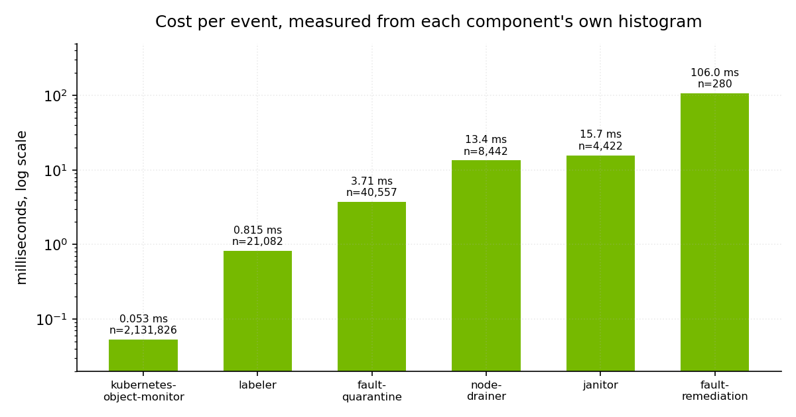

Read from each component's own handling histogram. Lifetime means:


| Component                 | Metric                                              | Events timed | Mean     |
| ------------------------- | --------------------------------------------------- | ------------ | -------- |
| kubernetes-object-monitor | `workqueue_work_duration_seconds`                   | 2,131,826    | 0.053 ms |
| labeler                   | `labeler_event_handling_duration_seconds`           | 21,082       | 0.815 ms |
| fault-quarantine          | `fault_quarantine_event_handling_duration_seconds`  | 40,557       | 3.71 ms  |
| node-drainer              | `node_drainer_event_handling_duration_seconds`      | 8,442        | 13.4 ms  |
| janitor                   | `workqueue_work_duration_seconds`                   | 4,422        | 15.7 ms  |
| fault-remediation         | `fault_remediation_event_handling_duration_seconds` | 280          | 106 ms   |


The spread follows what each handler does: kubernetes-object-monitor and labeler mostly return without acting, fault-quarantine writes one node patch, and node-drainer, janitor and fault-remediation each make several API calls and wait on the cluster. The slowest is two thousand times the fastest, and also the lowest-volume.

An update matching no policy costs less again: patching 5,000 nodes with an irrelevant label drove 17,803 items through kubernetes-object-monitor's workqueue at **0.045 ms of handler time each** and moved no other component's count, since the update reaches their caches without becoming an event. That is 3.56 queue items per node write, so the 250 node writes per second this fleet does when idle come to about 890 items per second and 40 ms of handler time per second. This is serial handler wall time rather than a CPU counter, so it bounds rather than measures the core cost.

---

## A3. Customer-facing SLAs

### Continuous load `[M]`

Measured in burst-free windows, so the tails are steady-state rather than burst contention. The cordon row is a 314-node window on the 50,000-node fleet, where 0.47 nodes/s is the rate at which nodes completed rather than a rate events were offered at; the input rate was not controlled. The drain, remediation and MTTR rows come from a later run that injected at a set **0.5 nodes/s** across 400 nodes, each carrying a drain-eligible pod, and all 400 completed -- so there input and output rates are the same.


| SLA                            | P50                                              | P90            | P99            | Max            | Conditions                                                                                                                                                                                                                                                                               |
| ------------------------------ | ------------------------------------------------ | -------------- | -------------- | -------------- | ---------------------------------------------------------------------------------------------------------------------------------------------------------------------------------------------------------------------------------------------------------------------------------------- |
| Time to cordon                 | 26 ms                                            | 48 ms          | 165 ms         | 373 ms         | 50k nodes, 11 pods/node, all DaemonSet; 314 nodes completed over the window (0.47/s)                                                                                                                                                                                                     |
| Time to label                  | 59 s                                             | 61 s           | 61 s           | 61 s           | driver and DCGM pods appear on a new node → labels on the node object, across 200 nodes `[M]`. The band is tight because labeler applies labels on its 30-second informer resync rather than on the event, so the wall time is two resync cycles; handling itself is 3.8 ms (see A1 QPS) |
| Time to drain                  | 10.09 s                                          | 10.14 s        | 10.27 s        | 10.92 s        | cordon → drained, 400 nodes at 0.5 nodes/s, one drain-eligible pod each `[M]`. The 10 s is node-drainer's recheck backoff, not eviction time                                                                                                                                             |
| Time to remediate              | 0.08 s                                           | 0.09 s         | 0.17 s         | 0.24 s         | drained → remediation dispatched across 400 nodes at 0.5 nodes/s `[M]`. Under a 200-node burst the same stage is 3.20 s, essentially all of it change-stream queue wait                                                                                                                  |
| NVSentinel MTTR                | 0.091 s                                          | 0.101 s        | 0.241 s        | 0.529 s        | detect → remediation dispatched, with each node's own drain wait subtracted, across 400 nodes at 0.5 nodes/s `[M]`. Detect to cordon is 16 ms and drained to dispatch is 75 ms. Drain is excluded because it is a policy-dependent wait on the workload, reported separately above       |
| Simulated reboot wait `[S]`    | 46.5 s                                           | 77.0 s         | 81.0 s         | 82.0 s         | CR created → `NodeReady=True`, across 200 nodes `[M]`. Excluded from MTTR and not physical: the simulated reboot is 5 s, the remainder is janitor's readiness re-poll. Of it, CR → `SignalSent` is p50 13 s / p99 30 s                                                                   |
| Customer end-to-end MTTR `[I]` | 0.09 s + D + R                                   | 0.10 s + D + R | 0.24 s + D + R | 0.53 s + D + R | the row above plus **D**, the reader's own drain time, and **R**, their reboot-to-Ready time. Substituting this harness's D of 10.09 s and R of 46.5 s gives 57 s end-to-end at the median `[S]`                                                                                         |
| Observed completion rate       | 0.47 nodes/s sustained with no degradation `[M]` |                |                |                | the input rate was not controlled, so this is what the run completed rather than what it could sustain. The capacity figure is in [Burst absorption](#burst-absorption): fault-remediation's CR creation is the slowest instantaneous stage at 11.9-13.0 nodes/s                         |
| Burst absorption               | see below                                        |                |                |                |                                                                                                                                                                                                                                                                                          |


Percentiles are computed from per-document timestamps, so they are exact rather than snapped to Prometheus histogram buckets.

Drain is a wait rather than work: node-drainer evicts the pod, requeues at its 10 s base backoff, confirms the pod is gone and marks the node drained. Everything NVSentinel does outside that wait totals 91 ms, two orders of magnitude below the backoff constant.

### Full-chain run, 200-node burst `[M]`

The rows above for remediation and reboot come from a single injection of 200 fatal `SysLogsXIDError` events, one per node, into 200 nodes with no prior remediation history (selected by the absence of the `dgxc.nvidia.com/nvsentinel-state` label, `Ready=True` and schedulable; the five real EC2 nodes were excluded). All 200 reached `faultRemediated: true` within 32 seconds of injection and all 200 subsequently reached `NodeReady=True`.


| Stage                            | p50     | p90     | p99     | max     |
| -------------------------------- | ------- | ------- | ------- | ------- |
| detect → quarantined             | 2.94 s  | 4.73 s  | 5.10 s  | 5.14 s  |
| quarantined → drained            | 16.18 s | 19.94 s | 21.34 s | 21.47 s |
| drained → remediation dispatched | 3.20 s  | 5.21 s  | 5.77 s  | 5.77 s  |
| detect → remediation dispatched  | 21.10 s | 28.79 s | 30.51 s | 30.70 s |
| CR created → `SignalSent=True`   | 13.0 s  | 27.0 s  | 30.0 s  | 31.0 s  |
| CR created → `NodeReady=True`    | 46.5 s  | 77.0 s  | 81.0 s  | 82.0 s  |
| detect → node back in service    | 70.0 s  | 86.0 s  | 89.0 s  | 90.0 s  |


These are burst figures. Two hundred events arrive in a single insert, so each stage's tail measures queue position rather than per-node work; the warm single-event path through fault-remediation is 0.05 s against the 3.20 s median here. For continuous load use the steady-state rows above.

CR-derived rows carry the API server's one-second timestamps; the MongoDB-derived rows are exact.

The drain figures come from a workload simulator (`--mode=workload` in `k8s-object-scaler`) running against `test-workload`, a namespace outside node-drainer's system-namespace exclusion, with pods carrying no `ownerReferences` so they are not treated as DaemonSet-owned. Jobs arrive at 5/s, 30% as gangs of 8-64 pods on consecutive nodes and the rest as singletons, each living 30 minutes, reaching a counted steady state of 109,000 pods.

### MTTR decomposition


| Phase                                 | Measured? | Notes                                                                                                                                                                                                            |
| ------------------------------------- | --------- | ---------------------------------------------------------------------------------------------------------------------------------------------------------------------------------------------------------------- |
| Detect → cordon                       | yes `[M]` | 17 ms P50 continuous; 3.47 s P50 under a 500-node burst                                                                                                                                                          |
| Cordon → drained                      | yes `[M]` | 10.09 s P50 continuous with one drain-eligible pod per node; 52.06 s P50 under a 500-node burst. One recheck cycle under continuous load, several under a burst                                                  |
| Drained → remediation CR created      | yes `[M]` | 0.08 s P50 continuous; 3.20 s P50 / 5.77 s P99 under a 200-node burst, which is change-stream queue wait rather than work                                                                                        |
| CR created → signal sent to provider  | yes `[M]` | 13.0 s P50 / 30.0 s P99 over 200 nodes                                                                                                                                                                           |
| CR created → provider returns         | no `[S]`  | simulated constant, carries no physical meaning (`simulatedRebootDuration: 5s`)                                                                                                                                  |
| Provider returns → back in service    | yes `[M]` | CR creation → `NodeReady=True` 46.5 s P50 / 81.0 s P99 over 200 nodes. Dominated by janitor's readiness re-poll, not by the reboot                                                                               |
| Whole chain, detect → back in service | yes `[M]` | 70.0 s P50 / 89.0 s P99 under a 200-node burst, correlated per node. Under continuous load NVSentinel's own share of that is 0.09 s once the drain wait is set aside, leaving drain and reboot as the whole cost |


### Correctness under load `[M]`

Every incorrect action is customer impact, so the question is not only whether the pipeline keeps up but whether it ever acts on the wrong node. Two hundred nodes carrying fatal GPU events and 1,800 carrying non-fatal events of otherwise identical shape were driven into a 10,005-node fleet in a single write, inserted straight into MongoDB so the health monitors are out of the path and any wrong action is attributable to NVSentinel itself. Every fatal node was cordoned and nothing else in the fleet was, the set was exact within 45 seconds and unchanged four minutes later, nothing was remediated without a drain or before one finished, and the run repeated on a second node range with the same outcome. Bursts of 100, 500 and 1,000 nodes all reached full drain completion. Normal operation and bursts at that size produce no incorrect action and nothing that runs away.

The reboot-after-drain ordering got a stronger test than intended. 129 of the 200 nodes still carried pods in a namespace mapped to `AllowCompletion`, so node-drainer waited for those pods to finish on their own rather than evicting them, logging `waiting for pods to complete: 2 pods remaining` and requeuing. Not one of those nodes was remediated. The 71 whose pods could be evicted drained and then remediated, in that order, every time. A node whose drain cannot complete therefore stays cordoned and unremediated indefinitely, which is the safe direction to fail: the system declines to reboot a node it has not finished draining, and it does so under a burst rather than only in the quiet case.

Outside that envelope there are three scenarios in which a module acts against its own stated intent, and none of them is closed by configuration.

1. **A consumer that falls behind the oplog skips events that are already stored.** The failure is on the read side: `ChangeStreamHistoryLost` is classified with corrupt-token errors, so the resume token is deleted and the stream reopens at the current cluster time, never delivering what came between. A skipped fatal event is a node never quarantined; a skipped healthy event is a node cordoned until someone runs `kubectl uncordon`. Only node-drainer and fault-remediation re-find part of their own gap, through status-filtered cold-start queries. There is no knob: the chart sets no `oplogSizeMB`, and `change_stream_resume_token_recoveries_total` carries only `(client, phase)`, so loss cannot be told from a corrupt token. The deployment platform connector does not close it: it changes how writes are acknowledged, and this failure is on the read side, in the consumer.
2. **The circuit breaker limits a rate, not a level.** It trips when unique nodes cordoned inside the sliding window reach `percentage` of the GPU fleet, so cordoning slower than the window never trips it however far it goes, and the required rate grows with fleet size while consumption does not. `percentage` and `duration` cannot express "at most this share of the fleet cordoned at once" at any value; the currently-cordoned set is computed on every check by `GetNodeCounts` and discarded.
3. **Resetting a tripped breaker re-cordons the nodes just released.** Deleting the ConfigMap recreates it with `cursor: RESUME`, so fault-quarantine replays the accumulated backlog, and because it watches inserts only, the `Cancelled` status written during a manual uncordon is invisible while `applyQuarantine` clears the manual-uncordon annotation. An intact backlog converges; one truncated by the oplog above leaves those nodes cordoned with nothing left to release them. The knob is `cursor: CREATE`, which skips the backlog — but deleting the ConfigMap is what resets it to `RESUME`.

### Event consumption rate `[M]`

Measured directly, with an empty collection and a change stream opened at the current oplog position:


| Offered | Written | Handled by fault-quarantine | Per event | Nodes cordoned |
| ------- | ------- | --------------------------- | --------- | -------------- |
| 50/s    | 29.6/s  | 33.4/s                      | 4.0 ms    | 50 of 50       |
| 200/s   | 106.0/s | 74.3/s                      | 3.9 ms    | 200 of 200     |


At the lower rate it handled more than was written, because it also consumes the status updates it writes itself, so it was fully caught up. At the higher rate it sustained **74 events/s** and cordoned every target node. Per-event cost is **about 4 ms**.

The ceiling is bracketed rather than found. At 200/s offered, consumption still trailed the write rate, so the limit sits somewhere above 74/s. An empty collection is the friendly extreme; a long-lived cluster with a large oplog is the other, and a consumer that has fallen behind one reads far lower. An earlier figure of 17 events/s came from exactly that state, with the component walking a 10.4-million-entry oplog and doing a document lookup per change, and it measures how fast a starved consumer catches up rather than what it can handle.

Two of the component's own metrics mislead while it is behind. `event_backlog_count` reads 0, because the in-process queue is empty and the real queue is the oplog. `events_received_total` reads 0 while the handling histogram counts past 31,000, so it is not wired to this path.

### Drain latency with real pods `[M]`

Two runs, both on brand-new nodes that had never been quarantined, each carrying one drain-eligible pod in `e2e-pods`, the only namespace node-drainer maps to `Immediate` eviction. Percentiles come from the per-document protobuf timestamps on each health event, so they are exact rather than bucketed.


| Stage                            | Continuous, 400 nodes at 0.5/s | Burst, 500 nodes at once |
| -------------------------------- | ------------------------------ | ------------------------ |
| detect → quarantined             | 0.017 s                        | 3.47 s                   |
| cordon → drained                 | 10.09 s                        | 52.06 s                  |
| drained → remediation dispatched | 0.08 s                         | 10.52 s                  |


P90 sits within a second of P50 in every continuous row and within eight seconds in every burst row; all 500 burst nodes and all 400 continuous nodes completed.

Under continuous load a drain costs one node-drainer recheck cycle. It evicts the pod, requeues at its 10 s base backoff, sees the pod gone, and marks the node drained, which is why the whole distribution sits in a 0.8-second band around 10 s rather than spreading out. Under a burst the same cycle repeats while the node waits its turn, giving 52 s for five hundred nodes arriving together.

The backoff is a compiled-in constant, not a setting. `node-drainer/pkg/queue/queue.go` builds the workqueue with `NewTypedItemExponentialFailureRateLimiter[NodeEvent](10*time.Second, 2*time.Minute)`, so the first retry lands at 10 s and each subsequent one doubles to a 2-minute ceiling, resetting only when the node drains. Nothing exposes the base, so the 10 s floor applies to every deployment.

Lowering it trades eviction calls for latency, and the exchange rate is set by the doubling rather than by the base. Reaching a given pod termination time takes roughly log2(T/base) attempts, so a 90-second termination costs 4 attempts at a 10 s base and 6 at 2 s, against the measured 3.0 eviction calls per pod. A 2 s base therefore cuts the drain from 10.09 s to about 2.1 s, a 4.8x improvement, for about 1.4x the eviction calls, taking node-drainer from roughly 15% of its 400 QPS budget at a 1,000-node burst to 21%. A 1 s base gives 9x for 2.3x the calls and 35% of budget. Below that the base falls under the time a pod needs to terminate, and every retry scheduled before the pod can possibly be gone re-evicts pods that are still terminating, which is where the 3.0 multiplier comes from in the first place. The useful floor is the workload's own termination time: about a second for the zero-grace pods used here, and at least 30 s for a pod carrying `terminationGracePeriodSeconds: 30`, where termination dominates and the requeue interval stops being the binding term.

This applies only to namespaces in `Immediate` mode. `AllowCompletion` and `DeleteAfterTimeout` wait on the workload, so the backoff is not what governs them. Exposing the base as a setting is development work that has not been done, and it should land with a test that measures the eviction call rate, since that is the cost the change spends.

### Publish latency

Publish latency is 7 ms in the median and seconds in the tail, and neither figure moves with the size of the store. Holding replica count at three and load at 40,000 connections publishing 2,000 events/s, and reading the connector's own `platform_connector_request_duration_seconds` histogram as a windowed distribution rather than a running average, across 36 minutes in which the collection grew from 14.2 to 19.2 million documents:


|      | Minimum   | Median of samples | Maximum     |
| ---- | --------- | ----------------- | ----------- |
| P50  | 6.18 ms   | 7.06 ms           | 7.42 ms     |
| P90  | 9.63 ms   | 43.81 ms          | 266.71 ms   |
| P99  | 222.80 ms | 2.31 s            | 3.97 s      |
| Mean | 11.93 ms  | 101.83 ms         | 182.10 ms   |


The typical publish is fast and stays fast: P50 holds between 6.18 and 7.42 ms across a 35% increase in collection size, and the tail does not widen with it.

Some writes stall for seconds well short of saturation: P99 ran from 223 ms to 3.97 s while throughput held constant at 2,000 inserts/s against the 4,925 ceiling. The stalls are cyclic and happened with the working set fully cached. That pattern points at WiredTiger's 60-second checkpoint flushes, but this run did not measure them directly.

At half that rate the stalls do not appear. In a rerun at 1,000 events/s through 40,000 connections, timed from the publisher side as well, none of about 643,000 publishes took longer than 1 second. Half the publishers sent healthy events and half sent unhealthy non-fatal events. MongoDB had 96 Gi per member and about 100 million stored events.


|                                | P50     | P90     | P99    |
| ------------------------------ | ------- | ------- | ------ |
| Publisher, healthy events      | 15.4 ms | 48.1 ms | 198 ms |
| Publisher, unhealthy non-fatal | 13.9 ms | 52.6 ms | 192 ms |
| Connector histogram            | 15.6 ms | 49.5 ms | 223 ms |


The token check's cost is in [Health-monitor authentication](#health-monitor-authentication-m). Healthy events that only read the node took about 1.5 ms longer at the median. Fatal events, and healthy events that clear a condition, also write the node condition, which took 17 ms P50 and 73 ms P99. P99 rose and fell at the same moments for healthy and unhealthy publishers, so the tail comes from the MongoDB write, not the node update.

For the customer-facing numbers in [MTTR decomposition](#mttr-decomposition), publish latency sits in front of detect → cordon. In the median it is invisible. In the tail it is the largest part of that stage, a fault that lands in a stall is cordoned seconds after it is reported rather than milliseconds, but it is still a few percent of detect → back in service, 70 s P50 and 89 s P99, which drain and reboot dominate.

### Against the DaemonSet

The Deployment's case is not speed. What centralising buys is a stronger acknowledgement and a bounded number of MongoDB connections; what it costs is a ceiling that no longer grows with the fleet. Latency is close enough either way not to decide it:

A node-local connector drains one write at a time, so a 5 ms acknowledgement caps it at roughly 200 events/s; the drain measured here is 197. Above that the queue grows without bound, though holding events there is cheap ([burst run](#daemonset-queue-under-burst-m)).

What matters is how long after a node reports a fault that fault becomes visible to the rest of the pipeline, since health-events-analyzer and fault-quarantine both read the store's change stream. At 200 events/s, two trials of 1,500 events each:


| Publish to visible on the change stream | DaemonSet, one per node | Deployment, three replicas |
| --------------------------------------- | ----------------------- | -------------------------- |
| P50                                     | 2.6, 2.7 ms             | 3.1, 3.4 ms                |
| P90                                     | 3.9, 4.0 ms             | 4.6, 4.7 ms                |
| P99                                     | 5.9, 6.3 ms             | 6.1, 6.3 ms                |
| Maximum                                 | 18.0, 72.9 ms           | 11.3, 10.9 ms              |


Half a millisecond separates them at the median on a three-millisecond figure, the P99s are identical, and the Deployment holds the tighter extreme. Centralising cost nothing measurable in the time it takes a fault to become actionable.

Capacity is the one place the two genuinely diverge. N node-local connectors offer about 200N events/s and grow with the fleet; the Deployment serialises everything through `DATASTORE_MAX_CONNECTIONS` per replica, so its ceiling is fixed. At the chart's 10 the DaemonSet overtakes at 27 nodes; at 30 it overtakes at 55. Raising the pool moves the crossover but never removes it, so for any pool setting there is a fleet size past which the DaemonSet carries more -- provided events are spread evenly across nodes, which is what makes the per-node ceiling add up. Driving it past the five real nodes ([how](#fanning-out-node-local-writers-m)):


| Node-local writers | Events/s attempted | Events/s reaching MongoDB | Per writer |
| ------------------ | ------------------ | ------------------------- | ---------- |
| 5                  | 1,500/s  | 1,172/s  | 234/s      |
| 15                 | 4,500/s  | 2,817/s  | 188/s      |
| 30                 | 9,000/s  | 5,381/s  | 179/s      |
| 60                 | 18,000/s | 10,143/s | 169/s      |


Sixty node-local connectors carry 10,143 events/s, twice the Deployment's ceiling at the chart's pool and still climbing, short of MongoDB's own majority-write capacity of roughly 14,000 events/s. Growth is sublinear -- per-writer output falls from 234 to 169 events/s -- but that is contention on the shared replica set rather than a wall.

So the choice is a trade, not an upgrade. The Deployment bounds MongoDB's connections and makes an acknowledgement mean the event is stored rather than queued; it gives up a ceiling that grows with the fleet. And the ceiling it settles for is set by `DATASTORE_MAX_CONNECTIONS`, not by MongoDB: the server absorbs more than twice what three replicas of ten connections ask of it.

The differences that do matter are structural:


|                               | DaemonSet                                                               | Deployment                                                                                      |
| ----------------------------- | ----------------------------------------------------------------------- | ----------------------------------------------------------------------------------------------- |
| Throughput ceiling            | about 200 events/s per node, growing with the fleet                     | about 4,900 events/s for the whole fleet, see [Ingest rate and sizing](#ingest-rate-and-sizing) |
| What an acknowledgement means | queued in one pod's memory                                              | stored on a majority of the replica set                                                         |
| MongoDB connections           | 7 per node                                                              | 166 for the whole replica set, measured in A2                                                   |
| Under overload                | queue grows without bound; acknowledged events are lost if the pod dies | backpressure, publishers block, nothing is lost                                                 |


### Recovery from a full outage

A full outage recovers in about 80 seconds, and re-authentication does not storm. Deleting all three replicas at once under 40,000 established connections took TokenReviews from 150-180/s to a peak of 329, with no failed reviews and P99 unchanged at 5.0 ms. The expected cliff -- 20,000 distinct tokens against three empty verdict caches -- does not happen, because authentication is charged per request rather than per connection: re-establishing connections costs nothing, and the re-authentication arrives spread over each publisher's next event.

What survives the outage is set by the publisher's retry window rather than by the connector. The shared client holds an event for `defaultRetryWindow = 5 * time.Minute`, so an 80-second outage loses nothing; an outage longer than that loses events. The generator used here does not retry, so its 14,319 recorded failures measure the interruption, not loss.

### Losing a MongoDB member

Losing one secondary costs nothing measurable, which is the structurally expected answer: a majority of three is two, so the primary never waited on more than one acknowledgement and the surviving secondary still provides it. Over 26 samples healthy and 5 with one secondary unreachable, the acknowledgement held at 5.02 against 4.97 ms and ingest at 5,140 against 4,850 events/s, inside the healthy run's own spread. No publisher errors, and the member rejoined about 65 seconds after deletion.

### Loss, duplication and upgrades

Nothing is lost when the path is saturated, counted against the store rather than the connector's own counters. Offering 20,000 events/s through 20,000 connections against a pool that drains about 4,900, then letting the backlog finish:


|                       |           |
| --------------------- | --------- |
| Published             | 2,663,837 |
| Publish errors        | 0         |
| Inserted into MongoDB | 2,663,837 |
| Difference            | 0         |


Published equals inserted because the Deployment writes inside the request, so oversubscription becomes backpressure rather than buffering.

Resends are refused rather than stored twice. Re-sending each batch under its original `idempotency-key` header, which is what the shared client does when a reply is lost, produced no duplicate rows: across 4,532,914 documents written in the window, every one carrying a key, no key was stored twice. The unique partial index refuses the second write, which is what makes the five-minute retry window safe to depend on.

A rolling upgrade costs interrupted requests. `RollingUpdate` at `maxSurge: 25%` and `maxUnavailable: 25%` rounds to one surge pod and zero unavailable at three replicas, so a replacement is Ready before its predecessor is removed. Restarting under 4,000 connections publishing 2,000 events/s:


| Seconds after the restart | Reaching MongoDB | Cumulative publish errors | Ready | Pods |
| ------------------------- | ---------------- | ------------------------- | ----- | ---- |
| 31                        | 1,924/s          | 135                       | 4/4   | 4    |
| 66                        | 1,922/s          | 1,148                     | 3/3   | 3    |
| 102                       | 2,000/s          | 1,148                     | 3/3   | 3    |
| 206                       | 2,003/s          | 1,148                     | 3/3   | 3    |


The rollout completed in 31 seconds, ingestion dipped about 4% and recovered, and no publisher failed to connect, but 1,148 requests were refused. That count follows throughput rather than the rollout: each terminating pod cuts roughly half a second of its own traffic, so a quieter fleet loses proportionally fewer. They are not necessarily lost events either -- a connector shutting down answers `Unavailable`, which the shared publisher retries inside its window, while the generator used here does not and records them as failures.

---

### Burst absorption

N nodes fail at once, on brand-new KWOK nodes with no quarantine history and no pods, so the two stages measured here are fault-quarantine's cordon and fault-remediation's CR creation without drain in between. Each size was injected as a single insert and run in isolation: fresh node names, and nodes, events and CRs deleted before the next size started. Every figure below is a per-node latency from the event's own generation timestamp, so the completion columns are that run's slowest node rather than a separately polled bound.

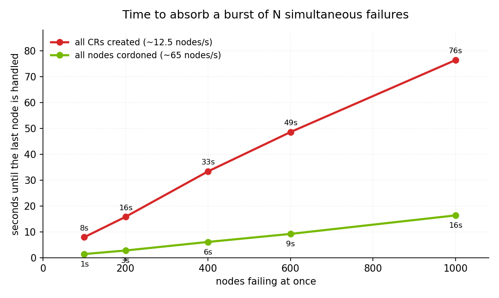


| Burst | Last node cordoned | cordon P50 / P99 | Last CR created | CR P50 / P99    |
| ----- | ------------------ | ---------------- | --------------- | --------------- |
| 100   | 1.44 s             | 0.74 / 1.44 s    | 8.06 s          | 4.12 / 8.06 s   |
| 200   | 2.82 s             | 1.38 / 2.80 s    | 15.95 s         | 7.85 / 15.87 s  |
| 400   | 6.15 s             | 3.01 / 6.10 s    | 33.61 s         | 16.53 / 33.37 s |
| 600   | 9.24 s             | 4.37 / 9.16 s    | 48.77 s         | 24.18 / 48.35 s |
| 1000  | 16.45 s            | 8.51 / 16.33 s   | 76.66 s         | 38.03 / 75.77 s |


Both stages degrade linearly rather than hitting a cliff, because each consumes its change stream serially: cordon holds 61-71 nodes/s and CR creation 11.9-13.0 nodes/s across a 10x range. P50 sits at half the window and P99 at the window itself, which is what draining a simultaneous arrival at a fixed rate produces. The last node in a 1,000-node burst waits 16 s to be cordoned and 77 s for its CR.

fault-quarantine also stretches the burst for everything downstream. A burst injected in a single insert arrives at fault-remediation spread over the cordon window -- 16 s at N=1000 -- so the components behind it never see the burst as one.

Drain is excluded above because it depends on what is running on the node and on the namespace's eviction mode, not on burst size alone. Measured separately at 5 pods/node:


| Burst      | Evictions | Time  | Throughput       | Share of the 400 QPS budget |
| ---------- | --------- | ----- | ---------------- | --------------------------- |
| 100 nodes  | 500       | 160 s | 3.1 evictions/s  | 0.8%                        |
| 500 nodes  | 2,500     | 200 s | 12.5 evictions/s | 3.1%                        |
| 1000 nodes | 5,000     | 260 s | 19.2 evictions/s | 4.8%                        |


Throughput rises sixfold while wall-clock stays flat, so larger bursts pipeline better. The client-side rate limit is not what stops it: at the largest burst node-drainer uses under 5% of its budget on a one-call-per-pod assumption, or about 15% once the measured 3.0 calls per pod is applied. What holds aggregate drain throughput down is the recheck cadence, not API rate limiting. node-drainer requeues each node at a 10 s base backoff and only marks it drained once it has confirmed the pod is gone, so under continuous load a drain takes exactly one cycle (10.09 s P50 across 400 nodes) and under a burst it takes as many cycles as the queue is deep (52.06 s P50 across 500 nodes arriving together). `[M]`

The calls-per-pod figure was checked directly. Five evictable pods on one node, one fatal event: all five were evicted, but they took 15 eviction calls rather than 5. node-drainer issues the evictions, logs `immediate eviction completed, requeuing for status verification`, and re-evicts every pod still present on each requeue. Here the pods took about 90 s to disappear, spanning three retry cycles. The multiplier therefore tracks how long a pod takes to terminate rather than how many pods there are, and pods honouring a real `terminationGracePeriodSeconds` will cost more than the zero-grace pods used here. `[M]`

### Circuit breaker `[M]`

fault-quarantine's circuit breaker stops cordoning once too many nodes have been cordoned inside a sliding window, and it has two independent bounds: `percentage`, taken against the current GPU-node count, and `maxNodes`, an absolute count. When both are set the lower one binds. Both were exercised against a 10,005-node fleet with 10,000 nodes carrying `nvidia.com/gpu.present=true`, starting from zero cordoned nodes each time, by injecting 5,500 fatal GPU events in a single insert and reading the cordon count from each event's own `quarantinefinishtimestamp`.


| Configured                          | Threshold reported         | Nodes cordoned before trip | Utilization at trip |
| ----------------------------------- | -------------------------- | -------------------------- | ------------------- |
| `percentage = 50`                   | 5,000 `bound="percentage"` | 5,000                      | 0.50                |
| `maxNodes = 500`, `percentage = 50` | 500 `bound="maxNodes"`     | 500                        | 0.05                |


Each bound tripped on exactly the node its threshold names, and the lower bound won when both were configured. Recovery is the same in both cases and needs two steps: write `status: CLOSED` into the `circuit-breaker` ConfigMap and restart fault-quarantine, because a tripped breaker blocks the event loop until the process restarts. After reset, cordoning resumed within 41 s and consumed the remaining events without re-tripping -- the sliding window lives only in memory, so a restart starts it empty and the fleet's existing cordons do not count against the new window.

The threshold is not a fixed number. It is recomputed on every event from the live count of nodes carrying the configured GPU label, so it moves with the fleet. An earlier run on a fleet where 600 of 10,000 nodes had been relabelled tripped at 4,700 rather than 5,000, which was correct against a 9,400-node denominator but is not what an operator reading `percentage = 50` against a 10,000-node cluster would predict. Node labelling is therefore part of the breaker's configuration surface.

Having the breaker enabled costs cordon throughput, because `IsTripped` runs once per event and each call lists the entire node cache to recompute the denominator. The same 5,500-event injection on the same fleet:


|                                   | Cordon rate  | Outcome            |
| --------------------------------- | ------------ | ------------------ |
| `--circuit-breaker-enabled=true`  | 35.8 nodes/s | tripped at 5,000   |
| `--circuit-breaker-enabled=false` | 45.9 nodes/s | all 5,500 cordoned |


That is a 22% reduction at 10,000 nodes. The work per event is proportional to fleet size, so the gap widens with the fleet rather than staying fixed; every other burst and drain figure in this report was measured with the breaker disabled.

## Appendix

The material here is either how the measurements were taken, or behaviour of the environment they were taken in rather than of NVSentinel. It is separated so that the sections above describe the product and this one describes the harness and the cloud underneath it.

### Fanning out node-local writers `[M]`

Nothing binds a node-local connector to a node except its socket path and the node-binding check, and both hold inside a pod. Each writer in the capacity measurement is therefore a pod running a real `platform-connectors` instance beside its generator over a shared `emptyDir` socket, with the Kubernetes connector disabled so only the store path is exercised. That lifts the limit of five real nodes without changing what is being measured.

### DaemonSet queue under burst `[M]`

Delivering 5,000 events/s across five nodes, five times their aggregate drain rate, for two minutes:


|                               |                             |
| ----------------------------- | --------------------------- |
| Events published              | 610,523                     |
| Received by the connectors    | 610,523                     |
| Inserted into MongoDB         | 610,523                     |
| Lost                          | 0                           |
| Peak queue depth              | 444,221                     |
| Peak connector working set    | 239 MB, against a 4Gi limit |
| Time to drain after the burst | 573 s                       |
| Connector restarts            | none                        |


So 444,221 queued events cost about 150 MB over an 89 MB baseline, roughly 0.34 KB each. The drain rate limits burst absorption on this path, not memory: a 512Mi connector holds several hundred thousand events and drains a burst of that size in minutes, but a node producing faster than 200/s for long enough grows its queue without limit.

An earlier run did see all five connectors `OOMKilled` at the 512Mi limit, and that is worth recording precisely because the obvious explanation is wrong. Their working set climbed steadily from 290 MB to 535 MB across a thirty-minute sweep during which queue depth was zero at every sample, and they were already at the limit before any backlog appeared. The growth tracks held connections and repeated generator churn rather than queued events, which the figures above make clear: the queue could not have accounted for it. What caused that climb is not established here.

### Majority acknowledgement against replication lag `[M]`

Driving `w:1` load at about 26,000 inserts/s to build backlog, then sampling the acknowledgement and the replication lag together:


| Replication lag | `w:1`   | `w:majority` | Acknowledgement |
| --------------- | ------- | ------------ | --------------- |
| 2.00 s          | 0.95 ms | 6.11 ms      | 5.16 ms         |
| 2.00 s          | 1.01 ms | 5.79 ms      | 4.78 ms         |
| 1.00 s          | 0.93 ms | 2.19 ms      | 1.26 ms         |
| 0.00 s          | 0.86 ms | 1.65 ms      | 0.79 ms         |
| 0.00 s          | 0.90 ms | 1.88 ms      | 0.98 ms         |
| 0.00 s          | 0.91 ms | 2.05 ms      | 1.15 ms         |


Writing to the primary alone stays at 0.9 ms throughout, so none of this is the primary's doing. `w:"majority"` implies `j:true` through `writeConcernMajorityJournalDefault`, which this replica set confirms is on, so each acknowledging member journals before replying -- but the journal is not the cost, at 0.635 ms per sync from the WiredTiger counters with group commit batching three writes per fsync. The cost is the wait for a second member to catch up.

### Connector memory: connections against label cache `[M]`

Nodes, connections and event rate held fixed, with only `allowedLabels` changed, so the metadata augmentor keeps an entry per node either way and only the stored labels differ. Thirty thousand nodes at three connections each, 90,000 connections in both runs, each from a restarted connector and each recorded only once three consecutive samples sat inside a 1% band:


| `allowedLabels`                                       | Working set above baseline |
| ----------------------------------------------------- | -------------------------- |
| the 25 the chart ships, of which these nodes carry 18 | 6,542 MB                   |
| none                                                  | 6,317 MB                   |


The 225 MB difference is the label storage for 30,000 nodes, about 7.5 KB per node. The remainder is 68.5 KiB per connection. Three connections plus one node's labels is 213 KiB, reproducing the 221.7 KiB per node the sweep gives at 100,000 nodes to within 4%.

The nodes carry 32 labels and 5 annotations, 34,349 bytes serialised. Eighteen of the 25 allowed keys are present, 743 bytes of keys and values between them:

```
topology.kubernetes.io/zone              = us-east-1a
topology.kubernetes.io/region            = us-east-1
node.kubernetes.io/instance-type         = gpu-worker
nvidia.com/cuda.driver-version.major     = 550          .minor = 90, .revision = 07, .full = 550.90.07
nvidia.com/cuda.runtime-version.major    = 12           .minor = 4,  .full = 12.4
topology.k8s.aws/capacity-block-id       = cr-000000000000
topology.k8s.aws/network-node-layer-1..3 = nn-000000000000
accelerator.topograph.run/domain         = dom-0000
fabric.topograph.run/tier-0..2           = t0-00000 / t1-0000 / t2-000
```

The seven absent keys are the OCI and GCE sets, which a node modelled on AWS never carries. So 743 bytes of label data costs about 7,500 bytes of process memory, roughly tenfold, in Go map overhead, per-key string headers and allocator size classes. The values here are short and uniform; a fleet carrying longer values for the same keys would pay more, though the per-entry overhead that dominates this figure would not change.

### Connector mode latency breakdown `[M]`

The full instrumentation behind the mode comparison, at 1,000 connections and 1,000 events/s against the chart's pool of 10 per replica:


|                                    | DaemonSet, one per node            | Deployment, three replicas |
| ---------------------------------- | ---------------------------------- | -------------------------- |
| Queue wait before the write starts | 6.44 ms P50, 20.25 P90, 276.97 P99 | none                       |
| Request duration, P50 / P90 / P99  | not exported                       | 4.96 / 8.99 / 9.90 ms      |
| Acknowledged but not yet written   | 11 items typical, 43 at peak       | none by construction       |


Neither path dropped an event and neither queue backed up: queue depth oscillated between 2 and 43, so the node-local writer keeps pace at this rate and its queue is a latency buffer rather than a backlog.

### Scale-out rebalancing `[M]`

Scaling from three replicas to four under 40,000 established connections, reading per-replica load as goroutines (three per connection):


| Time after scale-out | Replica 1 | Replica 2 | Replica 3 | New replica |
| -------------------- | --------- | --------- | --------- | ----------- |
| before               | 37,799    | 38,166    | 38,426    | --          |
| 1m42s                | 35,467    | 35,572    | 36,366    | 10,309      |
| 7m49s                | 34,800    | 34,693    | 35,490    | 13,365      |
| 12m27s               |           |           | 29,604    | 29,488      |
| 35m39s               | 29,886    | 29,907    | 30,150    | 30,219      |


An even split is 30,040 apiece, which is where it ends and stays. The approach is not smooth: the new replica took about a third of its share within two minutes, then crept for six, then arrived nearly all at once between the eighth and twelfth minute. That is `MaxConnectionAge` expiring a cohort of connections that were all established together during the ramp, so the shape of the redistribution follows the shape of the original connect. A fleet that connected gradually would drain gradually. No publish errors at any point.

### Rolling upgrade during a burst `[M]`

Upgrade here means a rollout restart and nothing beyond it: a real upgrade may also carry a backward-incompatible change, a datastore migration, or the replacement of persistent volumes, and none of that is covered below. Nothing coordinates a rollout with whatever the fault path is processing, so this was measured by injecting a burst and then rolling the fault-path components while it was still being processed.

A 2,000-event burst with fault-quarantine, node-drainer and fault-remediation all restarted mid-flight finished with 2,000 cordoned, 2,000 drained and 2,000 remediated, no duplicate node entries, and no stall: remediation climbed straight through the restart and the burst completed in 325 s. The components resume from their stored change-stream position and their cold-start sweeps recover whatever the stream did not redeliver.

Memory roughly doubles for the duration, and the per-pod figure does not move. The rolling update runs the old and new pods concurrently and each holds a full node cache, so the cluster, not the component, pays. Working set summed across every pod of fault-quarantine, node-drainer and fault-remediation, of which fault-quarantine is the large majority:


| Fleet   | Before  | During rollout | After   |
| ------- | ------- | -------------- | ------- |
| 50,010  | 2.34 GB | 4.28 GB        | 2.06 GB |
| 100,010 | 3.98 GB | 7.75 GB        | 3.77 GB |


The overlap is guaranteed by the deployment strategy rather than incidental. All three run `RollingUpdate` with `maxSurge: 25%` and `maxUnavailable: 25%`, which at one replica rounds up to a surge of one and down to zero unavailable, so the new pod must be Ready before the old one is removed. Inverting that to `maxSurge: 0` with `maxUnavailable: 1` removes the doubling, at the cost of a window in which no replica is running.

API load does not spike. 3,626 requests/s before the rollout, 3,630 during, 3,620 after. Each restarted informer re-lists the fleet, but that is a handful of large paginated reads rather than many small ones, so the cost lands in bytes rather than in request rate.

The circuit breaker does not survive the restart. Its sliding window is an in-memory ring buffer: `NewSlidingWindowBreaker` builds `buckets`, `nodeToIndex` and `indexToNodes` fresh and sets `startTime` to now, restoring only the CLOSED/TRIPPED state from its ConfigMap. Accumulated cordon counts are therefore lost on every restart, while the window itself restarts too, so cordons from just before the restart count toward nothing.


| Run             | Burst | Restart          | Outcome                           |
| --------------- | ----- | ---------------- | --------------------------------- |
| undisturbed     | 4,000 | none             | tripped at 2,001 cordons          |
| rolling upgrade | 3,000 | at 1,617 cordons | never tripped; all 3,000 cordoned |


The breaker's guarantee is that no more than a set share of the fleet is cordoned within a window. A restart breaks it: the second run cordoned 50% more nodes than the threshold with the breaker reporting CLOSED throughout, because the new pod needed the full count again within a window beginning at its own start and only ever saw 1,383. A breaker that has already tripped does stay tripped, since that state is in the ConfigMap; it is only progress toward tripping that is discarded.

Both runs used a 5% threshold rather than the shipped 50%, to keep the bursts small enough to repeat. The threshold lands near 2,000 rather than 2,501 because the denominator is the GPU-labelled node count of about 40,000, not the whole fleet.

### API server load produced by the simulation harness `[M]`

The share of API traffic that belongs to the harness rather than to NVSentinel is given in [A2](#a2-load-on-external-components). This section is the breakdown behind it.

Whole-cluster rates per second, for sizing the harness rather than NVSentinel. Idle and continuous differ mainly in simulated-node lease traffic:


|                    | Idle  | Continuous | Burst (med / peak) |
| ------------------ | ----- | ---------- | ------------------ |
| GET                | 172   | 81         | 78 / 185           |
| PUT                | 2,965 | 1,664      | 1,657 / 2,930      |
| PATCH              | 1,462 | 1,427      | 1,457 / 1,513      |
| LIST               | 7.5   | 8.0        | 7.8                |
| WATCH              | 6.0   | 6.7        | 6.6 / 8.6          |
| APF seats of 1,085 | 92    | 55         | 64 / 116           |
| APF rejections     | 0     | 0          | 0                  |


PUT is almost entirely simulated-node lease renewal and pod status rather than anything NVSentinel does; the breakdown is in [Node heartbeats and pod status](#node-heartbeats-and-pod-status). `[S]`

#### Node heartbeats and pod status

The five-minute revision window etcd retains is filled almost entirely by simulated kubelets, standing in for what real kubelets would write. At 25,000 nodes it comes to about 2 GB:


| Source                         | Rate      | Bytes per 5 min | Share |
| ------------------------------ | --------- | --------------- | ----- |
| `leases/update`                | 1,114.6/s | 290 MB          | 14%   |
| `nodes/patch` + `nodes/update` | 97.9/s    | 1.62 GB         | 79%   |
| `pods/patch`                   | 42.1/s    | 122 MB          | 6%    |
| `events/create`                | 24.5/s    | ~7 MB           | <1%   |
| total                          | 1,285/s   | ~2.04 GB        |       |


Node size is the lever. A lease is 869 B and a node 55 KB, so node heartbeats are 8% of the writes and 79% of the bytes.

Heartbeats are most of the write traffic, and their volume is set by fleet size rather than by activity. Across 50,021 nodes the API server sees 247 node PATCHes a second idle and 193 under load -- roughly one per node every three and a half minutes -- alongside 1,600 to 2,900 lease PUTs a second. A simulated node renews its lease every 30.6 seconds where a real kubelet on the same cluster renews every 10.3, because KWOK sets `leaseDurationSeconds` to 120 against the kubelet's 40.

Lease renewal is only part of that PUT traffic. 53,540 leases renewing every 30.6 seconds accounts for roughly 1,750 a second; the rest is pod status. Broken down by resource on a 10,005-node fleet carrying 20,733 pods, **78% of PUTs are `pods/status`** at 3,074/s, followed by endpoints at 161/s, nodes at 138/s and a tail of controller status subresources. Every KWOK pod has its status written periodically by the kwok controller, so pod count drives PUT volume more than node count does -- which is why the 642,243-pod fleet showed PUT traffic the lease arithmetic could not account for. `[M]`

The CNI policy controller is the one thing in this list that breaks rather than bends. A namespace with a few narrow NetworkPolicies has four `PolicyEndpoint` shards; a single namespace-wide selector produces 83, and beyond that the controller stalls and does not recover on its own.

### Simulated nodes and the AWS cloud-controller-manager `[M]`

A simulated node has no EC2 instance behind it, and the cloud-controller-manager reacts badly to that in two ways. Neither is configurable on a managed control plane. The tagging controller never gives up. It reads an instance ID from `spec.providerID`, fails to parse it, and requeues the node with no rate limit -- **579 log lines a second** across 53,513 nodes, the largest single source of control-plane load in this cluster. Three values were tried on live nodes: empty and `kwok://<name>` both fail to parse and spin locally; `aws:///us-east-1a/i-<17 hex>` parses and is worse, because it turns the local spin into real EC2 `CreateTags` calls that fail and requeue. The fleet therefore runs with no providerID at all.

Upstream fixed this. `cloud-provider-aws` now skips nodes whose instance ID cannot be valid, with a comment naming KWOK directly, but the CCM in this EKS control plane predates that and returns an error instead. The issue behind it, [cloud-provider-aws#325](https://github.com/kubernetes/cloud-provider-aws/issues/325), was closed `NOT_PLANNED` in 2022.

The node-lifecycle controller deletes nodes at 2.3 a second -- about 72 minutes to clear 10,000 -- but only when `spec.providerID` parses and names an instance that does not exist. With no providerID it never resolves an instance to check and deletes nothing: a 14,405-node fleet sat unchanged over three hours with the field empty.

Leaving `providerID` unset therefore avoids the deletion path entirely, at the cost of the tagging loop above, which spins but does not destroy anything.

The control plane also stops publishing its own metrics under load. The AWS/EKS stream stopped four minutes after etcd peaked and stayed down for six days, every metric ending at the same timestamp, then resumed within minutes of rebuilding the fleet at 10,000 nodes. Nothing flagged it -- `describe-cluster` health stayed `null` -- so it is no use as a warning near the tier limit. Audit logging was unaffected, which is why the API attribution in this report was possible at all.

### NetworkPolicy enforcement broke and stayed broken `[M]`

The AWS VPC CNI expands each `NetworkPolicy` into `PolicyEndpoint` objects, sharded by how many pods the selector matches. The sharding is strictly linear: driving a namespace-wide selector from 1,000 to 51,000 pods produced 1, 6, 21 and 51 shards at those points, exactly **1,000 pod endpoints per shard**.

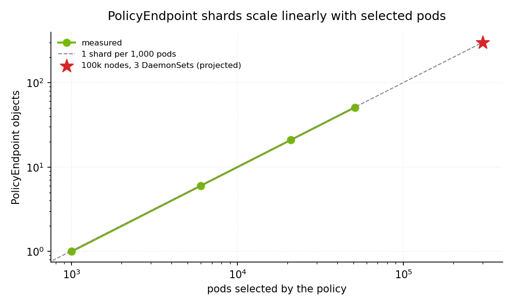

NVSentinel's `metrics-access` policy selects every pod in its namespace, and the benchmark put roughly 158,000 pods there. Eighty-three shards existed and no more appeared, and the CNI went on enforcing what it had last programmed: MongoDB was refused on 27017 by a source-IP list naming pods that no longer existed, and policies deleted by `helm uninstall` sat `Terminating` for three days while still isolating their pods. Deleting the 83 stale shards restored connectivity in about two minutes.

The exposure is not confined to the benchmark: NVSentinel's own DaemonSets put four pods per node in that namespace -- gpu-health-monitor, syslog-health-monitor, platform-connector and metadata-collector -- and three of them are pod-networked, so a clean install at 100,000 nodes selects roughly 300,000 endpoints and needs about 300 shards, more if the CNI also programs the host-networked metadata-collector. Whether the controller stops keeping up somewhere between the 51,000 pods it handled here and the 158,000 that broke it was not established, and the cause was never captured -- the controller runs in the EKS managed control plane and its logs are not exported. [#1792](https://github.com/NVIDIA/NVSentinel/issues/1792) carries the detail, the upstream reports it matches, and the open question of what to change.

### The EBS CSI provisioner runs out of memory at fleet scale `[M]`

`csi-provisioner` in `kube-system/ebs-csi-controller` runs with `--feature-gates=Topology=true`, so it caches every Node and CSINode in the cluster to place volumes by zone. The cluster holds only 8 PersistentVolumeClaims; its memory grows with node count. At this node count it exceeded its 10 GiB limit and was OOM-killed repeatedly -- 267 restarts -- after which no `VolumeAttachment` was created for any new pod.

MongoDB is the visible casualty. Its pods are a StatefulSet with EBS-backed volumes, so a mongod whose restart requires a new `VolumeAttachment` cannot get its volume back and remains in `PodInitializing` until that attachment is created and fulfilled; the fault-handling components then fail their datastore connection and the pipeline stops. Nothing in that chain names the provisioner, which is what makes it slow to diagnose.

Raising the limit to 24 GiB resolved it, and MongoDB recovered 112 seconds later without further intervention. The controller still shows the restart history from that period.

### Component versions

The commit each component was first measured on, with the commit's date, and what was rechecked on `aea32ab6` (upstream main, 2026-10-09, images `main-aea32ab`) on the 100,000-node fleet.


| Component | Commit | Commit date | Commit subject | Rechecked on `aea32ab6` |
| --- | --- | --- | --- | --- |
| fault-quarantine | `22fe67ce` | 2026-09-18 | perf(fault-quarantine): prune the node cache to the keys the rules read (#1842) | memory; cordon throughput and per-event handling (A/B against the earlier build, unchanged) |
| fault-remediation | `00582ef5` | 2026-09-15 | perf(fault-remediation): lazy fetch events during changeStreamProcessing instead of storing them into queue (#1811) | memory |
| health-events-analyzer | `85708e3b` | 2026-09-17 | feat: add opt-in rule_matched_entity_total (#1812) | not rechecked; throughput predates #1901 and #1913 |
| platform-connector, deployment mode | `3ec0b630` | 2026-10-09 | perf(platform-connectors): time-ordered idempotency key and datastore pool default of 30 (#1999) | -- |
| node-drainer | `791cd679` | 2026-09-07 | `v1.22.0` | memory |
| kubernetes-object-monitor | `791cd679` | 2026-09-07 | `v1.22.0` | memory |
| janitor, labeler, preflight | `791cd679` | 2026-09-07 | `v1.22.0` | memory, idle only (janitor untriggered; labeler without its DaemonSet pods) |
| MongoDB | -- | -- | Percona Server for MongoDB 8.0.12-4, operator `crVersion` 1.21.1 | -- |


### Methodology

How every number in this report was produced, and what it was produced on.

**Cluster.** AWS EKS, control-plane scaling tier 4XL. Five real EC2 nodes carry the NVSentinel control plane and MongoDB; the fleet is KWOK-simulated. Component versions are listed in [Component versions](#component-versions); `janitor-provider` is a bench build supplying a simulated-reboot CSP.

**Reference object profile.** `retained_bytes` in A1 is computed by applying each component's transform to this shape, so a reader substituting their own object shape re-derives those columns:


| Object        | Serialised size | Composition                                                                                             |
| ------------- | --------------- | ------------------------------------------------------------------------------------------------------- |
| Node          | 55,138 B        | 45,650 B padding in an annotation, 181 labels (~9.6 KB), 2 taints, kwok-generated status with no images |
| Pod           | 9,626 B         | DaemonSet-owned, no padding                                                                             |
| Lease         | 869 B           | one per node                                                                                            |
| RebootNode CR | 993 B           | one per remediation                                                                                     |


Node size was chosen to match production GPU workers (53.6 KB, measured in #1718). Padding sits in an annotation deliberately: transforms that drop annotations should show a slope of zero against it, which doubles as a transform-correctness check.

**Fleet control.** `tests/scale-tests/cmd/k8s-object-scaler` run in-cluster from the `e2e-runner` pod, using the service-account token, as `-kind=node -mode=ramp -node-labels=181 -pad-retained-bytes=40650`. That flag yields a 45,650 B annotation, 5,000 B above the value passed, and the serialised size above is the POST body: the stored object is about 62 KB once the API server adds `managedFields` and kwok adds status. It creates ~2,500 nodes/s and deletes ~12,000/s. Never run bulk operations through `kubectl` per object: the kubeconfig uses a Teleport exec credential plugin, so every invocation spawns a credential fetch and 53k of them will saturate it.

**Reading memory.** Container working set from cAdvisor via Prometheus is the number to provision against. Live heap (`go_memstats_heap_alloc_bytes`) sawtooths between collections, so only the trough across a window approximates the live set — a 2-minute window over a 10 GB heap read 47% high against a 16-minute one.

**Reading CPU.** `rate(container_cpu_usage_seconds_total{namespace="nvsentinel",pod="<pod>",container!="",container!="POD"}[5m])`, which reads directly in cores and is the same counter the CFS quota enforces a limit against. The `container!=""` filter matters: cAdvisor also exports a pod-level roll-up with an empty container label, and summing without it double-counts. The A1 med/peak columns are the median and maximum of that rate across a sampling window at each scale point. Two companions are worth reading alongside it: `container_cpu_cfs_throttled_seconds_total` shows whether a limit is actually biting, which a usage figure alone cannot; and the component's own `process_cpu_seconds_total` from `/metrics` isolates the Go process from any sidecar in the same pod, and should track the container rate closely when it does not have one. For per-event attribution rather than steady state, `usageCoreNanoSeconds` from the kubelet summary API is a cumulative counter that can be differenced across a burst window — with the noise-floor caveat in A2.

**Component measurement protocol.** For each scale point: set the fleet, restart every measured component, wait for rollouts to complete, wait for informers to sync, then sample. The restart is essential — Go does not return freed heap promptly, so a component measured at 5k straight after 25k still reports the larger figure. Pods are held constant across points during the node sweep, which is the measurement that isolates the node term. The kubernetes-object-monitor grid is the exception and varies watched pods from 0 to 100,000 at each node scale, on purpose, to separate the pod term from the node one.

**Deployment platform connector.** Each point begins from a restarted connector, so the baseline is a genuinely empty process rather than one still holding the previous point's connections. Working set is summed over the pods the Deployment currently has, looked up by name and excluding any terminating: a prefix match cannot distinguish a departing pod from its replacement, and counting series rather than identifying them produced a 12 MB delta for 15,000 connections on the first attempt. And the limit was raised to 16Gi for the duration, since the larger points need up to 7.2 GiB per replica and a 4Gi limit would have measured the cap instead of the demand.

The simulated nodes carry 18 of the 25 labels the chart whitelists -- the AWS set, since the OCI and GCE blocks cannot co-exist with it on a real node -- plus 14 the augmentor ignores. Earlier connector measurements in this report ran against nodes carrying one of the 25, which is why no per-node term was visible in them.

**Fitting the memory sweep.** Least squares over these ten points returns `189 MB + 224 KiB/node` with an r-squared of 0.99914 while being **25.8% high at 2,000 nodes**: fitting absolute megabytes lets the large points dominate, and the intercept it invents is an artifact -- the measured baseline is 23 to 31 MB, an empty process. Forcing the line through the origin removes the problem. The right-hand panel plots the error of both against each measurement.

A note on measuring this, because two earlier attempts in this section produced figures that were not measurements at all. Every histogram the connectors export has `le=0.01` as its first bucket, so any sub-10 ms distribution interpolates to the same 5.00/9.00/9.90 whatever the load, which is where both an earlier "6.44 ms median queue wait" and an earlier 10/18/19.8 ms durable latency came from. The stored document cannot settle it either: its `createdAt` is stamped as the document is built, before the write, so it measures the path up to the write rather than through it. Anything below ten milliseconds on this path has to be timed from outside the connectors.

**Restart the component before you measure it, or the number is wrong.** Reading the same six components at 50,000 nodes without restarting them — after the fleet had been reduced from 100,000 — gave 31.2 GB against 24.7 GB restarted, because none of them returns memory when the fleet shrinks.

**Driving faults.** Health events are inserted directly into MongoDB, bypassing platform-connector. Two reasons. Injecting straight into the datastore is faster and more controllable once the document shape is known, which matters when a run needs a million events at a chosen rate. It also keeps platform-connector out of these numbers; its ingest is measured on its own in [platform-connector, deployment mode](#platform-connector-deployment-mode-m). Everything downstream is unaffected, because fault-quarantine and the components behind it read from the datastore's change stream and cannot tell how a document arrived. The document shape is unforgiving and fails silently when wrong: the event nests under `healthevent`, field names are their Go names lowercased, `generatedtimestamp` must be a `{seconds, nanos}` subdocument, `recommendedaction` is the enum integer, `errorcode` is an **array**, and `healtheventstatus.userpodsevictionstatus` must be an empty document rather than null. `agent` must match the deployed fault-quarantine ruleset.

**Timing the chain.** Percentiles come from per-document timestamps (`generatedtimestamp`, `quarantinefinishtimestamp`, `drainfinishtimestamp`, `lastremediationtimestamp`), which are exact. CR-derived timings inherit the API server's one-second granularity. End-to-end figures join to the maintenance CR's `NodeReady` condition, since `faultRemediated: true` marks dispatch.

**Reading API load.** Per-component `rest_client_requests_total` differenced against an idle control of comparable length. fault-quarantine, labeler and preflight register no client-go metrics, so those come from EKS audit logs via CloudWatch Logs Insights. Sampling happened after the workload completed; a mid-burst sample of the same run read ~4x lower.

Two earlier attempts at this measurement were wrong and are worth recording, because both failure modes are easy to repeat. The first froze the member with `SIGSTOP`, which the kernel discards: `mongod` is PID 1 in its container, and a PID namespace's init process ignores signals from inside that namespace unless it installs a handler. Nothing was ever down, and the replication lag sitting unchanged at 1 second throughout should have been the tell. The second deleted the pod, which does work, but sampled on a schedule rather than on observed state and caught a single sample inside the window. Any claim about a component being degraded needs the degraded state evidenced in the same sample as the measurement.

One measurement correction. The workqueue histogram's first bucket is `le=0.01`, so every sub-10 ms distribution interpolates to the same 5.00 ms median regardless of load, which is where an earlier "6.44 ms median queue wait" in this section came from. Little's law on the same samples -- mean wait is depth over throughput -- puts the real figure near zero below saturation.

Memory is not a cost either, and an earlier reading that said otherwise was a counting error worth naming: summing working set across pods during a replacement counts the departing pods alongside their replacements, and here that meant six pods rather than three and an apparent doubling to 6,774 MB. Per replica there is no rise at all -- 1,227 MB before, 1,046 MB after -- so a full outage costs recovery time rather than memory.

**Comparing the two connector modes.** Their own metrics do not compare: the node-local connector exports `platform_connector_workqueue_`* and no request histogram, the Deployment a request histogram and no workqueues, so a sub-millisecond DaemonSet publish and a five-millisecond Deployment publish are not the same measurement. Every comparison in that section times the publisher's call to the event being stored instead, and the change-stream figures rely on neither connector's instrumentation.

**Minting publisher tokens.** Each simulated publisher presents a real ServiceAccount token bound to a pod pinned to its node. The node claim is filled in by the API server from `spec.nodeName`, so a pod on a simulated node yields a token attesting to that node without a kubelet. Minted in-cluster this runs at about 1,000 tokens/s per client.

**MongoDB `opcounters.insert` counts refused writes.** During an idempotency test the unique index rejects the second write, but the counter still increments, so it reads about double the true figure and cannot be used to check for duplicates. Count distinct keys in the collection instead.

**Cumulative means in the generator.** Client-side publish latency appeared to rise across the scale-out run, from 6.6 ms to 13.0 ms. The generator's `avgPublishMs` is a cumulative mean over its whole life rather than a windowed reading, so it integrates a heavy and variable tail rather than showing a rising typical case.

**The concurrency sweep cannot show the pool's diminishing returns.** At `w:majority` each writer blocks on the acknowledgement before issuing its next write, so thirty-two of them generated only 2,004 writes/s -- far too little to make a secondary fall behind. The writers were rate-limited by the quantity being measured, so that sweep does not contradict the pool result.

**WiredTiger is not the bottleneck, and the tickets say so.** MongoDB 8.0 sizes the concurrency ticket pool dynamically, so its value is not a configured ceiling to reason from. Measured, it sat at 6 under light load and 25 under saturation, with at most 2 tickets ever held and a queue length of 0 at every sample, against 2.4 concurrent writes at the ingest ceiling.

**Reading MongoDB.** Two counters mislead. `stats().count` is an estimate that lags badly -- it reported 0 documents against 38,178 actual -- so any document delta must come from `countDocuments`. And the oplog carries about 2.5 entries/s of background traffic on an idle cluster, so a burst's cost has to be measured against an identical quiet window; without that subtraction a 100-node burst reads 9.8 oplog entries per node instead of 6.1.

**Reading etcd.** `apiserver_storage_size_bytes` is file-allocated and reports whichever of three members answered, varying ~983 MB with no load; it cannot measure growth. Use `apiserver_storage_objects` per resource, which is exact but recomputed periodically.

#### Deployed configuration

Every figure in this report depends on what the components were actually configured to do, so the deployed configuration is reproduced here rather than described. This is read from the live cluster, not from the chart defaults.

**kubernetes-object-monitor** watches two policies. Its per-node and per-pod memory is a function of these, since each enabled policy adds a watch on its resource kind:

```toml
[controller]
  maxConcurrentReconciles = 100

[[policies]]
  name = "NodeNotReady"
  enabled = true
  [policies.resource]
    group = "";  version = "v1";  kind = "Node"
  [policies.predicate]
    expression = "has(resource.status.conditions) && resource.status.conditions.exists(c, c.type == \"Ready\" && c.status == \"False\")"
  [policies.healthEvent]
    componentClass = "Node";  isFatal = true;  errorCode = ["NODE_NOT_READY"]
    recommendedAction = "CONTACT_SUPPORT";  message = "Node is not ready"

[[policies]]
  name = "PodOnUnschedulableNode"
  enabled = true
  [policies.resource]
    group = "";  version = "v1";  kind = "Pod";  namespace = "kom-pod-bench"
  [policies.predicate]
    expression = "has(resource.metadata.annotations) && size(resource.metadata.annotations) > 500"
  [policies.nodeAssociation]
    expression = "resource.spec.nodeName"
  [policies.healthEvent]
    componentClass = "Node";  isFatal = false;  errorCode = ["POD_ON_UNSCHEDULABLE_NODE"]
    recommendedAction = "CONTACT_SUPPORT";  message = "Pod failed on an unschedulable node"
```

The Pod predicate above is not the shipped one, and the difference sets the per-pod cost. The shipped `PodOnUnschedulableNode` predicate reads `resource.status.phase`, so the CEL-derived transform retains `status.phase` and `spec.nodeName` and about 175 B per pod survives into the cache. The predicate used for the memory grid references `metadata.annotations` as a whole map, which the extractor cannot narrow to individual keys, so every annotation is retained; the benchmark pods carry **20,039 B of annotations** each. That is deliberately the expensive end of the range, chosen so the pod axis is visible rather than lost in noise, and it is why the grid's per-pod figures are roughly two orders of magnitude above what the shipped policy costs. Each row is a restarted process left to converge on a fleet with KWOK heartbeating normally, ~3,000-3,300 lease renewals/s.

The Pod policy is why kubernetes-object-monitor holds a Pod cache at all, and therefore why it is the largest component at 100,000 nodes with a pod on every node. Its `--resync-period=24h` means the fleet-wide relist that would otherwise dominate CPU does not occur within a measurement window. Its cache sync timeout is 10m.

**fault-quarantine** cordons on one ruleset, and every injected event in this report is shaped to match it:

```toml
label-prefix = "k8saas.nvidia.com/"
[circuitBreaker]
percentage = 50
duration = "5m"

[[rule-sets]]
  enabled = true;  version = "1";  priority = 0
  name = "GPU fatal error ruleset"
  [[rule-sets.match.all]]
    kind = "HealthEvent"
    expression = "event.agent == 'gpu-health-monitor' && event.componentClass == 'GPU' && event.isFatal == true"
  [[rule-sets.match.all]]
    kind = "Node"
    expression = "!('k8saas.nvidia.com/ManagedByNVSentinel' in node.metadata.labels && node.metadata.labels['k8saas.nvidia.com/ManagedByNVSentinel'] == 'false')"
  [rule-sets.cordon]
    shouldCordon = true
```

The circuit breaker is configured at 50% over 5 minutes but disabled on the command line (`--circuit-breaker-enabled=false`), so none of the burst results were shaped by it. It is measured separately under Circuit breaker in A3. An event whose agent is anything other than `gpu-health-monitor` matches nothing and produces no cordon, which from outside is indistinguishable from a stalled pipeline.

**node-drainer** decides per namespace whether a drain can complete, which governs every drain figure in A3:

```toml
evictionTimeoutInSeconds = "60"
systemNamespaces = "^(nvsentinel|kube-system|gpu-operator|gmp-system|network-operator|skyhook)$"
deleteAfterTimeoutMinutes = 60
notReadyTimeoutMinutes = 5
drainGPUPods = false
partialDrainEnabled = false

[[userNamespaces]]
name = "e2e-pods";  mode = "Immediate"
[[userNamespaces]]
name = "*";  mode = "AllowCompletion"
```

`drainGPUPods = false` means a pod requesting `nvidia.com/gpu` is never evicted, and the catch-all `*` namespace maps to `AllowCompletion`, which waits for pods to exit on their own rather than evicting them. Drain-latency measurements therefore need pods that request no GPU, in a namespace mapped to `Immediate`.

**Client rate limits, as deployed.** These are the values behind the QPS table:


| Component                 | Flags                                                                                 |
| ------------------------- | ------------------------------------------------------------------------------------- |
| kubernetes-object-monitor | `--max-concurrent-reconciles=100 --resync-period=24h`, no QPS flags                   |
| fault-quarantine          | `--kube-api-qps=100 --kube-api-burst=200`, `--circuit-breaker-enabled=false`          |
| labeler                   | `--kube-api-qps=500 --kube-api-burst=1000`, `--require-dcgm-ready-for-bootstrap=true` |
| node-drainer-bench        | `--kube-api-qps=400 --kube-api-burst=800`                                             |
| janitor                   | `--enable-ttl=false --default-ttl=336h`, no QPS flags                                 |
| fault-remediation         | `--leader-elect=true --enable-log-collector=false`, no QPS flags                      |
| preflight                 | `--config=/etc/preflight/config.yaml`, no QPS flags                                   |
| health-events-analyzer    | `--processing-strategy=EXECUTE_REMEDIATION`, no QPS flags                             |


fault-remediation, janitor and kubernetes-object-monitor have no client-side rate limit at all: controller-runtime v0.25.0's `GetConfig` sets `cfg.QPS = -1` when the value is unset, so the API server's own fairness rules are the only limit.

**labeler** takes no resync flag; the period is hard-coded to 30 seconds at `labeler/pkg/initializer/init.go:61`, which is what sets the two-cycle time-to-label in A3.

**janitor** runs all three controllers with a 25-minute timeout and reaches the CSP through a bench provider:

```yaml
global:
  timeout: 25m
  manualMode: false
  cspProviderHost: janitor-provider.nvsentinel.svc.cluster.local:50051
rebootNodeController:   {enabled: true, timeout: 25m}
terminateNodeController: {enabled: true, timeout: 25m}
gpuResetController:      {enabled: true, timeout: 25m}
```

**fault-remediation** maps recommended actions onto janitor CRs. `COMPONENT_RESET`, `RESTART_BM` and `RESTART_VM` all create a `RebootNode` completing on `NodeReady`; `REPLACE_VM` creates a `TerminateNode` completing on `NodeTerminated`. Both templates carry a 336-hour TTL annotation. Since 62% of production events recommend `COMPONENT_RESET`, the reboot path is the one that matters for MTTR.

**preflight** is a mutating webhook on `CREATE pods`, and these are the settings every gang figure in A1 was measured against:

```yaml
# MutatingWebhookConfiguration/preflight
failurePolicy: Ignore
timeoutSeconds: 10
reinvocationPolicy: Never
namespaceSelector:
  matchLabels:
    nvsentinel.nvidia.com/preflight: enabled
rules:
- apiGroups: [""]
  apiVersions: ["v1"]
  operations: ["CREATE"]
  resources: ["pods"]
  scope: Namespaced
```

```yaml
# ConfigMap/preflight, config.yaml
gangDiscovery:
  annotationKeys:
  - scheduling.k8s.io/group-name
  labelKeys: []
  minCountExpr: podGroup.spec.minMember
  name: volcano
  podGroupGVR:
    group: scheduling.volcano.sh
    resource: podgroups
    version: v1beta1
gangCoordination:
  enabled: true
  timeout: 10m
  masterPort: 29500
  configMapMountPath: /etc/gang
initContainerPlacement: append
initContainers:
- env:
  - name: DCGM_HOSTENGINE_ADDR
    value: nvidia-dcgm.gpu-operator.svc:5555
  - name: DCGM_DIAG_LEVEL
    value: '2'
  - name: DCGM_DIAG_STATUS_RETRY_MAX_ATTEMPTS
    value: '10'
  - name: DCGM_DIAG_STATUS_RETRY_INTERVAL_SECONDS
    value: '10'
  image: ghcr.io/nvidia/nvsentinel/preflight-dcgm-diag:1.0.0
  inheritUserEnv: true
  inheritUserVolumeMounts: true
  name: preflight-dcgm-diag
  volumeMounts:
  - mountPath: /var/run
    name: nvsentinel-socket
- env:
  - name: BW_THRESHOLD_GBPS
    value: '150'
  - name: TEST_SIZE_MB
    value: '256'
  image: ghcr.io/nvidia/nvsentinel/preflight-nccl-loopback:1.0.0
  inheritUserEnv: true
  inheritUserVolumeMounts: true
  name: preflight-nccl-loopback
  volumeMounts:
  - mountPath: /var/run
    name: nvsentinel-socket
- env:
  - name: BW_THRESHOLD_GBPS
    value: '100'
  - name: MESSAGE_SIZES
    value: 4G
  - name: NCCL_DEBUG
    value: INFO
  - name: NCCL_DEBUG_SUBSYS
    value: INIT,NET
  image: ghcr.io/nvidia/nvsentinel/preflight-nccl-allreduce:1.0.0
  inheritUserEnv: true
  inheritUserVolumeMounts: true
  name: preflight-nccl-allreduce
  securityContext:
    capabilities:
      add:
      - IPC_LOCK
  volumeMounts:
  - mountPath: /var/run
    name: nvsentinel-socket
```

The 10-second webhook deadline is the constraint the gang numbers are measured against, and `failurePolicy: Ignore` decides the failure mode: a webhook that misses it leaves the checks silently skipped rather than failing Pod creation, which is what production's documented `Fail` would do instead. The namespace selector means a pod created anywhere else never reaches preflight at all, so a gang benchmark run in an unlabelled namespace measures nothing while still looking successful. The three init containers above are appended to every admitted pod and are most of the per-member admission work, so a gang measured with no checks configured is not comparable to these numbers.

**health-events-analyzer** runs 8 rule sets covering 20 named rules, all correlation rules over the event history: `MultipleRemediations`, `RepeatedXIDErrorOnSameGPU`, `RepeatedXID31OnSameGPU`, `RepeatedXID31OnDifferentGPU`, `RepeatedXID13OnSameGPCAndTPC`, `RepeatedXID13OnDifferentGPCAndTPC`, `XIDErrorSoloNoBurst`, and thirteen XID74 register-decoding and NIC rules. Each incoming event is evaluated against all of them, which is where its 5.8 ms per event goes.

#### Traps

The health-event collection is never wiped between runs. Any SLA query must bound `createdAt` to the run — without it this run's cordon P99 read 11 s instead of 1.4 s.

Documents predating the schema fix store `generatedTimestamp` as a BSON date and abort aggregations doing arithmetic on it; queries need a numeric type guard.

A component that cannot reach MongoDB is not necessarily a MongoDB problem. Read the `PolicyEndpoint` objects (`networking.k8s.aws/v1alpha1`) before investigating the database, the certificates or DNS: they carry the source-IP allow-lists that are actually enforced, and they go stale silently. A useful one-line discriminator is that a port with no listener returns a RST ("Connection refused") whereas a port blocked by policy times out; if an unlisted port times out, enforcement is active and the allow-list is the thing to read.

`fault-quarantine`, `fault-remediation` and `node-drainer` expose readiness on an HTTP metrics server that comes up before the datastore connection is attempted, so `ready=True` does not mean the component reached MongoDB. Confirm from the log line `Successfully pinged database to confirm connectivity`. Trusting readiness produced two false recoveries during this run.

**A controller can hold a cluster-wide informer that its watch registration never mentions.** controller-runtime creates informers lazily, on the first cached read of a GVK, so `SetupWithManager` lists only what is watched eagerly. janitor registers no Node watch, yet one `TerminateNode` CR takes it from 11 MB to 500-870 MB on a 25,005-node fleet as the informer lists the fleet inside a single reconcile. An idle pod's memory therefore says nothing about the component at scale, and the first real unit of work after a restart blocks for the full list-and-sync. Audit by checking which client each constructor receives, not by grepping for `Watches`.